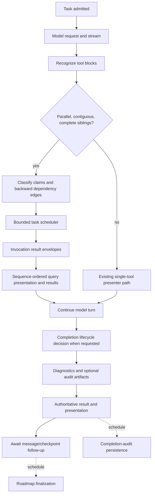
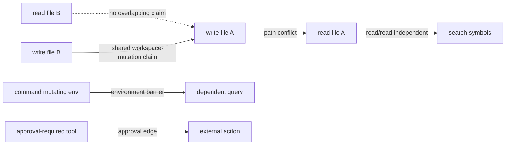
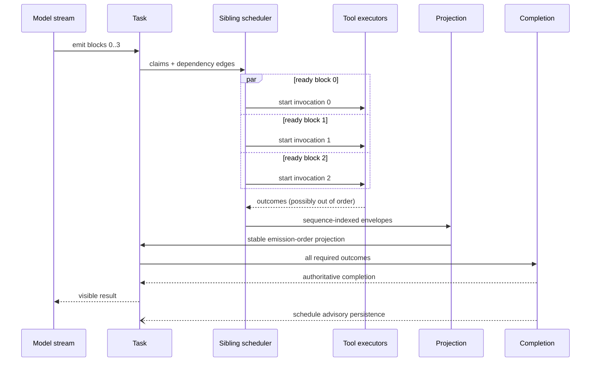
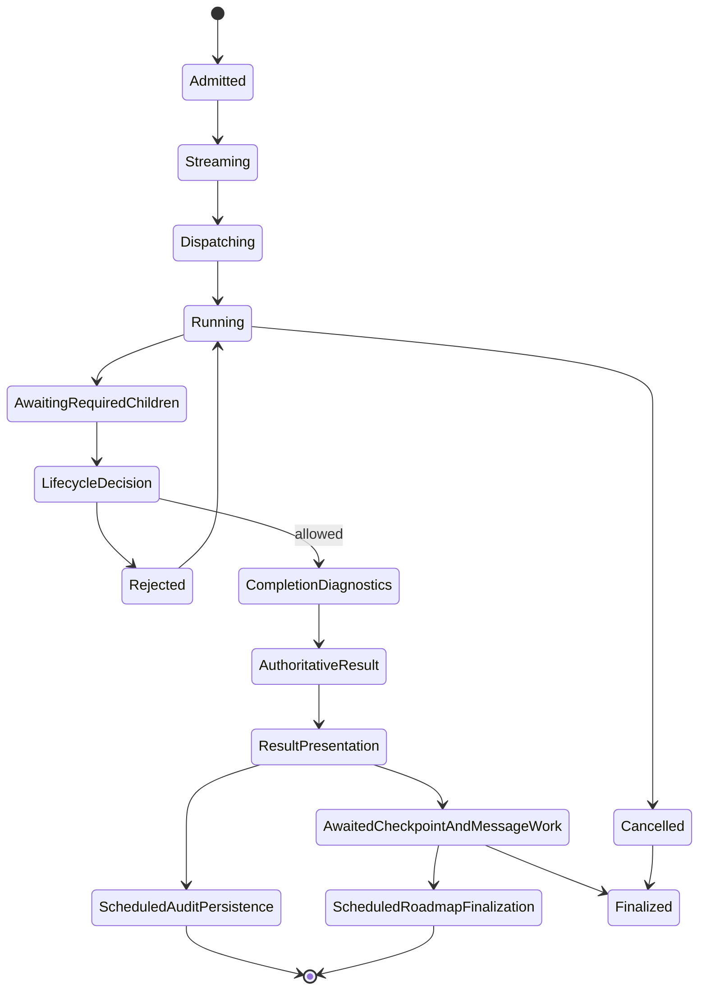

# Dependency-Oriented High-Throughput Execution Architecture

## Technical Whitepaper

**Canonical implementation reference**  
Primary surfaces: `src/core/task/index.ts`, `src/core/task/ToolExecutor.ts`, `src/core/task/tools/siblings/`, `src/core/task/latency/TaskLatencyTracker.ts`, `src/core/task/tools/io/IoRequestCoalescer.ts`, and `src/core/task/tools/handlers/AttemptCompletionHandler.ts`.

## Abstract

The execution engine combines a fast path for eligible parent I/O, conservative sibling dependency classification, bounded batch concurrency, deterministic batch projection, task-generation-aware I/O coalescing, and deferred completion-audit and roadmap persistence. The implementation separates execution eligibility from presentation for a specific path: contiguous complete sibling tool blocks when parallel tool calling is enabled. Existing single-tool, interactive, completion, and persistence paths remain partly synchronous.

## Architectural vocabulary

The paper distinguishes three layers deliberately:

| Layer | Question answered | Examples |
| --- | --- | --- |
| **Principles** | What must remain true? | dependency-oriented execution, proportional governance, authoritative completion, deterministic projection, structured concurrency |
| **Mechanisms** | How is that principle enforced? | dependency classifier, bounded scheduler, invocation context, cache generations, completion handler, latency tracker |
| **Evidence** | How do we know it works? | barrier-based tests, scheduler benchmarks, latency snapshots, full-suite and lint results |

Principles constrain design. Mechanisms are replaceable implementations of those constraints. Evidence is the basis for changing either; prose or architectural preference alone is not.

## 1. Lifecycle



`Task` admits work and owns cancellation. The model stream emits native or XML tool blocks. The parser preserves native call identity by index (`tool-call-processor.ts`). When parallel tool calling is enabled, `Task.presentAssistantMessage()` gathers consecutive complete `tool_use` blocks beginning at the current streaming index. It uses the sibling scheduler only when that group contains more than one block. Single tools and non-contiguous blocks continue through the original presentation path.

## 2. Dependency and resource model

`SiblingToolDependency.ts` produces claims and backward edges in model-emission order. Categories include query, mutation, command, approval, external, completion, and unknown. Path claims are resolved against the workspace and canonicalized through the nearest existing ancestor. Explicit `depends_on` values and recognized result-reference markers create prerequisite edges only to earlier siblings. Multi-file `apply_patch` targets are extracted, but every mutation also claims `workspace-mutation`, so mutations are serialized with all earlier mutations today. Unknown tools receive a workspace-wide write fence.



Edges are conflict, prerequisite, or barrier edges. A recognized result-reference marker creates a prerequisite even when resources appear disjoint. The initial-checkpoint predicate holds mutations, mutating or unknown commands, and unknown tools outside scheduler capacity until the checkpoint promise settles; eligible reads can start meanwhile.

## 3. Scheduler and structured concurrency

`SiblingToolScheduler.ts` maintains a bounded admission loop (the task path uses capacity four), an internal `AbortController`, sequence-indexed outcomes, and per-child result classification. Read/read work can start concurrently. All classified mutations serialize with one another. Read-only verification commands share one command-lane claim; other commands fence the workspace. Mutation, command, approval, external, and unknown categories also share an interactive-presentation claim and therefore remain mutually conservative where those claims overlap. The scheduler returns only after every admitted `run` promise settles.



Each child uses `ToolInvocationContext.ts` for invocation-local result content and an abort signal. Presentation events are captured only when `capturePresentation` is true, currently for workspace-local queries. `ToolExecutor.executeToolCaptured()` records a semantic outcome in the captured envelope. One failed independent query is represented as its own synthetic error result while successful siblings remain usable. A failed non-conflict prerequisite skips its dependents. Scheduler cancellation marks queued children cancelled and aborts active contexts; interruption of in-progress backend work depends on the handler honoring the signal.

## 4. Execution versus presentation

The execution path no longer waits for a UI message slot before admitting the next safe sibling. Progress events are associated with invocation sequence numbers. The projection layer can update grouped progress surfaces or completion-order indicators, while final result content is rendered in stable model-emission order. `Task.presentAssistantMessage()` advances `processedBlockCount` only after the sibling window has been collected and the task-owned batch has been joined.

The distinction is intentional:

| Concern | Authority | Ordering |
| --- | --- | --- |
| Eligibility | dependency model and scheduler | resource/dependency order |
| Progress | invocation context and presentation projection | completion order permitted |
| Final result | sequence-indexed envelopes | model-emission order |
| Validity | `AttemptCompletionHandler` | one canonical decision |
| Deferred completion audit/roadmap | scheduled persistence | after result presentation/finalization branch |

Failures while replaying captured per-query presentation events are logged and do not remove the captured result content. Shared presentation paths for interactive and non-query tools remain outside this guarantee.

## 5. Fast and governed paths

The fast path covers read-only, diagnostic, local, reversible, known-scope work under existing task authority. Query handlers use `executionAuthority.ts` and the task's established scope. The governed path remains for protected paths, external paths, destructive/manual commands, credentials, unresolved mutation scope, approval, and publication. The architecture does not infer safety from concurrency: every child still passes local validation and the governed path can serialize a child without collapsing unrelated reads.

## 6. Cache generations and mutation consistency

`IoRequestCoalescer.ts` keys supported parent-I/O requests by a resolved target string, task generation, tool name, query/regex, `file_pattern`, and `recursive` for list operations. A qualifying local mutation or scratchpad read-that-may-create replaces the task's coalescer with a new generation. An old in-flight request may still complete and populate the old object for its existing callers, but cannot seed the replacement object. The current invalidation is task-wide, not target-local, and command execution does not reset this coalescer in the shown implementation.

## 7. Completion and persistence

Completion blocks receive barrier edges to every earlier sibling in the same batch. `AttemptCompletionHandler.ts` evaluates the lifecycle snapshot and action guard once per attempt, then awaits preflight diagnostics, completion audit evaluation, and—when enabled—workspace audit-artifact persistence before latching the authoritative result. It presents the completion message, schedules pending completion-audit persistence, and then awaits checkpoint/message follow-up work. Roadmap finalization is scheduled later. The completion path is therefore narrower than before but is not fully asynchronous or reducible to one synchronous function call.



Failure of scheduled completion-audit persistence or roadmap finalization is logged after the result path and does not alter the latched completion decision. Pre-result audit evaluation and optional workspace-artifact persistence have different timing and should not be described as deferred.

## 8. Latency observability

`TaskLatencyTracker.ts` records monotonic events: admission, model request, first token, first tool recognition, first visible progress, tool admission/dispatch, useful I/O start/completion, sibling queue/start/completion, completion validation/decision, result presentation, and persistence scheduled/completed/failed. It is task-local and bounded to 1,024 events. Missing instrumentation never blocks execution.

The canonical trace is:

```text
admitted -> model_started -> first_token -> tool_recognized
 -> sibling_queued -> sibling_started -> useful_io_started/completed
 -> sibling_completed -> completion_validation -> authoritative_decision
 -> presentation_started/completed -> persistence_scheduled/completed
```

The snapshot exposes queue wait, execution duration, presentation-induced delay, completion latency, authoritative-result-to-visible-result latency, and post-result persistence duration. The deterministic fixture demonstrates the schema (admission 5 ms, first token 7 ms, first useful I/O 12 ms, authoritative-to-visible 5 ms, persistence 10 ms); production values must come from task snapshots rather than fixture values.

## 9. Before/after critical path

**Before the sibling-batch change:** the presenter processed tool blocks one at a time, awaited execution, and advanced the streaming index. Shared message state coupled admission to presentation.

**Current batch path:** native identity is tracked per index; a consecutive complete sibling window is classified once; ready children run with capacity four; invocation envelopes are collected; captured query presentation and results are replayed in sequence order. The completion handler retains additional synchronous diagnostic, artifact, message, and checkpoint work, while completion-audit persistence and roadmap finalization are deferred.

## 10. Verification and benchmark method

Tests use deferred promises and barriers, not real-time sleeps, to prove overlap, ordering, and cancellation. Focused suites cover dependency classification, scheduler behavior, presentation, cache generation, and completion. The performance fixture reports sequential estimate, concurrent wall time, maximum concurrency, queue wait, and outcome status. Current results are:

| Workload | Sequential estimate | Concurrent wall | Max concurrency | Safety result |
| --- | ---: | ---: | ---: | --- |
| Four reads | 280 ms | 100 ms | 4 | all overlap |
| Two reads + two searches | 290 ms | 100 ms | 4 | all overlap |
| Diagnostic + read-only command | 220 ms | 140 ms | 2 | command lane preserved |
| Mutation + two disjoint reads | 230 ms | 120 ms | 3 | mutation boundary preserved |
| Overlapping mutations | 200 ms | 200 ms | 1 | serialized |
| One failed sibling + successes | 190 ms | 100 ms | 3 | partial success |

The implementation pass recorded 2,263 passing and 4 pending in the full unit suite, plus five passing in the final targeted presentation-failure regression and successful TypeScript, lint, and roadmap-audit runs. The documentation grounding pass on 2026-07-12 reran 44 focused dependency, scheduler, batch, cache, latency, and completion-audit tests successfully. Documentation-link and diff-whitespace checks also passed. Live provider, webview, filesystem, and subprocess latency were not measured.

## 11. Safety boundaries and residual limits

The existing executor continues to enforce `.dietcodeignore`, workspace/external-path policy, protected credentials, destructive/manual approvals, checkpoint readiness, rollback/receipt rules, publication controls, and direct validation. The dependency model additionally serializes all mutations, the shared command lane, interactive presentation claims, and completion barriers. XML calls split across stream chunks may miss a common batch; non-interruptible backend I/O limits cancellation; audit artifacts, message persistence, and checkpoint saving remain on portions of the completion path. No live extension-host measurement yet ranks these residual costs.

## 12. Extension rules

When adding a tool: define its category, normalized claims, explicit dependencies, cancellation behavior, result envelope, and cache generation effects. Add a deterministic barrier test for any new ordering rule. Do not use presentation state as an execution lock, do not spawn detached promises, do not add a second completion authority, and do not make audit persistence synchronous without evidence that it changes validity.
