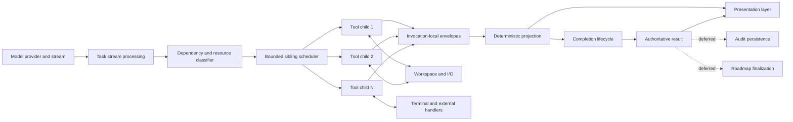
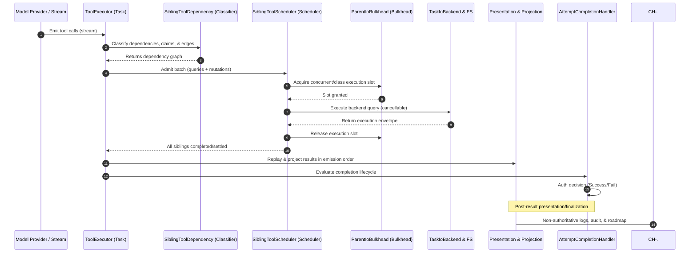
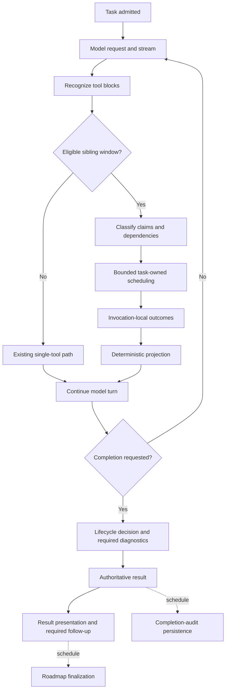
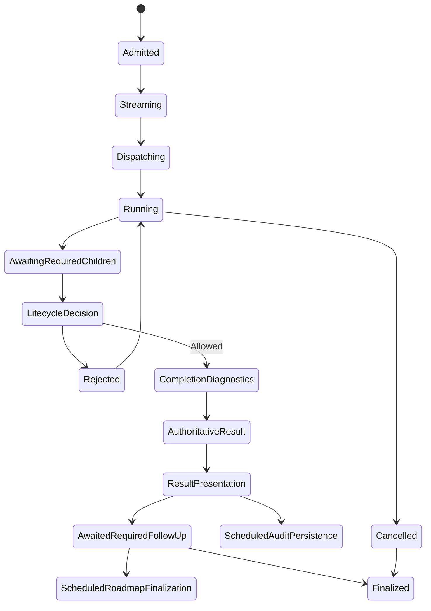

# MEOW: Model-Efficient Order-aware Workflow

## An Implementation-Backed Architecture Description and Evaluation

**Document status:** Canonical implementation reference
**Maturity:** Implemented and deterministically verified; production performance not yet characterized
**System of interest:** Task execution runtime under `src/core/task/`
**Version date:** July 12, 2026
**Intended audience:** Runtime maintainers, tool authors, UI contributors, reviewers, auditors, and performance engineers

**Primary implementation surfaces:**

* `src/core/task/index.ts`
* `src/core/task/ToolExecutor.ts`
* `src/core/task/tools/siblings/`
* `src/core/task/latency/TaskLatencyTracker.ts`
* `src/core/task/tools/io/IoRequestCoalescer.ts`
* `src/core/task/tools/handlers/AttemptCompletionHandler.ts`

---

## Abstract

The task execution engine historically coupled tool admission, execution, presentation, completion, and supporting persistence through a substantially sequential control path. This design preserved safety but serialized independent sibling operations and allowed shared presentation state, lifecycle bookkeeping, and selected persistence activities to delay otherwise valid execution.

This paper describes an implementation-backed transition to a Model-Efficient Order-aware Workflow (MEOW) for a Bounded Scope: contiguous, complete sibling tool blocks discovered while parallel tool calling is enabled. Each eligible operation is classified by resource claims, explicit prerequisites, safety boundaries, mutation scope, approval requirements, and completion semantics. Independent children execute through a bounded, task-owned scheduler. Conflicting, prerequisite-bound, interactive, externally visible, unknown, and correctness-sensitive operations remain ordered.

Execution eligibility is therefore determined by dependencies, resource ownership, and concrete risk rather than by presentation state, stream-cursor ownership, or model-emission order. Invocation-local result envelopes isolate concurrent execution evidence. Results may complete out of order but are projected deterministically in model-emission order. Task-generation-aware I/O coalescing prevents stale in-flight results from crossing mutation boundaries. Completion retains one authoritative decision path, while selected audit and roadmap persistence are deferred until after the result path.

Deterministic workload fixtures report wall-time reductions of 36.4%–65.5% for independent or partially independent workloads while preserving full serialization for overlapping mutations. These measurements establish scheduler behavior under controlled conditions; they do not constitute live provider, extension-host, filesystem, subprocess, or end-user latency measurements.

The contribution is not dependency scheduling as a novel concept. It is the application of explicit dependency modeling, structured task ownership, deterministic projection, generation-safe caching, and singular completion authority to this agent runtime without weakening its established safety boundaries.

**Keywords:** agent runtime, dependency scheduling, structured concurrency, deterministic projection, resource claims, authoritative completion, cache coherence, task orchestration

---

# 1. Document Purpose and Method

## 1.1 Purpose

This document serves four purposes:

1. Define the architectural contracts governing multi-tool execution under MEOW.
2. Describe the mechanisms currently implementing those contracts.
3. Present the evidence used to evaluate the implementation.
4. Establish extension and conformance requirements for future changes.

It is both an explanatory whitepaper and a canonical architecture reference. It is not a user tutorial, operational runbook, or replacement for individual architectural decision records.

## 1.2 Documentation method

The document is informed by established architecture-documentation practices:

* stakeholder, concern, viewpoint, and architecture-description concepts from ISO/IEC/IEEE 42010;
* scope, constraints, runtime behavior, quality requirements, decisions, risks, and technical debt emphasized by arc42;
* explicit requirements language and consistent terminology associated with RFC documentation;
* separation of explanation, reference, tutorials, and procedural guidance advocated by Diátaxis.

This document applies selected practices from those sources but does not claim formal certification or complete conformance with any external standard.

## 1.3 Normative language

The key words **MUST**, **MUST NOT**, **SHOULD**, **SHOULD NOT**, and **MAY**, when written in uppercase, express normative requirements as defined by BCP 14. Lowercase uses retain their ordinary-language meaning.

---

# 2. Status, Evidence, and Claim Classification

To prevent implementation claims, test results, and future intentions from being conflated, this paper uses the following classifications.

| Classification  | Meaning                                                                              |
| --------------- | ------------------------------------------------------------------------------------ |
| **Implemented** | The mechanism exists in the identified source path.                                  |
| **Verified**    | Deterministic tests exercise the stated contract.                                    |
| **Measured**    | A numerical result was produced by the described fixture or trace.                   |
| **Observed**    | Runtime evidence was collected outside a deterministic fixture.                      |
| **Inferred**    | A conclusion follows from implementation and evidence but was not measured directly. |
| **Proposed**    | A future change that is not part of the current architecture.                        |
| **Unmeasured**  | The paper explicitly lacks relevant runtime evidence.                                |

Unless otherwise stated:

* architecture mechanisms described in Sections 7–14 are **implemented**;
* behavioral claims backed by the focused suites are **verified**;
* benchmark-table values are **measured in deterministic fixtures**;
* provider- and host-specific performance is **unmeasured**.

---

# 3. Stakeholders and Architectural Concerns

The architecture is evaluated against the concerns of the following stakeholders.

| Stakeholder          | Primary concerns                                                         |
| -------------------- | ------------------------------------------------------------------------ |
| End user             | Responsiveness, stable results, safe execution, prompt cancellation      |
| Runtime maintainer   | Correct lifecycle semantics, bounded concurrency, diagnosability         |
| Tool author          | Classification rules, resource claims, cancellation, result envelopes    |
| UI contributor       | Presentation isolation, stable ordering, non-authoritative rendering     |
| Security reviewer    | Workspace boundaries, credentials, destructive actions, external effects |
| Reliability reviewer | Task ownership, failure containment, cancellation, no detached work      |
| Performance engineer | Critical-path latency, queueing, concurrency, measurement validity       |
| Auditor              | Traceability from architectural claims to mechanisms and evidence        |
| Project lead         | Scope, residual risk, technical debt, future investment boundaries       |

The principal architectural concerns are:

1. **Correctness:** dependent and conflicting operations must remain ordered.
2. **Safety:** concurrency must not bypass established controls.
3. **Determinism:** visible results must remain stable across execution interleavings.
4. **Responsiveness:** independent work should not wait on accidental shared state.
5. **Lifecycle integrity:** no child may outlive its owning task.
6. **Consistency:** stale pre-mutation evidence must not be reused after mutation.
7. **Auditability:** execution and latency evidence must remain attributable.
8. **Evolvability:** new tools must declare execution semantics explicitly.
9. **Measurement validity:** synthetic evidence must not be represented as production performance.

---

# 4. Problem Definition

## 4.1 Prior execution model

The previous effective path treated a model response as a sequential presentation sequence:

```text
model response
  -> acquire presentation ownership
  -> execute one tool
  -> update shared message state
  -> advance the stream cursor
  -> admit the next tool
  -> repeat
```

This design produced several forms of accidental coupling:

* presentation ownership controlled tool admission;
* full tool execution occurred while presentation state was held;
* recursive sibling admission preserved one-at-a-time execution;
* shared message state received writes in completion order;
* a task-global streaming cursor constrained discovery;
* mutable native tool-call state could be shared across interleaved deltas;
* completion could wait on work that did not alter the completion decision.

The relevant failure was not the existence of serialization itself. It was the inability to distinguish serialization required by correctness from serialization inherited from shared implementation state.

## 4.2 Design problem

Given a model turn containing multiple tool operations, the runtime must determine:

* which operations are genuinely independent;
* which operations share a protected resource;
* which operations depend on earlier results;
* which operations require approval or checkpoint readiness;
* which failures invalidate dependents;
* how concurrent results are presented deterministically;
* when the task is authoritatively complete;
* which supporting work may safely occur afterward.

## 4.3 Design questions

This architecture addresses five design questions.

**DQ1:** Can independent sibling operations overlap without weakening tool-local validation or existing safety controls?

**DQ2:** Can execution order be decoupled from presentation order while preserving deterministic visible results?

**DQ3:** Can concurrent I/O remain coherent across local mutations and in-flight cache entries?

**DQ4:** Can completion remain singular and authoritative while selected supporting persistence is deferred?

**DQ5:** Can the runtime expose enough evidence to distinguish genuine contention from accidental serialization?

## 4.4 Contributions

The implementation contributes:

1. an explicit sibling dependency and resource-claim model;
2. a bounded, task-owned scheduler;
3. invocation-local execution and presentation capture;
4. deterministic projection independent of completion order;
5. generation-safe request coalescing across local mutations;
6. a singular completion authority with selected deferred persistence;
7. task-local latency instrumentation;
8. deterministic evaluation fixtures for ordering, cancellation, failure, and throughput.

---

# 5. Scope and Non-Goals

## 5.1 Included execution path

The MEOW path applies when:

* parallel tool calling is enabled;
* the model stream contains consecutive tool blocks;
* those blocks are complete;
* the collected window contains more than one operation;
* the operations can be classified before dispatch.

Within that scope, the runtime can:

* collect a contiguous sibling window;
* classify operations and resource claims;
* derive backward dependency edges;
* admit ready operations concurrently;
* preserve invocation-local evidence;
* propagate cancellation;
* join all task-owned children;
* project results in canonical sequence order;
* continue through the existing completion lifecycle.

## 5.2 Excluded or partially covered paths

The following remain partly or wholly outside the MEOW batch model:

* single-tool model responses;
* non-contiguous tool blocks;
* incomplete streaming blocks;
* XML tool calls discovered in separate stream windows;
* interactive approval paths;
* singleton terminal-process operations;
* shared diff-buffer mutation paths;
* portions of completion presentation;
* selected message and checkpoint persistence;
* pre-result audit evaluation;
* optional workspace audit-artifact persistence.

## 5.3 Non-goals

The implementation does not attempt to:

* parallelize every mutation;
* replace the complete task lifecycle;
* infer that concurrent work is inherently safe;
* bypass tool-local validation;
* create unbounded fan-out;
* spawn detached background children;
* make all persistence asynchronous;
* guarantee immediate interruption of non-cooperative backends;
* claim production speedups from deterministic fixtures;
* establish a novel general theory of task scheduling.

---

# 6. Conceptual Model

## 6.1 Tool batch

Let a sibling batch be an ordered set:

```text
B = [t0, t1, ... tn-1]
```

Each operation `ti` has:

* a model-emission sequence `si`;
* an operation category `ci`;
* a set of read claims `Ri`;
* a set of write or exclusive claims `Wi`;
* a set of explicit prerequisites `Pi`;
* a completion-barrier indicator `Bi`;
* an approval or checkpoint predicate `Gi`;
* an invocation-local result envelope `Ei`.

## 6.2 Conflict relation

Two operations conflict when the implementation identifies at least one of the following:

* overlapping write claims;
* a write claim overlapping another operation’s read claim;
* a shared exclusive resource claim;
* a completion barrier;
* an environment or workspace-wide fence;
* an unresolved unknown side effect;
* an explicit prerequisite or result reference.

The current implementation is deliberately more conservative than path-level conflict alone. Every classified mutation also claims `workspace-mutation`, which serializes all sibling mutations.

## 6.3 Dependency graph

The classifier produces a directed acyclic graph over model-emission order. Edges point backward to earlier siblings and represent:

* **conflict edges**;
* **prerequisite edges**;
* **barrier edges**.

An operation is ready when:

1. all required predecessor states are terminal;
2. no failed prerequisite invalidates it;
3. required checkpoint or approval conditions are satisfied;
4. scheduler capacity is available;
5. the parent task has not been cancelled.

## 6.4 Deterministic projection

Let `E` be the set of settled invocation envelopes. Final result projection is:

```text
project(E) = sort(E, by=model-emission sequence)
```

Execution completion order does not determine final visible order.

---

# 7. Architecture Overview



The architecture separates five authorities:

| Authority             | Responsibility                                             |
| --------------------- | ---------------------------------------------------------- |
| Dependency classifier | Determines claims and ordering relationships               |
| Scheduler             | Determines when ready operations may start                 |
| Tool handler          | Determines local parameter validity and execution behavior |
| Projection layer      | Determines stable visible ordering                         |
| Completion handler    | Determines authoritative task completion                   |

No presentation component is an execution authority. No persistence component is a second completion authority.

### 7.1 End-to-End Processing Sequence

The following sequence diagram tracks a batch from stream reception to canonical projection and authoritative completion:



---

# 8. Lifecycle Contract



A conforming implementation:

* **MUST** retain parent-task ownership of every child;
* **MUST NOT** permit a child to silently outlive task finalization;
* **MUST** settle required predecessors before dependent admission;
* **MUST** join or otherwise account for every admitted child;
* **MUST** preserve one completion authority;
* **MUST NOT** allow deferred persistence failure to reverse a latched completion decision;
* **SHOULD** preserve useful independent outcomes after localized failure.

---

# 9. Dependency and Resource Contract

## 9.1 Operation categories

`SiblingToolDependency.ts` classifies operations as:

* query;
* mutation;
* command;
* approval-bound;
* external;
* completion;
* unknown.

Categories inform claims and conservative fallback behavior. Classification does not replace handler validation.

## 9.2 Resource claims

Claims may include:

* canonical filesystem paths;
* workspace-mutation scope;
* terminal-process ownership;
* command-environment scope;
* interactive-presentation ownership;
* approval-channel ownership;
* external-action scope;
* completion barriers.

Filesystem targets are resolved relative to the workspace and canonicalized through the nearest existing ancestor where required.

## 9.3 Explicit prerequisites

The classifier recognizes:

* declared `depends_on` relationships;
* recognized tool-result references;
* completion barriers;
* safety predicates such as initial-checkpoint readiness.

A result-reference dependency remains authoritative even when filesystem claims appear disjoint.

## 9.4 Mutation policy

Multi-file patch targets are parsed for add, update, delete, and move operations. The implementation nevertheless assigns a shared `workspace-mutation` claim to every mutation.

Consequently:

* mutation/query overlap may be permitted for disjoint claims;
* mutation/mutation overlap remains prohibited in the sibling scheduler;
* path extraction improves evidence and future extensibility;
* it does not currently authorize concurrent commits.

This is an implementation constraint, not a general claim that all filesystem mutations must serialize.

## 9.5 Unknown operations

Unknown tools receive a workspace-wide write fence.

The runtime chooses conservative serialization when side effects cannot be determined. Future narrowing requires an explicit category, claim model, and verification evidence.

## 9.6 Checkpoint readiness

Initial checkpoint completion gates:

* mutations;
* mutating commands;
* unknown commands;
* unknown tools.

Eligible local reads may proceed while checkpoint creation settles. Checkpoint waiting occurs outside query scheduler capacity.

---

# 10. Scheduling and Structured-Concurrency Contract

`SiblingToolScheduler.ts` maintains:

* Bounded capacity;
* Task-owned cancellation;
* Dependency-aware readiness;
* Sequence-indexed outcomes;
* Queue, start, and completion evidence;
* Dependency-local failure handling;
* A strict batch join.

The current task path uses capacity four.

## 10.1 Admission procedure

A child may begin when:

1. its prerequisite and barrier conditions are satisfied;
2. no required predecessor has failed;
3. its safety predicates are satisfied;
4. scheduler capacity is available;
5. cancellation has not been requested.

The scheduler **MUST NOT** admit work solely because capacity is available.

## 10.2 Child ownership

Every admitted child receives:

* an invocation identity;
* a model-emission sequence;
* an invocation-local context;
* a task-scoped abort signal;
* an attributable result envelope.

The scheduler **MUST NOT** use detached promises for sibling execution.

## 10.3 Joining

The scheduler returns after admitted operations have:

* succeeded;
* failed;
* been skipped because of dependency failure;
* or been cancelled.

The scheduler does not determine task completion. It returns a batch outcome to the owning task.

## 10.4 Bounded fan-out

Capacity limits protect:

* extension-host responsiveness;
* filesystem and subprocess resources;
* cancellation responsiveness;
* predictable queueing behavior.

The concurrency cap **SHOULD** remain centrally configured and **MUST NOT** be replaced by unbounded `Promise.all` over arbitrary model output.

---

# 11. Presentation Contract

## 11.1 Separation of concerns

The runtime distinguishes:

| Concern              | Authority                         | Ordering rule                 |
| --------------------- | --------------------------------- | ----------------------------- |
| Eligibility          | Dependency model and scheduler    | Dependency and resource order |
| Progress             | Invocation context and projection | Completion order permitted    |
| Final tool results   | Sequence-indexed envelopes        | Model-emission order          |
| Validity             | Completion handler                | Canonical lifecycle order     |
| Deferred persistence | Pending task state                | Post-result scheduling        |

Presentation is a projection of execution. It is not an execution lock.

## 11.2 Invocation-local capture

`ToolInvocationContext.ts` isolates:

* result content;
* presentation events;
* semantic outcome;
* abort signal;
* invocation identity.

This prevents supported sibling operations from overwriting a task-global “current tool” or result surface.

## 11.3 Capture boundary

Presentation capture is currently enabled for eligible workspace-local query operations.

Interactive, mutating, or other shared presentation paths do not yet receive the same isolation guarantee and therefore remain conservatively ordered where necessary.

## 11.4 Failure behavior

Failure while replaying captured query presentation events is logged. It does not erase already captured execution evidence.

A conforming implementation **MUST NOT** treat a non-authoritative rendering failure as proof that the tool execution did not occur.

---

# 12. Failure and Cancellation Contract

## 12.1 Independent failure

A failed independent query produces an invocation-specific error result. Successful siblings remain available.

The batch is not inherently transactional or all-or-nothing.

## 12.2 Prerequisite failure

Failure propagates only through dependency edges that require the failed result.

Unrelated siblings may continue.

## 12.3 Semantic classification

`ToolExecutor.executeToolCaptured()` records the semantic outcome in the invocation envelope. The scheduler distinguishes:

* successful execution;
* tool-level failure;
* dependency-based skipping;
* task cancellation.

## 12.4 Cancellation procedure

On task cancellation, the scheduler:

* stops further admission;
* marks queued children cancelled;
* aborts active invocation contexts;
* joins or accounts for owned work before returning.

Foreground-command cancellation additionally invokes the host termination path and sends interruption through the VS Code terminal integration.

## 12.5 Cooperative limitation

Cancellation propagation is immediate at the scheduler boundary, but backend settlement is handler-dependent. Filesystem, subprocess, or external operations that do not consume `AbortSignal` may continue until an operation-specific boundary.

The paper therefore claims prompt propagation, not universal instantaneous termination.

---

# 13. Safety and Governance Contract

Concurrency does not create execution authority.

Every child remains subject to tool-local validation and existing governance.

## 13.1 Fast path

The fast path applies to work that is:

* workspace-local;
* read-only or diagnostic;
* known in scope;
* permitted by ignore policy;
* reversible;
* covered by existing task authority.

Such work does not require mutation authority merely because it participates in a concurrent batch.

## 13.2 Governed path

The governed path remains for:

* protected resources;
* external paths;
* credentials;
* destructive commands;
* manual approval;
* external publication;
* unknown side effects;
* unresolved mutation targets;
* direct validation failures.

## 13.3 Preserved controls

The implementation preserves:

* `.dietcodeignore`;
* workspace-boundary enforcement;
* external-path policy;
* credential and protected-resource restrictions;
* destructive and manual approvals;
* first-mutation checkpoint readiness;
* mutation conflict detection;
* rollback and receipt integrity;
* publication controls;
* cancellation;
* direct authoritative validation.

The system improves throughput by applying coordination more precisely, not by weakening these controls.

## 13.4 Concurrency-specific hazards

| Hazard                                   | Mitigation                                          |
| ---------------------------------------- | --------------------------------------------------- |
| Concurrent writes corrupt shared state   | Shared mutation claim and diff-buffer serialization |
| Read observes stale post-mutation state  | Task-generation cache invalidation                  |
| Child outlives task                      | Task ownership, cancellation, and join barrier      |
| Result order varies nondeterministically | Sequence-indexed deterministic projection           |
| UI failure erases execution evidence     | Invocation-local result capture                     |
| External read bypasses approval          | External-path classification and existing policy    |
| Unknown tool runs concurrently           | Workspace-wide conservative fence                   |
| Failed sibling collapses unrelated work  | Dependency-local failure propagation                |

## 13.5 Concurrency and Caching Threat Model

Operating at high levels of concurrency introduces specific security and integrity threat vectors. MEOW/ACC implements precise structural guards to neutralize these threats:

### 13.5.1 Symlink Escapes & Directory Traversal
* **Threat:** A concurrent read or search path references a malicious symlink that points to a target outside the workspace, escaping the containment verification step due to timing or cache coherence lag.
* **Mitigation:** The `TaskPathAuthorityCache` resolves canonical paths synchronously and peeks at ancestors on every request. If a target contains a symlink, the `nearestExistingAncestor` verification walk resolves its physical parent target on disk. If the resolved canonical parent target is outside the workspace root, the path is classified as `external = true` and rejected or sent to the manual approval gate. Cache records carry the unique `workspaceIdentity` and `workspaceGeneration` to prevent cached results from being re-used under a different workspace context.

### 13.5.2 Cache Pollution & Poisoning
* **Threat:** A failed query, an external path access, or a system document like `scratchpad.md` is cached, allowing subsequent queries to bypass approvals or return mock/poisoned results.
* **Mitigation:** `IoRequestCoalescer` enforces strict filtering criteria. The key builder `buildIoCoalesceKey` returns `null` for:
  * External paths (never eligible for task-level coalesced caching);
  * Any request requiring explicit user approval (preventing reuse of transient permissions);
  * Diagnostic and state-creating resources (e.g. `scratchpad.md`);
  * Image payloads (`.png`, `.jpg`, etc.) due to potential payload mutation;
  * Rejected backend results or transient validation failures (ensuring a failed query is immediately retried on the backend rather than cached).

### 13.5.3 Cache Generation Races
* **Threat:** An in-flight query started in Generation A finishes *after* a mutating command has moved the workspace state into Generation B, overwriting the new cache entries with stale data.
* **Mitigation:** Caches are bound to the specific `filesystemGeneration` under which they were requested. When a local mutation finishes, the cache generation is incremented (`generation++`). If an old in-flight query from Generation A completes, it is written only into the stale coalescer instance of Generation A, preventing it from corrupting or repopulating the active coalescer of Generation B.

---

# 14. Consistency and Cache Contract

## 14.1 Request identity

`IoRequestCoalescer.ts` identifies supported requests by constructing a collision-free semantic identity key.

### 14.1.1 Key Layout Structure

The key is a serialized JSON array structured as follows:

```json
[
  "io-v2",
  "tool_name",
  "canonical_absolute_target",
  "filesystem_generation",
  "policy_generation",
  "workspace_identity",
  "...semantic_inputs"
]
```

### 14.1.2 Field Definitions

* **`io-v2`**: A static prefix version string to prevent key structure collisions with older caching namespaces.
* **`tool_name`**: The exact default tool name string (e.g., `read_file`, `search_files`, `list_files`).
* **`canonical_absolute_target`**: The fully resolved, case-normalized canonical absolute path to the target file or directory.
* **`filesystem_generation`**: The sequential generation index representing the number of mutations executed since task start.
* **`policy_generation`**: The current generation of ignore policies (mutated whenever ignore rules are re-scanned).
* **`workspace_identity`**: The canonical path to the parent workspace root hosting the resource.
* **`semantic_inputs`**: Tool-specific array extensions representing parameters that alter the output payload:
  * **`read_file`**: No semantic inputs (path resolution is covered by target).
  * **`list_files`**: Appends boolean `recursive` (converted to string/lowercased).
  * **`search_files`**: Appends the query/regex string and the `file_pattern` filter.
  * **`list_code_definition_names`**: No semantic inputs.

Concurrent identical requests in the same generation resolving to the same key share a single execution. If a cache entry matches the key, it is served as a `cache_hit` without invoking the filesystem. If a request is active for the key, subsequent callers register as `coalesced_waiters` and await the leader's completion.

## 14.2 Mutation invalidation

A qualifying local mutation replaces the task’s coalescer with a new generation.

A scratchpad read that may create state also advances generation.

## 14.3 In-flight results

A request started in an older generation may complete for existing callers awaiting that generation. It cannot populate the replacement generation.

This provides generation safety without requiring cancellation of every pre-mutation read.

## 14.4 Current limitations

The current invalidation model is:

* task-wide rather than target-local;
* generation-based rather than versioned per resource;
* not reset by command execution in the implementation described here.

The architecture therefore provides coarse generation coherence, not complete transactional isolation.

---

# 15. Completion Contract

Completion tools receive barrier edges to all earlier siblings in the same batch.

## 15.1 Authoritative procedure

`AttemptCompletionHandler.ts` currently:

1. evaluates the lifecycle snapshot;
2. evaluates the action guard;
3. awaits required preflight diagnostics;
4. evaluates completion audit state;
5. optionally persists enabled workspace audit artifacts;
6. latches the authoritative result;
7. presents completion;
8. schedules selected supporting persistence and finalization work.

The lifecycle and action guard are evaluated once per completion attempt.

## 15.2 Synchronous work

The following remain synchronous or partially synchronous:

* lifecycle decision;
* action guard;
* preflight diagnostics;
* completion-audit evaluation;
* optional workspace audit-artifact persistence;
* completion presentation;
* selected message and checkpoint follow-up.

The completion path is narrower than its predecessor but is not fully asynchronous.

## 15.3 Deferred work

The following are scheduled after the authoritative result path:

* completion-audit persistence;
* roadmap finalization.

Failure in these scheduled operations is logged and does not reverse the latched decision.

## 15.4 Singular authority

Audit, roadmap, telemetry, and persistence systems may support or record completion. They **MUST NOT** become independent completion authorities.



---

# 16. Observability Contract

`TaskLatencyTracker.ts` records monotonic task-local events, including:

* task admission;
* model request start;
* first model token;
* first tool recognition;
* first visible progress;
* tool admission and dispatch;
* useful I/O start and completion;
* sibling queue, start, and completion;
* completion validation and decision;
* result-presentation start and completion;
* persistence scheduled, completed, or failed.

The tracker is bounded to 1,024 events.

## 16.1 Derived metrics

Snapshots expose:

* admission lifecycle latency;
* time to first model token;
* time to first tool recognition;
* time to first useful I/O;
* sibling queue wait;
* sibling execution duration;
* presentation-induced delay;
* completion-decision latency;
* authoritative-result-to-visible-result latency;
* post-result persistence duration.

## 16.2 Non-authoritative status

Instrumentation is advisory, bounded, task-local, and fail-open.

It **MUST NOT** become:

* a receipt requirement;
* a lifecycle gate;
* a completion prerequisite;
* a mandatory persistence dependency.

## 16.3 Canonical event sequence

```text
admitted
  -> model_started
  -> first_token
  -> tool_recognized
  -> sibling_queued
  -> sibling_started
  -> useful_io_started
  -> useful_io_completed
  -> sibling_completed
  -> completion_validation
  -> authoritative_decision
  -> presentation_started
  -> presentation_completed
  -> persistence_scheduled
  -> persistence_completed | persistence_failed
```

---

# 17. Evaluation Method

## 17.1 Evaluation objectives

The evaluation tests whether the implementation:

1. overlaps independent work;
2. preserves required serialization;
3. preserves deterministic projection;
4. contains failure to dependency domains;
5. propagates cancellation;
6. prevents stale cache promotion;
7. preserves one completion decision.

## 17.2 Experimental design

Tests use:

* deferred promises;
* deterministic barriers;
* controlled operation durations;
* fake-clock advancement;
* explicit concurrency counters.

Real-time sleeps are avoided where controllable synchronization can establish ordering.

## 17.3 Variables

**Independent variables:**

* dependency topology;
* resource-claim overlap;
* operation category;
* failure location;
* scheduler capacity;
* cancellation timing.

**Dependent variables:**

* total wall time;
* sequential-duration estimate;
* maximum concurrency;
* queue wait;
* invocation outcome;
* projection order;
* cache execution count;
* child-settlement state.

## 17.4 Baseline definition

The reported sequential baseline is the sum or controlled serial composition of fixture operation durations.

It is not a recorded measurement from a previous production runtime.

This distinction matters: the results demonstrate scheduler semantics and potential latency reduction under the fixture, not an end-to-end production regression comparison.

## 17.5 Statistical treatment

The fixtures are deterministic contract tests rather than sampled performance experiments. Inferential statistics, confidence intervals, and variance estimates are therefore not reported.

Future production evaluation should collect repeated traces and report distributions such as median, tail latency, and confidence intervals where appropriate.

---

# 18. Evaluation Results

| Workload                             | Sequential estimate | Concurrent wall | Speedup | Wall-time reduction | Max concurrency | Correctness result               |
| ------------------------------------ | ------------------: | --------------: | ------: | ------------------: | --------------: | -------------------------------- |
| Four independent reads               |              280 ms |          100 ms |   2.80× |               64.3% |               4 | All operations overlap           |
| Two reads and two searches           |              290 ms |          100 ms |   2.90× |               65.5% |               4 | All operations overlap           |
| Diagnostic and read-only command     |              220 ms |          140 ms |   1.57× |               36.4% |               2 | Command lane preserved           |
| Mutation and two disjoint reads      |              230 ms |          120 ms |   1.92× |               47.8% |               3 | Governed mutation overlaps reads |
| Overlapping mutations                |              200 ms |          200 ms |   1.00× |                0.0% |               1 | Mutations remain serialized      |
| One failed sibling and two successes |              190 ms |          100 ms |   1.90× |               47.4% |               3 | Partial success preserved        |

## 18.1 Interpretation

The results support the following bounded conclusions:

* the scheduler admits independent fixture operations concurrently;
* mixed workloads overlap only across permitted lanes;
* mutation serialization remains effective;
* an independent failure does not erase successful sibling outcomes;
* deterministic fixtures show reduced constructed wall time where independence exists.

The results do not establish:

* provider-level latency improvement;
* extension-host responsiveness under sustained load;
* throughput under large sibling batches;
* filesystem or subprocess scaling;
* UI rendering performance;
* production tail-latency reduction.

---

# 19. Verification Record

The implementation pass recorded:

* 2,263 passing unit tests;
* 4 expected pending tests;
* 5 passing targeted presentation-failure regressions;
* successful TypeScript validation;
* successful lint validation;
* successful roadmap audit.

The documentation-grounding pass on July 12, 2026, reran 44 focused dependency, scheduler, batch, cache, latency, and completion-audit tests successfully.

The stabilization and closure pass on July 13, 2026, successfully verified:
* 71 focused MEOW/ACC tests passing (126ms);
* TypeScript compiler (`check-types`) clean;
* Biome lint checked 1,830 files clean;
* Roadmap audit passed;
* Agent documentation links checked clean (24 required, 109 scanned);
* `git diff --check` clean.

These results provide broad regression evidence. They do not substitute for live performance measurements or formal verification.

---

# 20. Threats to Validity

## 20.1 Construct validity

The deterministic wall-time fixtures model controlled operation durations. They may not represent provider streaming, extension-host scheduling, actual filesystem behavior, subprocess startup, or UI persistence costs.

The sequential estimate measures the fixture’s serial composition, not necessarily the exact pre-change runtime.

## 20.2 Internal validity

The tests use controlled barriers and clocks, reducing timing nondeterminism. However:

* untested shared state may still exist outside the captured paths;
* handlers that ignore cancellation may settle later than scheduler evidence suggests;
* production event-loop contention may alter admission behavior;
* single-tool and separate-window XML paths remain different.

## 20.3 External validity

The workloads are small and targeted. Results may not generalize to:

* large sibling batches;
* long-running commands;
* high file-descriptor pressure;
* remote tools;
* slow disks;
* provider interruptions;
* sustained multi-task workloads.

## 20.4 Conclusion validity

Because the fixtures are deterministic, the results establish contract behavior but not probabilistic performance claims.

No claim about average production improvement, tail latency, or user-perceived responsiveness should be made until repeated live traces are collected.

## 20.5 Documentation validity

Source paths, test counts, and behavior descriptions reflect the implementation state documented on July 12, 2026. Changes to classification, completion, caching, or presentation may invalidate portions of this paper and must trigger review.

---

# 21. Residual Constraints and Technical Debt

## 21.1 Safety-required serialization

The following remain ordered because they protect concrete risk or protocol semantics:

* destructive or manual approval;
* external publication;
* credential-sensitive operations;
* protected-path access;
* first-mutation checkpoint readiness;
* completion barriers;
* explicit prerequisites;
* result-reference dependencies;
* environment-mutating commands;
* unknown operations.

## 21.2 Shared implementation resources

The following remain serialized because current implementations expose shared mutable ownership:

* singleton diff-buffer state;
* one foreground terminal process;
* one interactive approval response channel;
* shared interactive presentation state;
* global mutation claim within sibling batches.

## 21.3 Discovery-window limitation

XML calls emitted across separate stream chunks may not enter the same sibling batch window.

The current system classifies a collected complete batch rather than maintaining a continuously open incremental execution frontier.

## 21.4 Cancellation limitation

Scheduler cancellation is prompt, but operation settlement remains handler-dependent where backends do not consume cancellation.

## 21.5 Measurement limitation

No live provider, extension-host, webview, filesystem, or subprocess benchmark currently ranks residual latency by user impact.

These constraints and debts should remain explicit rather than being represented as architectural invariants.

---

# 22. Conformance and Extension Requirements

A tool intended to participate in sibling execution under MEOW **MUST** define:

1. operation category;
2. canonical resource claims;
3. workspace or environment mutation behavior;
4. explicit prerequisite semantics;
5. checkpoint requirements;
6. approval and external-path behavior;
7. cancellation behavior;
8. invocation-envelope behavior;
9. presentation-capture compatibility;
10. cache identity and generation effects.

A new ordering rule **SHOULD** include a deterministic barrier-based test.

A change to completion semantics **MUST** identify whether it affects the singular authoritative decision.

A change to caching **MUST** demonstrate that old-generation work cannot populate current-generation state.

## 22.1 Prohibited regressions

Future implementations **MUST NOT**:

* use presentation state as an execution lock;
* spawn detached sibling work;
* introduce unbounded model-directed fan-out;
* add a second completion authority;
* treat persistence as proof that completion occurred;
* permit stale old-generation I/O to seed a new generation;
* discard successful independent outcomes solely because one sibling failed;
* bypass handler validation through scheduler classification;
* weaken workspace, approval, credential, or destructive-action controls;
* broaden resource fences without documenting the protected concern.

---

# 23. Traceability Matrix

| Architectural principle        | Runtime contract                            | Current mechanism                     | Principal evidence                   |
| ------------------------------ | ------------------------------------------- | ------------------------------------- | ------------------------------------ |
| Model-efficient workflow (MEOW)| Independent work may begin independently    | `SiblingToolDependency.ts`            | Dependency and scheduler tests       |
| Resource-oriented coordination | Conflicting claims remain ordered           | Canonical claims and backward edges   | Mutation and mixed-workload fixtures |
| Structured concurrency         | Children remain bounded and task-owned      | `SiblingToolScheduler.ts`             | Join and cancellation tests          |
| Deterministic projection       | Final order follows model sequence          | Sequence-indexed envelopes            | Out-of-order completion tests        |
| Presentation non-authority     | Rendering does not govern eligibility       | `ToolInvocationContext.ts`            | Presentation-failure regression      |
| Generation consistency         | Old work cannot seed new state              | `IoRequestCoalescer.ts`               | Cache-generation race tests          |
| Authoritative completion       | One component determines completion         | `AttemptCompletionHandler.ts`         | Completion lifecycle tests           |
| Advisory observability         | Instrumentation cannot block execution      | `TaskLatencyTracker.ts`               | Latency and resilience tests         |
| Proportional governance        | Safety boundaries remain local and explicit | Existing executor controls and claims | Authority and policy tests           |

---

# 24. Document Governance

This paper **MUST** be reviewed when any of the following changes:

* sibling-window discovery;
* operation classification;
* resource-claim semantics;
* scheduler capacity or ownership;
* mutation serialization;
* invocation-local presentation capture;
* cache-generation behavior;
* completion authority;
* synchronous versus deferred persistence;
* preserved safety boundaries;
* latency-event definitions.

A review should include:

1. implementation-path verification;
2. traceability-matrix updates;
3. focused contract tests;
4. benchmark reruns;
5. threat-to-validity review;
6. explicit identification of newly measured and still-unmeasured claims.

Historical measurements should not be silently replaced. New measurements should identify the code revision, environment, workload, and method.

---

# 25. Future Evaluation

The next rigorous evaluation should measure live task traces across:

* provider response latency;
* extension-host scheduling;
* filesystem operations;
* subprocess startup and cancellation;
* webview projection;
* completion persistence;
* representative sibling-batch sizes.

Recommended metrics include:

* time to first useful I/O;
* time to first visible progress;
* queue-wait distribution;
* batch wall time;
* completion-decision latency;
* authoritative-to-visible latency;
* cancellation-settlement latency;
* median and tail latency;
* scheduler utilization;
* conflict and false-serialization frequency.

A production comparison should state:

* workload selection;
* warm versus cold conditions;
* host hardware;
* provider and model;
* repository size;
* scheduler capacity;
* repetition count;
* variance;
* excluded outliers;
* before-and-after revision identifiers.

---

# 26. Evolution Rule

Future execution changes should follow this sequence:

1. Measure the actual critical path.
2. identify the specific dependency, resource, or protocol constraint.
3. determine whether serialization protects correctness or reflects accidental shared state.
4. narrow ownership or introduce reversible isolation where justified.
5. preserve bounded task ownership.
6. preserve deterministic projection.
7. preserve one authoritative completion decision.
8. verify correctness with deterministic tests.
9. evaluate performance with appropriately scoped measurements.
10. update this architecture description and its traceability evidence.

A new global coordinator, lifecycle gate, mandatory receipt, or synchronization layer **MUST NOT** be introduced unless a concrete correctness concern cannot be enforced more narrowly.

The architecture should evolve through more precise ownership rather than more elaborate ceremony.

---

# 27. Conclusion

The MEOW architecture changes the operational meaning of a supported multi-tool model turn.

A turn is no longer treated only as a presentation-ordered list of tool calls. For contiguous, complete sibling blocks on the parallel path, it becomes a dependency-constrained set of task-owned operations. Eligibility is determined by explicit claims, prerequisites, barriers, and safety predicates.

Independent work may execute concurrently. Conflicting work remains ordered. Execution evidence remains invocation-local. Final results remain deterministic. Cache generations preserve coherence across local mutation. Completion remains singular. Selected supporting persistence may occur after the result without redefining validity.

The implementation does not promise universal concurrency, transactional isolation, or production-level speedups from synthetic evidence. It establishes a narrower and more defensible rule:

> **Serialization must protect a dependency, a resource, a protocol boundary, or a concrete risk. Presentation convenience and advisory infrastructure are insufficient reasons.**

---

# References

1. ISO/IEC/IEEE 42010:2022, *Software, systems and enterprise — Architecture description*.
2. RFC 7322, *RFC Style Guide*.
3. RFC 2119 and RFC 8174, normative requirements terminology.
4. arc42 architecture-documentation structure and guidance.
5. Diátaxis documentation framework.
