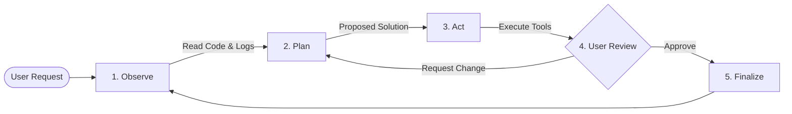

# DietCode: Your AI Coding Partner

**DietCode** is an open-source AI coding agent that lives in your editor. It's designed to help you build complex software by understanding your entire project, suggesting smart changes, and automating repetitive tasks—all while keeping you in full control.

> [!IMPORTANT]
> **Performance First**: The latest version of DietCode features a redesigned analysis engine that is faster and more memory-efficient, allowing it to handle projects with thousands of files with ease.

---

## 🚀 The Developer's Toolkit

DietCode offers a complete suite of tools to help you build faster:

- **Smart Project Analysis**: Automatically maps your project's structure, understanding dependencies and coding patterns without manual setup.
- **Local Context Memory**: Uses a local SQLite database (**BroccoliDB**) to store task history and project context safely on your machine.
- **Universal Guard**: Ensures all AI-suggested changes follow your project's rules and architectural standards.
- **Human-in-the-Loop**: You approve every file edit, terminal command, and browser action. Nothing happens without your permission.
- **Extensible Tools**: Support for terminal commands, browser automation, and 3rd-party tool integration via the [Model Context Protocol (MCP)](https://modelcontextprotocol.io).

---

## 📐 Project Blueprint (1-to-1 Parity)

DietCode is architected for transparency. Here is how the project is organized:

### Core Modules (`src/`)
- **`src/core/`**: The main orchestration loop and reasoning engine. This is where DietCode "thinks" and decides which tools to use.
- **`src/domain/`**: Business logic and project-wide rules. It defines the standards and constraints that DietCode must follow.
- **`src/services/`**: Shared capabilities like AI model communication, prompt generation, and context management.
- **`src/infrastructure/`**: The "hands" of DietCode. This layer handles file system access, terminal execution, and browser automation.
- **`src/integrations/`**: Adapters that connect DietCode to specific editors like VS Code and JetBrains.
- **`src/integrity/`**: Stability monitors and policy enforcement that prevent agent errors and ensure structural quality.
- **`src/types/`**: The central repository for all project-wide TypeScript definitions.

### Supporting Folders
- **`webview-ui/`**: The frontend code for the interactive sidebar you see in your editor.
- **`cli/`**: The standalone version for terminal power-users and automated CI/CD workflows.
- **`broccolidb/`**: Local storage (SQLite) where your task history and project context are safely persisted.
- **`proto/`**: The high-performance communication protocol between the agent and your host environment.
- **`mcp/`**: A plugin hub for extending DietCode with new tools (databases, API clients, custom scripts).

---

## 🛠️ How it Works

DietCode uses a simple **Observe → Plan → Act** loop to help you solve problems.

### 1. Smart Code Analysis
DietCode uses advanced static analysis to map your project's architecture. It identifies patterns, detects potential bugs, and ensures that new code follows your project's existing standards.

### 2. Intelligent Suggestions
When you ask for a change, DietCode analyzes the impact across your entire codebase. It identifies which files need to change and ensures that imports and dependencies are handled correctly.

### 3. Safe Execution
DietCode can run tests, install packages, and debug errors directly in your terminal. It can also launch a browser to verify that your UI changes look exactly right.

---

## ⚡ Quick Start

1.  **Install**: Search for "DietCode" in your IDE's marketplace (VS Code, JetBrains, etc.).
2.  **Configure**: Connect your preferred AI provider (Anthropic, OpenAI, Google, or local).
3.  **Start Building**: Open the DietCode panel and describe what you want to build.

For a detailed walkthrough, see our **[Getting Started Guide](https://docs.dietcode.com/getting-started)**.

---

## 🕰️ History & Origins

**DietCode** is a professionally hardened evolution of the [Cline](https://github.com/cline/cline) open-source project. While it shares some foundational concepts, DietCode has been significantly refactored to focus on enterprise-grade stability, advanced project analysis, and strict adherence to coding standards.

---
*Built with ❤️ by the DietCode Team. Focus on quality, stay in control.*
