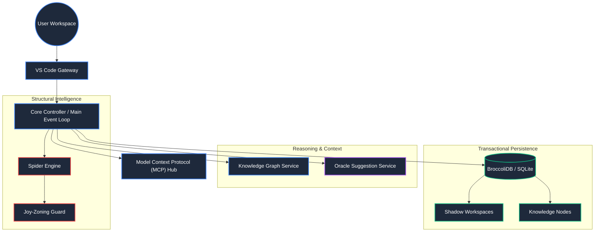
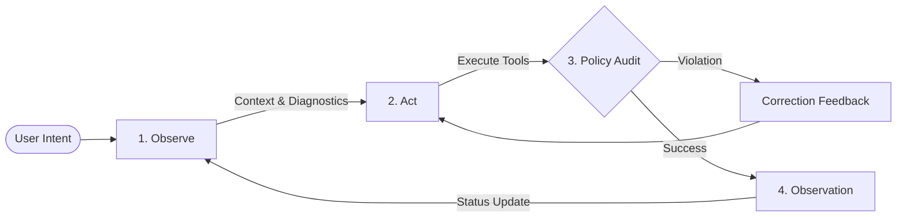

# DietCode: The Architectural Guardian

**DietCode** is an industrial-grade, model-agnostic agentic coding assistant designed to maintain architectural integrity in complex software ecosystems. Beyond simple code generation, DietCode acts as an **Architectural Guardian**, enforcing strict layering, managing structural entropy, and ensuring transactional stability across your workspace.

> [!IMPORTANT]
> **Industrial Release (v5.5.0)**: This release marks the achievement of **Industrial Sovereignty (V200)**. It transitions the architectural substrate to a 100% memory-resident, zero-allocation model, ensuring absolute metabolic immortality and forensic stability for enterprise-scale workspaces.

---

## 🏗️ Core Pillars of Intelligence

### 🧬 Joy-Zoning Framework
DietCode enforces a rigorous architectural pattern known as **Joy-Zoning**. It automatically categorizes every file into distinct layers and enforces "Outside-In" dependency rules. 
*   **Layer 1 (Shared/Core)**: Foundational types and utilities.
*   **Layer 2 (Services)**: Business logic and data providers.
*   **Layer 3 (UI/Handlers)**: Components and interaction logic.
*   **Layer 4 (Controllers)**: Extension lifecycle and event management.

> [!TIP]
> The **Fluid Policy Engine** monitors every file operation via the **Universal Guard** to prevent layer leaks and circular dependencies in real-time.

### 🕷️ Spider Structural Intelligence Engine (V200)
The **Spider Engine** has graduated to a sovereign, memory-resident **Industrial Substrate**:
*   **Metabolic Immortality**: Achieved via string interning, zero-alloc nested map caching, and clinical closure hygiene. Ensures the engine remains resource-neutral even in projects with 10,000+ files.
*   **Deterministic Forensics**: Uses real-time AST sensing to verify symbol consumption project-wide with 100% accuracy.
*   **Incremental $O(1)$ Audits**: Uses a memory-resident CAS-hash model to provide instantaneous architectural validation without disk overhead.
*   **Stability Lock 2.0**: Session-authenticated concurrency prevents structural corruption and race conditions during high-velocity agentic turns.
*   **Industrial Fission**: Manages architectural mass by enforcing a hard **1500-line limit** per module via the Sovereign Decomposer.

### 🔮 Oracle Grade Suggestion Engine
The **Oracle Suggestion Engine** transforms prompt suggestions into an architectural and diagnostic compass:
*   **Forensic Symbol Resolution**: Automatically identifies and resolves missing symbols using verified AST metadata from the Spider graph.
*   **Industrial Member Mapping**: Forensicly extracts method and property signatures from provider modules to synthesize perfectly compatible stubs.
*   **Parallelized Source Discovery**: Simultaneously gathers intelligence from Diagnostics, Git, BroccoliDB, and Tree-Sitter with zero detectable latency.

---

## 📐 System Architecture

### 1. Functional Layout
DietCode is built on a decoupled, high-throughput architecture designed for stability and observability.

### 2. Execution Flow: Observe-Act-Adjust
DietCode utilizes a high-reliability autonomous loop that prioritizes forward progress over recursive validation.

---

## 🛠️ Industrial Infrastructure

### 🔗 Advanced MCP Hub
Full integration with the **Model Context Protocol (MCP)**:
- **SSE & Stdio Transports**: Multi-protocol support for local and remote tool servers.
- **Native OAuth**: Integrated authentication for enterprise-grade tool integrations.

### 📊 OpenTelemetry Observability
High-fidelity telemetry for audit trails and performance tuning:
- **Token Economics**: Precise cost tracking per task and turn.
- **Stability Metrics**: Monitoring "Architectural Entropy" and policy violation trends.

---

## ⚡ Quick Start

1.  **Install**: Search for "DietCode" in the [VS Code Marketplace](https://marketplace.visualstudio.com/items?itemName=DreamBeesAI.dietcode).
2.  **Configure**: Add your API keys for [OpenRouter](https://openrouter.ai/), [Anthropic](https://www.anthropic.com/), or [Google](https://ai.google.dev/).
3.  **Activate**: Click the DietCode icon in the sidebar and start your first "Architectural Intent" resolution task.

---

## 🕰️ History & Origins
**DietCode** is a completely transformed, industrial-grade evolution of the original [Cline](https://github.com/cline/cline) repository. While it shares foundational DNA, the architecture, orchestration, and policy safeguarding have been reconstructed from the ground up to support enterprise-scale agentic coding.

---
*Built with ❤️ by the DietCode Team. Architectural Integrity is the core.*
