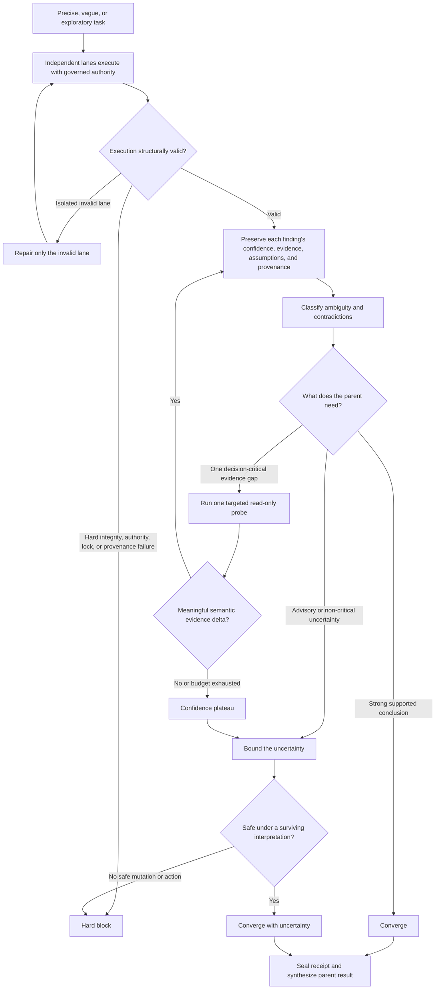
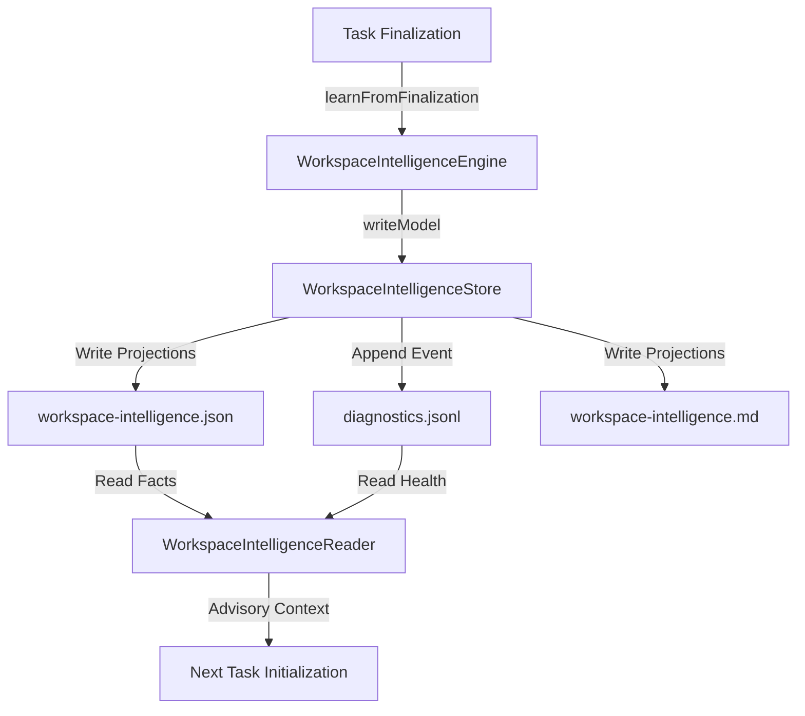
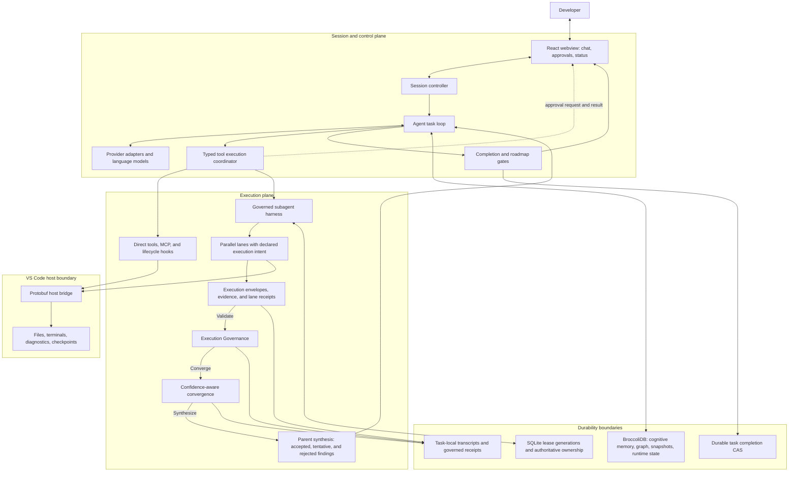

# LUMI

<p align="center">
  
</p>

<p align="center">
  <strong>A calm coding companion — human-in-the-loop agentic pair programming inside VS Code.</strong>
</p>

<p align="center">
  <em>Forked from <a href="https://github.com/cline/cline">Cline</a> · evolved independently by <a href="https://github.com/CardSorting">CardSorting</a></em>
</p>

<p align="center">
  <a href="docs/README.md">Documentation</a> ·
  <a href="#origins--acknowledgments">Cline lineage</a> ·
  <a href="CONTRIBUTING.md">Contributing</a> ·
  <a href="SECURITY.md">Security</a> ·
  <a href="docs/OPENSSF_SCORECARD.md">OpenSSF Scorecard</a> ·
  <a href="https://github.com/CardSorting/LUMI/issues">Issues</a> ·
  <a href="https://github.com/CardSorting/LUMI/discussions">Discussions</a>
</p>

<p align="center">
  <a href="LICENSE"></a>
  <a href="https://github.com/CardSorting/LUMI/actions/workflows/codeql.yml"></a>
  <a href="https://securityscorecards.dev/viewer/?uri=github.com/CardSorting/LUMI"></a>
  <a href="package.json"></a>
  
  
  
  
  
</p>

<p align="center">
  
</p>

> **Human-in-the-loop by default:** diff before write, checkpoint after tool use, completion gates before “done.”

```bash
# VS Code Marketplace (CardSorting.lumi-vscode)
code --install-extension CardSorting.lumi-vscode
# Open VSX / Cursor (CardSorting.lumi)
code --install-extension CardSorting.lumi
```

---

## Table of contents

- [About](#about)
- [Origins & acknowledgments](#origins--acknowledgments)
- [Product evolution (full history)](docs/EVOLUTION.md)
- [Features](#features)
- [Installation](#installation)
- [Quick start](#quick-start)
- [Documentation](#documentation)
- [Governed subagent execution](#governed-subagent-execution)
- [Workspace Knowledge System](#workspace-knowledge-system)
- [Mixture of Designers (MoD) v1.2](#mixture-of-designers-mod-v12)
- [Plan & Act modes](#plan--act-modes)
- [Built-in slash commands](#built-in-slash-commands)
- [Lifecycle hooks](#lifecycle-hooks)
- [Key VS Code settings](#key-vs-code-settings)
- [Architecture](#architecture)
- [Development](#development)
- [Troubleshooting](#troubleshooting)
- [Getting help](#getting-help)
- [Security](#security)
- [FAQ](#faq)
- [Contributing](#contributing)
- [License](#license)

---

## About

**LUMI** is a VS Code extension that reads your workspace, plans changes, runs terminal commands, connects MCP servers, and edits files — with **explicit approval at every mutating step**.

| | |
|---|---|
| **Publisher** | CardSorting |
| **VS Marketplace** | `CardSorting.lumi-vscode` |
| **Open VSX** | `CardSorting.lumi` |
| **License** | [Apache-2.0](LICENSE) |
| **Repository** | [github.com/CardSorting/LUMI](https://github.com/CardSorting/LUMI) |
| **Homepage** | [dietcode.io](https://dietcode.io) |
| **Changelog** | [changelogv3.md](changelogv3.md) |

Task history and cognitive memory use **BroccoliDB** (`@noorm/broccolidb`) locally. Multi-lane **governed swarms** (`use_subagents`) use SQLite-backed production leases, durable receipts, typed deadlock analysis, and a merge gate so parallel agents can share read work without weakening mutation safety.

Design philosophy: [docs/papers/philosophy.md](docs/papers/philosophy.md) (agent) · [docs/papers/knowledge-philosophy.md](docs/papers/knowledge-philosophy.md) (knowledge) · Stack map: [docs/AGENT_STACK.md](docs/AGENT_STACK.md)

### By the numbers

| Metric | Value |
|--------|-------|
| Typed tools | **64** (`src/shared/tools.ts`) |
| Read-only tools | **12** (`READ_ONLY_TOOLS`) |
| Wired providers | **6** (`providers.json`) |
| Slash commands | **10** |
| Hook kinds | **8** |
| Agent modes | **plan** · **act** |
| Governed receipt schema | **v3** |

Workspace-verified metrics: [docs/papers/companion-brief.md](docs/papers/companion-brief.md) · Knowledge brief: [docs/papers/knowledge-brief.md](docs/papers/knowledge-brief.md)

---

## Origins & acknowledgments

**LUMI** is spiritually and technically descended from **[Cline](https://github.com/cline/cline)** — the open-source VS Code agent that pioneered human-in-the-loop pair programming (diff-before-write, plan/act, MCP, checkpoints). This repository **forked the Cline VS Code extension codebase** and has since evolved independently under **[CardSorting](https://github.com/CardSorting)**.

[Cline](https://cline.bot) today ships several products — VS Code extension, [CLI](https://github.com/cline/cline/tree/main/cli), [TypeScript SDK](https://github.com/cline/cline/tree/main/sdk), and [Kanban](https://github.com/cline/kanban). **LUMI is not those other repos**; it is a governance-focused fork of the **editor extension agent** lineage only.

### Evolution

| Stage | Name | Notes |
|-------|------|-------|
| Upstream | **Cline** | Original agent loop, typed tools, and VS Code integration |
| Intermediate | **DietCode** | CardSorting fork; sovereign substrate, Spider, roadmap gates; legacy IDs remain |
| Substrate | **BroccoliDB** | Cognitive memory and structural truth recentered into `@noorm/broccolidb` |
| Governed lanes | **Receipts v3** | Multi-agent merge gate, per-lane roadmap projection, durable operator receipts |
| Current | **LUMI** | User-facing brand; extension IDs `CardSorting.lumi` / `CardSorting.lumi-vscode` |

**Full timeline, phase narratives, naming migration tables, and changelog map:** [docs/EVOLUTION.md](docs/EVOLUTION.md).

### Inherited from Cline · built by LUMI

| From Cline (kept) | LUMI additions |
|-------------------|----------------|
| Diff-before-write approvals · [Cline: working with files](https://docs.cline.bot/core-workflows/working-with-files) | **Governed subagents** — parallel lanes, mutation locks, merge gates, durable receipts |
| [Plan / Act modes](https://docs.cline.bot/core-workflows/plan-and-act) | **BroccoliDB** — local cognitive memory and workspace substrate (`dietcode.db`) |
| [MCP](https://docs.cline.bot/features/mcp) tool extension | **Roadmap & completion gates** — `ROADMAP.md` steering and `attempt_completion` audit pipeline |
| Terminal execution with explicit user consent | **Joy-Zoning & stability policy** — architectural enforcement in the tool path |
| `@` context mentions, browser tooling, checkpoints | **Product surface** — LUMI branding, [dietcode.io](https://dietcode.io), CardSorting extension IDs |

### Coming from Cline?

If you used Cline’s VS Code extension, approvals, modes, and MCP should feel familiar. Main differences:

| Cline | LUMI |
|-------|------|
| `.clinerules/` project rules | [`.dietcoderules/`](docs/customization/dietcode-rules.mdx) |
| `.clineignore` | [`.dietcodeignore`](docs/customization/dietcodeignore.mdx) |
| Cline extension IDs (e.g. `saoudrizwan.claude-dev`) | `CardSorting.lumi` / `CardSorting.lumi-vscode` |
| CLI, SDK, Kanban (separate Cline products) | **Not bundled here** — use [upstream Cline](https://github.com/cline/cline) |

Legacy identifiers (`cline`, `clineMessages`, Cline doc redirects in `docs/docs.json`) still appear in paths and types where refactors are ongoing; the user-facing product name is **LUMI**. See [legacy inventory](docs/EVOLUTION.md#legacy-inventory--refactor-status) for a full grep-backed list.

### Links & license

| | |
|---|---|
| **Upstream repo** | [github.com/cline/cline](https://github.com/cline/cline) |
| **Cline docs** | [docs.cline.bot](https://docs.cline.bot) |
| **Cline community** | [cline.bot](https://cline.bot) · [Discord](https://discord.gg/cline) |
| **Upstream license** | [Apache-2.0](https://github.com/cline/cline/blob/main/LICENSE) |
| **This fork’s attribution** | [NOTICE](NOTICE) · [License](#license) |

Thank you to the Cline maintainers and contributors for the foundation this project builds on. For LUMI’s design goals vs generic autonomous agents, see [How LUMI differs](docs/README.md#how-lumi-differs). For the full fork timeline and migration reference, see [Product evolution](docs/EVOLUTION.md).

---

## Features

- **Approval gates** — diff before write; you control when mutating tools run
- **Plan before Act** — `plan_mode_respond` for exploration; `act_mode_respond` for implementation
- **64 typed tools** — dedicated handlers instead of ad-hoc shell access
- **Checkpoints** — shadow Git rollback after each tool use
- **Completion gates** — `attempt_completion` must pass `completionGatePipeline` before “done”
- **Roadmap steering** — `ROADMAP.md` integration with validation gates
- **MCP** — connect external tools and prompts
- **Governed subagents** — parallel lanes with execution modes, merge gate, and durable receipts
- **Restart-safe completion** — terminal outcomes commit through an ownership- and state-checked SQLite transaction
- **Local-first** — settings and secrets under `~/.dietcode/data/`; workspace DB at `./dietcode.db`
- **Six providers** — OpenRouter, ChatGPT Subscription, NousResearch, Cloudflare Workers AI, ClinePass, Grok/X Subscription

**@ mentions** — attach files, folders, problems, terminal output, git diffs, and URLs in chat. Guide: [working-with-files](docs/core-workflows/working-with-files.mdx)

**Project files:** `.dietcoderules/`, `.dietcoderules/hooks/`, `.dietcodeignore`, `.dietcodeworkflows/`, `ROADMAP.md`. See [hooks](docs/customization/hooks.mdx) and [dietcodeignore](docs/customization/dietcodeignore.mdx).

**Enterprise:** [docs/ENTERPRISE_DEPLOYMENT.md](docs/ENTERPRISE_DEPLOYMENT.md)

---

## Installation

### Prerequisites

- VS Code **1.84+** (or Cursor with extension support)
- **Git** on `PATH` (for checkpoints)
- API credentials for one provider (OpenRouter, ChatGPT Subscription, NousResearch, Cloudflare, or ClinePass)

### Install

| Method | Action |
|--------|--------|
| **Marketplace** | Extensions → search **LUMI** → install **CardSorting.lumi-vscode** (VS Code) or **CardSorting.lumi** (Open VSX) |
| **CLI** | `code --install-extension CardSorting.lumi-vscode` |
| **VSIX** | `npm run package:vsix` → `code --install-extension dist/*.vsix` |
| **From source** | See [Development](#development) → press **F5** |

Provider setup: [docs/getting-started/quick-start.mdx](docs/getting-started/quick-start.mdx)

> Disable other DietCode forks to avoid activity bar collisions.

---

## Quick start

1. Open the LUMI activity bar panel
2. Configure a provider in **LUMI Settings → API Configuration**
3. Describe a task → review each tool proposal → **Approve** or **Reject**
4. Keep checkpoints enabled for one-click rollback

Tutorial: [your-first-project](docs/getting-started/your-first-project.mdx) · Plan/Act guide: [plan-and-act](docs/core-workflows/plan-and-act.mdx)

---

## Documentation

| Doc | Description |
|-----|-------------|
| **[Agent playbook](AGENT_PLAYBOOK.md)** | Current-state operating brief for future agents |
| [Workspace wiki](WIKI.md) | Stable architecture, workflows, setup, testing, deployment notes |
| **[Knowledge ledger](.wiki/index.md)** | Sovereign knowledge ledger index and navigation |
| [Troubleshooting](TROUBLESHOOTING.md) | Reproduced failures, fixes, non-causes, validation guidance |
| [Decisions](DECISIONS.md) | Root continuity and operating ADRs |
| [Handoff](HANDOFF.md) | Current working-tree state and next-agent transfer notes |
| **[docs/README.md](docs/README.md)** | Documentation hub — reading paths by audience |
| [Product evolution](docs/EVOLUTION.md) | Cline → DietCode → LUMI timeline, migration playbook |
| [Companion brief](docs/papers/companion-brief.md) | Product summary with live metrics |
| [Philosophy](docs/papers/philosophy.md) | Design values and philosophy of LUMI calm agency |
| [Whitepaper](docs/papers/whitepaper.md) | Technical whitepaper on LUMI and governed execution |
| [Workspace knowledge brief](docs/papers/knowledge-brief.md) | Executive brief of the Workspace Knowledge System |
| [Workspace knowledge philosophy](docs/papers/knowledge-philosophy.md) | Advisory memory design principles |
| [Workspace knowledge thesis](docs/papers/knowledge-thesis.md) | Sovereign advisory invariant thesis |
| [Workspace knowledge whitepaper](docs/papers/knowledge-whitepaper.md) | Architecture blueprint and NDJSON engine |
| [MEOW brief](.wiki/meow-executive-brief.md) | Executive brief for the Model-Efficient Order-aware Workflow |
| [MEOW philosophy](.wiki/meow-philosophy.md) | Normative reasoning and calm concurrency principles |
| [MEOW whitepaper](.wiki/meow-whitepaper.md) | Canonical technical architecture for execution lane swarms |
| [MEOW migration](.wiki/meow-migration.md) | Measured throughput evidence and naming evolution |
| [MoD brief](.wiki/mod-executive-brief.md) | Executive brief for Mixture of Designers v1.2 orchestration |
| [MoD philosophy](.wiki/mod-philosophy.md) | Cognitive specialization, bounded rationality, and priority consensus |
| [MoD whitepaper](.wiki/mod-whitepaper.md) | Mathematical formalization, gating network, and Hoare-logic mutation governance |
| [Governed subagent execution](docs/governed-subagent-execution.md) | Swarm architecture and lifecycle |
| [Governed execution authority](docs/governed-execution-authority.md) | SQLite lease authority, projection reconciliation, and deadlock safety |
| [Governed execution runbook](docs/governed-execution-runbook.md) | Operator playbook |
| [Task lifecycle authority](docs/task-lifecycle-authority.md) | Transactional generation, cancellation, resume, and terminal state |
| [Completion funnel](docs/completion-lifecycle-decision-engine.md) | Semantic completion and durable lifecycle handoff |
| [Memory & reasoning](docs/MEMORY_AND_REASONING.md) | BroccoliDB cognitive layer |
| [Spider forensic engine](docs/architecture/spider-v20-forensic-engine.md) | BroccoliDB analysis substrate |
| [Security best practices](docs/SECURITY_BEST_PRACTICES.md) | Trust boundaries and hardening |
| [Roadmap steering](docs/features/roadmap-steering.mdx) | `ROADMAP.md` and completion gates |
| [Hooks](docs/customization/hooks.mdx) | Lifecycle hook scripts |
| [Maintainer guide](docs/MAINTAINER.md) | Doc guardrails when code changes |
| [BroccoliDB](broccolidb/README.md) | Context store package |
| [BroccoliDB docs](broccolidb/docs/README.md) | Substrate documentation hub |

---

## Governed subagent execution

Multi-lane swarms via `use_subagents` separate **whether work executed correctly** from **how certain each finding is**. Vague research can now finish with bounded uncertainty instead of retrying until the swarm invents confidence or falls into a merge loop.

```text
Before: vague task → uncertainty → retry → interpretation drift → merge loop
Now:    vague task → tentative finding → bounded probe if critical → confidence plateau → converge with uncertainty
```

> **North-star invariant:** Private roadmap state is cheap. Workspace roadmap truth is expensive. Only the coordinator may spend it.



Low or unknown confidence never invalidates a valid lane. Advisory findings remain tentative, contradictory interpretations retain their assumptions, and repeated reads of the same evidence do not count as progress. Receipt, checksum, mutation-authority, lock, and provenance failures still fail closed.

### Production execution safety

| Boundary | Guarantee |
|----------|-----------|
| **Lease authority** | SQLite is the sole production authority; database failure retries or fails closed instead of falling back to memory or files |
| **Fencing identity** | Lease epochs and fencing tokens remain arbitrary-precision decimal strings and are released only by the exact owner/epoch/token tuple |
| **Filesystem projections** | Governed lock and Broccoli fence files are verified projections; malformed records are preserved for reconciliation rather than deleted automatically |
| **Deadlock recovery** | Typed wait-for edges are analyzed from an immutable scheduler snapshot; timers, expiring leases, outside owners, and capacity escapes prevent false deadlock recovery |
| **Terminal completion** | One durable `task_completions` row is committed only while the lease generation and evaluated task state remain current |

Operational details: [authority model](docs/governed-execution-authority.md) · [schema](docs/governed-execution-schema.md) · [runbook](docs/governed-execution-runbook.md)

| Mode | Lock | Use |
|------|------|-----|
| `read_only` | skipped | Code review, inspection |
| `audit_only` | skipped | Receipt / evidence audit |
| `mutation` | **required** | File edits, durable state changes |

Declare in lane prompts: `[execution_mode:read_only] [read_set:src/api.ts]`

| Doc | Audience |
|-----|----------|
| [Quick reference](docs/governed-roadmap-projection-quickref.md) | Patch tags, one page |
| [Architecture](docs/governed-subagent-execution.md) | Full lifecycle |
| [Runbook](docs/governed-execution-runbook.md) | Violations, retry flow |
| [Convergence and receipt guide](docs/governed-execution-schema.md) | Behavioral model, decision flow, invariants, and receipt v3 fields |

---

## Workspace Knowledge System

LUMI maintains an advisory, non-blocking **Workspace Knowledge System** (Observability Seatbelt) that builds a durable project memory after each completed task to orient future agent execution.



- **Durable Facts & Provenance:** Captures stable/volatile subsystems, recent architectural decisions (ADRs), stale docs, risk areas, and handoff facts. Every fact links to a provenance trail (*why we believe it*) and a lifecycle state (*whether it is still valid*).
- **Observability Seatbelt:** System errors (e.g. read-only filesystem or full disk) log to diagnostics but degrade gracefully, ensuring knowledge updates never block task completion or tool executions.
- **Append-Only Event Log (`diagnostics.jsonl`):** Diagnostics are written to an append-only JSON Lines event log.
- **Read-Only Health API:** Downstream tools check status via `getKnowledgeHealth()`, which parses diagnostic lines, returns status (`healthy | degraded`), and compiles actionable recovery hints.
- **Human-Readable Dashboard:** Exposes active system health alerts and collapsible diagnostics lists directly at the top of [workspace-intelligence.md](file:///.wiki/intelligence/workspace-intelligence.md).

---

## Mixture of Designers (MoD) v1.2

LUMI includes **Mixture of Designers (MoD) v1.2**, a toggleable cognitive-specialization orchestration runtime that models professional software product design organizations. Inspired by Mixture-of-Experts (MoE) architectures, MoD dynamically routes codebase problems to a council of specialized read-only design personas (such as UX Architect, Accessibility Reviewer, Design System Engineer), converges recommendations using a deterministic priority hierarchy, locks design decisions, and delegates codebase mutations to developer subagents bounded by strict file mutation scopes.

| Paper / Guide | Target Audience / Purpose |
|---------------|--------------------------|
| **[MoD Executive Brief](.wiki/mod-executive-brief.md)** | Product strategy, persona mappings, and token efficiency models |
| **[MoD Design Philosophy](.wiki/mod-philosophy.md)** | Bounded rationality, appraisal/execution separation, and priority consensus |
| **[MoD Technical Whitepaper](.wiki/mod-whitepaper.md)** | Mathematical formulation, gating networks, DAG state resume, and Hoare logic |

---

## Plan & Act modes

LUMI runs in **`plan`** or **`act`** mode. Each mode can use a different provider and model.

| Mode | Response tool | Behavior |
|------|---------------|----------|
| **Plan** | `plan_mode_respond` | Strategy, exploration, read-only tools |
| **Act** | `act_mode_respond` | Implementation — mutating tools with approval |

Typical flow: gather context in Plan → approve direction → Act executes writes → `attempt_completion` through completion gates.

Guide: [docs/core-workflows/plan-and-act.mdx](docs/core-workflows/plan-and-act.mdx)

---

## Built-in slash commands

Typed at the start of a message (`/command`):

| Command | Purpose |
|---------|---------|
| `/newtask` | Fresh task context |
| `/compact` | Condense conversation history |
| `/deep-planning` | Extended planning pass |
| `/roadmap` | Roadmap steering actions |
| `/explain-changes` | Summarize what changed |

**10** commands total — source: `SUPPORTED_DEFAULT_COMMANDS` in `src/core/slash-commands/index.ts`. Custom workflows: `.dietcodeworkflows/`

---

## Lifecycle hooks

**8** hook kinds in `VALID_HOOK_TYPES`. Scripts live under **`.dietcoderules/hooks/`** (workspace or global).

| Hook | Fires when |
|------|------------|
| `PreToolUse` | Before a tool executes (can cancel) |
| `PostToolUse` | After a tool executes |
| `TaskStart` | Task begins |
| `TaskComplete` | Task completes |

Guide: [docs/customization/hooks.mdx](docs/customization/hooks.mdx)

---

## Key VS Code settings

| Setting | Default | Purpose |
|---------|---------|---------|
| `lumi.roadmap.enabled` | `true` | Master switch for ROADMAP.md steering |
| `lumi.roadmap.autoBootstrap` | `true` | Create `ROADMAP.md` from workspace evidence |
| `lumi.roadmap.failClosedCompletionGates` | `true` | Block completion when gate evaluation fails |

Details: [docs/features/roadmap-steering.mdx](docs/features/roadmap-steering.mdx)

---

## Architecture

LUMI is split into a **session and control plane**, an **execution plane**, and two distinct durability boundaries. The ordinary tool path and governed swarm path share the same approval and VS Code host boundaries, but swarms add lane authority, receipts, merge validation, and confidence-aware parent synthesis.



| Layer | Owns | Boundary |
|-------|------|----------|
| **Webview** | Conversation UI, approval decisions, diff and swarm status presentation | Presents decisions; it does not execute workspace mutations directly |
| **Session control** | Conversation state, model turns, task lifecycle, completion routing | Coordinates work; physical I/O stays behind typed tools and the host bridge |
| **Tool execution** | Typed dispatch, lifecycle hooks, MCP calls, approval enforcement | Direct tools and subagent swarms enter through the same governed tool boundary |
| **Governed lanes** | Lane scheduling, declared execution intent, mutation claims, evidence collection | Produces execution records; it does not decide merge eligibility or manufacture consensus |
| **Execution governance** | Receipt integrity, authority, locks, mutation legality, replay legality, and merge eligibility | Fail-closed execution firewall; confidence cannot override a governance failure |
| **Coordination authority** | SQLite lease generations, fencing tokens, exact-tuple release, and projection reconciliation | Production never adopts memory or filesystem state as fallback authority |
| **Convergence and synthesis** | Finding confidence, ambiguity, contradictions, bounded probes, uncertainty, and the parent result | Consumes governance-approved execution; low confidence changes synthesis, not execution validity |
| **Terminal completion** | Canonical completion identity and the `task_completions` CAS transaction | In-memory state changes only after the durable lease/state commit succeeds |
| **VS Code host** | Filesystem, terminals, diagnostics, tabs, and checkpoints | Physical IDE operations are isolated behind the Protobuf host bridge |
| **Task artifacts** | Append-only transcripts, execution envelopes, immutable attempt receipts, replay checksums | Authoritative swarm execution history lives under the task directory, not in cognitive memory |
| **BroccoliDB** | Cognitive memory, runtime graph, snapshots, structural analysis, and fencing substrate | Advisory knowledge and substrate state; not the governed swarm receipt store |

Execution Governance is the fail-closed firewall between lane output and convergence. Confidence-aware convergence sees only governance-approved execution; it can add a bounded read-only verification probe or return an uncertainty package, but it cannot bypass receipt integrity, mutation authority, locks, replay checks, or completion gates.

**Stack:** TypeScript extension host · React webview · provider adapters · typed tools and MCP · Protobuf host bridge · BroccoliDB SQLite · governed receipt schema v3 · Biome · Mocha / Playwright tests · Mintlify docs.

Canonical stack map: [docs/AGENT_STACK.md](docs/AGENT_STACK.md) · Governed lifecycle: [docs/governed-subagent-execution.md](docs/governed-subagent-execution.md) · Confidence and receipt model: [docs/governed-execution-schema.md](docs/governed-execution-schema.md)

---

## Development

```bash
git clone https://github.com/CardSorting/LUMI.git
cd LUMI
npm run install:all    # root + webview-ui
npm run protos         # required before first build
npm run dev            # watch extension + typecheck
npm run dev:webview    # separate terminal — webview HMR
```

Press **F5** in VS Code → Extension Development Host. Package: `npm run package` → `dist/*.vsix`.

| Script | Purpose |
|--------|---------|
| `npm run check-types` | TypeScript — extension + webview |
| `npm run lint` | Biome + proto lint |
| `npm test` | Unit + integration tests |
| `npm run ci:check-all` | Types, lint, format, roadmap audit, doc guardrails |
| `npm run docs:check-all` | All doc guardrails + Mintlify links |

Governed execution tests: `npm run test:unit -- --grep "governed execution"`

### Quality gates

`npm run ci:check-all` runs types, lint, format, roadmap audit, and doc guardrails in parallel. Doc checks include `docs:check-root-readme`, `docs:check-readme-metrics`, and **`npm run docs:check-all`**.

When you change tools, providers, or governed execution, update docs per [docs/MAINTAINER.md](docs/MAINTAINER.md).

Full guide: [CONTRIBUTING.md](CONTRIBUTING.md)

---

## Troubleshooting

| Symptom | Fix |
|---------|-----|
| Extension missing from sidebar | Install **CardSorting.lumi-vscode** or **CardSorting.lumi**; `Developer: Reload Window` |
| Checkpoints fail | Install Git; ensure `git` is on `PATH` |
| Slow on large repos | Add [`.dietcodeignore`](docs/customization/dietcodeignore.mdx) |
| Provider auth errors | Re-open LUMI Settings → re-enter API key |
| Completion blocked | Run `/roadmap validate`; check `lumi.roadmap.*` settings |
| Subagent merge blocked | See [governed runbook](docs/governed-execution-runbook.md) |
| `DATABASE_AUTHORITY_UNAVAILABLE` | Restore the persistent SQLite database, then retry; do not delete projection files or switch to local authority |
| Reset extension state | Close VS Code; remove `~/.dietcode/data/`; reload window |

---

## Getting help

| Channel | Link |
|---------|------|
| **Documentation** | [docs/README.md](docs/README.md) |
| **Changelog** | [CHANGELOG.md](CHANGELOG.md) |
| **Discussions** | [GitHub Discussions](https://github.com/CardSorting/LUMI/discussions) |
| **Bug reports** | [GitHub Issues](https://github.com/CardSorting/LUMI/issues/new?template=bug_report.yml) |
| **Security (private)** | [SECURITY.md](SECURITY.md) |

Include VS Code version, LUMI **6.0.0**, provider used, and steps to reproduce.

---

## Security

| Boundary | Enforcement |
|----------|-------------|
| Mutating tools | Approval UI + diff before write |
| Secrets | `~/.dietcode/data/secrets.json` (mode `0600`) |
| Settings & state | `~/.dietcode/data/` |
| Workspace memory | `./dietcode.db` (BroccoliDB SQLite) |
| Governed receipts | `{taskDir}/subagent_executions/` |
| Hooks | `.dietcoderules/hooks/` — `PreToolUse` can cancel tool calls |

Details: [docs/SECURITY_BEST_PRACTICES.md](docs/SECURITY_BEST_PRACTICES.md) · Report vulnerabilities via [SECURITY.md](SECURITY.md)

---

## FAQ

**Is LUMI fully autonomous?** No — it assumes a human approver for mutating work.

**Which extension ID do I use?** `CardSorting.lumi-vscode` on VS Marketplace; `CardSorting.lumi` on Open VSX / Cursor.

**Where is my data stored?** Settings and secrets in `~/.dietcode/data/`; workspace cognitive memory in `./dietcode.db`.

**Can read-only subagent lanes share files?** Yes — lock collisions are write-scoped only.

**What happens if the coordination database is unavailable?** Production retries at a safe boundary or fails closed. It never treats in-memory or filesystem projections as a replacement lock authority.

**How do I contribute?** See [CONTRIBUTING.md](CONTRIBUTING.md) — squash merges on `main`, Conventional Commits for PR titles.

---

## Contributing

We welcome issues, docs improvements, and pull requests. Please read [CONTRIBUTING.md](CONTRIBUTING.md) before opening a PR.

- **Code of conduct:** be respectful in issues and discussions
- **PRs:** squash merge only; PR title must follow Conventional Commits
- **Docs:** run `npm run docs:check-all` when changing tools, providers, or architecture
- **Governance:** [GOVERNANCE.md](GOVERNANCE.md)

---

## License

[Apache-2.0](LICENSE) — Copyright CardSorting and Cline Bot Inc. (see [NOTICE](NOTICE)).

This project is a derivative work of [Cline](https://github.com/cline/cline) (Apache-2.0 © Cline Bot Inc. and contributors). See [Origins & acknowledgments](#origins--acknowledgments) above.
