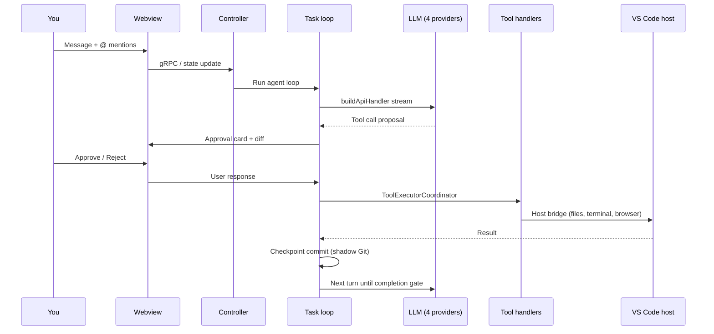
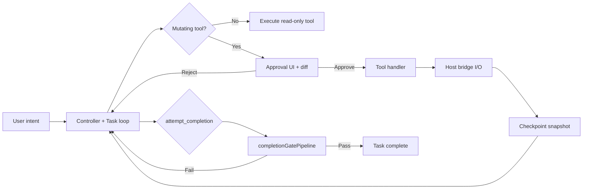
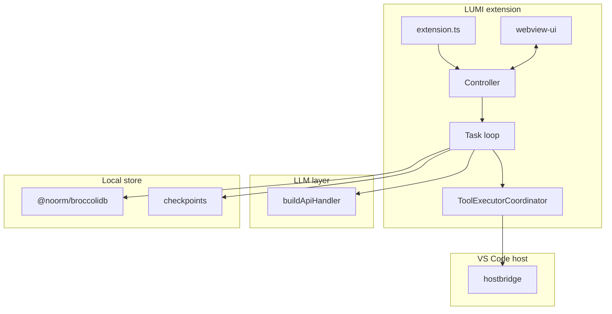

# LUMI

<p align="center">
  
</p>

<p align="center">
  <strong>A calm coding companion — comfort-first agentic pair programming inside VS Code.</strong>
</p>

<p align="center">
  <a href="docs/README.md">Documentation</a> ·
  <a href="docs/papers/companion-brief.md">Papers</a> ·
  <a href="docs/SECURITY_BEST_PRACTICES.md">Security</a> ·
  <a href="CONTRIBUTING.md">Contributing</a> ·
  <a href="https://github.com/CardSorting/DietCodeMarie/issues">Issues</a>
</p>

<p align="center">
  <a href="LICENSE"></a>
  <a href="package.json"></a>
  
  
  
  
  <a href="https://github.com/CardSorting/DietCodeMarie"></a>
</p>

<p align="center">
  
</p>

> **Human-in-the-loop by default:** diff before write, checkpoint after tool use, completion gates before “done.” Auto-approve and YOLO mode exist — pair them with [checkpoints](docs/core-workflows/checkpoints.mdx).

> **Doctrine:** User expresses intent → Controller holds session → Task runs the loop → Tools execute with approval → Checkpoints preserve rollback → Completion is earned through gates.

---

## Table of contents

- [Overview](#overview)
- [Why LUMI](#why-lumi)
- [Who LUMI is for](#who-lumi-is-for)
- [How LUMI differs](#how-lumi-differs)
- [Local-first & data](#local-first--data)
- [Compatibility](#compatibility)
- [Install](#install)
- [Quick start](#quick-start)
- [Project configuration](#project-configuration)
- [@ mentions](#-mentions)
- [Recommended workflows](#recommended-workflows)
- [Keyboard shortcuts](#keyboard-shortcuts)
- [Active providers](#active-providers)
- [Capabilities](#capabilities)
- [Plan & Act modes](#plan--act-modes)
- [Built-in slash commands](#built-in-slash-commands)
- [Lifecycle hooks](#lifecycle-hooks)
- [Key VS Code settings](#key-vs-code-settings)
- [How a task flows](#how-a-task-flows)
- [Trust model](#trust-model)
- [Architecture at a glance](#architecture-at-a-glance)
- [Monorepo packages](#monorepo-packages)
- [Tech stack](#tech-stack)
- [Documentation](#documentation)
- [Papers](#papers)
- [Repository layout](#repository-layout)
- [Development](#development)
- [Troubleshooting](#troubleshooting)
- [Getting help](#getting-help)
- [Security & trust](#security--trust)
- [FAQ](#faq)
- [Contributing](#contributing)
- [License](#license)

---

## Overview

**LUMI** (`CardSorting.lumi`, v1.0.3) is a VS Code extension that acts as an agentic pair programmer: it reads your workspace, plans changes, runs terminal commands, uses a browser, connects MCP servers, and edits files — with **explicit approval at every mutating step**.

Task history and cognitive memory use **BroccoliDB** (`@noorm/broccolidb`) locally. The sidebar UX is designed for **long sessions** without alert fatigue.

| | |
|---|---|
| **Publisher** | CardSorting |
| **Extension ID** | `CardSorting.lumi` |
| **License** | [Apache-2.0](LICENSE) |
| **Repository** | [github.com/CardSorting/DietCodeMarie](https://github.com/CardSorting/DietCodeMarie) |
| **Homepage** | [dietcode.io](https://dietcode.io) |
| **Changelog** | [changelogv3.md](changelogv3.md) |
| **Monorepo** | npm workspaces: root extension + `broccolidb/` package |

Workspace-verified metrics: [docs/papers/companion-brief.md](docs/papers/companion-brief.md).

### By the numbers

| Metric | Value |
|--------|-------|
| Typed tools | **62** (`src/shared/tools.ts`) |
| Read-only tools | **12** (`READ_ONLY_TOOLS`) |
| Wired providers | **4** (`providers.json`) |
| Slash commands | **10** |
| Hook kinds | **8** |
| Agent modes | **plan** · **act** |

---

## Why LUMI

Four design pillars — each maps to code, not marketing copy. Full treatment: [docs/papers/philosophy.md](docs/papers/philosophy.md).

| Pillar | What it means in practice |
|--------|---------------------------|
| **Calm agency** | Sidebar stays readable; you approve mutating work on your schedule |
| **Typed tools** | 62 enum values in `src/shared/tools.ts` → dedicated handlers — no ad-hoc shell |
| **Plan before mutate** | Plan mode + `plan_mode_respond` before Act mode file changes |
| **Provable finish** | `attempt_completion` runs through `completionGatePipeline.ts` — “done” is gated |

BroccoliDB handles **substrate truth** (structure, snapshots, Spider). LUMI handles **the human session** (chat, diffs, terminal, MCP). Do not confuse the two: [docs/AGENT_STACK.md](docs/AGENT_STACK.md).

---

## Who LUMI is for

| Persona | LUMI fit |
|---------|----------|
| **Solo developer** | Pair program in-editor with approval gates and checkpoints |
| **Tech lead** | Roadmap steering, hooks, `.dietcoderules/` for team guardrails |
| **Agent integrator** | MCP servers, subagents, typed tool surface to extend |
| **Substrate engineer** | BroccoliDB package for durable context — [broccolidb/README.md](broccolidb/README.md) |
| **Doc contributor** | Measured papers + [docs/MAINTAINER.md](docs/MAINTAINER.md) CI guardrails |

Not a fit: fully autonomous unattended agents (LUMI assumes a human approver in the loop).

---

## How LUMI differs

| Typical autonomous agent | LUMI |
|--------------------------|------|
| Runs until stopped | **Approval gate** per mutating tool call |
| Opaque file changes | **Diff view** before write lands |
| Hard to undo | **Checkpoints** — shadow Git after each tool use |
| “Done” when model says so | **Completion pipeline** + roadmap gates |
| Generic shell access | **62 typed tools** with dedicated handlers |
| External memory app | **BroccoliDB** integrated locally |

---

## Local-first & data

| Data | Location | Notes |
|------|----------|-------|
| **Settings & task refs** | `~/.dietcode/data/` | `globalState.json`, per-workspace state (`createStorageContext`) |
| **API keys / secrets** | `~/.dietcode/data/secrets.json` | Mode `0600` — owner read/write only |
| **BroccoliDB SQLite** | `./dietcode.db` (workspace cwd) | Local cognitive memory / runtime graph |
| **Checkpoints** | VS Code `globalStorage/checkpoints/` | Shadow Git — not your project `.git/` |
| **LLM requests** | Your chosen provider | Code context sent to OpenRouter, OpenAI, NousResearch, or Cloudflare when you run a task |

Override storage root: `DIETCODE_DIR` or `CLINE_DIR` env var. Details: [docs/SECURITY_BEST_PRACTICES.md](docs/SECURITY_BEST_PRACTICES.md).

---

## Compatibility

| Environment | Support | Notes |
|-------------|---------|-------|
| **VS Code 1.84+** | Full | Primary target (`package.json` `engines.vscode`) |
| **Cursor** | VSIX / marketplace | VS Code–compatible; install `CardSorting.lumi` |
| **Git** | Required for checkpoints | Shadow Git repo in extension global storage |
| **Node.js 20+** | Development only | Not required for end users installing from marketplace |
| **git-lfs** | Clone only | Required when cloning this repository |

**Conflict:** Disable other DietCode forks (`dreambeesai.dietcode`, `dietcode.dietcode`) to avoid activity bar collisions.

---

## Install

### Prerequisites

- VS Code **1.84+** (or Cursor with extension support)
- **Git** on `PATH` (for checkpoints)
- API credentials for one [active provider](#active-providers)

### Methods

| Method | Command / action |
|--------|------------------|
| **Marketplace** | Extensions → search **LUMI** → install **CardSorting.lumi** |
| **VSIX** | `code --install-extension lumi-1.0.3.vsix` or `cursor --install-extension lumi-1.0.3.vsix` |
| **From source** | See [Development](#development) → press **F5** in VS Code |

Provider setup: [docs/provider-config/README.mdx](docs/provider-config/README.mdx) · Full walkthrough: [docs/getting-started/quick-start.mdx](docs/getting-started/quick-start.mdx).

---

## Quick start

```
1. Open the LUMI activity bar panel
2. Configure a wired provider (Settings → API Provider)
3. Describe a task → review each tool proposal → Approve or Reject
4. (Recommended) Keep checkpoints enabled for one-click rollback
```

**First project tutorial:** [docs/getting-started/your-first-project.mdx](docs/getting-started/your-first-project.mdx)

**Power-user path:** Enable [auto-approve](docs/features/auto-approve.mdx) for reads/edits you trust + [checkpoints](docs/core-workflows/checkpoints.mdx) as your safety net.

---

## Project configuration

Per-project files LUMI reads from your workspace (primary root in multi-root setups):

| File / directory | Purpose |
|------------------|---------|
| [`.dietcoderules/`](docs/customization/dietcode-rules.mdx) | Project rules — loaded into every request |
| [`.dietcoderules/hooks/`](docs/customization/hooks.mdx) | Lifecycle hook scripts (`TaskStart`, `PreToolUse`, …) |
| [`.dietcodeignore`](docs/customization/dietcodeignore.mdx) | Exclude paths from agent scanning |
| `.dietcodeworkflows/` | Custom slash-command workflows |
| `ROADMAP.md` | Roadmap steering + completion gates ([settings](#key-vs-code-settings)) |

**First setup:** add `.dietcodeignore` early — largest impact on speed and focus. Tutorial: [your-first-project](docs/getting-started/your-first-project.mdx).

**Starter `.dietcodeignore`** (adjust for your stack):

```gitignore
node_modules/
dist/
build/
.next/
coverage/
.env
.env.*
*.log
.git/
```

---

## @ mentions

Type `@` in chat to attach context without copy-paste. Full guide: [working-with-files](docs/core-workflows/working-with-files.mdx).

| Mention | Example | Brings in |
|---------|---------|-----------|
| File | `@/src/index.ts` | Full file content |
| Folder | `@/src/components/` | Directory tree + files (trailing `/`) |
| Problems | `@problems` | Workspace errors/warnings |
| Terminal | `@terminal` | Recent terminal output |
| Git diff | `@git-changes` | Uncommitted changes |
| Commit | `@a1b2c3d` | Specific commit diff |
| URL | `@https://react.dev/...` | Fetched page content |

Multi-root: `@workspace-name:/path/to/file`

---

## Recommended workflows

| Goal | Workflow |
|------|----------|
| **Safe exploration** | Plan mode → approve reads → Act when ready; checkpoints on |
| **Fast iteration** | Auto-approve reads + edits in workspace; restore checkpoint if wrong |
| **Large refactor** | `/deep-planning` → `ROADMAP.md` steering → `/explain-changes` before commit |
| **Team guardrails** | `.dietcoderules/` + `PreToolUse` hooks + `.dietcodeignore` |
| **External tools** | MCP server → approve once → optional per-tool auto-approve |
| **Long session** | `/compact` when context grows; memory tools for cross-task recall |

---

## Keyboard shortcuts

From `package.json` `contributes.keybindings`:

| Shortcut (macOS) | Shortcut (Win/Linux) | Action |
|------------------|----------------------|--------|
| `Cmd+'` | `Ctrl+'` | Add selection to chat (`lumi.addToChat`) when text selected |
| `Cmd+'` | `Ctrl+'` | Focus chat input (`lumi.focusChatInput`) when nothing selected |

Context menu: right-click editor → **Add to LUMI** · Terminal → **Add to LUMI**.

### VS Code commands

Registered under `lumi.*` in `package.json` (selection):

| Command | Trigger |
|---------|---------|
| `lumi.focusChatInput` | Focus chat (`Cmd/Ctrl+'` when no selection) |
| `lumi.addToChat` | Add selection to chat |
| `lumi.addTerminalOutputToChat` | Terminal context menu |
| `lumi.generateGitCommitMessage` | SCM input — AI commit message |
| `lumi.explainCode` / `lumi.improveCode` | Editor context menu |
| `lumi.openWalkthrough` | First-run walkthrough |
| `lumi.mcpButtonClicked` | MCP panel in sidebar |

---

## Active providers

Only **four** providers are wired in this build (`src/shared/providers/providers.json` → `buildApiHandler`). Other handler files in the repo are reference-only.

| Provider key | UI label | Doc |
|--------------|----------|-----|
| `openrouter` | OpenRouter | [openrouter.mdx](docs/provider-config/openrouter.mdx) |
| `openai-codex` | ChatGPT Subscription | [openai-codex.mdx](docs/provider-config/openai-codex.mdx) |
| `nousResearch` | NousResearch | [nousresearch.mdx](docs/provider-config/nousresearch.mdx) |
| `cloudflare` | Cloudflare Workers AI | [cloudflare.mdx](docs/provider-config/cloudflare.mdx) |

Model selection guide: [docs/core-features/model-selection-guide.mdx](docs/core-features/model-selection-guide.mdx).

---

## Capabilities

| Capability | Detail |
|------------|--------|
| **62 typed tools** | `DietCodeDefaultTool` enum → `ToolExecutorCoordinator` handlers |
| **Plan & Act modes** | Plan before mutating; Act executes with approval |
| **Checkpoints** | Shadow Git snapshot after each tool use — compare or restore |
| **10 slash commands** | `/compact`, `/newtask`, `/roadmap`, … — see below |
| **MCP** | External tool servers via `McpHub` (`src/services/mcp/`) |
| **Subagents** | Parallel delegation via dynamic subagent tools |
| **8 hook kinds** | Lifecycle scripts — see [Lifecycle hooks](#lifecycle-hooks) |
| **Project rules** | `.dietcoderules/` loaded into every request |
| **Roadmap steering** | `ROADMAP.md` + five `lumi.roadmap.*` VS Code settings |
| **BroccoliDB memory** | Cognitive memory tools + Spider structural audit |

Tool reference: [docs/tools-reference/all-dietcode-tools.mdx](docs/tools-reference/all-dietcode-tools.mdx).

---

## Plan & Act modes

LUMI runs in **`plan`** or **`act`** mode (`src/shared/storage/types.ts`). Each mode can use a **different provider and model**.

| Mode | Response tool | Behavior |
|------|---------------|----------|
| **Plan** | `plan_mode_respond` | Strategy, exploration, read-only tools |
| **Act** | `act_mode_respond` | Implementation — mutating tools with approval |

Typical flow: gather context in Plan → user approves direction → Act executes writes → `attempt_completion` through completion gates.

Configure independently in **LUMI Settings → API Configuration** (Plan / Act tabs). Guide: [docs/core-workflows/plan-and-act.mdx](docs/core-workflows/plan-and-act.mdx).

---

## Built-in slash commands

Typed at the start of a message (`/command`). Source: `SUPPORTED_DEFAULT_COMMANDS` in `src/core/slash-commands/index.ts`.

| Command | Purpose |
|---------|---------|
| `/newtask` | Start a fresh task context |
| `/compact` | Condense conversation history |
| `/smol` | Shorter context mode |
| `/newrule` | Create a project rule |
| `/reportbug` | Structured bug report flow |
| `/deep-planning` | Extended planning pass |
| `/replan` | Revisit plan after new information |
| `/explain-changes` | Summarize what changed |
| `/document` | Generate documentation for changes |
| `/roadmap` | Roadmap steering actions |

Custom workflows: `.dietcodeworkflows/` · MCP prompts: `/mcp:<server>:<prompt>` · Details: [docs/core-workflows/using-commands.mdx](docs/core-workflows/using-commands.mdx).

---

## Lifecycle hooks

Eight hook kinds in `VALID_HOOK_TYPES` (`src/core/hooks/utils.ts`). Scripts live under **`.dietcoderules/hooks/`** (workspace or global hooks dir).

| Hook | Fires when |
|------|------------|
| `TaskStart` | Task begins |
| `TaskResume` | Task resumes from history |
| `TaskCancel` | Task cancelled |
| `TaskComplete` | Task completes |
| `PreToolUse` | Before a tool executes (can cancel) |
| `PostToolUse` | After a tool executes |
| `UserPromptSubmit` | User sends a message |
| `PreCompact` | Before context compaction |

Guide: [docs/customization/hooks.mdx](docs/customization/hooks.mdx).

---

## Key VS Code settings

Published under **LUMI** in VS Code Settings (`package.json` `contributes.configuration`):

| Setting | Default | Purpose |
|---------|---------|---------|
| `lumi.roadmap.enabled` | `true` | Master switch for ROADMAP.md steering |
| `lumi.roadmap.autoBootstrap` | `true` | Create `ROADMAP.md` from workspace evidence |
| `lumi.roadmap.autoBootstrapFill` | `true` | Autofill roadmap after bootstrap |
| `lumi.roadmap.blockKanbanOnValidationPending` | `true` | Block completion when roadmap changed since validate |
| `lumi.roadmap.failClosedCompletionGates` | `true` | Block completion when gate evaluation fails |

Details: [docs/features/roadmap-steering.mdx](docs/features/roadmap-steering.mdx).

---

## How a task flows



Deep dive: [docs/architecture/current.md](docs/architecture/current.md) · [docs/papers/whitepaper.md](docs/papers/whitepaper.md).

---

## Trust model



Layers: [docs/SECURITY_BEST_PRACTICES.md](docs/SECURITY_BEST_PRACTICES.md) · Hooks · `.dietcodeignore` · roadmap gates.

---

## Architecture at a glance

The monorepo ships **two layers**:

```
┌──────────────────────────────────────────────────────────────┐
│  LUMI  ·  CardSorting.lumi  ·  VS Code extension             │
│  Webview ↔ Controller ↔ Task loop ↔ Tools · MCP · Subagents  │
│  Docs: docs/papers/*  ·  docs/architecture/current.md        │
└────────────────────────────┬─────────────────────────────────┘
                             │ @noorm/broccolidb
┌────────────────────────────▼─────────────────────────────────┐
│  BroccoliDB  ·  capabilities · runtime · snapshots · Spider  │
│  Docs: broccolidb/docs/                                      │
└──────────────────────────────────────────────────────────────┘
```

Canonical map: [docs/AGENT_STACK.md](docs/AGENT_STACK.md).



---

## Monorepo packages

| Package | Path | npm | Role |
|---------|------|-----|------|
| **LUMI extension** | repo root | `lumi` (private) | VS Code agent — `CardSorting.lumi` |
| **BroccoliDB** | `broccolidb/` | `@noorm/broccolidb` | Context store, runtime, Spider |

npm workspaces in root `package.json`: `"."` and `"broccolidb"`. Install BroccoliDB standalone: [broccolidb/README.md](broccolidb/README.md).

---

## Tech stack

| Layer | Technology |
|-------|------------|
| Extension host | TypeScript, VS Code Extension API, esbuild |
| Webview UI | React, Vite |
| IPC | Protobuf / gRPC host bridge (`proto/`) |
| LLM routing | `buildApiHandler` — 4 wired providers |
| Local store | BroccoliDB (`better-sqlite3`), shadow Git checkpoints |
| Lint / format | Biome |
| Tests | Mocha (unit), `@vscode/test-electron` (integration), Playwright (e2e) |
| Docs site | Mintlify (`docs/`) |

---

## Documentation

| Doc | Description |
|-----|-------------|
| **[docs/README.md](docs/README.md)** | **Documentation hub** — reading paths by audience |
| [Quick start](docs/getting-started/quick-start.mdx) | Install, provider, first task |
| [What is LUMI?](docs/getting-started/what-is-dietcode.mdx) | Product overview |
| [All tools](docs/tools-reference/all-dietcode-tools.mdx) | Full tool enum reference |
| [Agent stack](docs/AGENT_STACK.md) | LUMI session + BroccoliDB substrate |
| [Architecture (current)](docs/architecture/current.md) | Module map and request flow |
| [Project map](docs/PROJECT_MAP.md) | 1-to-1 `src/` directory guide |
| [Code ↔ docs](docs/CODE_TO_DOC_MAP.md) | Source path → documentation lookup |
| [Security practices](docs/SECURITY_BEST_PRACTICES.md) | Approval gates, ignore files, MCP |
| [Maintainer guide](docs/MAINTAINER.md) | Doc CI, branding, update checklist |
| [Companion brief](docs/papers/companion-brief.md) | Executive summary · measured metrics |
| [Philosophy](docs/papers/philosophy.md) | Design values |
| [Whitepaper](docs/papers/whitepaper.md) | Full technical architecture |
| [BroccoliDB docs](broccolidb/docs/README.md) | Context store (separate package) |
| [Runtime API index](docs/api/README.md) | Agent-facing BroccoliDB capabilities |

**Mintlify preview:** `cd docs && npm install && npm run dev`

---

## Papers

Read in order for depth on **why** and **how** LUMI is built ([full index](docs/papers/README.md)):

| # | Doc | Audience | Time |
|---|-----|----------|------|
| 1 | [Companion brief](docs/papers/companion-brief.md) | Leads, evaluators | ~5 min |
| 2 | [Philosophy](docs/papers/philosophy.md) | Designers, tech leads | ~15 min |
| 3 | [Whitepaper](docs/papers/whitepaper.md) | Engineers | ~45 min |

Substrate papers: [broccolidb/docs/papers/](broccolidb/docs/papers/) — separate narrative.

---

## Repository layout

| Path | Role |
|------|------|
| `src/extension.ts` | VS Code activation entry |
| `src/core/controller/` | `Controller` — task lifecycle, state, MCP, auth |
| `src/core/task/` | Agent loop (~4k lines), message state, tools |
| `src/core/api/` | `buildApiHandler` + 4 wired provider handlers |
| `src/core/task/tools/` | `ToolExecutorCoordinator` + 55 handler files |
| `src/integrations/checkpoints/` | Shadow Git checkpoint system |
| `src/services/mcp/McpHub.ts` | MCP server connections |
| `src/shared/tools.ts` | `DietCodeDefaultTool` enum (62 values) |
| `webview-ui/` | React sidebar — chat, settings, diffs |
| `broccolidb/` | BroccoliDB package (`@noorm/broccolidb`) |
| `docs/` | LUMI user and architecture documentation |
| `proto/` | Protobuf schemas (state, host bridge, hooks) |

Full map: [docs/PROJECT_MAP.md](docs/PROJECT_MAP.md).

---

## Development

### Setup

```bash
git clone https://github.com/CardSorting/DietCodeMarie.git
cd DietCodeMarie
npm run install:all          # root + webview-ui
npm run protos               # required before first build
npm run dev                  # watch extension + typecheck
npm run dev:webview          # separate terminal — webview HMR
```

Press **F5** in VS Code → Extension Development Host with LUMI loaded.

Package VSIX: `npm run package` → install `dist/*.vsix`.

### Scripts reference

| Script | Purpose |
|--------|---------|
| `npm run check-types` | TypeScript — extension + webview |
| `npm run lint` | Biome + proto lint |
| `npm test` | Unit + integration tests |
| `npm run ci:check-all` | Types, lint, format, roadmap audit, **doc guardrails** |
| `npm run docs:check-agent-links` | Required docs + relative link resolution |
| `npm run docs:check-agent-branding` | No stale user-facing DietCode in core dirs |
| `npm run docs:check-all` | All doc guardrails + Mintlify links |
| `npm run docs:check-root-readme` | README parity + live metrics from codebase |
| `npm run docs:check-readme-metrics` | README + companion-brief vs live codebase |
| `npm run docs:check-links` | Mintlify broken-link pass |
| `npm run e2e` | Playwright end-to-end tests |

### Quality gates

`npm run ci:check-all` runs these **in parallel**:

| Gate | Script | Validates |
|------|--------|-----------|
| Types | `check-types` | TypeScript — extension + webview |
| Lint | `lint` | Biome + proto lint |
| Format | `format` | Biome format on changed files |
| Roadmap | `roadmap:audit` | ROADMAP.md consistency |
| Doc links | `docs:check-agent-links` | 24 required docs + link resolution |
| Doc branding | `docs:check-agent-branding` | No stale user-facing DietCode |
| Root README | `docs:check-root-readme` | Parity + live metrics from codebase |
| Docs hub | `docs:check-docs-readme` | `docs/README.md` structure |

Run all doc checks: **`npm run docs:check-all`** (includes Mintlify link pass).

### Documentation guardrails

Doc checks run in `ci:check-all`. When you change tools, providers, or architecture, update docs per [docs/MAINTAINER.md](docs/MAINTAINER.md) and [docs/CODE_TO_DOC_MAP.md](docs/CODE_TO_DOC_MAP.md).

Full contributor guide: [CONTRIBUTING.md](CONTRIBUTING.md).

---

## Troubleshooting

| Symptom | Fix |
|---------|-----|
| Extension missing from sidebar | Install **CardSorting.lumi**; disable DietCode forks; `Developer: Reload Window` |
| Checkpoints fail / “Git must be installed” | Install Git; ensure `git` is on `PATH` |
| Slow on large repos | Add [`.dietcodeignore`](docs/customization/dietcodeignore.mdx); disable checkpoints temporarily |
| Provider auth errors | Re-open LUMI Settings → re-enter API key or re-auth OAuth provider |
| MCP server won't connect | Check [MCP config](docs/mcp/adding-and-configuring-servers.mdx); verify server logs in Output panel |
| Completion blocked unexpectedly | Run `/roadmap validate`; check `lumi.roadmap.*` settings |
| Build fails from source | Run `npm run protos` before first `npm run dev`; use Node **20+** |
| Reset extension state | Close VS Code; remove `~/.dietcode/data/` (backs up secrets/settings); reload window |
| Uninstall cleanly | Uninstall extension; optionally delete `~/.dietcode/data/` and workspace `dietcode.db` |

---

## Getting help

| Channel | Link |
|---------|------|
| **Documentation hub** | [docs/README.md](docs/README.md) |
| **Glossary** | [docs/getting-started/glossary.mdx](docs/getting-started/glossary.mdx) |
| **Bug reports** | [GitHub Issues](https://github.com/CardSorting/DietCodeMarie/issues) |
| **Security (private)** | [SECURITY.md](SECURITY.md) → security@dietcode.bot |
| **Walkthrough** | Command palette → `LUMI: Open Walkthrough` (`lumi.openWalkthrough`) |

Include VS Code version, LUMI **1.0.3**, provider used, and steps to reproduce.

---

## Security & trust

| Boundary | Enforcement |
|----------|-------------|
| **No silent writes** | Tool approval + diff view before files change |
| **Scoped context** | `.dietcodeignore` → `DietCodeIgnoreController` |
| **Completion gates** | `completionGatePipeline.ts` before task finish |
| **Hook interception** | 8 lifecycle hook kinds on tool/session events |
| **MCP isolation** | Per-server credentials; per-tool auto-approve lists |
| **Roadmap fail-closed** | `lumi.roadmap.failClosedCompletionGates` setting |

Details: [docs/SECURITY_BEST_PRACTICES.md](docs/SECURITY_BEST_PRACTICES.md) · Report vulnerabilities: [SECURITY.md](SECURITY.md) → security@dietcode.bot

---

## FAQ

<details>
<summary><strong>LUMI vs BroccoliDB — what's the difference?</strong></summary>

**LUMI** is the VS Code extension you interact with (chat, approval, tools). **BroccoliDB** is the local substrate package for durable context, runtime graph, and Spider structural proof. They integrate via `@noorm/broccolidb` but have separate docs. See [docs/AGENT_STACK.md](docs/AGENT_STACK.md).
</details>

<details>
<summary><strong>Why does the code say "DietCode"?</strong></summary>

**LUMI** is the user-facing product name. Internal types and paths retain the `DietCode` prefix (`DietCodeMessage`, `.dietcoderules/`, `.dietcodeignore`) for historical compatibility. Docs use **LUMI** for product behavior.
</details>

<details>
<summary><strong>Checkpoints are slow on a large repo — what do I do?</strong></summary>

Disable checkpoints in LUMI Settings → Feature Settings → **Enable Checkpoints**, or add a thorough [`.dietcodeignore`](docs/customization/dietcodeignore.mdx). Checkpoints use a shadow Git repo under extension global storage.
</details>

<details>
<summary><strong>Can I use Anthropic / Gemini / Ollama directly?</strong></summary>

Not in this build's wired provider list. Use **OpenRouter** as a gateway, or see legacy reference pages under `docs/provider-config/` (handlers exist but are not wired in `buildApiHandler`).
</details>

<details>
<summary><strong>Where do I add a new tool?</strong></summary>

1. `src/shared/tools.ts` — enum value<br>
2. `src/core/task/tools/handlers/` — handler<br>
3. `ToolExecutorCoordinator.toolHandlersMap` — registration<br>
4. [docs/tools-reference/all-dietcode-tools.mdx](docs/tools-reference/all-dietcode-tools.mdx) — documentation
</details>

<details>
<summary><strong>Extension doesn't appear after install?</strong></summary>

Search for **CardSorting.lumi** (not "DietCode"). Disable conflicting forks (`dreambeesai.dietcode`, `dietcode.dietcode`). Reload the window (`Developer: Reload Window`).
</details>

---

## Contributing

We welcome bug fixes, features, and documentation improvements.

| Resource | Link |
|----------|------|
| Contributing guide | [CONTRIBUTING.md](CONTRIBUTING.md) |
| Doc maintainer guide | [docs/MAINTAINER.md](docs/MAINTAINER.md) |
| Documentation map | [docs/DOCS_GUIDE.md](docs/DOCS_GUIDE.md) |
| Code of conduct | [CODE_OF_CONDUCT.md](CODE_OF_CONDUCT.md) |
| Issues | [GitHub Issues](https://github.com/CardSorting/DietCodeMarie/issues) |

Before a feature PR: open an issue or discussion for maintainer approval. Run `npm run ci:check-all` locally.

---

## License

[Apache-2.0](LICENSE) · Copyright DietCode Inc.
