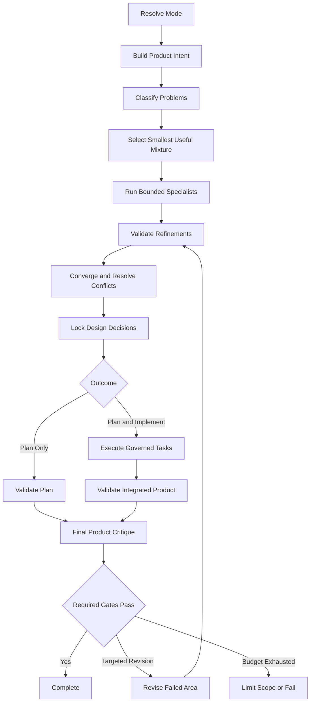

# Workspace Wiki

> **What is this?** A ledger of stable architectural boundaries, monorepo subsystem responsibilities, and core data flows.
> **When do I use it?** When proposing or auditing architectural changes to ensure alignment with subsystem boundaries.
> **What is the source of truth?** The physical file architecture, codebase imports, and the active `tsconfig.json` paths mapping.

Last audited: 2026-07-18

## System Summary

LUMI is a human-in-the-loop VS Code extension for agentic pair programming. The monorepo has two main packages:

| Layer | Paths | Responsibility |
|---|---|---|
| LUMI session layer | `src/`, `webview-ui/`, `proto/` | VS Code extension activation, webview UI, task loop, tools, providers, MCP, hooks, completion gates |
| BroccoliDB substrate | `broccolidb/` | Local cognitive memory, runtime graph, Spider/repair substrate, durable snapshots |

Do not merge these narratives. LUMI owns IDE session behavior and approvals. BroccoliDB owns substrate truth and runtime graph capabilities.

## Architecture Map

| Subsystem | Primary paths | Stable owner / boundary |
|---|---|---|
| Extension activation | `src/extension.ts` | Registers VS Code commands, webview, roadmap watcher, migrations |
| Host abstraction | `src/hosts/host-provider.ts`, `src/hosts/vscode/` | Core code should use host abstractions instead of direct `vscode` imports |
| Controller | `src/core/controller/` | Task lifecycle, webview RPC, MCP hub, auth, state |
| Agent loop | `src/core/task/` | Prompt -> API stream -> parse message -> execute tools -> completion |
| Tools | `src/core/task/tools/`, `src/shared/tools.ts` | 63 typed default tools plus dynamic subagent tools |
| Completion/finalization | `src/core/task/tools/completion/`, `src/core/task/tools/finalization/` | Deterministic lifecycle decisions, action guards, receipts, wiki finalization |
| Coordination authority | `src/core/governance/`, `src/core/swarm/SwarmMutexService.ts`, `src/infrastructure/db/Config.ts` | SQLite production leases, fencing, projections, reconciliation, durable terminal results |
| Workspace intelligence | `src/core/workspace-intelligence/` | Finalization-time cognitive model, drift findings, classified knowledge signals |
| Providers | `src/core/api/`, `src/shared/providers/providers.json` | Five active provider keys in current code/UI |
| Prompts | `src/core/prompts/system-prompt/` | Variant-specific system prompts and tool descriptions |
| Context/rules/skills | `src/core/context/`, `.dietcoderules/`, `.agents/skills/` | User/project instructions and optional skills |
| Mixture of Designers (MoD) | `src/core/orchestration/mod/` | MoE Top-K Softmax routing, circuit breakers, BFT consensus, zero-stall heuristic fallbacks |
| Webview UI | `webview-ui/` | React/Vite sidebar, settings, message rendering |
| Protocol | `proto/`, `src/generated/` | Protobuf/gRPC contracts; generated outputs should not be hand-edited |
| Roadmap/governance | `src/services/roadmap/`, `ROADMAP.md` | Steering, gates, roadmap lifecycle |
| BroccoliDB | `broccolidb/` | Separate package and docs; validate with its own scripts |

## Core Data Flow

```text
VS Code activation
  -> HostProvider initialization
  -> VscodeWebviewProvider
  -> Controller
  -> Task
  -> buildApiHandler(mode)
  -> LLM stream
  -> assistant message parser
  -> ToolExecutorCoordinator
  -> tool handlers / HostProvider / MCP / BroccoliDB
  -> completion lifecycle decision engine
  -> run_finalization / receipt seal
  -> WorkspaceIntelligenceEngine
  -> .wiki/intelligence + optional BroccoliDB cognitive memory
```

## Completion And Finalization Contract

The completion spine is central to recent architecture:

```text
snapshot builder -> decision engine -> action contract -> action guard
```

Key files:

- `src/core/task/tools/completion/completionSnapshotBuilder.ts`
- `src/core/task/tools/completion/CompletionLifecycleDecisionEngine.ts`
- `src/core/task/tools/completion/CompletionActionGuard.ts`
- `src/core/task/tools/handlers/AttemptCompletionHandler.ts`
- `src/core/task/tools/handlers/RunFinalizationToolHandler.ts`
- `src/core/task/tools/finalization/AutonomousDocumentationFinalizer.ts`

Rule: handlers adapt and execute; the decision engine decides; the action guard enforces. Do not add new completion eligibility logic in a handler. A successful decision becomes terminal only after `AttemptCompletionHandler` commits the lease/state CAS row in `task_completions`.

## Coordination And Storage Contract

- Production uses immutable `sqlite` coordination authority. `local_test` is explicit and never a database-outage fallback.
- `SwarmMutexService` allocates lease epochs and fencing tokens as arbitrary-precision decimal strings under `BEGIN IMMEDIATE`.
- Memory, governed lock files, and Broccoli fences are projections. Release and reconciliation compare owner, epoch, token, and mode before cleanup.
- `AdministrativeLockCleaner` is the isolated ownership-override path; normal runtime cannot force-release a swarm.
- `TarjanDeadlockDetector` evaluates typed wait edges from an immutable scheduler snapshot and applies recovery only if scheduler/lane versions are unchanged.
- `task_completions` is the durable terminal-result source of truth across restart and multi-process delivery.
- **SQLite Storage & Memory Hardening (ADR-014)**:
  - `PRAGMA auto_vacuum = INCREMENTAL;` executes *before* `PRAGMA journal_mode = WAL;` during DB initialization, and performs an automated `VACUUM;` header migration if initialized in non-autovacuum mode.
  - Multi-table retention policies cover all system tables (`task_lifecycle_records`, `task_lifecycle_events`, `task_completions`, `completion_attempts`, expired `branches`, unreferenced `swarm_lock_generations`, legacy `tasks`, CAS `files`, `telemetry`, `audit_events`, `agent_streams`, `agent_tasks`).
  - Prepared statement caching (`_rawStmtCache`) explicitly invokes `.dispose()` on evicted `better-sqlite3` handles to prevent native C++ memory leaks.
  - WAL checkpoints (`wal_checkpoint(TRUNCATE)`) run with exponential backoff retries when logs exceed 32MB or busy readers block truncation.

## Workspace Intelligence Engine

The Workspace Intelligence Engine is the code-level continuity subsystem introduced in this pass.

| Artifact | Purpose |
|---|---|
| `src/core/workspace-intelligence/types.ts` | Knowledge categories, drift findings, cognitive model schema, finalization input/result contracts |
| `src/core/workspace-intelligence/WorkspaceIntelligenceEngine.ts` | Discovers workspace evidence, classifies knowledge, detects drift, carries forward durable signals |
| `src/core/workspace-intelligence/WorkspaceIntelligenceStore.ts` | Persists the canonical JSON model and markdown projection under `.wiki/intelligence/` |
| `src/shared/completion/finalizationEvidence.ts` | Receipt evidence fields for intelligence artifacts and category counts |

Current integration point: `AutonomousDocumentationFinalizer.run()` invokes the engine after playbook generation and before migration-state stamping. The engine can also publish a summary to `KnowledgeGraphService` when that service is available.

## Agent Playbook And Living Wiki

The workspace now has two continuity layers:

| Layer | Path | Use |
|---|---|---|
| Root operating docs | `AGENT_PLAYBOOK.md`, `WIKI.md`, `TROUBLESHOOTING.md`, `DECISIONS.md`, `HANDOFF.md` | Human/agent entry points committed at repository root |
| Generated/finalization wiki | `.wiki/`, especially `.wiki/agent/*` once generated by finalization | Session finalization evidence and agent handoff artifacts |

The finalizer writes managed sections so generated playbook content can be refreshed without deleting human-authored notes.

## Provider Contracts

Current provider truth comes from implementation:

| Provider key | Handler | UI label |
|---|---|---|
| `openrouter` | `OpenRouterHandler` | OpenRouter |
| `openai-codex` | `OpenAiCodexHandler` | ChatGPT Subscription |
| `nousResearch` | `NousResearchHandler` | NousResearch |
| `cloudflare` | `CloudflareHandler` | Cloudflare Workers AI |
| `cline-pass` | `ClinePassHandler` | ClinePass |

If docs say four providers, they are stale.

## Setup And Environment

| Task | Command |
|---|---|
| Install all root and webview deps | `npm run install:all` |
| Build protobuf outputs | `npm run protos` |
| Compile production TypeScript | `npx tsc --noEmit --pretty false --project tsconfig.json` |
| Watch extension build | `npm run watch` |
| Run webview dev server | `npm run dev:webview` |
| Package VSIX | `npm run package:vsix` |
| Package VS Code and Open VSX targets | `npm run package:vsix:all` |

Node 22 is used in GitHub Actions. VS Code engine support is `^1.84.0`.

## Testing Strategy

| Surface | Command | Notes |
|---|---|---|
| Full root quality | `npm run ci:check-all` | Parallel check-types/lint/docs/doctor checks |
| Production TS only | `npx tsc --noEmit --pretty false --project tsconfig.json` | Excludes e2e helper files |
| Unit tests | `npm run test:unit` | Uses `.mocharc.json`; can run many specs |
| Focused TS spec | `TS_NODE_PROJECT=./tsconfig.unit-test.json npx mocha --no-config ... <spec>` | Use to avoid loading every recursive spec |
| Integration tests | `npm run test:integration` | VS Code test runner |
| Webview tests | `cd webview-ui && npm run test` | Vitest |
| E2E | `npm run test:e2e:optimal` | Builds VSIX and runs Playwright |
| BroccoliDB guardrails | `cd broccolidb && npm run test:guardrails` | Substrate public API/docs guard |

## Deployment And Release

| Flow | Source |
|---|---|
| Local packaging | `npm run package:vsix`, `npm run package:vsix:openvsx`, `npm run package:vsix:all` |
| Tagged package workflow | `.github/workflows/package-extension.yml` |
| Manual publish workflow | `.github/workflows/publish.yml` |
| VS Code publish script | `scripts/publish-vscode.mjs` |
| Open VSX publish script | `scripts/publish-openvsx.mjs` |
| Native dependency doctor | `scripts/lumi-doctor.mjs`, `npm run doctor:ci` |

Release workflows build platform-targeted VSIX files and run doctor checks. Publishing uses VSCE and OVSX tokens.

## Coding Conventions

| Convention | Practical rule |
|---|---|
| Host isolation | Core code uses `HostProvider`; direct `vscode` belongs under host-specific paths |
| Tool routing | Add tools through `DietCodeDefaultTool`, prompt specs, coordinator registration, and handler tests |
| Provider routing | Add provider keys in both API routing and UI provider list |
| Generated code | Edit schemas/sources, then regenerate |
| Webview copy | Prefer `webview-ui/src/copy/lumiVoice.ts` when changing user-facing voice |
| Docs | Session behavior goes under `docs/`; substrate behavior goes under `broccolidb/docs/`; continuity goes in root operating docs |
| Architecture changes | Update `docs/architecture/current.md`, `docs/PROJECT_MAP.md`, and this file when boundaries move |

## Glossary

| Term | Meaning |
|---|---|
| LUMI | User-facing VS Code extension |
| DietCode | Legacy/internal naming still present in code paths, settings, and storage keys |
| BroccoliDB | Local substrate package for context, runtime graph, Spider, snapshots |
| Completion spine | Snapshot -> decision -> action contract -> guard |
| Terminal CAS | `BEGIN IMMEDIATE` transaction binding completion to the current lease generation and task state version |
| Coordination projection | Memory/file/Broccoli copy of an authoritative SQLite lease; never independent authority |
| Finalization lane | Same-session documentation/ledger path after engineering verification |
| Agent Playbook Method | Workspace-specific agent handoff pattern for reducing rediscovery |
| Workspace Intelligence Engine | Harness subsystem that turns finalization evidence and workspace inspection into classified durable knowledge |
| Governed swarm | Multi-agent execution with lane receipts, locks, merge gate, and coordinator commit |
| Roadmap projection | Private per-lane roadmap events plus coordinator-owned workspace commits |

## Dependency Map

```text
package.json
  -> src/
  -> webview-ui/
  -> broccolidb/

src/core/task/
  -> src/core/api/
  -> src/core/prompts/
  -> src/core/task/tools/
  -> src/services/roadmap/
  -> src/infrastructure/db/

src/core/task/tools/
  -> src/hosts/host-provider.ts
  -> src/shared/tools.ts
  -> broccolidb capabilities through handlers

webview-ui/
  -> generated/shared protobuf clients
  -> VS Code webview messaging runtime
```

## Mixture of Designers (MoD) Orchestration

Mixture of Designers (MoD) v1.2 is a toggleable LUMI execution mode for structured product-design refinement and implementation.

### Standard vs MoD Behavior
- **Standard Mode**: Processes requests in a single LLM request loop, executing tools directly through the `ToolExecutorCoordinator`. Standard mode does not record designer intent or run specialist agents.
- **MoD Mode**: Routes requests through a multi-stage design-to-implementation pipeline. It selects a set of design specialists, validates their recommendations, resolves conflicts, locks decisions, and delegates work to implementation subagents under parent governance.

### Plan-Only vs Plan-and-Implement
- **Plan-Only**: Executes up to Stage 7 (Implementation Planning) and runs validation/critique without performing any code mutations or spawning developer subagents.
- **Plan-and-Implement**: Spawns subagents via the canonical `SubagentRunner` to apply modifications to the codebase within authorized boundaries, followed by integrated validation and gates audit.

### Specialist-Selection Logic
Selection is derived directly from classified product problems (mapping problem dimensions to specialized roles). Redundant roles are excluded, and only the smallest useful mixture of specialists is called (max 6). Each role selection contains a recorded justification.

### Convergence and Conflict Resolution
`ConvergenceEngine` clusters related recommendations, deduplicates overlapping recommendations, and resolves conflicts using the following priority order:
1. Product intent & constraints
2. User safety and accessibility
3. Primary workflow impact
4. Existing product strengths
5. Evidence quality
6. Design-system coherence
7. Technical feasibility

### Decision Locking
Accepted design decisions are locked before mutation. Reopening a locked decision requires a specific justification (e.g. failed gate validation).

### Mutation Authority & Governance
Mutations are permitted only in **Plan-and-Implement** outcome mode and must remain within the approved boundaries. Overlapping parallel mutations are prohibited.

### Completion Gates
Final results are audited against 8 gates: Product Intent, UX Architecture, Visual System, Interaction & State, Accessibility, Implementation Fidelity, Cross-Surface Consistency, and Final Product Critique (ensuring the final product does not feel generic or stitched together).

### Revision Behavior
A failed gate triggers a targeted revision pass. Only the responsible specialists are re-run. Revisions are capped at a strict budget of 2 passes, after which the parent must reduce scope, accept limitations, or fail honestly.

### Resume Behavior
MoD state is serialized in `mod_run_state.json` inside the task storage directory. Resuming a task restores the correct stage, preserves completed tasks, and avoids duplicate mutations.

### Telemetry & Failure Modes
Emits trace lifecycle events (e.g. `mod.started`, `mod.decision.locked`, `mod.gate.passed`). Stage failures route to an explicit `MoDFailure` state to exit cleanly.

### Known Limitations
- Does not run visual comparison engines on actual visual screenshots.
- Revision passes are limited to a text-based critique loop.

### Lifecycle Diagram



## Known Drift

| Drift | Source of truth |
|---|---|
| Some docs say four providers | Code/UI list five provider keys |
| Provider/version metrics have drifted historically | `src/core/api/index.ts`, `src/shared/providers/providers.json`, and `package.json` |
| `ROADMAP.md` contains stale bootstrap text | Maintained docs and implementation |
| `.wiki/00-forensics.md` refers to old DietCode/Spider state | Current code and fresh diagnostics |
