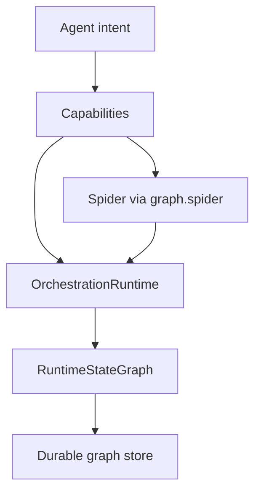

# Architecture (current)

BroccoliDB v30 describes the **operational system as shipped** — not historical milestone docs. For archaeology see [../../../docs/history/architecture/](../../../docs/history/architecture/).

## Layers



## Request flow

1. **Agent** calls a capability method (`ctx.query.search`, `ctx.graph.spider.audit`, …).
2. **Capability** checks lifecycle, records intent, delegates to an internal service.
3. **Runtime** governs sessions: budget → policy → plan → approve → execute → verify → rollback.
4. **Spider** proves structure (audit / gate / check). It does not mutate files during audit.
5. **RuntimeStateGraph** is the canonical operational truth for a session.
6. **Snapshots** persist graph state to CAS + audit metadata; **replay** reconstructs causality after restart.

## Core components

| Component | Location | Public access |
|-----------|----------|---------------|
| `AgentContext` | `core/agent-context.ts` | `new AgentContext(...)` |
| Capabilities | `core/agent-context/capabilities/` | `ctx.query`, `ctx.graph`, … |
| `OrchestrationRuntime` | `core/orchestration/` | `ctx.runtime` |
| `RuntimeStateGraph` | `core/orchestration/state/` | via `ctx.runtime.state()` etc. |
| Durable store | `core/orchestration/state/store/` | `snapshot`, `replay`, `story` |
| Spider engine | `core/policy/spider/` | `ctx.graph.spider` only |
| CLI | `cli/` | `npx broccolidb` |

## Runtime modes

| Mode | Typical use |
|------|-------------|
| `readonly` | Audit and inspect only |
| `interactive` | Human-in-the-loop repairs |
| `autonomous_safe` | Low-risk autonomous fixes |
| `ci` | Pipeline gates, compact output |

```typescript
ctx.runtime.setMode('ci');
```

## Operator views

| View | API |
|------|-----|
| Summary | `ctx.runtime.state(sessionId)` |
| Blockers | `ctx.runtime.blockers()` |
| Narrative | `ctx.runtime.story(sessionId)` |
| SARIF export | `ctx.runtime.export(sessionId, { format: 'sarif' })` |
| Forensic replay | `await ctx.runtime.replay(sessionId, { mode: 'forensic' })` |

## Integrity (RTG diagnostics)

Runtime graph snapshots are blocked when integrity checks fail:

| ID | Meaning |
|----|---------|
| RTG-001 | Orphaned node |
| RTG-002 | Dangling edge |
| RTG-003 | Invalid execution chain |
| RTG-004 | Replay divergence |
| RTG-005 | Snapshot corruption |
| RTG-006 | Invalid rollback link |
| RTG-007 | Incomplete verification |
| RTG-008 | Runtime truth mismatch |

See [runtime integrity](../../../docs/api/runtime-integrity.md).

## Recovery across restart

1. `await ctx.runtime.snapshot(sessionId)` while context is running.
2. `await ctx.flush()` then `await ctx.stop()`.
3. New process: new `BufferedDbPool`, new `AgentContext`, `await ctx.start()`.
4. `restorePersistedSessions()` reloads graph + session from stored snapshots.
5. `ctx.runtime.replay(sessionId)` and `ctx.runtime.story(sessionId)` work on restored state.

Smoke test: `tests/runtime-recovery-smoke.test.ts`

## Extended reference

- [Public API](../public-api.md)
- [Spider ergonomics](../../../docs/api/spider-agent-ergonomics.md)
- [Runtime snapshots](../../../docs/api/runtime-snapshots.md)
- [Runtime replay](../../../docs/api/runtime-replay.md)
- [Mutation plans](../../../docs/api/mutation-plans.md)

## Doctrine

A complete structure is not finished until it is boring to operate.
