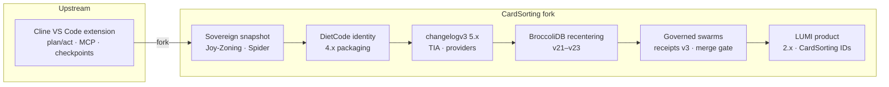
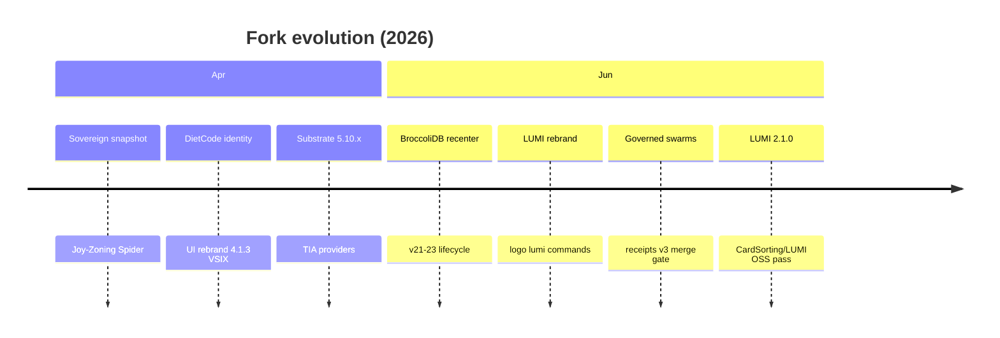

# Product evolution

This page is the **canonical history** of how this repository diverged from [Cline](https://github.com/cline/cline) and became **LUMI**. For a short summary and migration table, see [Origins & acknowledgments](../README.md#origins--acknowledgments) in the root README.

| | |
|---|---|
| **Upstream** | [github.com/cline/cline](https://github.com/cline/cline) (VS Code extension agent) |
| **Maintainer** | [CardSorting](https://github.com/CardSorting) |
| **Current product** | LUMI — `CardSorting.lumi` / `CardSorting.lumi-vscode` |
| **Legal** | [NOTICE](../NOTICE) · [LICENSE](../LICENSE) |
| **Release log** | [CHANGELOG.md](../CHANGELOG.md) (extension semver) · [changelogv3.md](../changelogv3.md) (substrate-era detail) |

## On this page

- [Timeline at a glance](#timeline-at-a-glance)
- [Chronological milestones](#chronological-milestones)
- [Design thesis evolution](#design-thesis-evolution)
- [Architectural continuity](#architectural-continuity)
- [Phase narratives](#phase-narratives)
- [Cline vs LUMI (feature matrix)](#cline-vs-lumi-feature-matrix)
- [Version numbers across eras](#version-numbers-across-eras)
- [Naming migration reference](#naming-migration-reference)
- [Migration playbook (Cline → LUMI)](#migration-playbook-cline--lumi)
- [Legacy inventory & refactor status](#legacy-inventory--refactor-status)
- [What is not ported from Cline](#what-is-not-ported-from-cline)
- [Changelog map](#changelog-map)
- [Further reading](#further-reading)

---

## Timeline at a glance



| Era | Product name | What changed | Where to read more |
|-----|--------------|--------------|-------------------|
| **Upstream** | **Cline** | Human-in-the-loop VS Code agent: diff-before-write, plan/act, MCP, terminal, browser, checkpoints | [Cline docs](https://docs.cline.bot) |
| **Sovereign fork** | **DietCode (early)** | CardSorting fork: Joy-Zoning, Spider forensics, sovereign policy engine, completion gates | `.wiki/` forensics · Joy-Zoning docs |
| **Packaged DietCode** | **DietCode 4.x** | First distributable VSIX under DietCode branding | git `e2a36f6` (Apr 2026) |
| **Substrate 5.x** | **DietCode 5.x** | Provider hardening, Sovereign Integrity Substrate (TIA), Spider V204 | [changelogv3.md](../changelogv3.md) |
| **Substrate recentering** | **DietCode + BroccoliDB** | Cognitive memory and graph truth moved into `@noorm/broccolidb` | [AGENT_STACK.md](AGENT_STACK.md) |
| **Governed execution** | **DietCode → LUMI** | `use_subagents` harness: locks, roadmap projection, merge gate, receipt schema **v3** | [governed-subagent-execution.md](governed-subagent-execution.md) |
| **Current** | **LUMI 2.x** | Calm companion UX, LUMI logo, `lumi.*` commands, repo **CardSorting/LUMI** | [CHANGELOG.md](../CHANGELOG.md) |

**Versioning note:** Three number lines coexist on purpose:

| Line | Example | Tracks |
|------|---------|--------|
| Extension semver | `2.1.0` in `package.json` | Shipped VS Code extension (LUMI era) |
| DietCode packaging | `4.1.3` VSIX era | Early CardSorting builds (Apr 2026) |
| changelogv3 | `5.10.x` | Substrate, Spider, provider deep history |

---

## Chronological milestones

Dates are from this repository's git history (fork onward). Upstream Cline predates these commits.

| Date | Milestone | Significance |
|------|-----------|--------------|
| **2026-04-12** | `b96a026` Initial Sovereign Snapshot [Phases 1–23] | Earliest commit in this fork; Joy-Zoning / Spider substrate begins |
| **2026-04-12** | `d4a46b4` Full Identity Migration: DietCode | User-facing rebrand from Cline → DietCode across extension UI |
| **2026-04-13** | `e2a36f6` DietCode **4.1.3** VSIX packaging | First successful distributable build under CardSorting |
| **2026-04-21** | changelogv3 **5.10.11** | Sovereign Integrity Substrate (V204), non-blocking TIA advisories |
| **2026-04-22** | changelogv3 **5.10.15** | Moonshot Kimi K2.6, NousResearch provider hardening |
| **2026-06-13** | `35beeb9` LUMI manifest rebrand | Package wiring, OpenRouter attribution → LUMI |
| **2026-06-15** | `515e9b9` BroccoliDB architectural recentering | AgentContext lifecycle cut; substrate owns durable graph |
| **2026-06-16** | `7a88376` LUMI logo & asset purge | Legacy DietCode cola-era assets removed; calm LUMI identity |
| **2026-06-19** | `0a4387d` JoyRide execution cache | Performance layer for governed tool path |
| **2026-06-22–24** | Governed execution hardening | Merge gate, lock necessity, receipt v3, operator console (50+ unit tests) |
| **2026-06-23** | `8b69cd7` CardSorting/LUMI industry-standards pass | README, CI, community templates, OpenSSF alignment |
| **2026-06-23** | **2.1.0** in [CHANGELOG.md](../CHANGELOG.md) | Current extension release line |



---

## Design thesis evolution

Each era changed *what “done” means* for an agent session.

| Era | Thesis | Operator experience |
|-----|--------|---------------------|
| **Cline** | Human-in-the-loop pair programmer — approve each step, but the model drives pace | Familiar chat + diff; strong MCP and multi-provider story |
| **DietCode (sovereign)** | **Structural truth matters** — Spider, Joy-Zoning, and integrity advisories prevent silent architectural drift | More policy signal in tool responses; roadmap steering emerges |
| **DietCode + BroccoliDB** | **Memory and graph are substrate** — session layer stays thin; proof lives in `@noorm/broccolidb` | Task history and cognitive memory persist locally, not in chat |
| **LUMI (governed)** | **Calm agency** — parallel lanes are governed, completion is gated, workspace roadmap truth is coordinator-owned | Sidebar stays open all day; swarms show durable receipts, not chat status |

LUMI did not abandon Cline's approval contract — it **extended** it to completion, structure, and multi-agent coordination. See [philosophy.md](papers/philosophy.md).

---

## Architectural continuity

The fork preserved Cline's **session skeleton**. New work wrapped governance and substrate around it.

### Unchanged spine (Cline → LUMI)

```
src/extension.ts
  → HostProvider
  → WebviewProvider → Controller
  → Task (agent loop)
  → buildApiHandler → LLM stream
  → ToolExecutorCoordinator → handlers/*
  → HostProvider.hostBridge (files, terminal, window)
```

| Component | Path | Cline lineage |
|-----------|------|---------------|
| Extension entry | `src/extension.ts` | Same activation pattern |
| Session controller | `src/core/controller/index.ts` | Same responsibility |
| Agent loop | `src/core/task/index.ts` | Same observe → stream → tool cycle |
| Webview UI | `webview-ui/` | React sidebar (re-skinned LUMI) |
| MCP hub | `src/services/mcp/` | Same integration model |
| Checkpoints | `src/integrations/checkpoints/` | Git shadow snapshots |
| Host bridge | `src/hosts/vscode/hostbridge/` | gRPC to VS Code APIs |

Internal architecture guide (still titled Cline in places): [`.dietcoderules/cline-overview.md`](../.dietcoderules/cline-overview.md).

### Fork additions (not in upstream Cline extension)

| Addition | Path | Purpose |
|----------|------|---------|
| BroccoliDB bridge | `broccolidb/`, `dietcode_kernel` tool | Durable memory + structural proof |
| Spider / policy | `src/core/policy/spider/` | Forensic structural advisories |
| Joy-Zoning | stability policy in tool path | Architectural enforcement |
| Completion gates | `completionGatePipeline.ts` | `attempt_completion` audit |
| Roadmap steering | `src/services/roadmap/`, `ROADMAP.md` | Coordinator-owned kanban truth |
| Governed swarms | `src/core/task/tools/subagent/` | Locks, projection, merge gate, receipts |
| Governance | `src/core/governance/` | `LockAuthority`, fencing tokens |

Full current map: [architecture/current.md](architecture/current.md) · [AGENT_STACK.md](AGENT_STACK.md).

---

## Phase narratives

### Phase 0 — Cline (upstream)

[Cline](https://cline.bot) established the core contract this fork still honors:

| Capability | Still in LUMI? | LUMI doc |
|------------|----------------|----------|
| Diff-before-write file edits | Yes | [Working with files](core-workflows/working-with-files.mdx) |
| Plan / Act modes | Yes | [Plan & Act](core-workflows/plan-and-act.mdx) |
| MCP servers | Yes | [MCP overview](mcp/mcp-overview.mdx) |
| Terminal with consent | Yes | [Terminal quick fixes](troubleshooting/terminal-quick-fixes.mdx) |
| Checkpoints | Yes | [Checkpoints](core-workflows/checkpoints.mdx) |
| `.clinerules/` project rules | Renamed | [`.dietcoderules/`](customization/dietcode-rules.mdx) |
| Cline CLI, SDK, Kanban | **No** — separate repos | [cline/cline](https://github.com/cline/cline) |

Cline's VS Code marketplace ID remains `saoudrizwan.claude-dev` (legacy **Claude Dev** name). Install only one sidebar agent at a time to avoid activity-bar conflicts.

### Phase 1 — Fork and DietCode era

After forking the **Cline VS Code extension** codebase, CardSorting pursued **calm agency through enforced gates**, not maximum autonomy.

**Kept from Cline:** controller → task → tool loop; webview approval UX; MCP/browser shapes; multi-provider handler layout (this build wires **4** providers).

**Deliberate divergence:**

| Theme | DietCode / LUMI direction |
|-------|---------------------------|
| Completion | `attempt_completion` → **completionGatePipeline** + roadmap audit |
| Structure | **Spider** + non-blocking integrity advisories (TIA) |
| Steering | **`ROADMAP.md`** projection, coordinator-owned commits |
| Rules | `.dietcoderules/`, `.dietcodeignore`, `.dietcodeworkflows/` |
| Storage | Local SQLite via BroccoliDB |

Milestone: **Sovereign Integrity Substrate (V204)** — [changelogv3.md § 5.10.11](../changelogv3.md).

### Phase 2 — BroccoliDB recentering

| Layer | Answers |
|-------|---------|
| **LUMI** (`src/`, `webview-ui/`) | What happens in *this* IDE session, with my approval? |
| **BroccoliDB** (`broccolidb/`) | What is structurally true about the repo, and what is remembered across sessions? |

Recentering (BroccoliDB v21–v23, Jun 2026) moved graph truth and memory APIs into the substrate package. LUMI tools (`dietcode_kernel`, `mem_*`) are thin bridges.

### Phase 3 — Governed subagent execution

Parallel lanes (`use_subagents`) required more than background tasks:

| Mechanism | Purpose |
|-----------|---------|
| **LockAuthority** + `LockNecessity` | Mutation lanes acquire leases; read lanes skip false alarms |
| **Per-agent roadmap projection** | Lanes propose patches; coordinator commits workspace truth |
| **Merge gate** | Reconcile accepted/rejected patches before seal |
| **Governed receipt schema v3** | `.governed.history.jsonl` — operator console |

Deep dive: [governed-subagent-execution.md](governed-subagent-execution.md).

### Phase 4 — LUMI product (current)

**LUMI** is the user-facing name. **DietCode** remains the internal module prefix — not a separate shipped product.

| Surface | Value |
|---------|-------|
| Display name | **LUMI** |
| Extension IDs | `CardSorting.lumi` · `CardSorting.lumi-vscode` |
| VS Code commands | `lumi.*` |
| Settings | `lumi.*` (roadmap, UX) · `dietcode.isDevMode` (dev) |
| User data dir | `~/.dietcode/data/` |
| Workspace DB | `./dietcode.db` (BroccoliDB) |
| Homepage | [dietcode.io](https://dietcode.io) |
| Repository | [github.com/CardSorting/LUMI](https://github.com/CardSorting/LUMI) |

---

## Cline vs LUMI (feature matrix)

| Area | Cline (upstream extension) | LUMI (this repo) |
|------|---------------------------|------------------|
| **Approval model** | Diff before write; auto-approve rules | Same + completion gate pipeline |
| **Modes** | Plan / Act | Same (`plan_mode_respond` / `act_mode_respond`) |
| **Providers** | Broad catalog in upstream | **4 wired** in this build (OpenRouter, Codex, Nous, Cloudflare) |
| **Project rules** | `.clinerules/` | `.dietcoderules/` |
| **Ignore file** | `.clineignore` | `.dietcodeignore` |
| **Workflows** | Cline workflows | `.dietcodeworkflows/` |
| **Subagents** | Background tasks (upstream) | **Governed** swarms with locks + merge gate |
| **Memory** | Task history (upstream patterns) | BroccoliDB cognitive memory + SQLite |
| **Structural audit** | Not a core upstream focus | Spider + Joy-Zoning + `dietcode_kernel` |
| **Roadmap** | Kanban product (separate repo) | `ROADMAP.md` steering in-extension |
| **CLI / SDK** | First-class Cline products | Not included — use upstream |
| **Extension ID** | `saoudrizwan.claude-dev` | `CardSorting.lumi*` |
| **License** | Apache-2.0 © Cline Bot Inc. | Apache-2.0 derivative — [NOTICE](../NOTICE) |

---

## Version numbers across eras

Do not compare `5.10.15` (changelogv3) to `2.1.0` (package.json) directly — they measure different layers.

| Version | File / artifact | Meaning |
|---------|-----------------|--------|
| `saoudrizwan.claude-dev` | Cline Marketplace | Upstream extension ID (unchanged) |
| `4.1.3` | git `e2a36f6` | Early DietCode VSIX packaging era |
| `5.10.x` | [changelogv3.md](../changelogv3.md) | Substrate, Spider, provider releases |
| `1.1.0` | `broccolidb/package.json` | BroccoliDB package semver |
| `2.1.0` | root `package.json` | **Current LUMI extension** |

---

## Naming migration reference

### User-facing files and config

| Cline | LUMI / DietCode (current) | Documentation |
|-------|---------------------------|---------------|
| `.clinerules/` | `.dietcoderules/` | [Project rules](customization/dietcode-rules.mdx) |
| `.clineignore` | `.dietcodeignore` | [Ignore file](customization/dietcodeignore.mdx) |
| Cline workflows | `.dietcodeworkflows/` | [Workflows](customization/workflows.mdx) |
| `saoudrizwan.claude-dev` | `CardSorting.lumi-vscode` / `CardSorting.lumi` | [Installing LUMI](getting-started/installing-dietcode.mdx) |
| Cline settings key prefix | `lumi.*` + legacy `dietcode.*` | VS Code Settings → LUMI |

### Code and environment (legacy aliases)

Prefer **DIETCODE_** / **lumi.*** in new code. Many paths accept **CLINE_** during refactor.

| Legacy (Cline) | Current / alias | Example location |
|----------------|-----------------|------------------|
| `CLINE_ENVIRONMENT` | `DIETCODE_ENVIRONMENT` | `src/config.ts` |
| `CLINE_COMMAND_PERMISSIONS` | `DIETCODE_COMMAND_PERMISSIONS` | `CommandPermissionController` |
| `CLINE_E2E_TESTS_VERBOSE` | `DIETCODE_E2E_TESTS_VERBOSE` | E2E fixtures |
| `CLINE_MCP_TOOL_IDENTIFIER` | `DIETCODE_MCP_TOOL_IDENTIFIER` | `src/shared/mcp.ts` |
| `CLINE_OTEL_*` | `DIETCODE_OTEL_*` (parallel) | `src/shared/services/config/otel-config.ts` |
| `cline.*` commands | `lumi.*` | `package.json` |
| `cline-rules` URLs | redirect → `dietcode-rules` | `docs/docs.json` |
| `DietCodeDefaultTool` | internal tool enum | `src/shared/tools.ts` |
| `dietcode.db` | BroccoliDB SQLite | workspace `.dietcode/` |

### Documentation URLs

Mintlify redirects `/customization/cline-rules` → `/customization/dietcode-rules`. New docs use **dietcode-** paths and **LUMI** in titles.

---

## Migration playbook (Cline → LUMI)

### 1. Extension install

1. Disable or uninstall `saoudrizwan.claude-dev` (avoid duplicate activity bars).
2. Install **LUMI**: `CardSorting.lumi-vscode` (Marketplace) or `CardSorting.lumi` (Open VSX).
3. Re-enter API keys in **LUMI Settings** — secrets do not migrate between publishers.

### 2. Project files

```bash
# Optional: rename rules (content is compatible; adjust paths if you reference filenames)
mv .clinerules .dietcoderules 2>/dev/null || true
mv .clineignore .dietcodeignore 2>/dev/null || true
```

Verify [project rules](customization/dietcode-rules.mdx) and [ignore patterns](customization/dietcodeignore.mdx) match your expectations.

### 3. Workflows and MCP

- Export MCP server config from Cline settings; re-import in LUMI MCP panel (JSON format is similar; validate paths).
- Cline workflow files → `.dietcodeworkflows/` per [workflows doc](customization/workflows.mdx).

### 4. Expect differences

| Expect | Why |
|--------|-----|
| Stricter **completion** | `attempt_completion` runs audit + roadmap gates |
| **ROADMAP.md** prompts | Optional steering — not in base Cline extension |
| **Fewer providers** wired | Only 4 handlers in `buildApiHandler`; others exist as reference code |
| **Governed subagents** | Declare `[execution_mode:…]` in lane prompts when using `use_subagents` |
| **Local data path** | `~/.dietcode/data/` — not Cline's storage location |

### 5. When to stay on Cline

Use upstream Cline if you need **CLI**, **TypeScript SDK**, **Kanban**, or the full upstream provider matrix without fork-specific governance.

---

## Legacy inventory & refactor status

Honest snapshot of remaining Cline/DietCode identifiers (grep-backed, ongoing refactor):

| Location | Status | Notes |
|----------|--------|-------|
| `src/config.ts`, permissions, E2E | **Dual env vars** | `CLINE_*` aliases beside `DIETCODE_*` |
| `src/shared/tools.ts` | **DietCodeDefaultTool** | Enum name; tools work as LUMI |
| `~/.dietcode/`, `dietcode.db` | **Intentional** | Storage namespace until migration |
| `evals/` package names | **Legacy** | `@cline/analysis`, `cline-evals` |
| `locales/*/README.md` | **Stale** | Still Cline-branded; use root [README](../README.md) |
| `.dietcoderules/cline-overview.md` | **Legacy title** | Architecture doc; content applies to LUMI |
| `docs/docs.json` redirects | **Intentional** | `/cline-rules` → `/dietcode-rules` |
| `docs/styles.css`, `hubspot.js` | **Legacy comments** | Cline doc site leftovers |
| System prompt snapshots | **Mixed** | Some `docs.cline.bot` fetch hints in test snapshots |

**User-facing rule:** say **LUMI** in UI and docs; grep for `cline` when debugging internals.

---

## What is not ported from Cline

| Cline product (2026) | In this repo? |
|----------------------|---------------|
| VS Code extension agent | **Yes** — evolved as LUMI |
| [CLI](https://github.com/cline/cline/tree/main/cli) | No |
| [TypeScript SDK](https://github.com/cline/cline/tree/main/sdk) | No |
| [Kanban](https://github.com/cline/kanban) | No — `ROADMAP.md` steering instead |
| Cline hosted account/sync | Not a goal — local-first BroccoliDB |

When evaluating features: **session agent** (here) vs **Cline platform** (upstream monorepo).

---

## Changelog map

| File | Scope |
|------|-------|
| [CHANGELOG.md](../CHANGELOG.md) | LUMI extension releases (semver), GitHub-facing |
| [changelogv3.md](../changelogv3.md) | Substrate/provider history (DietCode 5.x era) |
| [broccolidb/CHANGELOG.md](../broccolidb/CHANGELOG.md) | BroccoliDB package only |
| [.wiki/changelog.md](../.wiki/changelog.md) | Internal wiki (if present) |

---

## Further reading

| Audience | Start here |
|----------|------------|
| Cline user evaluating LUMI | [README — Coming from Cline?](../README.md#coming-from-cline) |
| Design intent | [philosophy.md](papers/philosophy.md) |
| Metrics and capabilities | [companion-brief.md](papers/companion-brief.md) |
| Two-layer architecture | [AGENT_STACK.md](AGENT_STACK.md) |
| Current code map | [architecture/current.md](architecture/current.md) |
| Governed swarms | [governed-subagent-execution.md](governed-subagent-execution.md) |
| Upstream credit | [NOTICE](../NOTICE) |

Thank you to the [Cline](https://github.com/cline/cline) maintainers and contributors for the foundation this project builds on.
