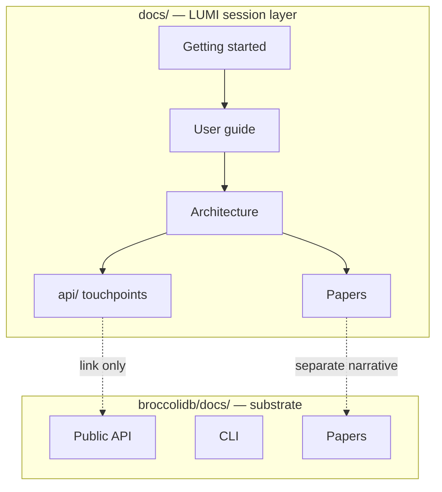

# LUMI documentation

Documentation for the **LUMI** VS Code extension and agent workspace (`src/`, `webview-ui/`). BroccoliDB has its own docs — do not duplicate substrate content here; link across via [AGENT_STACK.md](AGENT_STACK.md).

<p align="center">
  <a href="home.mdx">Mintlify home</a> ·
  <a href="papers/companion-brief.md">Companion brief</a> ·
  <a href="AGENT_STACK.md">Agent stack</a> ·
  <a href="MAINTAINER.md">Maintainer</a> ·
  <a href="../README.md">Repository README</a>
</p>

---

## Table of contents

- [At a glance](#at-a-glance)
- [Start here](#start-here)
- [Project configuration](#project-configuration)
- [Reading paths by audience](#reading-paths-by-audience)
- [Where to document what](#where-to-document-what)
- [Release & policy](#release--policy)
- [User guide](#user-guide)
- [Features & customization](#features--customization)
- [Architecture & internals](#architecture--internals)
- [Papers](#papers-agent-layer)
- [Runtime API](#runtime-api-broccolidb-touchpoints)
- [Local development & quality](#local-development)
- [Principles](#principles)

---

## At a glance

Workspace-verified figures from [papers/companion-brief.md](papers/companion-brief.md) (v1.0.3):

| Metric | Value | Source |
|--------|-------|--------|
| Extension ID | `CardSorting.lumi` | `package.json` |
| Typed tools | **62** | `src/shared/tools.ts` |
| Wired LLM providers | **4** | `src/shared/providers/providers.json` |
| Built-in slash commands | **10** | `src/core/slash-commands/index.ts` |
| Lifecycle hook kinds | **8** | `VALID_HOOK_TYPES` in `src/core/hooks/utils.ts` |
| Roadmap VS Code settings | **5** | `lumi.roadmap.*` in `package.json` |
| Read-only tools | **12** | `READ_ONLY_TOOLS` in `src/shared/tools.ts` |
| Agent modes | **2** | `plan` · `act` |

## How LUMI differs

| Typical autonomous agent | LUMI |
|--------------------------|------|
| Runs until stopped | Approval gate per mutating tool |
| Opaque file changes | Diff view before write |
| Hard to undo | Checkpoints after each tool use |
| “Done” when model says so | Completion pipeline + roadmap gates |



---

## Project configuration

| File / directory | Doc |
|------------------|-----|
| `.dietcoderules/` | [Project rules](customization/dietcode-rules.mdx) |
| `.dietcoderules/hooks/` | [Hooks](customization/hooks.mdx) |
| `.dietcodeignore` | [Ignore file](customization/dietcodeignore.mdx) |
| `.dietcodeworkflows/` | [Workflows](customization/workflows.mdx) |
| `ROADMAP.md` | [Roadmap steering](features/roadmap-steering.mdx) |

@ mentions: [working-with-files](core-workflows/working-with-files.mdx)

---

## Start here

| Doc | Description |
|-----|-------------|
| [Home](home.mdx) | Mintlify landing page |
| [Quick start](getting-started/quick-start.mdx) | Install, provider, first task |
| [What is LUMI?](getting-started/what-is-dietcode.mdx) | Product overview |
| [Agent stack](AGENT_STACK.md) | LUMI + BroccoliDB two-layer map |
| [Project map](PROJECT_MAP.md) | 1-to-1 map of `src/` directories |
| [Code ↔ docs](CODE_TO_DOC_MAP.md) | Source path → doc page lookup |
| [Maintainer guide](MAINTAINER.md) | CI checks, branding rules, update checklist |

---

## Reading paths by audience

| Audience | Recommended path | Time |
|----------|------------------|------|
| **New user** | [Quick start](getting-started/quick-start.mdx) → [Your first project](getting-started/your-first-project.mdx) → [Task management](core-workflows/task-management.mdx) | ~30 min |
| **Power user** | [Auto-approve](features/auto-approve.mdx) + [Checkpoints](core-workflows/checkpoints.mdx) → [MCP overview](mcp/mcp-overview.mdx) → [Hooks](customization/hooks.mdx) | ~45 min |
| **Team lead** | [Companion brief](papers/companion-brief.md) → [Security](SECURITY_BEST_PRACTICES.md) → [Roadmap steering](features/roadmap-steering.mdx) | ~20 min |
| **Designer / PM** | [Philosophy](papers/philosophy.md) → [User interface design](USER_INTERFACE_DESIGN.md) | ~25 min |
| **Engineer (agent)** | [Whitepaper](papers/whitepaper.md) → [Architecture (current)](architecture/current.md) → [Project map](PROJECT_MAP.md) | ~60 min |
| **Privacy / security review** | [SECURITY_BEST_PRACTICES](SECURITY_BEST_PRACTICES.md) → root [README § Local-first](../README.md#local-first--data) | ~15 min |
| **Engineer (substrate)** | [BroccoliDB docs](../broccolidb/docs/README.md) → [Runtime API index](api/README.md) | varies |
| **Doc contributor** | [MAINTAINER](MAINTAINER.md) → [DOCS_GUIDE](DOCS_GUIDE.md) → [REWRITE_PLAN](REWRITE_PLAN.md) | ~15 min |

---

## Where to document what

| Change | Update here (`docs/`) | Update in BroccoliDB (`broccolidb/docs/`) |
|--------|----------------------|-------------------------------------------|
| New LUMI tool or slash command | `tools-reference/`, `CODE_TO_DOC_MAP` | — |
| New wired provider | `provider-config/README`, model guide | — |
| Webview UX / approval flow | feature or architecture doc | — |
| Spider agent ergonomics in IDE | `api/spider-agent-ergonomics.md` | cross-link only |
| `AgentContext` / capability API | link from `api/README.md` | `public-api.md`, `getting-started.md` |
| CLI `broccolidb spider` | — | `cli.md` |

When in doubt: session behavior → `docs/`; durable substrate → `broccolidb/docs/`.

---

## Release & policy

| Doc | Purpose |
|-----|---------|
| [MAINTAINER.md](MAINTAINER.md) | When to update docs; CI commands; branding rules |
| [DOCS_GUIDE.md](DOCS_GUIDE.md) | Full documentation map and principles |
| [REWRITE_PLAN.md](REWRITE_PLAN.md) | Rewrite progress and maintenance checklist |
| [SECURITY_BEST_PRACTICES.md](SECURITY_BEST_PRACTICES.md) | Approval gates, ignore files, MCP trust |
| [CODEBASE_STANDARDS.md](CODEBASE_STANDARDS.md) | Repo layout and coding conventions |
| [../SECURITY.md](../SECURITY.md) | Vulnerability reporting |

---

## User guide

| Topic | Doc |
|-------|-----|
| Tasks | [core-workflows/task-management.mdx](core-workflows/task-management.mdx) |
| Plan & Act modes | [core-workflows/plan-and-act.mdx](core-workflows/plan-and-act.mdx) |
| Files & @ mentions | [core-workflows/working-with-files.mdx](core-workflows/working-with-files.mdx) |
| Slash commands | [core-workflows/using-commands.mdx](core-workflows/using-commands.mdx) |
| Checkpoints | [core-workflows/checkpoints.mdx](core-workflows/checkpoints.mdx) |
| Tools index | [tools-reference/README.mdx](tools-reference/README.mdx) |
| All tools | [tools-reference/all-dietcode-tools.mdx](tools-reference/all-dietcode-tools.mdx) |
| Model selection | [core-features/model-selection-guide.mdx](core-features/model-selection-guide.mdx) |
| Glossary | [getting-started/glossary.mdx](getting-started/glossary.mdx) |

---

## Features & customization

| Feature | Doc |
|---------|-----|
| Auto-approve & YOLO | [features/auto-approve.mdx](features/auto-approve.mdx) |
| Focus chain | [features/focus-chain.mdx](features/focus-chain.mdx) |
| Subagents | [features/subagents.mdx](features/subagents.mdx) |
| Roadmap steering | [features/roadmap-steering.mdx](features/roadmap-steering.mdx) |
| Memory bank | [features/memory-bank.mdx](features/memory-bank.mdx) |
| Multi-root workspace | [features/multiroot-workspace.mdx](features/multiroot-workspace.mdx) |
| Hooks | [customization/hooks.mdx](customization/hooks.mdx) |
| Skills | [customization/skills.mdx](customization/skills.mdx) |
| Workflows | [customization/workflows.mdx](customization/workflows.mdx) |
| Project rules | [customization/dietcode-rules.mdx](customization/dietcode-rules.mdx) |
| Ignore file | [customization/dietcodeignore.mdx](customization/dietcodeignore.mdx) |
| MCP | [mcp/mcp-overview.mdx](mcp/mcp-overview.mdx) |
| Providers (active 4) | [provider-config/README.mdx](provider-config/README.mdx) |

---

## Architecture & internals

| Doc | Description |
|-----|-------------|
| [Agent stack](AGENT_STACK.md) | Two-layer map (LUMI + BroccoliDB) |
| [Architecture (current)](architecture/current.md) | Extension module structure |
| [System communication](SYSTEM_COMMUNICATION.md) | gRPC host bridge, webview messaging |
| [Memory & reasoning](MEMORY_AND_REASONING.md) | Context, cognitive memory tools |
| [Working with subagents](WORKING_WITH_SUBAGENTS.md) | Background agent delegation |
| [Security best practices](SECURITY_BEST_PRACTICES.md) | Approval gates, ignore files |
| [Spider forensic engine](architecture/spider-v20-forensic-engine.md) | Policy/audit layer (BroccoliDB) |
| [User interface design](USER_INTERFACE_DESIGN.md) | Webview UX patterns |

---

## Papers (agent layer)

| Doc | Audience | Purpose |
|-----|----------|---------|
| [Index](papers/README.md) | All | Reading order and two-layer context |
| [Companion brief](papers/companion-brief.md) | Leads, evaluators | Executive summary · workspace-verified metrics |
| [Philosophy](papers/philosophy.md) | Builders, policy | Calm agency · approval · completion gates |
| [Whitepaper](papers/whitepaper.md) | Engineers | Full technical architecture |

Substrate papers: [broccolidb/docs/papers/](../broccolidb/docs/papers/) — separate narrative.

---

## Runtime API (BroccoliDB touchpoints)

Agent-facing substrate API notes (Spider, snapshots, replay, budgets):

| Doc | Topic |
|-----|-------|
| [api/README.md](api/README.md) | Index |
| [api/spider-agent-ergonomics.md](api/spider-agent-ergonomics.md) | Spider toolkit |
| [api/runtime-snapshots.md](api/runtime-snapshots.md) | Snapshots |
| [api/runtime-replay.md](api/runtime-replay.md) | Replay |
| [api/execution-budgets.md](api/execution-budgets.md) | Execution budgets |

Package docs: **[broccolidb/docs/README.md](../broccolidb/docs/README.md)**

---

## Local development

**Mintlify preview:**

```bash
cd docs && npm install && npm run dev
```

**Quality checks (repository root):**

```bash
npm run docs:check-all              # all doc guardrails + Mintlify links
npm run docs:check-agent-links      # 24 required docs + link resolution
npm run docs:check-agent-branding   # no stale user-facing DietCode in core dirs
npm run docs:check-root-readme      # README.md parity + live metrics
npm run docs:check-docs-readme      # docs/README.md structure guardrails
npm run docs:check-readme-metrics   # README + companion-brief vs live codebase counts
npm run docs:check-links              # Mintlify broken-link pass (included in docs:check-all)
npm run docs:tag-legacy-providers   # after adding unwired provider pages
```

Doc checks in `ci:check-all` (except Mintlify-only `docs:check-links`). Run **`npm run docs:check-all`** before publishing docs.

---

## History

Architecture milestone notes (archaeology only): [history/architecture/](history/architecture/)

---

## Principles

1. **1-to-1 with code** — Architecture pages mirror real paths under `src/` and `webview-ui/`.
2. **LUMI user-facing** — Product name is LUMI; `DietCode` only for internal types and legacy filenames.
3. **Two-layer boundary** — Session UX docs live here; substrate docs live in `broccolidb/docs/`.
4. **Measured claims** — Metrics cite verifiable paths (`package.json`, `src/shared/tools.ts`, etc.).

**Calm agency:** approve before mutate, checkpoint after tool use, complete only through gates.
