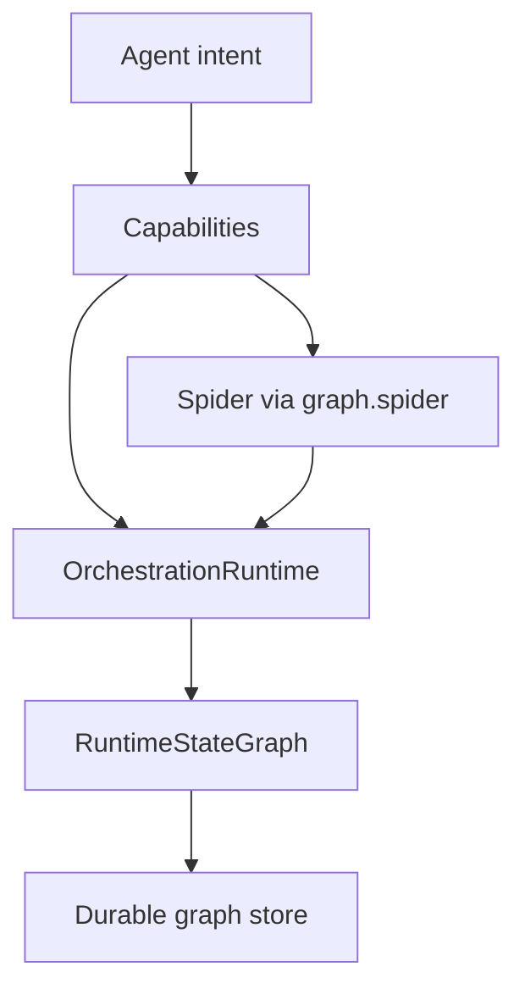

# BroccoliDB architecture (current)

v30 describes the **final** operational system — not milestone-by-milestone excavation. Historical docs are in [../history/](../history/).

## Layers

## Flow

1. **Agent** expresses intent through capability methods (`ctx.query.search`, `ctx.graph.spider.audit`, …).
2. **Capabilities** validate lifecycle, trace intent, delegate to internal services.
3. **Runtime** governs sessions: budget, policy, plan → approve → execute → verify → rollback.
4. **Spider** proves structure (audit/gate/check); never mutates during audit.
5. **RuntimeStateGraph** is the canonical operational truth for a session.
6. **Snapshots** persist graph state; **replay** reconstructs causality after restart.

## Runtime modes

| Mode | Typical use |
|------|-------------|
| `readonly` | Audit and inspect only |
| `interactive` | Human-in-the-loop repairs |
| `autonomous_safe` | Low-risk autonomous fixes |
| `ci` | Pipeline gates, compact output |

Set with `ctx.runtime.setMode('ci')`.

## Operator views

- `ctx.runtime.state(sessionId)` — summary
- `ctx.runtime.blockers()` — open blockers
- `ctx.runtime.story(sessionId)` — narrative for humans
- `ctx.runtime.export(sessionId, { format: 'sarif' })` — tool interchange

## API detail

- [Public API](../public-api.md)
- [Runtime snapshots API](../api/runtime-snapshots.md)
- [Runtime replay API](../api/runtime-replay.md)
- [Spider ergonomics API](../api/spider-agent-ergonomics.md)

## Doctrine

A complete structure is not finished until it is boring to operate. v30 makes BroccoliDB teachable and hard to misuse.
