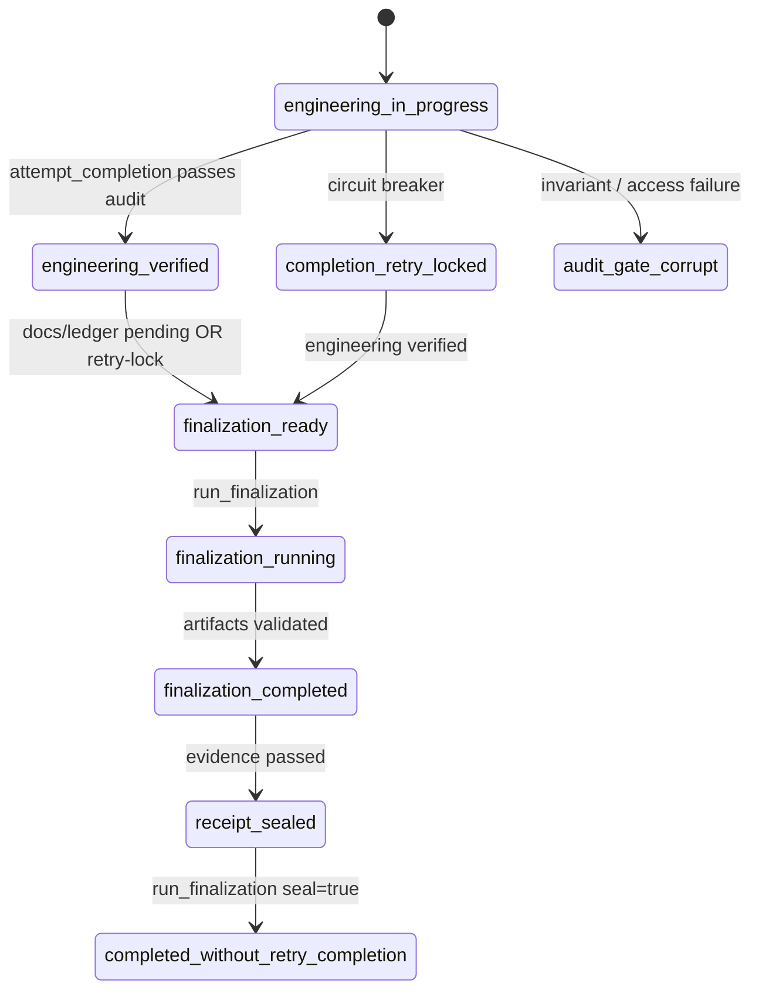

# Completion & Finalization Gate — Reference

Modern-only execution model for engineering verification, same-session finalization, and sealed receipts. No legacy compatibility layer.

## Architecture



## Canonical lifecycle (`GateLifecycleState`)

| State | Meaning | Typical next action |
|-------|---------|---------------------|
| `engineering_in_progress` | Engineering work or audit preflight in flight | `attempt_completion`, `run_verification` |
| `engineering_verified` | Audit/preflight passed; checkpoint latched | `run_finalization` |
| `finalization_ready` | Docs/ledger pending; authorized finalization lane | `run_finalization` |
| `finalization_running` | Authorized finalization executing | wait |
| `finalization_completed` | Evidence collected; ready to seal | `seal_session` |
| `receipt_sealed` | Finalization validated; seal pending | `run_finalization seal=true` |
| `completed_without_retry_completion` | Sealed receipt emitted; terminal success | none |
| `completion_retry_locked` | `attempt_completion` forbidden (403 analogue) | `run_finalization` when verified |
| `audit_gate_corrupt` | Invariant or access failure; fail-closed | operator guidance only |

Allowed transitions are enforced by `GateLifecycleEvaluator` + `gateLifecycleInvariants.ts`. Unknown states throw via `assertExhaustiveGateLifecycleState`.

## Dual lanes

| Lane | Tool | Owns |
|------|------|------|
| Completion | `attempt_completion` | Engineering verification only |
| Finalization | `run_finalization` | Docs, ledger, roadmap stamp, receipt |

`attempt_completion` does **not** own finalization. After engineering is verified, documentation and ledger work use `run_finalization` in the **same session**.

## `AuditGateDecision` (audit score gate)

Defined in `src/shared/audit/auditGateReport.ts`. Evaluated via `evaluateAuditGate()`.

```typescript
interface AuditGateDecision {
  blocked: boolean
  score: number
  effectiveThreshold: number
  grade: TaskAuditMetadata["hardening_grade"]
  reasons: CompletionGateReason[]
}
```

Nested inside `GateLifecycleDecision.auditDecision` when relevant. This is **not** a lifecycle state.

## `GateLifecycleDecision` (operator gate)

Defined in `src/shared/completion/gateLifecycleDecision.ts`. Produced by `evaluateGateLifecycle()`.

```typescript
interface GateLifecycleDecision {
  lifecycleState: GateLifecycleState
  activeLane: "completion" | "finalization" | "none"
  reasonCode: GateReasonCode
  operatorMessage: string
  engineering: GateAxisStatus
  verification: GateAxisStatus
  documentation: GateAxisStatus
  ledger: GateAxisStatus
  finalization: GateAxisStatus
  allowedActions: GateAction[]
  forbiddenActions: GateAction[]
  recoveryPath: GateRecoveryStep[]
  receiptEligible: boolean
  moreToolCallsUseful: boolean
  userInputRequired: boolean
  finalizationEvidence?: FinalizationEvidence
  completionReceipt?: CompletionReceipt
  auditDecision?: AuditGateDecision
  evaluatedAt: number
}
```

Published to:
- `TaskState.lastGateLifecycleDecision`
- `TaskState.lifecycleTransitionLogJson` (append-only continuity)
- `DietCodeMessage.gateLifecycleStatus` (live webview)

## Same-session finalization

1. Engineering passes → `engineeringVerifiedAt` latched → `engineering_verified`
2. Retry-lock + verified → `finalization_ready` (not session-dead)
3. `run_finalization` → updates `.wiki/changelog.md`, stamps ledger, validates roadmap
4. `run_finalization seal=true` → sealed `CompletionReceipt`, `completed_without_retry_completion`

No new task/session required for finalization.

## Sealed receipt requirements

`CompletionReceipt` (`src/shared/completion/finalizationEvidence.ts`) requires:

- `engineeringVerifiedAt` (+ optional checkpoint hash)
- `finalizationEvidence` with `status: "passed"`, `docsUpdated`, `ledgerStamped`, `artifactPaths`
- `lifecycleTransitionHistory` (engineering + finalization transitions)
- `gateReasonCode`
- `continuityMarker` (`taskId:receiptId:sealedAt`)
- `sealedAt`

Validated by `src/shared/completion/receiptValidation.ts`. Summary text alone cannot produce a receipt.

## Authorized wiki policy

`.wiki/` writes allowed only when:
- `finalizationMode === true` (during `run_finalization`), or
- `isSubagentExecution === true`

Enforced in `WriteToFileToolHandler`, `ApplyPatchHandler` via `isWikiWriteAuthorized()`. Policy denial surfaces as `finalization.access_denied` / `audit_gate_corrupt`, distinct from validation failure.

## UI state model

`GateLifecycleStatusPanel` in task header (`TaskNotesSection`) consumes `resolveGateLifecycleSnapshot(messages)` — includes freshness and continuity marker.

Display order:
1. Headline badge (`getGateLifecycleHeadline`) + freshness (`evaluatedAt`)
2. Human operator sentence (`operatorMessage`)
3. Structured axes + next/avoid actions
4. Collapsible evidence (finalization preview, receipt id)

Retry-lock with verified engineering shows amber **Retry Locked — Recoverable**, not engineering failure.

## Subagent parity

`validateSubagentCompletionGates()` runs the same preflight pipeline and publishes `GateLifecycleDecision`. The decision is persisted on `SubagentExecutionEnvelope.gateLifecycleStatus`. Envelope validation requires `gateLifecycleStatus` when `phase === "completion_gate"`.

## Parent-thread throughput (shift-right gates)

Completion and finalization gates remain **cold-path authoritative** — they block at `attempt_completion` when engineering verification fails.

Inner-loop tool execution uses a separate **I/O execution authority** model so reads and searches do not pay full guard/audit cost on every call:

| Concern | Cold path (blocks) | Hot path (non-blocking) |
|---------|-------------------|-------------------------|
| Engineering audit score | `evaluateCompletionAuditGate` at `attempt_completion` | Deferred act-mode / command advisories |
| UniversalGuard | Plan-mode writes, disk blockade | I/O tools bypass guard in `ToolExecutor` |
| Preflight | Quality, roadmap (when enabled), circuit breaker | `cooldown`, `duplicate` soft stages |
| Audit cache | Fresh `runCompletionAudit` when needed | 5-min TTL on unchanged result + advisory reuse |

See **[parent-thread-execution-authority.md](parent-thread-execution-authority.md)** for helpers, file map, and operator summary.

### Failure messages and why completion blocks

When `attempt_completion` fails, the agent receives a structured error — not a generic denial. Common categories:

| Category | Example message fragment | Meaning |
|----------|-------------------------|---------|
| **Preflight quality** | `Completion rejected: result is too brief` | Summary failed shape/tone checks before audit |
| **Focus chain** | `focus chain has N incomplete item(s)` | Todo list not fully checked off |
| **Roadmap** | Roadmap service remediation text | Workspace roadmap item blocked completion |
| **Audit gate** | `Grade F (20/100, threshold 50)` | Hardening score or violations failed cold path |
| **Circuit breaker** | `maximum completion gate retries (10) exceeded` | Retry budget exhausted — see lifecycle states below |
| **Double-check** | `re-verify your work` | Two-step completion gate pending |

Full stage order, soft vs hard preflight, audit reason codes (`score_below_threshold`, `critical_violations`, …), and tool-level blocks (plan mode, disk blockade): **[parent-thread execution authority § Failure catalog](parent-thread-execution-authority.md#what-blocked-throughput-before-vs-after)**.

Gate block events append to `completionGateBlockHistory` (ring buffer) and publish `gateLifecycleStatus` to the webview via `GateLifecycleStatusPanel`.

## Invariants (`gateLifecycleInvariants.ts`)

- Retry-locked verified engineering must allow `run_finalization`
- Retry-locked unverified engineering must **not** allow `run_finalization`
- Terminal states must not require more tool calls
- Finalization success requires artifact evidence
- Sealed completion requires `completionReceipt`
- No fake `ask_followup_question` when machine-readable recovery exists (`fakeFollowupGuard.ts`)

## Regression guardrails

Tests in:
- `src/core/task/tools/completion/__tests__/gateLifecycleAudit.test.ts`
- `src/core/task/tools/completion/__tests__/gateLifecycleEvaluator.test.ts`
- `src/core/task/tools/completion/__tests__/fakeFollowupGuard.test.ts`
- `src/core/task/tools/finalization/__tests__/finalizationRunner.test.ts`
- `webview-ui/.../GateLifecycleStatusPanel.test.tsx`

## Removed legacy behavior

Not exported or used:
- `CompletionGateDecision` alias on audit gate
- `evaluateCompletionGate` alias
- `completion_gate_corrupt`, `receipt_ready`, `completion_gate_retry_locked` lifecycle names
- Recovery copy: “start a new task”, “new session required”
- `attempt_completion` as documentation trigger
- `CompletionGateStatusPanel` (renamed to `GateLifecycleStatusPanel`)

## Intentionally retained `CompletionGate*` names

| Name | Scope | Why retained |
|------|-------|--------------|
| `CompletionGateOptions` | Audit settings | Audit threshold config, not lifecycle model |
| `auditCompletionGateEnabled` etc. | User settings keys | Persisted setting identifiers |
| `buildCompletionGate*` XML helpers | Agent observability | Externally consumed structured blocks in tool errors |
| `evaluateGatePreflightReadiness` | Dry-run preflight | Renamed from `evaluateCompletionGateReadiness` — readiness probe, not lifecycle |
| `runCompletionGateFlow` | Preflight pipeline | Orchestrates audit + quality gates |
| `RoadmapCompletionGate` | Roadmap service | Domain-specific roadmap gate |
| `CompletionGateReason` | Audit reason codes | Part of `AuditGateDecision.reasons` |

## Migration from old artifacts

| Old | Modern |
|-----|--------|
| `lastCompletionGateDecision` | `lastGateLifecycleDecision` |
| `completionGateStatus` on messages | `gateLifecycleStatus` |
| `CompletionGateEvaluator` | `GateLifecycleEvaluator` |
| `CompletionGateStatusPanel` | `GateLifecycleStatusPanel` |
| `receipt_ready` | `receipt_sealed` |
| `completion_gate_retry_locked` | `completion_retry_locked` |
| `completion_gate_corrupt` | `audit_gate_corrupt` |

## Legacy trap eliminated

### Original failure shape

Engineering passed and completion retry-locked, but operators were told to start a new task/session for wiki/docs work. `attempt_completion` owned finalization; retry-lock felt session-dead; fake `ask_followup_question` could escape machine-readable recovery.

### Modern transition path

```
engineering verified (latched)
  → completion_retry_locked + finalization_ready
  → run_finalization (same session)
  → receipt_sealed
  → run_finalization seal=true
  → completed_without_retry_completion
```

### Invariant that prevents recurrence

- `gateLifecycleInvariants.ts`: retry-locked verified engineering **must** allow `run_finalization`; unverified retry-lock **must not**
- `fakeFollowupGuard.ts`: rejects follow-up when recovery path exists
- `receiptValidation.ts`: sealed receipts require artifact + lifecycle history — no summary-only receipts
- `wikiWritePolicy.ts` + tool handlers: unauthorized `.wiki` writes blocked at runtime
- `resolveGateLifecycleSnapshot()`: UI shows freshness (`current` / `stale` / `unknown`) and continuity marker

### Same-session finalization recipe

1. Pass engineering gates → `attempt_completion` latches `engineeringVerifiedAt`
2. If retry-locked → call `run_finalization` (not `attempt_completion`, not new task)
3. When finalization validates → `run_finalization seal=true`
4. Receipt emitted with evidence; session terminal

### Closeout tests

- `gateLifecycleCloseout.test.ts` — full trap reproduction + receipt + subagent parity
- `gateLifecycleAudit.test.ts` — regression guardrails
- `gateLifecycleMessages.test.ts` — freshness classification
- `GateLifecycleStatusPanel.test.tsx` — stale snapshot UI

### No remaining architectural unknowns

The completion/finalization system is **closed**. Runtime behavior, UI, prompts, subagent envelopes, and docs align on the modern-only model.
