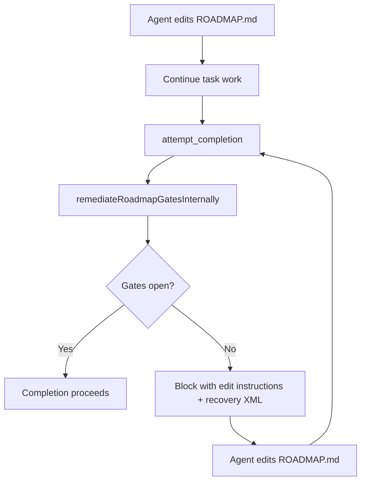
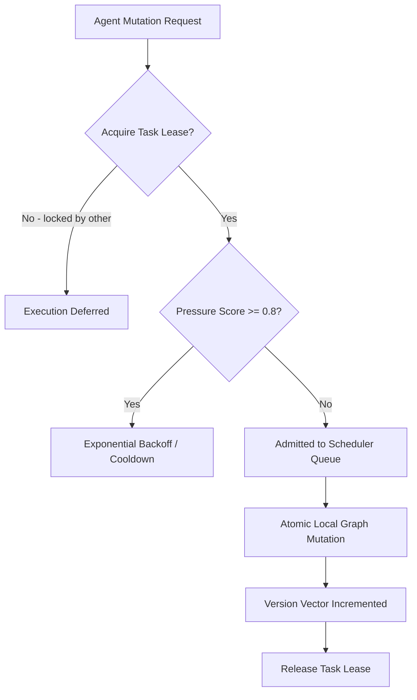

**Date:** June 2026  
**Scope:** Roadmap completion gates, agent ergonomics, system prompt alignment  
**Status:** Resolved — internal auto-governance at `attempt_completion` and pressure-aware multi-agent orchestration runtime

## Summary

Roadmap steering gates were **correct in intent** (block completion when `ROADMAP.md` is out of sync) but **wrong in ergonomics**: agents were told to call `roadmap(action='validate')`, `/roadmap validate`, or MCP tools after every ROADMAP edit. That caused validate loops, wasted tool turns, and confusion when governance could have run inside the extension.

We moved governance to a **closed-loop internal pipeline** at `attempt_completion` and aligned prompts, error messages, progress logs, and tool descriptions to match.

Under multi-agent concurrent operations, we further evolved the substrate into a **Pressure-Aware Multi-Agent Orchestration Runtime** to prevent lock contention, fork divergence, and cognitive fragmentation.

---

## Symptoms (before auto-governance)

| Symptom | Impact |
|---------|--------|
| System prompt required `roadmap(action='validate')` before `attempt_completion` | Agents burned turns on redundant validate calls |
| Completion block messages said "Run roadmap(action='cockpit')" or "validate" | Agents invoked tools instead of editing ROADMAP.md |
| `validation_pending` after file writes | Manual validate expected even though service could validate internally |
| Inconsistent copy across Doctor, Progress, Cockpit, NativeBridge | Mixed signals — some paths auto, some manual |
| No structured recovery payload | Agents parsed prose; hard to recover from gate blocks |

Users experienced: **completion blocked → agent calls validate/cockpit → still blocked → repeat**.

---

## Symptoms (before multi-agent runtime pass)

Under concurrent multi-agent planning:
- **Write Contention / Mutation Storms:** Multiple agents attempted to touch Section 11 dates or edit tasks simultaneously, corrupting markdown.
- **Split-Brain Continuation:** Stale continuation anchors were resumed by different executors, causing parallel execution forks.
- **Cognitive Fragmentation:** Agents consumed massive context payloads filled with other agents' active locks and unrelated task lists, causing prompt bloat and planning fatigue.
- **Starvation / Remediation Loops:** Runaway validation cycles and redundant workspace scans bogged down execution throughput.

---

## Root causes

### 1. Gate evaluated, but not remediated
`evaluateRoadmapCompletionBlock()` checked gates but did not consistently **auto-heal** fixable states (`validation_pending`, bootstrap placeholders, missing checkpoint dates) before blocking.

### 2. Contradictory agent-facing instructions
`roadmap_steering.ts` (system prompt) and `roadmap-steering.mdx` (user docs) documented a **manual validate step** that fought the product goal of automatic steering.

### 3. Missing concurrency leases & scheduling pacing
The roadmap layer assumed linear progression by a single agent, lacking mutation locks, version checks, and admission pacing.

### 4. Globally sprawling context
Tool payloads and cockpit steering blocks forced agents to ingest the entire workspace state, including other agents' lock records and irrelevant tasks.

---

## What we changed

### 1. Internal remediation pipeline
`remediateRoadmapGatesInternally()` in `RoadmapCompletionGate.ts` runs **before** any block decision:

```text
1. readState → validation_pending?
2. bootstrap placeholders? → writeBootstrapAutofill (if autoBootstrapFill)
3. validateRoadmap (if pending or autofill wrote)
4. stale + mechanical reason? → touchRecentCheckpointDate → re-validate
5. getOperationalStatus → evaluate blocking gates
```

Mechanical stale reasons only: `no_recent_checkpoint_date`, `invalid_date`. Narrative staleness (git activity, age) still requires human/agent edits to section 11.

### 2. Multi-Agent Lease Management
- Implemented `acquireOrchestrationLease` and `releaseOrchestrationLease` inside `RoadmapService`.
- Agents must reserve task nodes before write actions. Leases default to 5 minutes to prevent starvation.

### 3. Pressure-Aware Scheduling & Admission Queue
- Calculated `orchestration_pressure_score` (0.0 to 1.0) dynamically from active unexpired locks, active tasks queue size, and mutations rate.
- Enforced exponential backoffs and cooldown pacing inside `scheduleAdmission` when pressure >= 0.8.

### 4. Continuation Version Vectors
- Maintained sequence counters inside `version_vectors` in the state JSON.
- Resuming continuation anchors requires checking `verifyAnchorFreshness()`. If vectors mismatch, a branch divergence is flagged.

### 5. Scoped Cognitive Partitioning
- Updated `RoadmapCockpit.ts` and `RoadmapAgentSteering.ts` to filter out other agents' lineage entries and unrelated task lists unless `--verbose` is specified, creating a quiet reasoning corridor.

### 6. Lazy Validation Caching
- Cached `validateRoadmap` results. If validation is requested within 5 seconds and the file hash is unchanged, the heavy evidence parsing is bypassed.

---

## New agent flow



---

## Multi-Agent Scheduler Flow



---

## What did NOT change

| Unchanged | Notes |
|-----------|-------|
| Gate **definitions** | Same gates in `RoadmapGateCatalog.ts`; still enforce schema, freshness, bootstrap |
| `roadmap` tool | Still available for checkpoint, cockpit, doctor, diagnostics |
| `/roadmap` slash command | Operator console for humans and agents |
| `failClosedCompletionGates` | Still blocks if gate evaluation throws |

`roadmap(action='validate')` is a **diagnostic**, not a **completion prerequisite**.

---

## Files touched (reference)

| Area | Key files |
|------|-----------|
| Remediation / Locks | `RoadmapCompletionGate.ts`, [RoadmapService.ts](file:///Users/bozoegg/Downloads/codemarie-new/src/services/roadmap/RoadmapService.ts) (`acquireOrchestrationLease`, `scheduleAdmission`, `touchRecentCheckpointDate`) |
| Copy / recovery | `RoadmapAutoGovernance.ts` |
| Completion pipeline | `completionGatePipeline.ts`, `attemptCompletionUtils.ts`, `TaskState.ts` |
| Prompts & Steer UX | `roadmap_steering.ts`, `tools/roadmap.ts`, [RoadmapAgentSteering.ts](file:///Users/bozoegg/Downloads/codemarie-new/src/services/roadmap/RoadmapAgentSteering.ts), `RoadmapSteeringContext.ts` |
| Operator surfaces | `RoadmapOperator.ts`, `RoadmapDoctor.ts`, `RoadmapProgress.ts`, [RoadmapCockpit.ts](file:///Users/bozoegg/Downloads/codemarie-new/src/services/roadmap/RoadmapCockpit.ts), [RoadmapSession.ts](file:///Users/bozoegg/Downloads/codemarie-new/src/services/roadmap/RoadmapSession.ts) |
| Tests | [RoadmapSurfaceLegibility.test.ts](file:///Users/bozoegg/Downloads/codemarie-new/src/services/roadmap/__tests__/RoadmapSurfaceLegibility.test.ts) |

---

## Lessons learned

1. **Enforcement ≠ manual steps.** Blocking completion is valid; requiring an agent tool call to clear routine state is not.
2. **One copy source for agent-facing strings.** Divergent "fix" messages across 12 files guaranteed drift.
3. **Recovery should be file-action-first.** Industry pattern (CI, API gateways): tell the agent *what to change*, not *what tool to invoke*.
4. **Coordinate at the state boundary, not through markdown.** Locks and version vectors must sit inside the state JSON, while markdown serves strictly as a human-readable projection layer.

---

## Verification

- **1,687 unit tests passing cleanly**, including multi-agent leases, scheduling pressure backoffs, version vector divergence checkouts, and local visibility filters.
- Gate block messages do not mandate `roadmap(action='validate')` for routine recovery.
- `AUTO_GOVERNANCE` constants used across steering, progress, and completion paths.

---

## Related

- [Roadmap steering (current behavior)](roadmap-steering.mdx)
- [Security — completion gates](../SECURITY_BEST_PRACTICES.md)
- Source: `src/services/roadmap/RoadmapAutoGovernance.ts`
