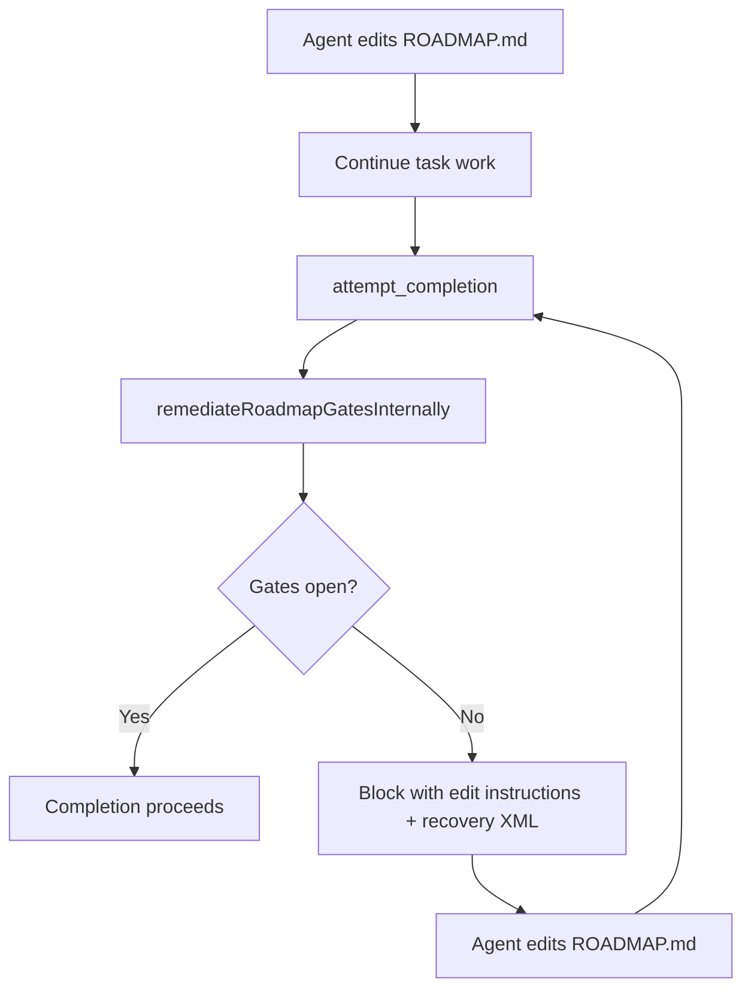

**Date:** June 2026  
**Scope:** Roadmap completion gates, agent ergonomics, system prompt alignment  
**Status:** Resolved — internal auto-governance at `attempt_completion`

## Summary

Roadmap steering gates were **correct in intent** (block completion when `ROADMAP.md` is out of sync) but **wrong in ergonomics**: agents were told to call `roadmap(action='validate')`, `/roadmap validate`, or MCP tools after every ROADMAP edit. That caused validate loops, wasted tool turns, and confusion when governance could have run inside the extension.

We moved governance to a **closed-loop internal pipeline** at `attempt_completion` and aligned prompts, error messages, progress logs, and tool descriptions to match.

## Symptoms (before)

| Symptom | Impact |
|---------|--------|
| System prompt required `roadmap(action='validate')` before `attempt_completion` | Agents burned turns on redundant validate calls |
| Completion block messages said "Run roadmap(action='cockpit')" or "validate" | Agents invoked tools instead of editing ROADMAP.md |
| `validation_pending` after file writes | Manual validate expected even though service could validate internally |
| Inconsistent copy across Doctor, Progress, Cockpit, NativeBridge | Mixed signals — some paths auto, some manual |
| No structured recovery payload | Agents parsed prose; hard to recover from gate blocks |

Users experienced: **completion blocked → agent calls validate/cockpit → still blocked → repeat**.

## Root causes

### 1. Gate evaluated, but not remediated

`evaluateRoadmapCompletionBlock()` checked gates but did not consistently **auto-heal** fixable states (`validation_pending`, bootstrap placeholders, missing checkpoint dates) before blocking.

### 2. Agent-facing docs contradicted implementation

`roadmap_steering.ts` (system prompt) and `roadmap-steering.mdx` (user docs) documented a **manual validate step** that fought the product goal of automatic steering.

### 3. Tool-first recovery language

`RoadmapGateCatalog` fix strings, error envelopes, and completion playbooks pointed at **tool commands** (`roadmap(action='validate')`) rather than **file edits** (repair section 11, fill placeholders).

### 4. Fragmented copy

A dozen files each had slightly different "what to do next" strings. No single source of truth for auto-governance messaging.

## What we changed

### Internal remediation pipeline

`remediateRoadmapGatesInternally()` in `RoadmapCompletionGate.ts` runs **before** any block decision:

```text
1. readState → validation_pending?
2. bootstrap placeholders? → writeBootstrapAutofill (if autoBootstrapFill)
3. validateRoadmap (if pending or autofill wrote)
4. stale + mechanical reason? → touchRecentCheckpointDate → re-validate
5. getOperationalStatus → evaluate blocking gates
```

Mechanical stale reasons only: `no_recent_checkpoint_date`, `invalid_date`. Narrative staleness (git activity, age) still requires human/agent edits to section 11.

### Single copy source: `RoadmapAutoGovernance.ts`

Central constants (`AUTO_GOVERNANCE`), per-gate edit map (`GATE_EDIT_INSTRUCTIONS`), and structured recovery XML (`buildRoadmapGateStructuredEnvelope`). Used by completion gate, steering blocks, progress journal, doctor, and native bridge.

### System prompt rewrite

`src/core/prompts/system-prompt/components/roadmap_steering.ts` now states:

- Auto-governance runs at `attempt_completion`
- Do **not** call `validate` or MCP for governance
- If blocked, edit `ROADMAP.md` per gate message

All model snapshots updated.

### Structured agent recovery

On roadmap gate block, `completionGatePipeline.ts` attaches `<roadmap_governance_recovery>` with:

- Policy and auto-steps attempted
- Per-gate `<edit>` instructions
- Resolution: edit ROADMAP.md, retry `attempt_completion`

Cached on `TaskState.lastRoadmapGateRecovery` for the error formatter.

### Mid-task messaging

`midTaskAgentNextCall()` returns **"continue task"** when `validation_pending` or bootstrap incomplete — not "run validate". Write hints after ROADMAP mutations say validation runs at completion.

## What did NOT change

| Unchanged | Notes |
|-----------|-------|
| Gate **definitions** | Same gates in `RoadmapGateCatalog.ts`; still enforce schema, freshness, bootstrap |
| `roadmap` tool | Still available for checkpoint, cockpit, doctor, diagnostics |
| `/roadmap` slash command | Operator console for humans and agents |
| `failClosedCompletionGates` | Still blocks if gate evaluation throws |
| Settings defaults | `blockKanbanOnValidationPending` remains `true` — validation still **enforced**, just **automatic** |

`roadmap(action='validate')` is a **diagnostic**, not a **completion prerequisite**.

## New agent flow



## Pass 2 — production hardening (preflight + copy audit)

### Preflight must not mutate

Readiness checks called `evaluateRoadmapCompletionBlock()` which always ran live remediation — preflight could validate ROADMAP before the real completion attempt. Fixed with:

- `dryRun: true` on `remediateRoadmapGatesInternally()` / `evaluateRoadmapCompletionBlock()`
- `skipAutoValidate` on `getOperationalStatus()` / `resolveWorkspaceContext()` so status reads during dry-run do not persist validation
- Auto-clearable-only blocks (`validation_current`, `bootstrap_complete`) suppressed in dry-run readiness

### Copy audit (remaining validate-first strings)

Unified mid-task guidance via `AUTO_GOVERNANCE.previewBootstrapAutofill` and `continueTaskMidPass` across:

- `RoadmapService.ts` — template, validate, autofill, auto-bootstrap payloads
- `RoadmapOperator.ts` — `explain_gate` detail
- `RoadmapDoctor.ts` — state file check message
- `ToolExecutor.ts` — write guard error (file path, not `doctor` tool)
- `attemptCompletionUtils.ts` — preflight brief includes auto-governance policy
- `docs/tools-reference/all-dietcode-tools.mdx` — completion note

## Pass 3 — validation_pending persistence (industry gate pattern)

### Problem

`resolveWorkspaceContext()` auto-validated on every `getOperationalStatus()` read. That cleared `validation_pending` mid-task whenever an agent called `guide` or `cockpit`, undermining the completion gate and contradicting “governance at `attempt_completion`.”

### Fix

- **Opt-in only:** `validatePendingOnRead` — status reads no longer mutate state by default
- **`validation_pending` persists** after ROADMAP edits until live completion remediation or explicit `roadmap(action='validate')`
- **`recommendNextAction`** returns `continueTaskMidPass` instead of `cockpit` for pending validation
- **`validationPendingEnvelope`** aligned to auto-governance copy (no `action='validate'` mandate)
- Tests: status read preserves pending; dry-run preflight skips auto-clearable-only gates

This mirrors CI/CD merge gates: checks run at the gate, not on every status poll.

## Pass 4 — mid-task messaging (no false “blocked” alarms)

### Problem

Steering surfaces (`formatRoadmapSteeringBlock`, cockpit) showed **⛔ attempt_completion blocked** whenever `kanban_complete_allowed === false`, including when the only blockers were `validation_pending` or bootstrap placeholders — states that **auto-clear at completion**. Agents were nudged into unnecessary validate/cockpit loops.

### Fix

- Shared `isAutoClearableGovernanceOnly()` in `RoadmapAutoGovernance.ts`
- Mid-task copy uses `midTaskGovernanceNote` instead of hard block when auto-clearable only
- `buildOperationalPayload` uses `midTaskAgentNextCall()` for consistent `agent_next_call`
- Tool spec: `apply_bootstrap_fill` context documented as preview-only
- Validate failure recovery → `explain_gate` (diagnostic), not `cockpit` loop
- Completion breather hints include roadmap auto-governance when `lastReason === roadmap_gate`

## Pass 5 — unified surfaces + structured auto-clearable signal

### Problem

Progress reports, explain-gate, doctor, and `_roadmap_operator_hints` still emitted **attempt_completion blocked** for auto-clearable states. Agents saw contradictory signals across cockpit vs progress vs environment block.

### Fix

- `gateExplainParamsFromStatus()` — single helper for gate report context
- `formatExplainGateReport`, progress timeline, doctor, operator hints use `isAutoClearableGovernanceOnly()`
- Payloads expose `auto_clearable_governance_only` for machine consumers
- `<roadmap_governance_recovery>` adds `<auto_clearable_only>` + `<mid_task_note>` when applicable
- `isAutoClearableGovernanceOnly` requires `schemaValid !== false` for validation-only blocks
- System prompt steering section shows gate status line (info vs hard block)
- `/roadmap` slash description de-emphasizes manual validate

## Pass 6 — `formatKanbanGateStatusLine` + machine `governance_policy`

### Problem

Gate status copy was duplicated across six files with slight wording drift. Tool payloads lacked a stable machine-readable governance policy field.

### Fix

- `formatKanbanGateStatusLine()` — single human line for kanban gate state (info vs hard block)
- All steering surfaces refactored to use it (agent steering, cockpit, progress, explain-gate)
- Every `wrapClarityEnvelope` payload includes `governance_policy` + `auto_clearable_governance_only`
- `sessionBrief` / `RoadmapSteeringContext` / `watch` expose auto-clearable flag
- Completion recovery caches `autoClearableOnly: false` on real blocks; XML envelope explicit
- Bootstrap fill plan uses `continueTaskMidPass` instead of `cockpit` when complete

## Pass 7 — proactive preflight advisories + residual cockpit mandates

### Problem

Preflight readiness was silent when only auto-clearable governance was pending — agents got no positive signal that completion would self-heal. A few recovery paths still mandated `roadmap(action='cockpit')` after checkpoint autofill, state write failures, and idle “wait” phase recommendations. Write hints lacked machine-readable governance fields.

### Fix

- `CompletionGateReadinessIssue` supports `severity: "info" | "block"`
- `evaluateCompletionGateReadinessAsync` emits a non-blocking roadmap `<advisory>` when `auto_clearable_governance_only` (preflight `ready="true"` with `advisory_count`)
- `buildCompletionGateReadinessBlock` separates blockers from advisories
- Checkpoint autofill, state-write retry, and `recommendNextAction` wait phase → `guide` / `continueTaskMidPass` instead of `cockpit`
- `roadmapWriteHint` + `mergeRoadmapHintIntoResult` propagate `governance_policy` and `auto_clearable_governance_only`
- `/roadmap guide` shows mid-task governance note when auto-clearable
- Progress error recovery defaults to `/roadmap guide` (diagnostic, not mandatory loop)
- Progress gate fallback uses `midTaskGovernanceNote` instead of hard “blocked” text

## Pass 8 — unified governance fields + consolidated preflight dry-run

### Problem

Governance copy still drifted across completion playbooks, session brief, operator hints, and preflight XML. Bootstrap-fill phase nudged agents toward `apply_bootstrap_fill` instead of continuing work. Preflight advisories used a separate status read instead of the same dry-run block evaluator as live completion.

### Fix

- `AUTO_GOVERNANCE.governancePolicy` + `roadmapGateRecoveryHint` — single strings for machine and human consumers
- `governanceFieldsFromStatus()` — stable `governance_policy` / `auto_clearable_governance_only` / `governance_mid_task` on session brief
- `ROADMAP_DIAGNOSTIC_SLASH_COMMANDS` — guide-first diagnostic list on all operator hints
- `roadmapPreflightReadinessFromDryRun()` — one mapper from `evaluateRoadmapCompletionBlock({ dryRun: true })` to preflight issues (includes planned remediation steps in advisory message)
- `<completion_gate_readiness>` adds `governance_policy` when roadmap stage is present
- Bootstrap-fill `agent_next_call` / `recommendNextAction` → `continueTaskMidPass` (preview optional in detail)
- `roadmapToolCommandToSlash` defaults to `/roadmap guide` not cockpit

## Pass 9 — deduplicated steering signals + validate as diagnostic-only

### Problem

Steering block, watch line, and validate/bootstrap responses still duplicated warnings (validation_pending + bootstrap + gate line) when governance was auto-clearable — agents saw triple ⚠️ signals. `roadmap(action='validate')` and bootstrap fill plan still returned `apply_bootstrap_fill` as primary `agent_next_call`. Doctor always dumped full explain-gate report for auto-clearable states.

### Fix

- `isAutoClearableBrief()` — brief-level helper; steering block suppresses redundant warnings when auto-clearable
- `formatWatchSteeringLine` — `ℹ️gov` instead of `⚠️pending` / `⛔gates` when auto-clearable
- System prompt uses `ROADMAP_DIAGNOSTIC_SLASH_COMMANDS` (guide-first) + explicit `governance_policy` line
- `validateRoadmap` payload: `governance_diagnostic: true`, `validateDiagnosticOnly` copy, `continueTaskMidPass` as next call
- `buildBootstrapFillPlan`, template brief, autofill dry-run preview → `continueTaskMidPass` (preview as optional `preview_command`)
- `buildOperationalPayload` includes `governance_policy` on every status response
- Error envelopes include `governance_policy`
- Doctor uses `formatKanbanGateStatusLine` before heavy explain-gate dump
- Task breather uses `AUTO_GOVERNANCE.roadmapGateRecoveryHint`

## Pass 10 — governance on every surface + unified gate edit copy

### Problem

`governance_policy` was missing from progress snapshots and steering context. Gate explain reports used raw `fix:` strings that could drift from `GATE_EDIT_INSTRUCTIONS`. Checkpoint agent instructions and autofill draft copy still elevated preview commands. Tool spec listed `validate` and `cockpit` before `guide`.

### Fix

- `mergeGovernanceFields()` — spreads policy/mid-task fields onto progress snapshots and steering context
- `formatExplainGateReport` + `RoadmapGateCatalog` closed gates use `gateEditInstruction()` (`edit:` not ad-hoc `fix:`)
- `AGENT_PLAYBOOK` reordered — continue task at step 2; checkpoint/preview optional
- Checkpoint `agent_instructions` bootstrap_fill aligned with `continueTaskMidPass`
- `applyBootstrapFillDraft` no-autofill summary avoids mandating preview command
- `/roadmap validate` slash output includes `validateDiagnosticOnly`
- Tool spec: guide-first action list; `validate` labeled diagnostic; description mentions `governance_policy`
- Pre-completion brief uses single `governancePolicy` line

## Files touched (reference)

| Area | Key files |
|------|-----------|
| Remediation | `RoadmapCompletionGate.ts`, `RoadmapService.ts` (`touchRecentCheckpointDate`) |
| Copy / recovery | `RoadmapAutoGovernance.ts` |
| Completion pipeline | `completionGatePipeline.ts`, `attemptCompletionUtils.ts`, `TaskState.ts` |
| Agent prompts | `roadmap_steering.ts`, `tools/roadmap.ts` |
| Steering UX | `RoadmapAgentSteering.ts`, `RoadmapNativeBridge.ts`, `RoadmapSteeringContext.ts` |
| Operator surfaces | `RoadmapOperator.ts`, `RoadmapDoctor.ts`, `RoadmapProgress.ts`, `RoadmapCockpit.ts` |
| Tests | `RoadmapCompletionGate.test.ts`, `RoadmapAutoGovernance.test.ts`, `RoadmapIntegration.test.ts`, system prompt snapshots |

## Lessons learned

1. **Enforcement ≠ manual steps.** Blocking completion is valid; requiring an agent tool call to clear routine state is not.
2. **One copy source for agent-facing strings.** Divergent "fix" messages across 12 files guaranteed drift.
3. **Recovery should be file-action-first.** Industry pattern (CI, API gateways): tell the agent *what to change*, not *what tool to invoke*.
4. **System prompt is part of the gate.** If the prompt says "run validate," agents will — even when the runtime auto-validates.

## Verification

- **1512+** unit tests passing, including roadmap gate, auto-governance, and system prompt snapshot suites
- Gate block messages do not mandate `roadmap(action='validate')` for routine recovery
- `AUTO_GOVERNANCE` constants used across steering, progress, and completion paths

## Related

- [Roadmap steering (current behavior)](roadmap-steering.mdx)
- [Security — completion gates](../SECURITY_BEST_PRACTICES.md)
- Source: `src/services/roadmap/RoadmapAutoGovernance.ts`
