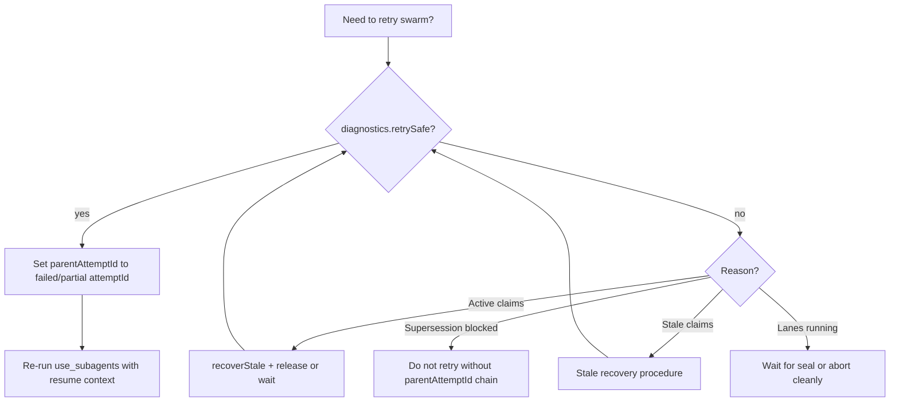

# Governed Execution Operator Runbook

SRE-style playbook for governed swarm receipts: triage incidents, interpret violations, recover safely, and decide when retry is allowed.

| Doc | Purpose |
|-----|---------|
| [governed-subagent-execution.md](governed-subagent-execution.md) | Architecture and patterns |
| [governed-execution-schema.md](governed-execution-schema.md) | Receipt field reference |
| [governed-execution-decisions.md](governed-execution-decisions.md) | Why the system works this way |

---

## On-call quick reference

**North-star:** Locks protect mutation. Receipts preserve truth.

| Question | Answer |
|----------|--------|
| Where is truth? | Last `sealed && mergePassed` in `{swarmId}.governed.history.jsonl`, or `loadAuthoritativeGovernedReceipt()` |
| Is "lock skipped" a bug? | **No** — expected for read/audit/plan/doc/diagnostic lanes |
| Is missing `claimId` a bug? | Only if `executionMode: mutation` or lane performed writes |
| Can two lanes read the same file? | **Yes** — read overlap is not a violation |
| When is retry safe? | `diagnostics.retrySafe === true` in incident console |
| What blocks merge? | `mergeGate.violations` — see [violation catalog](#violation-catalog) |

---

## Authoritative state procedure

Chat status and latest pointer can lie after a failed retry. Use this procedure:

1. Open `{taskDir}/subagent_executions/{swarmId}.governed.history.jsonl`
2. Scan **from bottom** for first entry with `sealed: true` and `mergePassed: true`
3. Load `{swarmId}.governed.{attemptId}.json` for that `attemptId`
4. Or call `loadAuthoritativeGovernedReceipt(taskId, swarmId)`

**Latest pointer rule:** `{swarmId}.governed.json` is **not updated** when a new attempt fails seal but a prior attempt sealed successfully.

---

## Incident taxonomy

Derived by `deriveReceiptIncident()` (priority order). Use **Symptom → Diagnosis → Action**.

| Incident | Symptoms | Diagnosis | Action |
|----------|----------|-----------|--------|
| **sealed_success** | Green seal, merge ok | Gate passed, replay valid | Treat swarm as complete |
| **in_progress** | Lanes running, live summary | Execution not sealed | Wait; do not merge or retry over |
| **partial_receipt** | Unsealed, lanes `running`, `retryReason` crash prefix | Interrupt before seal | Inspect claim timeline; recover stale mutation claims; retry with `parentAttemptId` |
| **stale_claim** | Stale count > 0, `stale_detected` in history | Expired lease / stale file or fence | Run [stale recovery](#stale-recovery-procedure) |
| **unsafe_retry** | Supersession violation | Retry would overwrite sealed success | Link via `parentAttemptId`; do not delete sealed attempt |
| **merge_blocked** | Violations list non-empty | Reconciliation failed | [Violation catalog](#violation-catalog) → fix → retry |
| **replay_mismatch** | Checksum / integrity invalid | Receipt or envelope drift | Forensic compare; re-run from authoritative attempt |
| **corrupted_receipt** | Schema validation failed | Malformed JSON or wrong version | Inspect file on disk; do not merge |
| **backend_unavailable** | Durable layer missing | DB/workspace unavailable | Fix workspace/DB; re-admit |
| **failed_receipt** | Sealed false, no other class | General failure | Full receipt review |

### Incident console UI map

| UI section | Source field |
|------------|--------------|
| Incident badge | `diagnostics.incident` |
| Summary line | `diagnostics.incidentSummary` |
| Retry safe / unsafe | `diagnostics.retrySafe`, `retryUnsafeReason` |
| Lane receipts | `laneStates[]` — mode, lock skipped/required, read/write counts |
| Lane DAG | `laneDag[]` |
| Resource ownership | `resourceOwners[]` — mutation claims only |
| Claim timeline | `claimTimeline[]` — no lock-skipped lanes |
| File overlaps | `diagnostics.overlappingPaths` — **write collisions only** |
| Merge violations | `violations[]` |

---

## Lock necessity (operator)

### Console signals

| Signal | Meaning |
|--------|---------|
| Mode badge (`read_only`, …) | Declared execution mode |
| **lock skipped** (green) | No governed ownership; safe read/audit lane |
| **lock required** (blue) | Mutation or escalated lane |
| `read:N` | Read set size |
| `write:N` | Write set size — attention if lock skipped |
| No claim ID | Expected when lock skipped |

**Do not escalate** lock-skipped lanes as "missing lock."

### Lock decision matrix

| Condition | Lock |
|-----------|------|
| `mutation` (default) | Required |
| `[write_set:…]` | Required (escalated) |
| `[declares_writes]`, `[mutates_roadmap]`, `[mutates_broccoli]` | Required |
| `[updates_authoritative_receipt]`, `[exclusive_resource:…]` | Required |
| Read/audit/plan/doc/diagnostic, no escalation | **Skipped** |

### Parallel safety matrix

| Scenario | Merge collision? |
|----------|------------------|
| Two `read_only` lanes read `src/a.ts` | No |
| Two `audit_only` lanes inspect same receipt | No |
| Two `planning_only` lanes reference same roadmap item | No |
| `diagnostic_only` append-only evidence | No |
| Two `mutation` lanes write `src/a.ts` in parallel | **Yes** — `unsafe mutation overlap` |
| Non-mutating lane ran write tools without lock | **Yes** — `performed writes without lock` |
| Dependent lane writes after predecessor (DAG order) | No — allowed when deps wired |

---

## Retry decision flow



### isRetrySafe() conditions

**Unsafe when:**

- Any `resourceOwners` with `status: active`
- Any `status: stale` (must recover first)
- `mergeGate.sealedSupersessionBlocked`
- Prior sealed attempt exists and current DAG has `running` nodes

**Safe when:** none of the above.

Lock-skipped lanes from prior attempt impose **no** claim cleanup.

---

## Violation catalog

Exact strings from `MergeGate.runMergeGate()`. Use for log search and alert routing.

### Mutation safety

| Violation pattern | Meaning | Remediation |
|-------------------|---------|-------------|
| `unsafe mutation overlap on '{path}': {agents}` | Parallel writes to same path | Serialize lanes, add DAG dep, or split write sets |
| `mutation lane {laneId} missing governed lock` | Mutation mode without claim | Bug or bypassed acquire — inspect handler |
| `mutation lane {laneId} performed writes without lock` | Write tools ran without claim | Ensure mutation acquire succeeded |
| `non-mutating lane {laneId} ({mode}) performed writes without lock` | Mode/write mismatch | Add `[write_set:…]` and accept lock, or fix lane tools |

### Evidence

| Violation pattern | Remediation |
|-------------------|-------------|
| `missing evidence: {agentIds}` | Ensure agents record `evidenceRefs` |
| `missing transcript pointer: {laneIds}` | Completed lanes need `transcriptArtifactPath` |
| `missing tool evidence: {laneIds}` | Completed lanes need tool steps or evidence |
| `unresolved placeholders: {agentIds}` | Remove TODO/FIXME/PLACEHOLDER/TBD from output |

### Status integrity

| Violation pattern | Remediation |
|-------------------|-------------|
| `lane {laneId} marked completed but agent status is failed` | Reconcile lane vs envelope status |
| `failed lane marked successful in envelope: {laneId}` | Same |
| `failed lanes: {laneIds}` | Fix or exclude failed lanes before seal |
| `unsealed DAG nodes: {laneIds}` | All nodes must be `sealed` or `failed` at seal |

### Ownership (mutation lanes only)

| Violation pattern | Remediation |
|-------------------|-------------|
| `orphaned claims: {count}` | Release or recover — filter `lockRequired` lanes |
| `unreleased claims: {laneIds}` | Call release path; check crash phase |
| `stale leases: {count}` | Stale recovery procedure |
| `duplicate claim on '{resource}': {a}, {b}` | Split-brain acquire — recover stale |
| `duplicate claimId '{id}' on resources '…' and '…'` | Claim ID collision — forensic claim history |
| `split-brain lock authority detected` | Multiple owner:token per resource |

### Lineage and replay

| Violation pattern | Remediation |
|-------------------|-------------|
| `unsealed retry cannot supersede prior sealed receipt` | Set `parentAttemptId`; complete or fail all DAG nodes |
| `replay checksum mismatch — non-deterministic state detected` | Receipt edited post-seal or envelope drift |
| `swarm id mismatch: …` / `task id mismatch: …` | Align artifact IDs |
| `lane count mismatch: …` | Lane receipts vs replay lineage |
| Replay schema violations | `unsupported replay schema`, `missing artifact id`, etc. |

---

## Stale recovery procedure

Applies to **mutation lanes** with durable locks. Lock-skipped lanes: skip.

1. **Incident console** — note `stale claims` / `stale leases` count
2. **Re-admit swarm** — `admitSwarm` calls `recoverStale(workspace, "governed-lane:")`
3. **Verify backends cleared:**

| Layer | Location | Auto-recover |
|-------|----------|--------------|
| In-process | Coordinator memory | `expiresAt` expiry |
| File lock | `.broccolidb/governed/locks/` | 600s stale threshold |
| Broccoli fence | `.broccolidb/governed/fencing/` | 600s stale threshold |
| SwarmMutex | SQLite | Manual / service restart |
| Roadmap lease | Roadmap service | Manual |

4. **Manual clear (last resort):** delete stale lock/fence files only if PID dead and mtime > 600s
5. **Confirm** claim timeline shows `released` or `recovered`
6. Re-check `isRetrySafe`

---

## Claim timeline

| Event | Meaning |
|-------|---------|
| `admitted` | Roadmap allowed swarm |
| `acquired` | Mutation claim succeeded |
| `released` | Claim cleared via `UnifiedLockAuthority` |
| `rejected` | Acquire failed — check backend tags |
| `stale_detected` | Stale owner — recover before retry |
| `recovered` | Stale lock reclaimed |

**Lock-skipped lanes never appear** in acquired/released — they never held ownership.

### Backend tags (resource ownership row)

| Tag | Layer |
|-----|-------|
| `proc` | In-process |
| `db` | SwarmMutex |
| `lease` | Roadmap |
| `file` | File lock |
| `fence` | Broccoli fence |

Partial acquire (file ok, fence fail) → **rejected**, SwarmMutex rolled back.

---

## Crash phases

| Phase | Receipt signal | Orphan / unreleased? |
|-------|----------------|----------------------|
| After claim, before execution | Partial, lane `running` | Orphan if mutation |
| During execution | Partial | — |
| After execution, before release | Unreleased claim violation | Mutation only |
| After release, before seal | Unsealed, may lack evidence | No |
| Lock-skipped lane any phase | Lane receipt `lockRequired: false` | **No** |
| Parent before merge gate | Live `in_progress` summary | — |
| Failed retry after sealed success | Failed attempt file; pointer unchanged | Prior sealed authoritative |

`SubagentToolHandler` invokes `sealCrashReceipt()` on timeout, abort, or parent interruption — crash phase inferred via `inferSwarmCrashPhase`. Authoritative sealed success is preserved by `shouldUpdateLatestPointer` in `GovernedExecutionStore`.

---

## Replay checksum mismatch

**Hashed fields:** `swarmId`, `executionId`, `taskId`, `admission`, lane status + sorted `touchedFiles`, `mergePassed`, replay artifact ID/status.

**Not hashed:** lock fields, `executionMode`, `readSet`, `writeSet`, `claimHistory`.

### Common causes

| Cause | Check |
|-------|-------|
| Receipt edited after seal | File mtime vs `sealedAt` |
| Envelope mutated | Compare `{swarmId}.json` to seal-time copy |
| Lane count drift | `laneReceipts.length` vs replay lineage |
| ID drift | `taskId` / `swarmId` mismatch strings |

Use `explainReplayMismatch()` output in incident console.

---

## Harness author checklist

1. **Read-only review** — `[execution_mode:read_only]` + `[read_set:…]`
2. **Audit** — `[execution_mode:audit_only]`; no lock expected
3. **Doc edit** — `[write_set:…]` or `mutation` mode
4. **Default** — omit tag = mutation = lock required
5. **Parallel reads** — safe across read_only lanes
6. **Parallel writes** — require mutation + non-overlapping write sets or DAG order

---

## Forensic artifact locations

```
{taskDir}/subagent_executions/
  {swarmId}.json                          # envelope
  {swarmId}.governed.{attemptId}.json     # immutable receipt
  {swarmId}.governed.history.jsonl        # attempt index
  {swarmId}.governed.json                 # latest pointer (may lag)
  {swarmId}/agents/{agentId}.transcript.jsonl

{workspace}/.broccolidb/governed/
  locks/{sha256(resourceKey)}.lock
  fencing/{sha256(resourceKey)}.json
```

---

## Escalation guide

| Severity | Condition | Escalate to |
|----------|-----------|-------------|
| P3 | Single merge violation, clear fix | Harness author / retry |
| P2 | Stale claims persist after recovery | Platform — lock backend health |
| P2 | `split-brain lock authority detected` | Platform — forensic claim history |
| P1 | Data loss suspected (authoritative receipt missing) | Stop merges; preserve `history.jsonl` |
| P1 | Repeated fence fail-closed with DB up | BroccoliDB / workspace integrity |

---

## Quick diagnostic checklist

1. **Lane receipts** — is `lock skipped` expected for this mode?
2. **Overlap violation** — is it `unsafe mutation overlap` (writes), not reads?
3. **Orphaned claims** — filter to `lockRequired: true` lanes only
4. **Non-mutating blocked** — did lane run write tools? Fix mode or add write_set
5. **Authoritative state** — `history.jsonl` sealed entry, not chat or latest pointer alone
6. **Retry** — `diagnostics.retrySafe` before re-run

---

## Related

- [Architecture](governed-subagent-execution.md)
- [Schema](governed-execution-schema.md)
- [Decisions](governed-execution-decisions.md)
