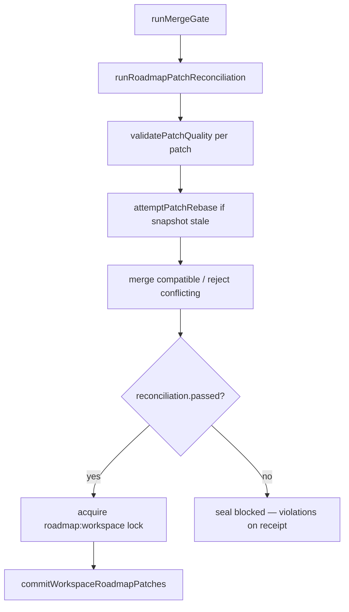

# Governed Roadmap Projection — Quick Reference

One-page cheatsheet for harness authors and operators. Full depth: [governed-subagent-execution.md](governed-subagent-execution.md).

---

## Invariants (memorize these)

| Rule | Meaning |
|------|---------|
| **Locks protect mutation** | File edits need `LockAuthority` when `mutation` mode (or escalated) |
| **Receipts preserve truth** | Every lane emits a durable receipt — with or without a lock |
| **Private projection is cheap** | Lanes freely maintain `agentRoadmap` + `localRoadmapEvents` |
| **Workspace truth is expensive** | Only coordinator commits `workspaceRoadmap` after reconciliation |
| **Agents propose; coordinator commits** | No lane-level kanban writes; use `propose_patch` |

**Do not:** return to shared per-lane workspace roadmap mutation · add extra lock layers for projections · let agents directly mutate `workspaceRoadmap`.

---

## Three planes

```
agentRoadmap (lane)     →  local events, patch proposals     →  no workspace lock
swarmRoadmap (plan)     →  DAG, lane items, snapshot at admit →  read-only
workspaceRoadmap (truth) →  reconciled patches only           →  roadmap:workspace lock at seal
```

| I want to… | Use | Never use |
|------------|-----|-----------|
| Log private progress | `[local_roadmap:progress_note:ITEM:…]` | Direct `roadmap` tool write from lane |
| Note a blocker locally | `[local_roadmap:blocked_reason:ITEM:…]` | Smuggle "mark complete" in local event text |
| Attach evidence to workspace | `[propose_patch:attach_evidence:ITEM:evidence=path\|rationale=…]` | `[mutates_roadmap]` without patch |
| Mark item complete | `[propose_patch:mark_complete:ITEM:evidence=path\|rationale=…\|confidence=0.9]` | Local event saying "done" |
| Re-open completed item | `[propose_patch:reopen_item:ITEM:rationale=…]` | Silent kanban edit |
| Advisory only | `[propose_patch:advisory_only:ITEM:…]` | Expect workspace commit |

---

## Prompt tag syntax

### Local events (private — no workspace write)

```
[local_roadmap:progress_note:TASK-1:implementing auth]
[local_roadmap:blocked_reason:TASK-1:waiting on API review]
[local_roadmap:evidence_checklist:TASK-1:unit tests|e2e tests]
[local_roadmap:completion_confidence:TASK-1:0.85]
[local_roadmap:todo_state:TASK-1:in_progress]
```

### Workspace patches (proposals — coordinator may commit)

```
[propose_patch:attach_evidence:TASK-1:evidence=tests/auth.test.ts|rationale=unit tests pass|confidence=0.9|policy=rebase_if_safe]

[propose_patch:mark_complete:TASK-1:evidence=tests/e2e/auth.spec.ts|rationale=all acceptance criteria met|confidence=0.95|policy=fail_on_conflict]

[propose_patch:add_blocked_reason:TASK-1:rationale=blocked on upstream API|policy=rebase_if_safe]

[propose_patch:reopen_item:TASK-1:rationale=regression found in prod|policy=require_explicit_reopen]
```

**Patch metadata keys:** `evidence=`, `rationale=`, `confidence=`, `policy=` (`fail_on_conflict` | `rebase_if_safe` | `require_explicit_reopen`).

### Lane linkage (unchanged)

```
[execution_mode:read_only]
[depends_on:0]
[roadmap_item:NOW-42]
```

---

## Required patch fields (non-advisory)

| Field | Required | Notes |
|-------|----------|-------|
| `patchId` | yes | Auto-generated if omitted in parser |
| `agentRoadmapId` | yes | From projection at acquire |
| `baseWorkspaceSnapshotId` | yes | `rm-snap-…` at projection creation |
| `itemId` | yes | Target roadmap item |
| `type` | yes | See patch types below |
| `evidencePointer` | for `mark_complete` / `reopen_item` | Path or evidence ref |
| `rationale` | yes | ≥ 8 chars; "done" rejected |
| `confidence` | yes | ≥ 0.5 |
| `expectedTransition` | yes | `{ to: "…" }` |
| `conflictPolicy` | yes | Rebase behavior |

**Patch types:** `mark_complete`, `move_lane`, `update_dependency`, `add_blocked_reason`, `attach_evidence`, `update_ownership`, `suggest_follow_up`, `advisory_only`, `reopen_item`.

---

## Seal pipeline (what happens at swarm end)



**Coordinator commit requires:** sealed · merge passed · integrity valid · reconciliation passed · actionable patches · completion policy allows · `roadmap:workspace` lock acquired.

**No lane-level workspace commit path exists.**

---

## Rebase rules (stale snapshot)

| Patch type | Workspace moved during run | Outcome |
|------------|---------------------------|---------|
| `attach_evidence`, `add_blocked_reason`, `suggest_follow_up`, `advisory_only` | Snapshot advanced | **Safe rebase** → `rebased` |
| `mark_complete`, `move_lane`, `update_dependency`, `update_ownership` | Snapshot advanced | **Stale conflict** → rejected |
| Any patch targeting completed item | Without `reopen_item` | Rejected |

---

## Operator console legend

| UI signal | Meaning |
|-----------|---------|
| `workspace snap: rm-snap-…` | Current workspace snapshot at seal |
| `accepted patches: N` | Passed reconciliation |
| `rejected patches: N` | Failed quality / rebase / conflict |
| `rebase {id}: rebased` | Patch safely rebased to current snapshot |
| `rebase {id}: stale_conflict` | Stale patch cannot apply — retry lane |
| `Rejected patch reasons` | Why each patch failed |
| `commit: committed` | Coordinator applied patches to kanban |
| `commit: blocked` | See `workspaceCommit.blockReason` on receipt |
| `commit: skipped` | Roadmap disabled or no actionable patches |
| `stale projections: …` | Projection out of sync with workspace |
| Lane `patches:N` | Lane proposed N workspace patches |
| Lane `local:N` | Lane recorded N private local events |

---

## Common rejection reasons

| Reason | Fix |
|--------|-----|
| `missing evidence pointer` | Add `evidence=path` to `propose_patch` |
| `vague or missing rationale` | Specific rationale ≥ 8 characters |
| `insufficient confidence` | `confidence=0.8` or higher |
| `stale conflicting patch` | Re-run lane or use `attach_evidence` first |
| `failed lane cannot mark roadmap complete` | Fix lane or use advisory patch |
| `conflicting workspace patches` | Add `[depends_on:N]` or split items |
| `smuggled authoritative mutation via local event` | Use `propose_patch` instead |
| `cannot directly mutate workspace roadmap` | Never write kanban from lane tools |

---

## Harness author decision tree

```
Does this lane edit files?
  yes → [execution_mode:mutation] or default (omit tag)
  no  → [execution_mode:read_only] or audit/plan/doc/diagnostic

Does this lane need to update workspace kanban?
  yes → [propose_patch:TYPE:ITEM:evidence=…|rationale=…]
  no  → [local_roadmap:progress_note:ITEM:…] for private notes only

Does completion need evidence?
  yes → [propose_patch:mark_complete:…:evidence=…] (never local event "done")

Do lanes depend on each other?
  yes → [depends_on:N] on downstream lane

Parallel lanes same item?
  → use DAG deps OR different items OR compatible patch types only
```

---

## Module map

| Module | Role |
|--------|------|
| `roadmapProjection.ts` | Shared types |
| `AgentRoadmapProjection.ts` | Projection builder, parsers |
| `RoadmapPatchQualityGate.ts` | Patch validation |
| `RoadmapLocalEventContainment.ts` | Local event allowlist |
| `RoadmapPatchReconciler.ts` | Rebase + conflict merge |
| `RoadmapWorkspaceCommit.ts` | Coordinator commit |
| `GovernedSwarmCoordinator.ts` | Lifecycle wiring |

---

## Related

| Doc | Purpose |
|-----|---------|
| [Governed subagent execution](governed-subagent-execution.md) | Full architecture |
| [Runbook](governed-execution-runbook.md) | Incident triage |
| [Schema](governed-execution-schema.md) | Receipt fields |
| [Decisions ADR-011/012](governed-execution-decisions.md#adr-011-per-agent-roadmap-projection-coordinator-owned-workspace-commits) | Why projection |
| [Philosophy § VI-A](papers/philosophy.md) | Design values |
| [Working with subagents](WORKING_WITH_SUBAGENTS.md) | Code map |
