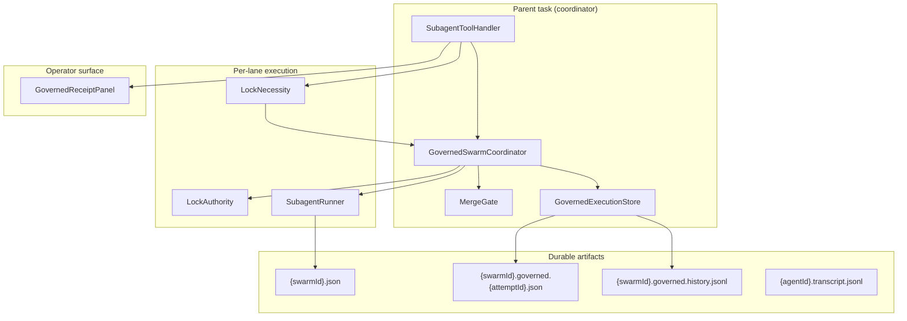
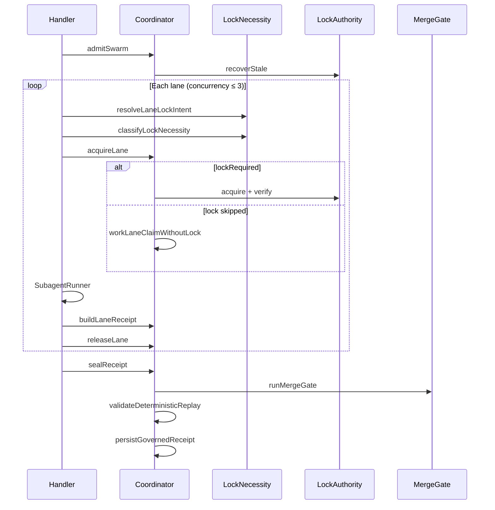

# Governed Subagent Execution

LUMI's governed swarm harness coordinates multi-lane agent execution with **durable receipts**, **conditional mutation locks**, and a **merge gate** that reconciles parallel work before declaring success.

The parent task is **coordinator, reviewer, and receipt presenter** — not a memory sink.

| Doc | Audience | Purpose |
|-----|----------|---------|
| **This page** | Engineers, architects | Architecture, patterns, lifecycle |
| [governed-execution-runbook.md](governed-execution-runbook.md) | Operators, on-call | Symptom → diagnosis → remediation |
| [governed-execution-schema.md](governed-execution-schema.md) | Integrators | Receipt field reference (schema v3) |
| [governed-execution-decisions.md](governed-execution-decisions.md) | Maintainers | ADR-style design decisions |

---

## North-star invariant

> **Locks protect mutation. Receipts preserve truth.**

| Concern | Mechanism | Non-goal |
|---------|-----------|----------|
| **Who may mutate?** | Governed lock claim (`LockAuthority`) | Blocking read-only parallelism |
| **What happened?** | Durable lane + swarm receipts | Chat transcript as source of truth |
| **Is it safe to merge?** | `MergeGate` optimistic reconciliation | Silent success on partial evidence |

Non-mutating lanes (`read_only`, `audit_only`, …) emit full receipts with `lockRequired: false` — replayable and visible without ownership pressure.

---

## Industry pattern mapping

The harness composes familiar distributed-systems primitives. Names below match how practitioners discuss them; implementation is in-process + SQLite + filesystem (not a separate consensus service).

| Pattern | Where it appears | Familiar reference |
|---------|------------------|-------------------|
| **Lease / TTL lock** | In-process claim `expiresAt` (default 600s); file lock stale recovery | Chubby / etcd lease |
| **Fencing token** | Monotonic `fencingToken` + broccoli fence file; release/verify require match | Kleppmann — *Designing Data-Intensive Applications* |
| **Optimistic concurrency** | Execute in parallel → `runMergeGate` reconciles write sets before commit | OCC / merge-before-commit |
| **Saga (lite)** | Acquire → execute → release → seal; unreleased claims block merge | Microservices sagas |
| **Admission control** | Roadmap `scheduleAdmission` at swarm admit (+ per-lane lease at acquire) | API rate limiting / backpressure |
| **Append-only audit log** | `claimHistory`, `.governed.history.jsonl`, transcript `.jsonl` | Event sourcing |
| **Attempt lineage / idempotency** | `attemptId` + `parentAttemptId`; supersession guard | Workflow run IDs |
| **Read/write set separation** | `readSet` vs `writeSet`; collisions scoped to writes | Transaction isolation (read uncommitted OK across lanes) |
| **Compare-and-swap (file)** | `fs.open(lockPath, 'wx')` exclusive create | Atomic file create |
| **Policy gate** | `MergeGate` — deny list of violations before `sealed: true` | OPA / admission webhook |

---

## System boundaries



**In scope:** LUMI `use_subagents` path via `SubagentToolHandler` → `GovernedSwarmCoordinator`.

**Partial / separate:** `broccolidb/worker_cli.ts` — file lock only, different resource key format, receipt schema v1. See [Process workers](#process-workers-boundary).

---

## Lifecycle phases

Formal orchestration flow (production handler):

| # | Phase | Entry point | Output |
|---|-------|-------------|--------|
| 1 | **Admit** | `admitSwarm(taskId)` | `GovernedAdmissionResult`; triggers `recoverStale(governed-lane:*)` |
| 2 | **Classify** | `resolveLaneLockIntent` + `classifyLockNecessity` | `lockRequired`, reason, read/write intent |
| 3 | **Acquire** | `acquireLane` | `WorkLaneClaim` with or without `lockClaim` |
| 4 | **Execute** | `SubagentRunner.runWithEnvelope` | `SubagentExecutionEnvelope` |
| 5 | **Attribute** | `buildLaneReceipt` + `splitReadWriteSets` | `LaneExecutionReceipt` |
| 6 | **Release** | `releaseLane` | Claim cleared (mutation only); DAG `sealed` / `failed` |
| 7 | **Merge** | `runMergeGate` | `MergeGateResult` — pass/fail + violations |
| 8 | **Seal** | `sealReceipt` | `GovernedSwarmReceipt` schema v3 persisted |



**Seal condition:** `sealed = mergeGate.passed && replay valid && !forceFail`.

Handler forces `finalSwarmStatus = "failed"` when `!receipt.sealed`.

---

## Four invariants

### 1. One authority for mutation ownership

All mutation claims flow through `LockAuthority` (`src/core/governance/LockAuthority.ts`):

| Implementation | Use |
|----------------|-----|
| `UnifiedLockAuthority` | Production — layered backends (see below) |
| `InMemoryLockAuthority` | Unit tests |

`mem_claim` / `mem_release` use the same authority via `governLock.ts`. Lane locks use `releaseGovernedLock()` (workspace-aware durable release). `mem_release` uses in-process release only.

**Lock-necessity:** only lanes that intend to mutate acquire claims. Classifier runs **before** `acquireLane()`.

### 2. One durable truth surface

| Artifact | Path | Role |
|----------|------|------|
| Swarm envelope | `subagent_executions/{swarmId}.json` | Agent outputs, tool steps, touched files |
| Transcript | `subagent_executions/{swarmId}/agents/{agentId}.transcript.jsonl` | Append-only lane event log |
| Per-attempt receipt | `subagent_executions/{swarmId}.governed.{attemptId}.json` | Immutable governed record (schema v3) |
| History index | `subagent_executions/{swarmId}.governed.history.jsonl` | Append-only attempt lineage |
| Latest pointer | `subagent_executions/{swarmId}.governed.json` | Convenience — **may lag** behind sealed prior attempt |

**Authoritative state:** last `sealed && mergePassed` entry in history, or `loadAuthoritativeGovernedReceipt()`. Latest pointer does not regress over sealed success when a retry fails.

Full field reference: [governed-execution-schema.md](governed-execution-schema.md).

### 3. One merge gate (optimistic reconciliation)

`MergeGate.runMergeGate()` is the commit barrier. Parallel lanes execute optimistically; the gate rejects merge if reconciliation fails.

**Mutation-scoped overlap:** `auditMutationWriteOverlaps` uses `writeSet`, or `touchedFiles` when `lockRequired`. Read-set overlap never violates.

**DAG ordering exemption:** overlapping writes allowed when one lane transitively depends on the other (`LaneDAG` infrastructure — see [Known limitations](#known-limitations)).

### 4. One operator surface

`GovernedReceiptPanel` renders incident class, lane execution modes, lock skipped/required, read/write counts, claim timeline, resource ownership, violations.

Data path: `GovernedSwarmCoordinator.buildReceiptSummary()` → `DietCodeSaySubagentStatus.governedReceipt`.

---

## Lock necessity model

Intent is declared **before** acquire; attribution is refined **after** execution.

### Execution modes

| Mode | Default lock | Use case |
|------|--------------|----------|
| `read_only` | skipped | Inspection, review, summarization |
| `audit_only` | skipped | Receipt / evidence audit |
| `planning_only` | skipped | Design recommendations |
| `documentation_only` | skipped | Doc drafts (no writes) |
| `diagnostic_only` | skipped | Append-only diagnostic evidence |
| `mutation` | **required** | File edits, durable state changes |

**Resolution order:**

1. Tool param `execution_mode_{N}` (1-based lane index)
2. Tool param `execution_mode`
3. Prompt header `[execution_mode:…]` (line start)
4. Default: **`mutation`** (backward compatible)

### Escalation tags (non-mutating → lock required)

| Tag | Effect |
|-----|--------|
| `[write_set:path1,path2]` | Declares write intent |
| `[declares_writes]` | Escalates |
| `[mutates_roadmap]` | Roadmap state mutation |
| `[mutates_broccoli]` | BroccoliDB durable state (beyond append-only evidence) |
| `[updates_authoritative_receipt]` | Authoritative pointer update |
| `[exclusive_resource:…]` | Exclusive resource access |
| `[read_set:…]` | Read intent only — does **not** escalate |

Classifier: `src/core/task/tools/subagent/LockNecessity.ts`.

### Post-execution write detection

Write tools: `write_to_file`, `edit_file`, `apply_patch`, `search_and_replace`, `insert_content`, `mem_claim`.

`splitReadWriteSets()`:

- Explicit intent sets → used as-is
- Non-mutating + no write tools → `touchedFiles` → read set
- Non-mutating + write tools → write set (merge gate may fail if no lock)
- Mutation → write set

### Lock-skipped lane receipt

```json
{
  "executionMode": "read_only",
  "lockRequired": false,
  "claimId": null,
  "fencingToken": null,
  "lockBackends": [],
  "reasonLockSkipped": "read_only lane — read/audit/plan/diagnostic only; no mutation declared",
  "readSet": ["src/api.ts"]
}
```

No `claimHistory` entry. Lane still appears in `laneReceipts` and incident console.

---

## Lock authority stack

`UnifiedLockAuthority.acquire()` layers (fail-closed; partial acquire rolls back):

| Order | Backend | Key | Stale recovery |
|-------|---------|-----|----------------|
| 1 | In-process registry | `inProcess` | `expiresAt` expiry |
| 2 | Roadmap lease | `roadmapLease` | Not in `recoverStale` |
| 3 | SwarmMutex (SQLite) | `swarmMutex` | Not in `recoverStale` |
| 4 | File lock | `fileLock` | 600s via `recoverStaleGovernedFileLocks` |
| 5 | Broccoli fence | `broccoliFence` | 600s via `recoverStaleBroccoliFences` |

**Resource keys:**

| Concept | Format |
|---------|--------|
| Lane ID | `swarm-lane:{swarmId}:{index}` |
| Mutex resource | `governed-lane:{swarmId}:{index}` |
| Roadmap lease | `swarm-lane-{swarmId}-{index}` |

**Filesystem layout:**

```
.broccolidb/governed/locks/{sha256(resourceKey)}.lock
.broccolidb/governed/fencing/{sha256(resourceKey)}.json
```

**Failure reasons** (`LockFailureReason`): `collision`, `split_brain`, `stale_owner`, `owner_mismatch`, `fencing_mismatch`, `missing_fencing_token`, `durable_backend_unavailable`, `ambiguous_roadmap_admission`, `not_held`.

Partial acquire (e.g. file ok, fence failed) rolls back SwarmMutex and records `rejected` in claim history — never silent success.

---

## Merge gate audits

Complete violation catalog: [governed-execution-runbook.md#violation-catalog](governed-execution-runbook.md#violation-catalog).

Summary:

| Category | Examples |
|----------|----------|
| **Mutation safety** | `unsafe mutation overlap`, `mutation lane … missing governed lock`, `non-mutating lane … performed writes without lock` |
| **Evidence** | `missing evidence`, `missing transcript pointer`, `missing tool evidence` |
| **Integrity** | `split-brain lock authority detected`, `duplicate claimId`, `replay checksum mismatch` |
| **Ownership** | `orphaned claims`, `unreleased claims`, `stale leases` (lock-required lanes only) |
| **Lineage** | `unsealed retry cannot supersede prior sealed receipt` |
| **Status** | `failed lanes`, `unsealed DAG nodes`, lane/envelope status mismatch |

---

## Replay checksum

SHA-256 over a **canonical JSON subset** (not the full receipt):

- `swarmId`, `executionId`, `taskId`, `admission`
- Per-lane: `laneId`, `agentId`, `index`, `status`, `evidenceCount`, sorted `touchedFiles`
- `mergePassed`, `replayArtifactId`, `replayStatus`

**Not hashed:** `claimHistory`, `executionMode`, `lockRequired`, `readSet`, `writeSet`, fencing tokens.

Mismatch indicates receipt or envelope drift after seal — not necessarily lock-state corruption.

---

## Incident classification

`deriveReceiptIncident()` priority (first match wins):

1. `in_progress`
2. `corrupted_receipt`
3. `replay_mismatch`
4. `stale_claim`
5. `unsafe_retry`
6. `sealed_success`
7. `partial_receipt`
8. `merge_blocked`
9. `backend_unavailable`
10. `failed_receipt`

Operator actions per incident: [governed-execution-runbook.md](governed-execution-runbook.md).

---

## Harness author guide

### Read-only parallel review

```
[execution_mode:read_only] [read_set:src/api.ts,src/types.ts]
Review the public API. Do not modify files.
```

### Audit without lock

```
[execution_mode:audit_only]
Inspect subagent_executions/swarm-abc.governed.{attemptId}.json and list merge violations.
```

### Documentation with declared writes (escalates to lock)

```
[execution_mode:documentation_only] [write_set:docs/guide.md]
Update the operator guide.
```

### Default mutation (omit tag)

```
Refactor src/core/handler.ts and add tests.
```

---

## Process workers (boundary)

`broccolidb/worker_cli.ts` is a **subset** of the full harness:

| Aspect | LUMI coordinator | worker_cli |
|--------|------------------|------------|
| Lock layers | 5-backend stack | File lock only |
| Resource key | `governed-lane:{swarmId}:{index}` | `governed-lane:{swarmId}:{laneId}` |
| Fencing | Authority monotonic token | `Date.now()` |
| Receipt | `GovernedSwarmReceipt` v3 | v1 at `.broccolidb/governed/receipts/{workerId}.json` |

Shared: `src/shared/governance/fileLock.ts`, heartbeat `<pulse>` on stdout.

---

## Known limitations

Honest integration gaps (as of schema v3):

| Gap | Impact |
|-----|--------|
| **Orchestration lease** | `acquireOrchestrationLease()` not called; per-lane ownership uses `scheduleAdmission` via lock acquire only |
| **Roadmap item mutation** | `[roadmap_item:…]` linkage recorded on receipt; roadmap kanban state is not auto-updated on seal |
| **Crash seal path** | `sealCrashReceipt()` tested but not called on handler timeout/abort; partial state via `sealReceipt` |
| **Roadmap recoverStale** | `recoverStale` only clears in-process, file, fence — not roadmap lease pruning |
| **Replay checksum scope** | Lock-necessity fields not in canonical hash |
| **worker_cli parity** | Separate receipt schema and resource key format |

These are tracked for future hardening; operator runbook documents workarounds.

---

## Roadmap and audit integration

Governed swarms coordinate with the **roadmap** (scheduling + linkage) and **workspace audit** (completion gates) through explicit bridges recorded on `GovernedSwarmReceipt`. **MergeGate is the commit barrier only** — not the workspace audit system.

### Expected lifecycle

```
roadmap plan → audit preflight → admit swarm → classify lane intent → execute lanes
  → audit evidence (per-lane completion_gate) → merge gate → audit final receipt → roadmap completion advisory
```

### Definition of done (where things happen)

| Question | Answer |
|----------|--------|
| Where does roadmap planning enter? | Parent agent roadmap / Now items; swarm admits via `RoadmapService.scheduleAdmission` in `GovernedSwarmCoordinator.admitSwarm` |
| Where does roadmap state update? | **Not auto-updated on seal.** Seal captures `roadmapLinkage.completionAdvisory` via dry-run `evaluateRoadmapCompletionBlock`. Kanban updates remain parent/subagent completion flows. |
| Which roadmap item owns each lane? | `laneReceipts[].roadmapItemId` from `[roadmap_item:ID]` prompt tag or `roadmap_item_N` param; lease id in `roadmapLeaseTaskId` |
| Which audit runs before execution? | `evaluateGatePreflightReadinessAsync` via `runGovernedSwarmAuditPreflight` in `SubagentToolHandler` — recorded in `auditIntegration.preflightIssues` |
| Which audit runs after execution? | Per-lane: `runCompletionGateFlow` at `attempt_completion` in `SubagentRunner`. Swarm seal: `buildGovernedAuditIntegration` + replay checksum in `sealReceipt` |
| Is MergeGate the audit system? | **No.** `mergeGateRole: "commit_barrier"` — reconciles parallel writes, locks, transcripts. Workspace audit is `completionGatePipeline`. |
| Does BroccoliDB store audit evidence? | **No for governed receipts.** Artifacts under `subagent_executions/`; `auditIntegration.storageBoundary` documents this. BroccoliDB backs lock fencing / substrate replay, not CAS audit_events for swarms. |

### Roadmap surfaces wired today

| Surface | Module | Receipt field |
|---------|--------|---------------|
| Swarm pressure admission | `GovernedSwarmCoordinator.admitSwarm` | `admission.pressureScore`, `roadmapLinkage.pressureScore` |
| Per-lane lease on lock | `LockAuthority.acquire` + `scheduleAdmission` | `laneReceipts[].roadmapLeaseTaskId`, `roadmapLinkage.laneRoadmapItems` |
| Lane dependency ordering | `buildLaneDependencyMap` + `LaneDAG` + DAG-aware handler pool | `laneDag`, `laneReceipts[].dagState` |
| Roadmap item linkage | `[roadmap_item:…]` / params | `laneReceipts[].roadmapItemId` |
| Completion advisory (dry-run) | `captureRoadmapLinkage` at seal | `roadmapLinkage.completionAdvisory` |
| Partial integration honesty | `ROADMAP_INTEGRATION_PARTIAL` | `roadmapLinkage.incompleteIntegration` |

### Audit surfaces wired today

| Surface | Module | Receipt field |
|---------|--------|---------------|
| Preflight dry-run | `GovernedIntegration.runGovernedSwarmAuditPreflight` | `auditIntegration.preflightIssues`, `workspaceAuditAtPreflight` |
| Per-lane completion audit | `SubagentRunner` → `validateSubagentCompletionGates` | `auditIntegration.perLaneCompletionAudit`, `laneReceipts[].completionAuditPhase` |
| Merge / commit barrier | `MergeGate.runMergeGate` | `mergeGate`, `auditIntegration.mergeGateRole` |
| False-positive lock audit | `auditFalsePositiveLocks` | `auditIntegration.falsePositiveLockAudit` |
| Receipt integrity | `ReplayValidator` in `sealReceipt` | `auditIntegration.receiptIntegrityValidated`, `integrity` |

### Prompt tags for roadmap linkage

```
[depends_on:0]           — lane waits until lane 0 is sealed
[roadmap_item:NOW-42]    — links lane to roadmap Now item (receipt only)
```

Param equivalents: `depends_on_2`, `roadmap_item_1`.

---

## Code entry points

| Module | Path | Role |
|--------|------|------|
| Types + helpers | `src/shared/subagent/governedExecution.ts` | Schema v3, incident derivation, retry safety |
| Lock authority | `src/core/governance/LockAuthority.ts` | Unified acquire/release/verify/recover |
| Public lock API | `src/core/governance/governLock.ts` | `mem_claim` integration |
| Fencing | `src/core/governance/BroccoliFencingAdapter.ts` | Durable fence files |
| Coordinator | `src/core/task/tools/subagent/GovernedSwarmCoordinator.ts` | Lifecycle orchestration |
| Integration bridges | `src/core/task/tools/subagent/GovernedIntegration.ts` | Roadmap linkage + audit preflight/post-seal |
| Lock necessity | `src/core/task/tools/subagent/LockNecessity.ts` | Classifier + read/write split + prompt tags |
| Merge gate | `src/core/task/tools/subagent/MergeGate.ts` | Commit barrier |
| Replay | `src/core/task/tools/subagent/ReplayValidator.ts` | Deterministic checksum |
| Store | `src/core/task/tools/subagent/GovernedExecutionStore.ts` | Persist + authoritative load |
| Handler | `src/core/task/tools/handlers/SubagentToolHandler.ts` | `use_subagents` integration |
| UI | `webview-ui/.../GovernedReceiptPanel.tsx` | Incident console |

---

## Test contract matrix

| File | Contracts |
|------|-----------|
| `governedExecutionLockNecessity.test.ts` | Classifier, acquire skip/acquire, read overlap OK, mutation without lock fails, lock-skipped no orphan |
| `governedExecutionHardening.test.ts` | LockAuthority, DAG overlap ordering, file lock, worker_cli smoke |
| `governedExecutionReliability.test.ts` | Crash phases, fence fail-closed, retry lineage, `isRetrySafe`, checksum stability |
| `governedExecutionIntegration.test.ts` | Roadmap DAG, pressure score, audit boundaries, receipt linkage fields |
| `GovernedReceiptPanel.test.tsx` | Incident console, execution mode badges |

---

## Related

- [Operator runbook](governed-execution-runbook.md)
- [Receipt schema](governed-execution-schema.md)
- [Design decisions](governed-execution-decisions.md)
- [Working with subagents](WORKING_WITH_SUBAGENTS.md)
- [Execution envelope migration](execution-envelope-migration.md)
