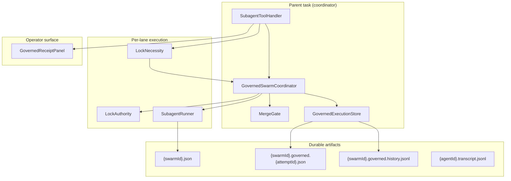
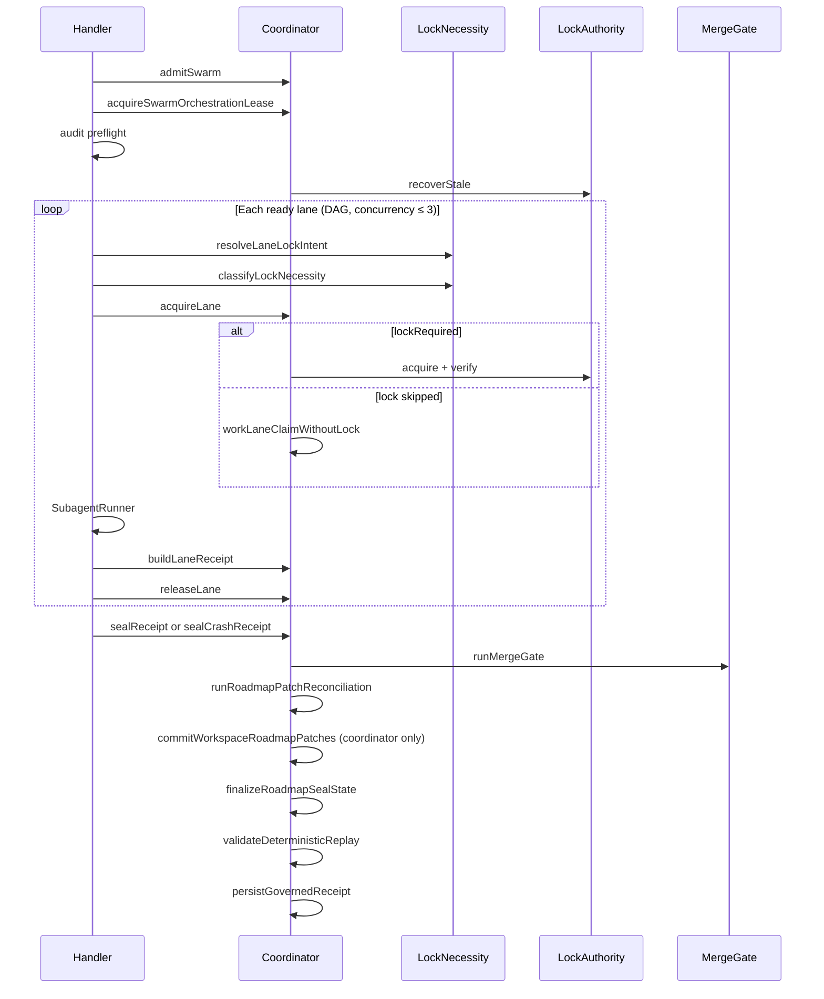
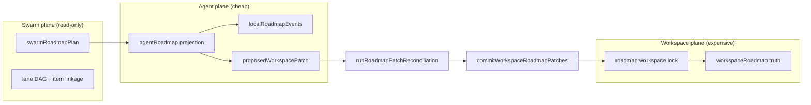

# Governed Subagent Execution

LUMI's governed swarm harness coordinates multi-lane agent execution with **durable receipts**, **conditional mutation locks**, and a **merge gate** that reconciles parallel work before declaring success.

The parent task is **coordinator, reviewer, and receipt presenter** — not a memory sink.

| Doc | Audience | Purpose |
|-----|----------|---------|
| **This page** | Engineers, architects | Architecture, patterns, lifecycle |
| [governed-execution-runbook.md](governed-execution-runbook.md) | Operators, on-call | Symptom → diagnosis → remediation |
| [governed-execution-schema.md](governed-execution-schema.md) | Integrators | Receipt field reference (schema v3) |
| [governed-execution-decisions.md](governed-execution-decisions.md) | Maintainers | ADR-style design decisions |

---

## North-star invariants

> **Locks protect mutation. Receipts preserve truth.**

> **Private roadmap state is cheap. Workspace roadmap truth is expensive. Only the coordinator may spend it.**

| Concern | Mechanism | Non-goal |
|---------|-----------|----------|
| **Who may mutate files?** | Governed lock claim (`LockAuthority`) | Blocking read-only parallelism |
| **Who may mutate workspace roadmap?** | Coordinator `commitWorkspaceRoadmapPatches` after patch reconciliation | Per-lane direct kanban writes |
| **What happened?** | Durable lane + swarm receipts | Chat transcript as source of truth |
| **Is it safe to merge?** | `MergeGate` optimistic reconciliation | Silent success on partial evidence |
| **What may change workspace roadmap?** | Evidence-backed `proposedWorkspacePatch` → `runRoadmapPatchReconciliation` | `localRoadmapEvents` smuggling authoritative state |

Non-mutating lanes (`read_only`, `audit_only`, …) emit full receipts with `lockRequired: false` — replayable and visible without ownership pressure.

---

## Industry pattern mapping

The harness composes familiar distributed-systems primitives. Names below match how practitioners discuss them; implementation is in-process + SQLite + filesystem (not a separate consensus service).

| Pattern | Where it appears | Familiar reference |
|---------|------------------|-------------------|
| **Lease / TTL lock** | In-process claim `expiresAt` (default 600s); file lock stale recovery | Chubby / etcd lease |
| **Fencing token** | Monotonic `fencingToken` + broccoli fence file; release/verify require match | Kleppmann — *Designing Data-Intensive Applications* |
| **Optimistic concurrency** | Execute in parallel → `runMergeGate` reconciles write sets before commit | OCC / merge-before-commit |
| **Saga (lite)** | Acquire → execute → release → seal; unreleased claims block merge | Microservices sagas |
| **Admission control** | Roadmap `scheduleAdmission` at swarm admit (+ per-lane lease at acquire) | API rate limiting / backpressure |
| **Append-only audit log** | `claimHistory`, `.governed.history.jsonl`, transcript `.jsonl` | Event sourcing |
| **Attempt lineage / idempotency** | `attemptId` + `parentAttemptId`; supersession guard | Workflow run IDs |
| **Read/write set separation** | `readSet` vs `writeSet`; collisions scoped to writes | Transaction isolation (read uncommitted OK across lanes) |
| **Compare-and-swap (file)** | `fs.open(lockPath, 'wx')` exclusive create | Atomic file create |
| **CQRS / projection** | Per-lane `agentRoadmap` + `proposedWorkspacePatch` → coordinator commit | Read model / write model split |

---

## System boundaries



**In scope:** LUMI `use_subagents` path via `SubagentToolHandler` → `GovernedSwarmCoordinator`.

**Partial / separate:** `broccolidb/worker_cli.ts` — file lock only, different resource key format, receipt schema v1. See [Process workers](#process-workers-boundary).

---

## Lifecycle phases

Formal orchestration flow (production handler):

| # | Phase | Entry point | Output |
|---|-------|-------------|--------|
| 1 | **Admit (pressure)** | `admitSwarm` → `scheduleAdmission` | `pressureScore`; `recoverStale(governed-lane:*)` |
| 2 | **Admit (ownership)** | `acquireSwarmOrchestrationLease` | Fail closed before lanes; `orchestrationLease` on receipt |
| 3 | **Audit preflight** | `runGovernedSwarmAuditPreflight` | `auditIntegration.preflightIssues` |
| 4 | **Classify** | `resolveLaneLockIntent` + `classifyLockNecessity` | `lockRequired`, reason, read/write intent |
| 5 | **Schedule** | `buildLaneDependencyMap` + `LaneDAG` | Ready/blocked lanes; DAG-aware pool (≤ 3) |
| 6 | **Acquire** | `acquireLane` | `WorkLaneClaim` with or without `lockClaim`; `agentRoadmap` projection when roadmap enabled |
| 7 | **Execute** | `SubagentRunner.runWithEnvelope` | `SubagentExecutionEnvelope`; per-lane `completion_gate` |
| 8 | **Attribute** | `buildLaneReceipt` + `collectRoadmapLaneArtifacts` | `LaneExecutionReceipt` with projection fields |
| 9 | **Release** | `releaseLane` | Claim cleared (mutation only); DAG `sealed` / `failed` |
| 10 | **Merge** | `runMergeGate` | `MergeGateResult` — file + roadmap audit commit barrier |
| 11 | **Reconcile patches** | `runRoadmapPatchReconciliation` | `patchReconciliation` — quality gate, rebase, conflict merge |
| 12 | **Commit workspace roadmap** | `commitWorkspaceRoadmapPatches` | Coordinator-only under `roadmap:workspace` lock |
| 13 | **Seal** | `sealReceipt` or `sealCrashReceipt` | Receipt v3 + `roadmapLinkage` + `auditIntegration` |
| 14 | **Roadmap completion** | `applyGovernedRoadmapCompletionPolicy` | Advisory default; optional update when policy enabled |



**Seal condition:** `sealed = mergeGate.passed && replay valid && !forceFail`. **Crash condition:** timeout/abort → `sealCrashReceipt` with inferred `crashPhase`; prior sealed success preserved via `shouldUpdateLatestPointer`.

Handler forces `finalSwarmStatus = "failed"` when `!receipt.sealed`.

---

## Four invariants

### 1. One authority for mutation ownership

All mutation claims flow through `LockAuthority` (`src/core/governance/LockAuthority.ts`):

| Implementation | Use |
|----------------|-----|
| `UnifiedLockAuthority` | Production — layered backends (see below) |
| `InMemoryLockAuthority` | Unit tests |

`mem_claim` / `mem_release` use the same authority via `governLock.ts`. Lane locks use `releaseGovernedLock()` (workspace-aware durable release). `mem_release` uses in-process release only.

**Lock-necessity:** only lanes that intend to mutate acquire claims. Classifier runs **before** `acquireLane()`.

### 2. One durable truth surface

| Artifact | Path | Role |
|----------|------|------|
| Swarm envelope | `subagent_executions/{swarmId}.json` | Agent outputs, tool steps, touched files |
| Transcript | `subagent_executions/{swarmId}/agents/{agentId}.transcript.jsonl` | Append-only lane event log |
| Per-attempt receipt | `subagent_executions/{swarmId}.governed.{attemptId}.json` | Immutable governed record (schema v3) |
| History index | `subagent_executions/{swarmId}.governed.history.jsonl` | Append-only attempt lineage |
| Latest pointer | `subagent_executions/{swarmId}.governed.json` | Convenience — **may lag** behind sealed prior attempt |

**Authoritative state:** last `sealed && mergePassed` entry in history, or `loadAuthoritativeGovernedReceipt()`. Latest pointer does not regress over sealed success when a retry fails.

Full field reference: [governed-execution-schema.md](governed-execution-schema.md).

### 3. One merge gate (optimistic reconciliation)

`MergeGate.runMergeGate()` is the commit barrier. Parallel lanes execute optimistically; the gate rejects merge if reconciliation fails.

**Mutation-scoped overlap:** `auditMutationWriteOverlaps` uses `writeSet`, or `touchedFiles` when `lockRequired`. Read-set overlap never violates.

**DAG ordering exemption:** overlapping writes allowed when one lane transitively depends on the other (`LaneDAG` infrastructure — see [Known limitations](#known-limitations)).

### 4. One operator surface

`GovernedReceiptPanel` renders incident class, lane execution modes, lock skipped/required, read/write counts, claim timeline, resource ownership, violations, and **roadmap projection state** (workspace snapshot, swarm plan, per-agent projections, accepted/rejected patches, rebase outcomes, commit status, rejection reasons).

Data path: `GovernedSwarmCoordinator.buildReceiptSummary()` → `DietCodeSaySubagentStatus.governedReceipt`.

---

## Lock necessity model

Intent is declared **before** acquire; attribution is refined **after** execution.

### Execution modes

| Mode | Default lock | Use case |
|------|--------------|----------|
| `read_only` | skipped | Inspection, review, summarization |
| `audit_only` | skipped | Receipt / evidence audit |
| `planning_only` | skipped | Design recommendations |
| `documentation_only` | skipped | Doc drafts (no writes) |
| `diagnostic_only` | skipped | Append-only diagnostic evidence |
| `mutation` | **required** | File edits, durable state changes |

**Resolution order:**

1. Tool param `execution_mode_{N}` (1-based lane index)
2. Tool param `execution_mode`
3. Prompt header `[execution_mode:…]` (line start)
4. Default: **`mutation`** (backward compatible)

### Escalation tags (non-mutating → lock required)

| Tag | Effect |
|-----|--------|
| `[write_set:path1,path2]` | Declares write intent |
| `[declares_writes]` | Escalates |
| `[mutates_roadmap]` | Roadmap state mutation |
| `[mutates_broccoli]` | BroccoliDB durable state (beyond append-only evidence) |
| `[updates_authoritative_receipt]` | Authoritative pointer update |
| `[exclusive_resource:…]` | Exclusive resource access |
| `[read_set:…]` | Read intent only — does **not** escalate |

Classifier: `src/core/task/tools/subagent/LockNecessity.ts`.

### Post-execution write detection

Write tools: `write_to_file`, `edit_file`, `apply_patch`, `search_and_replace`, `insert_content`, `mem_claim`.

`splitReadWriteSets()`:

- Explicit intent sets → used as-is
- Non-mutating + no write tools → `touchedFiles` → read set
- Non-mutating + write tools → write set (merge gate may fail if no lock)
- Mutation → write set

### Lock-skipped lane receipt

```json
{
  "executionMode": "read_only",
  "lockRequired": false,
  "claimId": null,
  "fencingToken": null,
  "lockBackends": [],
  "reasonLockSkipped": "read_only lane — read/audit/plan/diagnostic only; no mutation declared",
  "readSet": ["src/api.ts"]
}
```

No `claimHistory` entry. Lane still appears in `laneReceipts` and incident console.

---

## Roadmap: three planes

The workspace kanban is no longer mutated in parallel by lanes. Roadmap state is split across three planes:



| Plane | Owner | May mutate? | Lock at acquire? |
|-------|-------|-------------|------------------|
| `agentRoadmap` | Lane agent | Yes — private projection | **No** |
| `swarmRoadmap` | Coordinator (plan) | No — linkage only | No |
| `workspaceRoadmap` | Coordinator (commit) | Yes — after reconciliation | `roadmap:workspace` at seal only |

**Do not:** return to shared per-lane workspace roadmap mutation. **Do not:** add extra lock layers for projections. **Do not:** let agents directly mutate `workspaceRoadmap`.

### Legacy merge-audit signals (still enforced)

`RoadmapMergeAudit` and `RoadmapMutation` still classify declared roadmap read/write intent and detect direct tool writes for merge-gate auditing. `requiresRoadmapMutationLock()` always returns `false` — lanes no longer acquire per-lane `roadmap:*` locks at acquire time.

| Signal | Purpose |
|--------|---------|
| `roadmapReadSet` / `roadmapWriteSet` | Declared scope on lane receipt |
| `directWorkspaceRoadmapMutation` | Flag when agent attempted authoritative write without patch |
| `localEventContainmentViolations` | Smuggled mutation language in local events |

Canonical resource keys (coordinator commit only):

| Key | Scope |
|-----|--------|
| `roadmap:workspace` | Global kanban commit under coordinator |
| `roadmap:item:{itemId}` | Item-scoped audit keys (merge audit) |
| `roadmap:lane:{laneId}` | Lane ownership metadata (audit) |
| `roadmap:now` | Now / Doing claims (audit) |
| `roadmap:completion:{taskId}` | Completion state (audit + policy) |

Classifier + tool-step detection: `src/core/task/tools/subagent/RoadmapMutation.ts`.  
Merge audits: `src/core/task/tools/subagent/RoadmapMergeAudit.ts`.

### Prompt tags (roadmap scope)

| Tag | Effect |
|-----|--------|
| `[roadmap_read_set:…]` | Declared roadmap read scope (receipt + merge audit) |
| `[roadmap_write_set:…]` | Declared write intent — audited; does **not** acquire lane lock |
| `[mutates_roadmap]` | Flags direct-mutation risk — must use `propose_patch` instead |
| `[claims_roadmap_now]` / `[mutates_roadmap_now]` | Now-claim signal (audit) |
| `[mutates_roadmap_completion]` | Completion signal — becomes patch proposal |
| `[writes_roadmap_advisory]` | Advisory-only patch signal |

**Invariant:** Parallel lanes may read roadmap and maintain private projections freely. Workspace truth changes only through reconciled patches committed by the coordinator.

---

## Per-agent roadmap projection

Each lane receives a private `agentRoadmap` projection at `acquireLane()`. Agents record progress locally and propose workspace changes via structured patches — never by writing the shared kanban directly.

### Projection lifecycle

1. **Admit** — coordinator captures `workspaceRoadmapSnapshotId` (`rm-snap-{hash}`)
2. **Acquire** — `buildAgentRoadmapProjection()` creates `agentRoadmapId`, `projectedItems`, `roadmapSnapshotId`
3. **Execute** — agent emits `localRoadmapEvents` and/or `proposedWorkspacePatch` via prompt tags or tool attribution
4. **Attribute** — `collectRoadmapLaneArtifacts()` runs local-event containment + patch parsing
5. **Seal** — `runRoadmapPatchReconciliation()` then `commitWorkspaceRoadmapPatches()` (coordinator only)

### Lane receipt fields

| Field | Semantics |
|-------|-----------|
| `agentRoadmapId` | Stable projection ID (`agent-rm:{swarmId}:{index}`) |
| `roadmapSnapshotId` | Workspace snapshot at projection creation |
| `projectedItems` | Item IDs the lane believes it owns |
| `localRoadmapEvents` | Private progress (see allowed types below) |
| `proposedWorkspacePatch` | Structured workspace change proposals |
| `directWorkspaceRoadmapMutation` | `true` if agent bypassed patch model |
| `localEventContainmentViolations` | Rejected smuggled local events |

Swarm-level linkage: `roadmapLinkage.swarmRoadmapPlan`, `roadmapLinkage.agentProjections`, `roadmapLinkage.patchReconciliation`, `roadmapLinkage.workspaceCommit`.

### Local events (allowed)

| Type | Use |
|------|-----|
| `progress_note` | Status narrative |
| `blocked_reason` | Why lane is blocked |
| `evidence_checklist` | Checklist progress |
| `todo_state` | Local todo within projection |
| `completion_confidence` | Confidence score (high values may convert to patch) |
| `dependency_observation` | Read-only observation (mutation language converts/rejects) |

**Local events may not:** move workspace items, mark complete, claim Now, change dependency graph, or overwrite ownership metadata. Mutation-like payloads are **rejected** or **converted** to `proposedWorkspacePatch` by `containLocalRoadmapEvents()`.

### Proposed workspace patches (required fields)

Every non-advisory `proposedWorkspacePatch` must include:

| Field | Required | Notes |
|-------|----------|-------|
| `patchId` | yes | Stable patch identifier |
| `agentRoadmapId` | yes | Links patch to projection |
| `baseWorkspaceSnapshotId` | yes | Snapshot patch was built against |
| `itemId` | yes | Target roadmap item |
| `type` | yes | See patch types below |
| `evidencePointer` | for `mark_complete` / `reopen_item` | Path or evidence ref |
| `rationale` | yes (non-advisory) | Min 8 chars; vague values rejected |
| `confidence` | yes (non-advisory) | ≥ 0.5 |
| `expectedTransition` | yes | `{ from?, to }` state transition |
| `conflictPolicy` | yes | `fail_on_conflict` \| `rebase_if_safe` \| `require_explicit_reopen` |

Patch types: `mark_complete`, `move_lane`, `update_dependency`, `add_blocked_reason`, `attach_evidence`, `update_ownership`, `suggest_follow_up`, `advisory_only`, `reopen_item`.

Validated by `validatePatchQuality()` in `RoadmapPatchQualityGate.ts`. Rejected when vague, unsupported, missing evidence, or targeting unknown items.

### Prompt tags (projection)

```
[local_roadmap:progress_note:TASK-1:implementing auth module]
[local_roadmap:blocked_reason:TASK-1:waiting on API review]
[local_roadmap:evidence_checklist:TASK-1:unit tests|integration tests]
[local_roadmap:completion_confidence:TASK-1:0.85]

[propose_patch:attach_evidence:TASK-1:evidence=tests/auth.test.ts|rationale=tests pass|confidence=0.9|policy=rebase_if_safe]
[propose_patch:mark_complete:TASK-1:evidence=tests/auth.test.ts|rationale=all acceptance criteria met]
[propose_patch:reopen_item:TASK-1:rationale=regression found in prod]
```

### Patch reconciliation (`RoadmapPatchReconciler.ts`)

Runs at seal **after** initial `runMergeGate`, before workspace commit.

| Check | Outcome |
|-------|---------|
| Patch quality gate | Reject vague / incomplete patches |
| Stale snapshot rebase | Safe rebase for `attach_evidence`, `add_blocked_reason`, etc. |
| Stale conflicting patch | `mark_complete` / `move_lane` on stale snapshot → `stale_conflict` |
| Failed lane | Cannot `mark_complete` (non-advisory) |
| Completed item | Requires `reopen_item` patch type |
| Compatible parallel patches | Two `attach_evidence` on same item → merge |
| Conflicting parallel patches | Two `move_lane` on same item → violation |
| Advisory patches | Accepted but not committed to workspace |
| Merge gate failed | Actionable patches rejected |

Output: `patchReconciliation` with `acceptedPatches`, `rejectedPatches`, `rebaseResults`, `staleProjections`, `commitStatus`.

Reconciliation failures are appended to `mergeGate.violations` and block seal.

### Coordinator-only workspace commit (`RoadmapWorkspaceCommit.ts`)

`commitWorkspaceRoadmapPatches()` runs **only** from `GovernedSwarmCoordinator.sealReceipt()`. No lane-level commit path exists.

**Preconditions** (`canCoordinatorCommitWorkspaceRoadmap`):

| Gate | Required |
|------|----------|
| `sealed` | Receipt sealed |
| `mergePassed` | Merge gate passed |
| `integrityValid` | Replay integrity valid |
| `reconciliation.passed` | Patch reconciliation passed |
| Actionable patches | At least one non-advisory patch |
| Completion policy | `advisory_only` blocks `mark_complete` commit |
| `roadmap:workspace` lock | Coordinator acquires exclusive lock |

Commit statuses: `pending` → `committed` \| `blocked` \| `advisory_only` \| `skipped` (roadmap disabled).

### Operator console (projection)

`GovernedReceiptPanel` **Roadmap planes** section shows:

- `workspace snap` — current `workspaceRoadmapSnapshotId`
- `swarm plan` — lane count from `swarmRoadmapPlan`
- `agent projections` — per-lane projection count
- `accepted patches` / `rejected patches` — reconciliation counts
- `rebase {patchId}` — per-patch rebase outcome
- `Rejected patch reasons` — human-readable rejection list
- `commit: {status}` — workspace commit result
- `stale projections` — projections out of sync with workspace

Per-lane row: `patches:N`, `local:N`, truncated `agentRoadmapId`, evidence count.

### Modules

| Module | Role |
|--------|------|
| `roadmapProjection.ts` | Shared types (patches, events, reconciliation) |
| `AgentRoadmapProjection.ts` | Snapshot IDs, projection builder, parsers |
| `RoadmapPatchQualityGate.ts` | Patch field validation |
| `RoadmapLocalEventContainment.ts` | Local event allowlist + smuggling detection |
| `RoadmapPatchReconciler.ts` | Rebase, conflict merge, reconciliation |
| `RoadmapWorkspaceCommit.ts` | Coordinator commit under `roadmap:workspace` |

**Invariant:** Agents own projections. Coordinator owns commits. Roadmap truth is merged, not directly mutated by parallel lanes.

---

## Lock authority stack

`UnifiedLockAuthority.acquire()` layers (fail-closed; partial acquire rolls back):

| Order | Backend | Key | Stale recovery |
|-------|---------|-----|----------------|
| 1 | In-process registry | `inProcess` | `expiresAt` expiry |
| 2 | Roadmap lease | `roadmapLease` | Not in `recoverStale` |
| 3 | SwarmMutex (SQLite) | `swarmMutex` | Not in `recoverStale` |
| 4 | File lock | `fileLock` | 600s via `recoverStaleGovernedFileLocks` |
| 5 | Broccoli fence | `broccoliFence` | 600s via `recoverStaleBroccoliFences` |

**Resource keys:**

| Concept | Format |
|---------|--------|
| Lane ID | `swarm-lane:{swarmId}:{index}` |
| Mutex resource | `governed-lane:{swarmId}:{index}` |
| Roadmap lease | `swarm-lane-{swarmId}-{index}` |

**Filesystem layout:**

```
.broccolidb/governed/locks/{sha256(resourceKey)}.lock
.broccolidb/governed/fencing/{sha256(resourceKey)}.json
```

**Failure reasons** (`LockFailureReason`): `collision`, `split_brain`, `stale_owner`, `owner_mismatch`, `fencing_mismatch`, `missing_fencing_token`, `durable_backend_unavailable`, `ambiguous_roadmap_admission`, `not_held`.

Partial acquire (e.g. file ok, fence failed) rolls back SwarmMutex and records `rejected` in claim history — never silent success.

---

## Merge gate audits

Complete violation catalog: [governed-execution-runbook.md#violation-catalog](governed-execution-runbook.md#violation-catalog).

Summary:

| Category | Examples |
|----------|----------|
| **Mutation safety** | `unsafe mutation overlap`, `mutation lane … missing governed lock`, `non-mutating lane … performed writes without lock` |
| **Evidence** | `missing evidence`, `missing transcript pointer`, `missing tool evidence` |
| **Integrity** | `split-brain lock authority detected`, `duplicate claimId`, `replay checksum mismatch` |
| **Ownership** | `orphaned claims`, `unreleased claims`, `stale leases` (lock-required lanes only) |
| **Roadmap** | `unsafe roadmap mutation overlap`, `roadmap mutation without claim`, `lock-skipped lane … mutated roadmap`, `stale roadmap orchestration lease`, completion integrity, `conflicting workspace patches`, `agent … cannot directly mutate workspace roadmap`, `smuggled authoritative mutation via local event` |
| **Lineage** | `unsealed retry cannot supersede prior sealed receipt` |
| **Status** | `failed lanes`, `unsealed DAG nodes`, lane/envelope status mismatch |

---

## Replay checksum

SHA-256 over a **canonical JSON subset** (not the full receipt):

- `swarmId`, `executionId`, `taskId`, `admission`
- Per-lane: `laneId`, `agentId`, `index`, `status`, `evidenceCount`, sorted `touchedFiles`
- `mergePassed`, `replayArtifactId`, `replayStatus`

**Not hashed:** `claimHistory`, `executionMode`, `lockRequired`, `readSet`, `writeSet`, fencing tokens.

Mismatch indicates receipt or envelope drift after seal — not necessarily lock-state corruption.

---

## Incident classification

`deriveReceiptIncident()` priority (first match wins):

1. `in_progress`
2. `corrupted_receipt`
3. `replay_mismatch`
4. `stale_claim`
5. `unsafe_retry`
6. `sealed_success`
7. `partial_receipt`
8. `merge_blocked`
9. `backend_unavailable`
10. `failed_receipt`

Operator actions per incident: [governed-execution-runbook.md](governed-execution-runbook.md).

---

## Harness author guide

### Read-only parallel review

```
[execution_mode:read_only] [read_set:src/api.ts,src/types.ts]
Review the public API. Do not modify files.
```

### Audit without lock

```
[execution_mode:audit_only]
Inspect subagent_executions/swarm-abc.governed.{attemptId}.json and list merge violations.
```

### Documentation with declared writes (escalates to lock)

```
[execution_mode:documentation_only] [write_set:docs/guide.md]
Update the operator guide.
```

### Default mutation (omit tag)

```
Refactor src/core/handler.ts and add tests.
```

### Roadmap-aware lane with projection

```
[roadmap_item:NOW-42] [depends_on:0]
[local_roadmap:progress_note:NOW-42:refactoring handler]
[propose_patch:attach_evidence:NOW-42:evidence=src/core/handler.test.ts|rationale=unit tests green|confidence=0.9]
Implement handler refactor. Do not write workspace roadmap directly.
```

### Mark complete (requires evidence)

```
[propose_patch:mark_complete:TASK-1:evidence=tests/e2e/auth.spec.ts|rationale=all acceptance criteria verified|confidence=0.95|policy=fail_on_conflict]
```

---

## Process workers (boundary)

`broccolidb/worker_cli.ts` is a **subset** of the full harness:

| Aspect | LUMI coordinator | worker_cli |
|--------|------------------|------------|
| Lock layers | 5-backend stack | File lock only |
| Resource key | `governed-lane:{swarmId}:{index}` | `governed-lane:{swarmId}:{laneId}` |
| Fencing | Authority monotonic token | `Date.now()` |
| Receipt | `GovernedSwarmReceipt` v3 | v1 at `.broccolidb/governed/receipts/{workerId}.json` |

Shared: `src/shared/governance/fileLock.ts`, heartbeat `<pulse>` on stdout.

---

## Known limitations

Honest integration gaps (as of schema v3):

| Gap | Impact |
|-----|--------|
| **Orchestration lease** | Wired via `acquireSwarmOrchestrationLease` after pressure admission; released on seal/crash |
| **Roadmap completion mutation** | Default `advisory_only`; patch commit + optional `roadmap_completion_update=enabled` on sealed success |
| **Crash seal path** | `sealCrashReceipt()` invoked on handler timeout/abort with inferred crash phase |
| **Roadmap recoverStale** | `recoverStale` only clears in-process, file, fence — not roadmap lease pruning |
| **Replay checksum scope** | Lock-necessity and projection fields not in canonical hash |
| **worker_cli parity** | Separate receipt schema and resource key format |
| **Patch commit scope** | Coordinator applies subset of patch types to runtime state; complex dependency/ownership graphs logged to `decision_log` |

These are tracked for future hardening; operator runbook documents workarounds.

---

## Roadmap and audit integration

Governed swarms coordinate with the **roadmap** (scheduling + linkage) and **workspace audit** (completion gates) through explicit bridges recorded on `GovernedSwarmReceipt`. **MergeGate is the commit barrier only** — not the workspace audit system.

### Expected lifecycle

```
roadmap plan → audit preflight → admit swarm → classify lane intent → acquire projections
  → execute lanes (local events + patch proposals) → audit evidence (per-lane completion_gate)
  → merge gate → patch reconciliation → coordinator workspace commit → audit final receipt → roadmap completion advisory
```

### Definition of done (where things happen)

| Question | Answer |
|----------|--------|
| Where does roadmap planning enter? | Parent agent roadmap / Now items; swarm admits via `RoadmapService.scheduleAdmission` in `GovernedSwarmCoordinator.admitSwarm` |
| Where does roadmap state update? | Via `commitWorkspaceRoadmapPatches` when reconciliation passes + coordinator holds `roadmap:workspace` lock; legacy `roadmap_completion_update=enabled` policy still applies to completion advisory |
| Which roadmap item owns each lane? | `laneReceipts[].roadmapItemId` from `[roadmap_item:ID]` prompt tag or `roadmap_item_N` param; lease id in `roadmapLeaseTaskId` |
| Which audit runs before execution? | `evaluateGatePreflightReadinessAsync` via `runGovernedSwarmAuditPreflight` in `SubagentToolHandler` — recorded in `auditIntegration.preflightIssues` |
| Which audit runs after execution? | Per-lane: `runCompletionGateFlow` at `attempt_completion` in `SubagentRunner`. Swarm seal: `buildGovernedAuditIntegration` + replay checksum in `sealReceipt` |
| Is MergeGate the audit system? | **No.** `mergeGateRole: "commit_barrier"` — reconciles parallel writes, locks, transcripts. Workspace audit is `completionGatePipeline`. |
| Does BroccoliDB store audit evidence? | **No for governed receipts.** Artifacts under `subagent_executions/`; `auditIntegration.storageBoundary` documents this. BroccoliDB backs lock fencing / substrate replay, not CAS audit_events for swarms. |

### Roadmap surfaces wired today

| Surface | Module | Receipt field |
|---------|--------|---------------|
| Swarm pressure admission | `GovernedSwarmCoordinator.admitSwarm` | `admission.pressureScore`, `roadmapLinkage.pressureScore` |
| Swarm execution ownership | `acquireSwarmOrchestrationLease` after admit | `roadmapLinkage.orchestrationLease` |
| Per-lane lease on lock | `LockAuthority.acquire` + `scheduleAdmission` | `laneReceipts[].roadmapLeaseTaskId`, `roadmapLinkage.laneRoadmapItems` |
| Lane dependency ordering | `buildLaneDependencyMap` + `LaneDAG` + DAG-aware handler pool | `laneDag`, `laneReceipts[].dagState` |
| Roadmap item linkage | `[roadmap_item:…]` / params | `laneReceipts[].roadmapItemId` |
| Completion advisory (dry-run) | `captureRoadmapLinkage` at seal | `roadmapLinkage.completionAdvisory` |
| Completion mutation policy | `applyGovernedRoadmapCompletionPolicy` | `roadmapLinkage.completionPolicy`, `completionOutcome` |
| Per-lane projection | `buildAgentRoadmapProjection` at acquire | `laneReceipts[].agentRoadmapId`, `roadmapLinkage.agentProjections` |
| Local events + patches | `collectRoadmapLaneArtifacts` | `laneReceipts[].localRoadmapEvents`, `proposedWorkspacePatch` |
| Patch reconciliation | `runRoadmapPatchReconciliation` at seal | `roadmapLinkage.patchReconciliation` |
| Workspace commit | `commitWorkspaceRoadmapPatches` | `roadmapLinkage.workspaceCommit` |
| Swarm roadmap plan | `buildSwarmRoadmapPlan` | `roadmapLinkage.swarmRoadmapPlan` |
| Workspace snapshot | `computeRoadmapSnapshotId` | `roadmapLinkage.workspaceRoadmapSnapshotId` |

### Audit surfaces wired today

| Surface | Module | Receipt field |
|---------|--------|---------------|
| Preflight dry-run | `GovernedIntegration.runGovernedSwarmAuditPreflight` | `auditIntegration.preflightIssues`, `workspaceAuditAtPreflight` |
| Per-lane completion audit | `SubagentRunner` → `validateSubagentCompletionGates` | `auditIntegration.perLaneCompletionAudit`, `laneReceipts[].completionAuditPhase` |
| Merge / commit barrier | `MergeGate.runMergeGate` | `mergeGate`, `auditIntegration.mergeGateRole` |
| False-positive lock audit | `auditFalsePositiveLocks` | `auditIntegration.falsePositiveLockAudit` |
| Receipt integrity | `ReplayValidator` in `sealReceipt` | `auditIntegration.receiptIntegrityValidated`, `integrity` |

### Prompt tags for roadmap linkage

```
[depends_on:0]           — lane waits until lane 0 is sealed
[roadmap_item:NOW-42]    — links lane to roadmap Now item (receipt + projection)
[local_roadmap:progress_note:NOW-42:…]  — private agent event
[propose_patch:attach_evidence:NOW-42:evidence=…|rationale=…]  — workspace patch proposal
```

Param equivalents: `depends_on_2`, `roadmap_item_1`.

Optional completion mutation: `roadmap_completion_update=enabled` (requires sealed success + patch commit or policy path).

### Final invariant

| Plane | Owns |
|-------|------|
| Agent roadmap | Private projection — local events, patch proposals |
| Swarm roadmap | Plan linkage — DAG, lane items, snapshot at admit |
| Workspace roadmap | Authoritative kanban — coordinator commit only |
| Roadmap service | Admission (pressure + orchestration lease) |
| Audit | Verification (`completionGatePipeline`, receipt `auditIntegration`) |
| MergeGate | File + roadmap audit commit barrier |
| BroccoliDB | Fencing / replay substrate only |
| Receipts | Truth (`subagent_executions/` governed artifacts) |

---

## Code entry points

| Module | Path | Role |
|--------|------|------|
| Types + helpers | `src/shared/subagent/governedExecution.ts` | Schema v3, incident derivation, retry safety |
| Projection types | `src/shared/subagent/roadmapProjection.ts` | Patches, events, reconciliation, commit result |
| Lock authority | `src/core/governance/LockAuthority.ts` | Unified acquire/release/verify/recover |
| Public lock API | `src/core/governance/governLock.ts` | `mem_claim` integration |
| Fencing | `src/core/governance/BroccoliFencingAdapter.ts` | Durable fence files |
| Coordinator | `src/core/task/tools/subagent/GovernedSwarmCoordinator.ts` | Lifecycle orchestration |
| Integration bridges | `src/core/task/tools/subagent/GovernedIntegration.ts` | Roadmap linkage + audit preflight/post-seal |
| Lock necessity | `src/core/task/tools/subagent/LockNecessity.ts` | Classifier + read/write split + prompt tags |
| Roadmap mutation | `src/core/task/tools/subagent/RoadmapMutation.ts` | Resource keys + write classifier + direct-mutation detection |
| Roadmap merge audit | `src/core/task/tools/subagent/RoadmapMergeAudit.ts` | Serialized roadmap overlap + completion integrity |
| Agent projection | `src/core/task/tools/subagent/AgentRoadmapProjection.ts` | Snapshot IDs, projection builder, parsers |
| Patch quality gate | `src/core/task/tools/subagent/RoadmapPatchQualityGate.ts` | Required patch field validation |
| Local event containment | `src/core/task/tools/subagent/RoadmapLocalEventContainment.ts` | Smuggling detection + conversion |
| Patch reconciler | `src/core/task/tools/subagent/RoadmapPatchReconciler.ts` | Rebase, conflict merge, reconciliation |
| Workspace commit | `src/core/task/tools/subagent/RoadmapWorkspaceCommit.ts` | Coordinator-only `roadmap:workspace` commit |
| Merge gate | `src/core/task/tools/subagent/MergeGate.ts` | Commit barrier |
| Replay | `src/core/task/tools/subagent/ReplayValidator.ts` | Deterministic checksum |
| Store | `src/core/task/tools/subagent/GovernedExecutionStore.ts` | Persist + authoritative load |
| Handler | `src/core/task/tools/handlers/SubagentToolHandler.ts` | `use_subagents` integration |
| UI | `webview-ui/.../GovernedReceiptPanel.tsx` | Incident console |

---

## Test contract matrix

| File | Contracts |
|------|-----------|
| `governedExecutionLockNecessity.test.ts` | Classifier, acquire skip/acquire, read overlap OK, mutation without lock fails, lock-skipped no orphan |
| `governedExecutionHardening.test.ts` | LockAuthority, DAG overlap ordering, file lock, worker_cli smoke |
| `governedExecutionReliability.test.ts` | Crash phases, fence fail-closed, retry lineage, `isRetrySafe`, checksum stability |
| `governedExecutionIntegration.test.ts` | Roadmap DAG, pressure score, audit boundaries, receipt linkage fields |
| `governedExecutionClosure.test.ts` | Orchestration lease, completion policy, crash seal, broccoli boundary |
| `governedExecutionRoadmapProjection.test.ts` | Projection model, reconciliation, coordinator commit |
| `governedExecutionRoadmapProjectionHardening.test.ts` | Quality gate, containment, rebase, commit guards |
| `governedExecutionRoadmapSerialization.test.ts` | Legacy merge-audit + projection acquire semantics |
| `GovernedReceiptPanel.test.tsx` | Incident console, execution mode badges, projection patch state |

---

## Related

- [Operator runbook](governed-execution-runbook.md)
- [Receipt schema](governed-execution-schema.md)
- [Design decisions](governed-execution-decisions.md)
- [Working with subagents](WORKING_WITH_SUBAGENTS.md)
- [Execution envelope migration](execution-envelope-migration.md)
