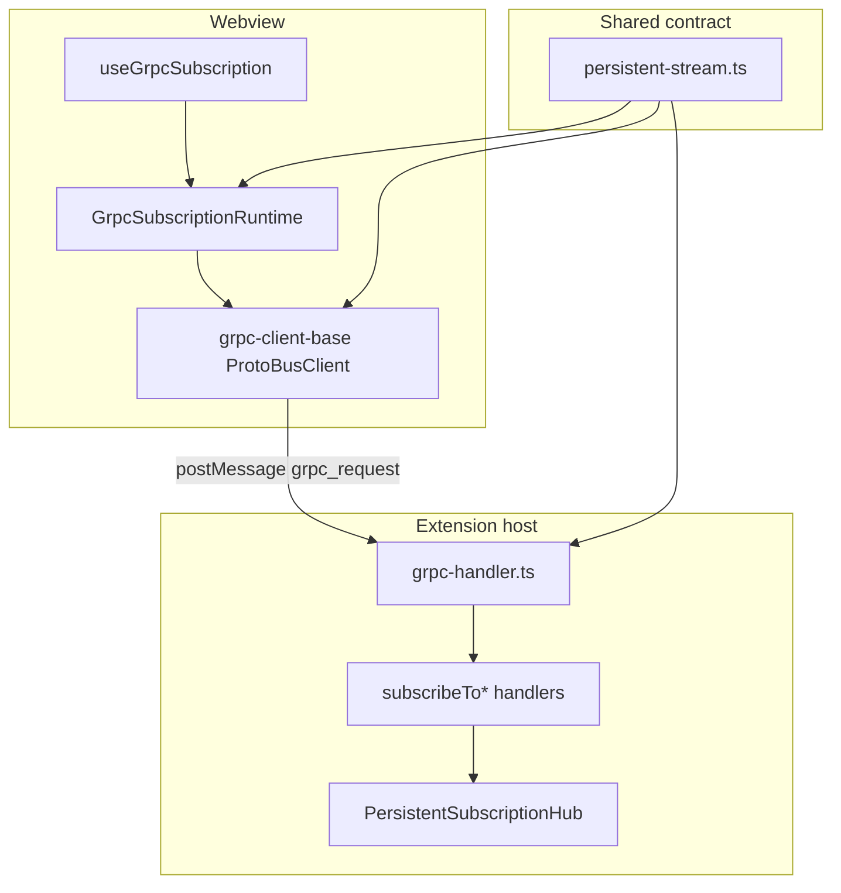

# gRPC subscription persistence

This document explains a production bug that broke long-lived webview subscriptions, the root cause, and the architecture that replaced ad-hoc stream handling.

## Symptoms (what users and developers saw)

After the sidebar had been open for roughly **10 minutes**, the webview console filled with errors like:

```
Timed out waiting for dietcode.UiService.subscribeToMcpButtonClicked stream update.
Timed out waiting for dietcode.UiService.subscribeToChatButtonClicked stream update.
Timed out waiting for dietcode.UiService.subscribeToSettingsButtonClicked stream update.
… (many similar lines for other subscribeTo* methods)
```

Typical pattern:

- **State subscription still worked** — `subscribeToState` sends an initial snapshot as soon as the client connects, which resets the idle timer.
- **Event-only subscriptions failed together** — button-click streams, relinquish-control, partial messages, and model-catalog streams often sit idle until something happens; they never received a “first message” to reset the timer.
- **UI felt flaky after idle** — navigation buttons, MCP panel triggers, and other event-driven flows stopped responding until reload.

## Root cause

Two separate problems compounded:

### 1. Idle timeout applied to the wrong stream class

`ProtoBusClient.makeStreamingRequest` in `webview-ui/src/services/grpc-client-base.ts` added a **10-minute idle timeout** (`DEFAULT_STREAM_IDLE_TIMEOUT_MS`) on **every** streaming RPC.

That semantics is correct for **finite** streams (e.g. `triggerAudit`) where silence means the server stalled or the stream is dead.

It is **wrong** for **persistent subscriptions** (`subscribeToState`, `subscribeToMcpButtonClicked`, `subscribeToPartialMessage`, etc.). Those RPCs are meant to stay open indefinitely and emit only when an event occurs. Silence is normal, not failure.

Because the idle timer started at connect time and only reset on incoming messages, any subscription that did not immediately push data was guaranteed to error out after ~10 minutes.

### 2. Scattered subscription lifecycle on both sides

Before the hardening pass:

| Layer | Problem |
|-------|---------|
| **Webview** | Each `useEffect` owned its own stream, manual cleanup refs, duplicated reconnect logic, no shared health state. |
| **Extension** | Each `subscribeTo*` handler kept a private `Set<StreamingResponseHandler>` and hand-rolled fanout loops with copy-paste error handling. |
| **Registry** | Re-registering the same `requestId` could overwrite cleanup without running the previous handler’s teardown. |

There was no single contract for “this method is persistent” vs “this method should time out when idle.”

## Fix overview



### Shared contract — `src/shared/grpc/persistent-stream.ts`

Single source of truth for persistence semantics (do not duplicate string matching elsewhere):

| Export | Role |
|--------|------|
| `isPersistentStreamingMethod()` | `true` for `subscribe*` / `*subscription*` method names |
| `shouldApplyStreamIdleTimeout()` | `false` for persistent methods; `true` for finite streams |
| `DEFAULT_STREAM_IDLE_TIMEOUT_MS` | 10 minutes — **finite streams only** |
| `DEFAULT_RECONNECT_POLICY` | Backoff + jitter for client reconnect |
| `DEFAULT_STALE_AFTER_MS` | Optional watchdog for data streams that should heartbeat |

`grpc-client-base.ts` calls `shouldApplyStreamIdleTimeout(methodName)` before arming the idle timer.

### Client runtime — webview

| File | Role |
|------|------|
| `webview-ui/src/services/grpc-subscription-runtime.ts` | `GrpcSubscriptionRuntime` — one transport per stable key, ref-counted consumers, exponential backoff, stale heartbeat, visibility/focus recovery |
| `webview-ui/src/hooks/useGrpcSubscription.ts` | Declarative hook; call sites describe key, subscribe fn, and handlers only |
| `webview-ui/src/context/useExtensionGrpcSubscriptions.ts` | Central list of all extension-side subscriptions |
| `webview-ui/src/services/grpc-subscription-manager.ts` | Deprecated re-export shim only |

Runtime invariants (covered by `grpc-subscription-runtime.test.ts`):

- One active transport per subscription key
- Ref count cannot go negative; teardown is idempotent
- Reconnect cannot race with unsubscribe (generation tokens)
- Stale watchdog and visibility restore cannot revive disposed streams or duplicate healthy connections
- Bounded retry stops after final unsubscribe; failed state recovers on a fresh acquire

### Server hubs — extension

| File | Role |
|------|------|
| `src/core/controller/persistent-subscription-hub.ts` | `PersistentSubscriptionHub` — register, broadcast, prune dead subscribers |
| `src/core/controller/grpc-request-registry.ts` | Chained cleanup when the same `requestId` is re-registered |
| `src/core/controller/index.ts` | Calls `disposeAllPersistentSubscriptionHubs()` on shutdown |

All persistent `subscribeTo*` handlers now use a module-level hub instead of private `Set` fanout, including:

- State, partial messages, MCP servers / marketplace
- OpenRouter and LiteLLM model catalogs
- UI button clicks, show webview, add-to-input, relinquish control
- Checkpoints (keyed hub per `cwdHash`)

CLI-only partial-message callbacks remain a separate `Set` — they are not gRPC streams.

## Stream classes (maintainer reference)

| Class | Examples | Idle timeout | Client runtime |
|-------|----------|--------------|----------------|
| **Persistent subscription** | `subscribeToState`, `subscribeToMcpButtonClicked`, `subscribeToPartialMessage` | No | `GrpcSubscriptionRuntime` + hub |
| **Finite / job stream** | `triggerAudit`, one-shot streaming RPCs | Yes (10 min) | Direct `makeStreamingRequest` |
| **Unary** | `updateSettings`, `getLatestState` | N/A (60 s response timeout) | `makeUnaryRequest` |

When adding a new streaming RPC, decide which class it belongs to **first**. If it is persistent, the method name should start with `subscribe` (or include `subscription`) so `isPersistentStreamingMethod` classifies it automatically, or extend the contract explicitly with a comment and test.

## Adding a new persistent subscription

1. **Proto** — Add `rpc subscribeToFoo(…) returns (stream …);` in the appropriate `proto/dietcode/*.proto` file; run `npm run protos`.
2. **Server** — Create `src/core/controller/.../subscribeToFoo.ts`:
   - Module-level `const hub = new PersistentSubscriptionHub<Foo>("foo")`
   - `subscribeToFoo` → `hub.register(…)`
   - `sendFooEvent` → `hub.broadcast(…)`
3. **Webview** — Add one `useGrpcSubscription` entry in `useExtensionGrpcSubscriptions.ts` (or a feature hook that uses `useGrpcSubscription`).
4. **Tests** — Hub fanout: `persistent-subscription-hub.test.ts`; contract: `persistent-stream.test.ts`; client invariants: `grpc-subscription-runtime.test.ts`.

Do **not** reintroduce private `Set<StreamingResponseHandler>` fanout in new handlers.

## Related compile incident (separate from subscriptions)

While validating the subscription work, `npm run compile` also failed because commit `0d19742` accidentally removed most of `API_HANDLER_SETTINGS_FIELDS` from `src/shared/storage/state-keys.ts` during an unrelated Biome lint pass. That broke types across model refresh and settings code; it was restored from the pre-regression definition and protos were regenerated. That issue did **not** cause the subscription timeouts, but it blocked full builds until fixed.

## Verification

```bash
npm run compile
cd webview-ui && npm test -- --run
npx cross-env TS_NODE_PROJECT=./tsconfig.unit-test.json mocha \
  src/core/controller/persistent-subscription-hub.test.ts \
  src/shared/grpc/__tests__/persistent-stream.test.ts
cd webview-ui && npx vitest run src/services/__tests__/grpc-subscription-runtime.test.ts
```

## Related docs

- [System communication](SYSTEM_COMMUNICATION.md) — webview ↔ extension IPC overview
- [Architecture (current)](architecture/current.md) — high-level request flow
- [Code-to-doc map](CODE_TO_DOC_MAP.md) — source paths for subscription files
