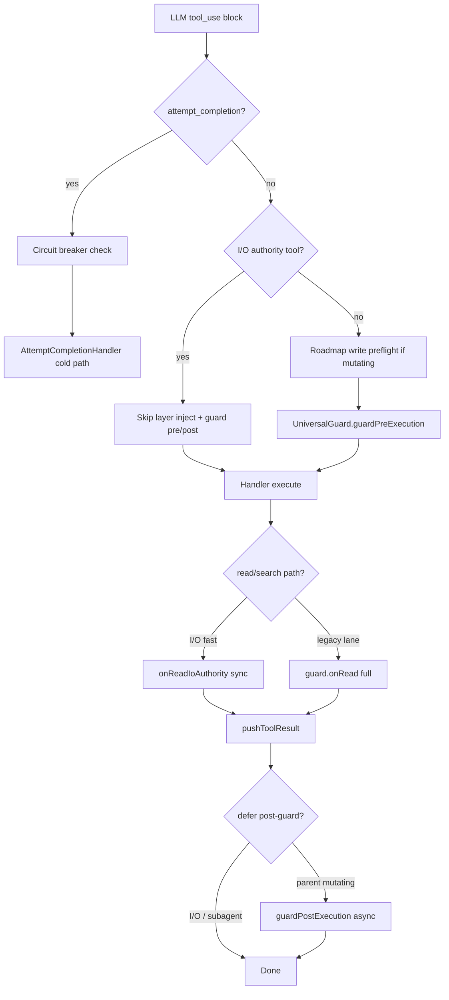
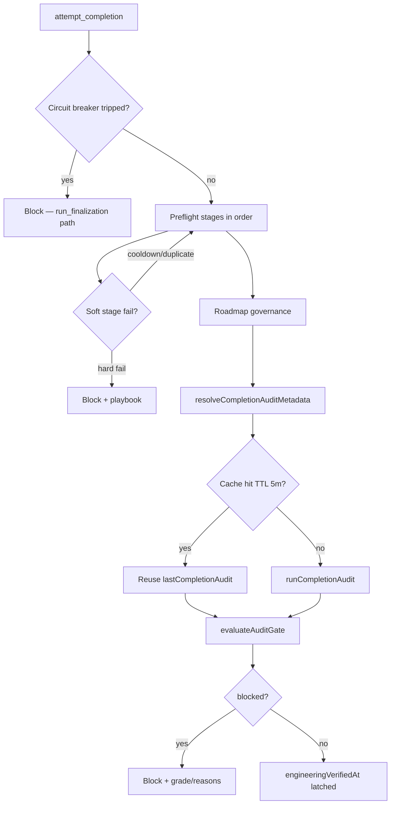

<!-- [LAYER: INFRASTRUCTURE] -->


# Parent-thread execution authority

This document describes the **throughput-oriented execution model** for the parent main-thread agent loop and subagent I/O lanes. The goal is high-throughput tool execution without weakening authoritative safety at `attempt_completion`.

**Canonical code:** `src/core/task/tools/executionAuthority.ts`  
**Parent entry:** `src/core/task/ToolExecutor.ts`  
**Completion gates:** `src/core/task/tools/completionGatePipeline.ts`

Related:

| Doc | Topic |
|-----|--------|
| [Completion gate lifecycle](completion-gate-lifecycle-migration.md) | Engineering vs finalization lanes |
| [Governed execution runbook](governed-execution-runbook.md) | Subagent I/O bulkhead and lane dispatch |
| [Governed execution decisions § ADR-013/014](governed-execution-decisions.md) | Flow control and I/O authority ADRs |
| [Architectural enforcement](ARCHITECTURAL_ENFORCEMENT.md) | UniversalGuard overview |

**Quick reference**

| Question | Answer |
|----------|--------|
| Which tools skip guard on the parent thread? | `read_file`, `list_files`, `search_files`, `list_code_definition_names`, `diagnose_stability` |
| What still hard-blocks completion? | Preflight stages + audit gate at `attempt_completion` only |
| Where is lane audit enforced? | Parent seal barrier (10s bound), not per-lane |
| Default audit threshold | 50 (`auditCompletionGateThreshold`); intent-adjusted for FIX/TEST/DELETE |
| Circuit breaker | 10 consecutive gate blocks → `attempt_completion` forbidden |

---

## Problem

Early implementations ran **shift-left** enforcement on every tool call:

- Full `UniversalGuard.guardPreExecution` / `guardPostExecution` on reads and searches
- Blocking advisory audits during act-mode and command output
- Per-read `SpiderEngine.loadRegistry()` rebuilds in handlers
- Duplicate guard preflight in validators and handlers
- Synchronous scratchpad reads, GC sweeps, and roadmap journals on the hot path

That model is correct for safety but **starves throughput** when the agent performs many read/list/search operations between writes.

---

## What blocked throughput (before vs after)

This section documents **why agent work felt slow or stuck** — distinct from **user-facing completion gates** that intentionally block `attempt_completion`.

### Inner-loop blockers removed (throughput failures)

These patterns **blocked or delayed every tool call** before the execution-authority refactor. They did not produce helpful operator errors — they silently consumed main-thread time.

| Symptom | Root cause | Why it blocked work | Fix |
|---------|------------|---------------------|-----|
| Read-heavy turns took seconds | Full `guardPreExecution` / `guardPostExecution` on every `read_file` | Spider graph + scratchpad + joy-zoning ran per read | I/O authority bypass in `ToolExecutor` |
| Same guard cost twice | `ToolValidator.checkArchitecturalPurity` **and** `ToolExecutor` both called `guardPreExecution` | Duplicate preflight on mutating tools | Validator no longer calls guard |
| Every read rebuilt Spider | `ReadFileToolHandler` called `SpiderEngine.loadRegistry()` | Full registry parse from disk per file | `appendSessionStabilityContext()` reuses warm session graph |
| List/search ran before approval | Handlers executed I/O, then checked approval | Wasted disk/network on denied tools | Approval → PreToolUse → execute ordering |
| Act/command audits stalled turns | `runCompletionAudit` awaited inline on `act_mode_respond` / command output | Audit is seconds; blocked next model turn | Fire-and-forget advisory audits + cache |
| Post-edit work blocked result | `guardPostExecution`, `alignTag`, roadmap journal ran before `pushToolResult` | Model waited for GC, healer, journal | Shift-right after `pushToolResult` |
| Subagent lanes serialized on audit | Each lane ran full `runCompletionGateFlow` + blocking `auditTask` | N lanes × audit latency | Lane sync preflight only; audit at seal barrier |
| Read lanes starved pool | Mutation lanes consumed all 3 execution slots | No bulkhead for I/O authority lanes | `computeFastIoReservedSlots` (ADR-013) |
| Preflight misclassified timeouts | Lane audit timeout treated as hard block | False-positive lane failure | Audit removed from lane path; seal join only |

### Intentional blocks retained (safety failures)

These **should** block — they indicate real policy or engineering failures:

| Layer | Failure | User/agent sees |
|-------|---------|-----------------|
| `attempt_completion` | Audit score / violations | Grade, threshold, reason codes, remediation |
| `attempt_completion` | Empty/brief/tone/unfinished result | `Completion rejected: …` preflight message |
| `attempt_completion` | Focus chain incomplete | Item count mismatch |
| `attempt_completion` | Roadmap governance (fail-closed) | Roadmap remediation steps |
| `attempt_completion` | 10 consecutive gate blocks | Circuit breaker → `run_finalization` path |
| Mutating tools | Plan mode write to non-scratchpad | `PLAN MODE RESTRICTION` |
| Mutating tools | Disk &lt; 500MB | `PHYSICAL BLOCKADE [CRITICAL]` |
| Mutating tools | Stale SEARCH block in edit | `PRE-EMPTIVE MATCH FAILURE` |
| Mutating tools | Sibling stream collision | `FLUID COORDINATION ERROR` |
| Mutating tools | Roadmap write preflight | Roadmap native bridge block message |
| User flow | Prior tool manually denied | `Skipping tool due to user rejecting…` |

---

## Three-tier model

| Tier | When | Blocks tool result? | Examples |
|------|------|---------------------|----------|
| **Hot** | Every parent I/O tool call | Only cheap safety (ignore rules, missing params) | I/O guard bypass, sync `onReadIoAuthority`, approval-before-I/O |
| **Warm** | After result is pushed / background | No | Deferred audits, post-guard GC, file-context tracking, roadmap journal |
| **Cold** | `attempt_completion` / swarm seal | Yes (authoritative) | Completion spine: snapshot → decision engine → action contract → action guard. The agent receives a command, not prose. See [Completion lifecycle decision engine](completion-lifecycle-decision-engine.md). |

Industry patterns mirrored:

| Pattern | Implementation |
|---------|----------------|
| **Shift-right** | Audits and heavy guard work run after the tool result is visible to the model |
| **Cache-aside** | Completion/advisory audit TTL, scratchpad mtime cache, JoyRide search cache, env lease |
| **Bulkhead** | `computeFastIoReservedSlots` on subagent `AuthorityAwareExecutionPool` |
| **Circuit breaker** | `MAX_COMPLETION_GATE_BLOCK_COUNT` on completion retries |
| **Fire-and-forget observability** | Drift detection, focus chain, forensic hints, mutation tracking |

### Parent tool turn (hot path)



### Parent `attempt_completion` (cold path)



---

## I/O authority tools

Defined in `executionAuthority.ts` as `IO_AUTHORITY_TOOLS`:

| Tool | Enum |
|------|------|
| `read_file` | `FILE_READ` |
| `list_files` | `LIST_FILES` |
| `search_files` | `SEARCH` |
| `list_code_definition_names` | `LIST_CODE_DEF` |
| `diagnose_stability` | `STABILITY_DIAGNOSE` |

### Parent fast-path rules

| Helper | Behavior |
|--------|----------|
| `shouldBypassGuardForParentIoTool()` | Skip `guardPreExecution` / `guardPostExecution` in `ToolExecutor` |
| `shouldUseIoAuthorityReadFastPath()` | Sync `onReadIoAuthority()` — substrate tracking only, no advisory header bloat |
| `shouldSkipPreToolUseForParentIoTool()` | Skip PreToolUse hook (centralized in `ToolHookUtils`) |
| `shouldSkipLayerInjectionForParentIoTool()` | Skip joy-zoning `getLayer()` on I/O tools |
| `shouldDeferParentGuardPostExecution()` | Post-guard GC/merkle runs after `pushToolResult` on mutating tools |
| `appendSessionStabilityContext()` | Read context from warm `UniversalGuard` spider graph — **never** `loadRegistry()` |
| `resolveSessionSpiderEngine()` | Reuse session spider for `project_map` and similar tools |

### Subagent lane parity

| Helper | Behavior |
|--------|----------|
| `shouldBypassGuardForLaneIoTool()` | I/O bypass on non-mutating lanes only (`read_only`, `audit_only`, …) |
| `computeFastIoReservedSlots()` | Bulkhead reservation when read lanes wait (`ParentAgentFlowControl`) |

### Tools **not** on I/O authority

These tools always run full guard, hooks (unless subagent rules say otherwise), and cold-path checks where applicable:

| Tool category | Examples | Why excluded |
|---------------|----------|--------------|
| Mutations | `write_to_file`, `apply_patch`, `insert_content` | Joy-zoning, staleness, collision, post-healer |
| Execution | `execute_command`, `browser_action` | Side effects, verification advisories |
| Network / MCP | `web_search`, `mcp_use`, `fetch_url` | External I/O, not local substrate |
| Planning / completion | `plan_mode_respond`, `attempt_completion`, `run_finalization` | Mode and lifecycle gates |
| Memory / coordination | `use_subagents`, cognitive memory tools | Parent authority boundary |
| Maps (cold load) | `project_map` | May cold `loadRegistry()` if session spider empty |

`project_map` uses `resolveSessionSpiderEngine()` first but is **not** in `IO_AUTHORITY_TOOLS` — it can still pay registry cost on first use.

---

## Parent `ToolExecutor` changes

| Change | File / area |
|--------|-------------|
| I/O guard bypass | `handleCompleteBlock` — `parentIoFastPath` |
| Deferred post-guard | `guardPostExecution` after `pushToolResult` on act-mode mutating tools |
| Per-turn `TaskConfig` cache | `asToolConfig()` + `refreshCachedToolConfig()` |
| Browser close only when active | `BrowserSession.hasActiveSession()` + `shouldCloseBrowserBetweenTools()` |
| Fire-and-forget focus chain | `updateFCListFromToolResponse` when `task_progress` present |
| Deferred roadmap journal | `afterRoadmapWrite` async; `appendRoadmapWriteHint` stays sync |
| No duplicate layer inject on I/O | `shouldSkipLayerInjectionForParentIoTool()` |

---

## Tool handler changes

### Reads and I/O

| Handler | Change |
|---------|--------|
| `ReadFileToolHandler` | Removed per-read `SpiderEngine.loadRegistry()`; uses `appendSessionStabilityContext()`; fire-and-forget `trackFileContext` |
| `ListFilesToolHandler` | Approval → PreToolUse → execute (no wasted I/O on manual deny) |
| `SearchFilesToolHandler` | Same ordering; JoyRide cache hits skip search entirely |
| `ListCodeDefinitionNamesToolHandler` | Same approval-before-work ordering |
| `ProjectMapHandler` | `resolveSessionSpiderEngine()` before cold `loadRegistry()` |

### Writes

| Handler | Change |
|---------|--------|
| `WriteToFileToolHandler` | Removed duplicate JoyZoning block (scrutinize/diagnose/alignTag); deferred scratchpad `StabilityScribe` audit |
| `ToolValidator` | `checkArchitecturalPurity()` no longer calls `guardPreExecution` (ToolExecutor owns it once) |

### Act-mode and plan

| Handler | Change |
|---------|--------|
| `ActModeRespondHandler` | Advisory audit every 5 calls or TODO/FIXME heuristic; **fire-and-forget** |
| `PlanModeRespondHandler` | Plan UI first; `runCompletionAudit` deferred → `lastPlanAuditMetadata` |
| `ExecuteCommandToolHandler` | Verification fail-fast on output; `deferCommandOutputAdvisoryAudit()` async |

### Completion

| Handler | Change |
|---------|--------|
| `AttemptCompletionHandler` | Calls `CompletionActionGuard` as first gate; delegates eligibility to `CompletionLifecycleDecisionEngine`; forensic compliance async; proactive guidance async; double-check uses cached advisory |
| `RunFinalizationToolHandler` | Calls `CompletionActionGuard` as first gate; delegates eligibility to engine |
| `completionGatePipeline` | Soft preflight for `cooldown`, `duplicate`, `workspace_progress`; audit cache-aside (strict AND validity); progressive critical-only gate |
| `CompletionLifecycleDecisionEngine` | **Single deterministic authority** — receives immutable snapshot, returns one canonical decision with binding action contract |
| `CompletionActionGuard` | **Enforcement layer** — validates requested tool against `nextAllowedAction`; rejected actions never mutate counters |

**See:** [Completion lifecycle decision engine](completion-lifecycle-decision-engine.md) for full architecture.

---

## `FluidPolicyEngine` / UniversalGuard

| Change | Purpose |
|--------|---------|
| `resolveScratchpadContext()` | Mtime cache-aside; lazy load only when edit/cooldown paths need it |
| `invalidateScratchpadCache()` | Invalidated on scratchpad writes in post-exec |
| `onReadIoAuthority()` | Sync read path — no advisory header injection |
| `getSpiderEngine()` on guard | Session-warm graph for handlers |
| Deferred pre-flight GC sweep | High-activity pressure no longer blocks pre-exec |
| Deferred concurrent drift detection | Async observability on edit tools |
| Activity rate log dedup | Log velocity calibration only when value changes |

---

## Completion gate pipeline

Constants in `src/shared/audit/gatePolicy.ts`:

| Constant | Value | Purpose |
|----------|-------|---------|
| `COMPLETION_AUDIT_CACHE_TTL_MS` | 5 min | Reuse audit when result text unchanged |
| `PARENT_PROGRESSIVE_GATE_BLOCK_LIMIT` | 2 | First N blocks use critical-only threshold |
| `SUBAGENT_IO_LANE_RESULT_MIN_LENGTH` | 20 | Relaxed min length for I/O lanes (parent stays 40) |

### Preflight soft stages (non-blocking on parent)

On **parent** `attempt_completion`, these stages still **run** but do **not** return a blocking error — the pipeline `continue`s (shift-right throttle pattern):

| Stage | Message when triggered | Blocks parent? | Why softened |
|-------|------------------------|----------------|--------------|
| `cooldown` | `Completion throttled: wait Ns before retrying…` | **No** | Backoff is observability; hammering is handled by circuit breaker |
| `duplicate` | `Duplicate completion submission: you re-submitted the same result…` | **No** | Workspace may be fixed without changing prose; audit gate is authoritative |

Hard blocks still increment `completionGateBlockCount` and apply cooldown **tracking**, but soft stages skip `rejectPreflightStage` / `onFailure`.

**Dry-run note:** `evaluateGatePreflightReadiness()` may still list cooldown/duplicate with `severity: "block"` for CI-style previews. Only the live `runCompletionPreflightChecks()` path applies the soft skip.

### Parent preflight stage catalog (blocking)

Stages run in order (`PREFLIGHT_STAGE_RUNNERS` in `completionGatePipeline.ts`). First failure stops the pipeline.

| Stage | `CompletionPreflightReason` | Typical failure message | Why blocked |
|-------|----------------------------|-------------------------|-------------|
| *(pre-check)* | `circuit_breaker` | `maximum completion gate retries (10) exceeded` | Prevent unbounded retry loops; route to `run_finalization` when engineering verified |
| `quality` | `empty_result`, `unfinished_markers`, `invalid_tone` | Empty result, TODO/FIXME, question endings, engagement bait | Completion must be definitive engineering summary |
| `checklist_in_result` | `checklist_in_result` | `result must not contain checklist items` | Checklists belong in `task_progress` |
| `min_length` | `result_too_brief` | `too brief (N chars, minimum 40)` — **20** on I/O subagent lanes | Reject one-liner non-summaries |
| `max_length` | `result_too_long` | `exceeds maximum length (… 6000)` | Prevent context-flooding payloads |
| `task_progress_required` | `task_progress_required` | `task_progress is required when a focus chain checklist exists` | Focus chain parity |
| `task_progress_complete` | `task_progress_incomplete` | Unchecked `[ ]` items in `task_progress` | All items must be `[x]` |
| `task_progress_align` | `task_progress_align` | `task_progress has N item(s) but focus chain has M` | Every focus item must appear in progress |
| `focus_chain` | `focus_chain_incomplete` | `focus chain has N incomplete item(s)` | Todo list must be complete |
| `demo_command` | `invalid_demo_command` | `echo/cat/printf/type are not allowed` | Demo must show live behavior |
| `roadmap` | `roadmap_gate` | Roadmap service message + remediation | Workspace roadmap governance |
| `audit` | `audit_gate`, `audit_error` | Grade/score/violations or infra failure | Authoritative engineering verification |
| `double_check` | `double_check` | Re-verify checklist prompt | Two-step completion when enabled |

Agent hints per stage: `COMPLETION_PREFLIGHT_STAGE_HINTS` in `attemptCompletionUtils.ts`.

### Audit gate reason codes (cold path)

When preflight reaches the audit stage, `evaluateAuditGate()` in `auditGateReport.ts` produces `CompletionGateReasonCode` values:

| Code | When blocked | Remediation |
|------|--------------|-------------|
| `score_below_threshold` | Hardening score &lt; effective threshold (default 50, intent-adjusted) | Resolve violations; add verification evidence |
| `critical_violations` | Critical-severity violations present (or `criticalOnly` mode) | Fix critical issues first |
| `policy_violations` | New violations since workspace baseline (`newViolationsOnly`) | Fix newly introduced debt |
| `advisory_escalation` | Unresolved critical findings from act-mode advisories | Address act-mode advisory flags |
| `plan_regression` | Score dropped below plan audit baseline | Restore hardening to plan level |
| `gate_disabled` | Gate off in settings | Never blocks — informational only |

Labels and remediation copy: `GATE_REASON_LABELS` / `GATE_REASON_REMEDIATION` in `auditGateCatalog.ts`.

**Progressive gate:** For the first `PARENT_PROGRESSIVE_GATE_BLOCK_LIMIT` (2) blocks, `criticalOnly` is forced — only critical violations block; warnings may pass.

**Infra degradation:** Stream-focus lookup and audit persistence are best-effort. If either is unavailable, the gate evaluates a fresh local audit using the task description and retains that evidence in the task-local completion cache. The authoritative audit calculation and policy evaluation remain fail-closed; they never pass from unrelated or stale cached metadata. Only those core failures produce `audit_error`.

### Tool execution blocks (non-completion)

These block **individual tools** in `ToolExecutor` / `FluidPolicyEngine` — not `attempt_completion`.

| Trigger | Tool scope | Block message prefix | Bypass on I/O authority? |
|---------|------------|----------------------|--------------------------|
| Plan mode filesystem write | `write_to_file`, `apply_patch`, `execute_command`, … | `PLAN MODE RESTRICTION` | N/A (mutating) |
| Disk &lt; 500MB | All non-I/O-guard tools | `PHYSICAL BLOCKADE [CRITICAL]` | No |
| Permission denied / critical env | Pre-exec env lease | `ENVIRONMENT ALERT [GATEKEEPER]` | No |
| UniversalGuard pre-exec | Mutating tools | Architectural correction from guard | **Yes** — I/O tools skip guard |
| Roadmap write preflight | Roadmap-targeting writes | Roadmap bridge message | No |
| SEARCH block mismatch | `write_to_file` / patch edits | `PRE-EMPTIVE MATCH FAILURE` | No |
| Multi-stream file collision | Concurrent edits | `FLUID COORDINATION ERROR` | No |
| User rejected prior tool | Any | `Skipping tool due to user rejecting` | No |
| Plan mode tool restriction | Plan-blocked tool names | `not available in PLAN MODE` | No |
| Circuit breaker (early) | `attempt_completion` only | Checked before other tools in ATTEMPT block | N/A |

**Warnings (non-blocking):** Stale context alerts, environment toolchain advisories, domain-layer progressive enforcement (first strike blocks, later degrades to warnings per `FluidPolicyEngine`).

### Subagent lane vs parent vs seal

| Check | Subagent lane `attempt_completion` | Parent `attempt_completion` | Swarm seal barrier |
|-------|-----------------------------------|----------------------------|-------------------|
| Quality / min / max / demo | **Blocks** | **Blocks** | — |
| Focus chain / task_progress | Skipped (`isSubagentExecution`) | **Blocks** when enabled | — |
| Cooldown / duplicate | Not in lane stage set | **Non-blocking** (soft) | — |
| Roadmap governance | Deferred to parent | **Blocks** | Joined async (10s bound) |
| Hardening `auditTask` | **Deferred** (`auditDeferredToSeal`) | **Blocks** | Authoritative join |
| Circuit breaker | Parent state | **Blocks** at 10 | — |
| I/O tool guard | Bypass on non-mutating lanes | Bypass on `IO_AUTHORITY_TOOLS` | — |

Lane failure returns `gateResult.error` with preflight message; envelope records `auditDeferredToSeal: true` on success.

### Audit metadata resolution order

1. `lastCompletionAudit` (same cache key + SHA input + 5 min TTL)
2. `lastAdvisoryAudit` (act-mode / command output cache via `recordAdvisoryAuditCache`)
3. Fresh `runCompletionAudit(taskId, description, result, …)`

Cache key: `hashCompletionAuditInput(result, taskDescription)` in `completionGatePipeline.ts`.

### Degraded audit fallback (infra failure)

`lastCompletionAudit` → `lastAdvisoryAudit` → `lastPlanAuditMetadata`

### Subagent lanes

`runSubagentCompletionLanePreflight()` — sync quality/min-length only; expensive `auditTask` deferred to parent seal barrier (`subagentCompletionGates.ts`).

---

## Settings and policy knobs

Extension settings (via `TaskConfig` / global state):

| Setting key | Default | Effect on execution authority |
|-------------|---------|------------------------------|
| `auditCompletionGateEnabled` | on | Skips entire audit cold path when off |
| `auditCompletionGateThreshold` | 50 | Base hardening score bar |
| `auditCompletionGateCriticalOnly` | off | When on, only critical violations block (also forced for first 2 blocks) |
| `auditIntentThresholdAdjustmentsEnabled` | on | Raises bar for FIX (+10), TEST (+10), DELETE (+5), INVESTIGATE (+5) |
| `auditIntentThresholdOverrides` | JSON | Per-intent threshold overrides (0–50) |
| `auditAdvisoryEscalationEnabled` | on | Act-mode advisories can escalate to completion block |
| `auditPlanRegressionGateEnabled` | on | Blocks if score drops below plan baseline |
| `auditNewViolationsOnly` | workspace | SonarQube-style baseline filtering via `.audit/gate-policy.json` |
| `focusChainSettings.enabled` | varies | Enables task_progress / focus_chain preflight stages |
| `mode` | `act` / `plan` | Plan mode blocks mutating tools via guard |

Workspace overrides: `.audit/gate-policy.json` merges with extension settings (`auditGatePolicyLoader.ts`).

Roadmap: `fail_closed_completion_gates` on roadmap config blocks mutating tools when roadmap preflight throws (see [roadmap steering](features/roadmap-steering.mdx)).

---

## TaskState fields (gates & cache)

Persisted on `TaskState` during a task — useful for debugging and UI:

| Field | Purpose |
|-------|---------|
| `lastCompletionAudit` | Latest authoritative completion audit metadata |
| `lastAdvisoryAudit` | Latest act-mode / command advisory audit |
| `lastPlanAuditMetadata` | Plan-mode deferred audit baseline |
| `lastCompletionAuditCacheKey` / `CachedAt` | Cache-aside for unchanged completion result |
| `lastAdvisoryAuditCacheKey` / `CachedAt` | Advisory cache for completion reuse |
| `completionGateBlockCount` | Consecutive gate blocks (circuit breaker input) |
| `lastCompletionBlockReason` | `CompletionPreflightReason` for last failure |
| `lastCompletionFailedStage` | Pipeline stage that failed |
| `completionGateBlockHistory` | Ring buffer (max 5) of block events |
| `completionGatePressureLevel` | `stable` → `elevated` → `critical` → `tripped` |
| `completionGateSessionId` | Correlates all blocks in one completion cycle |
| `lastBlockedCompletionResultFingerprint` | Duplicate detection after gate block |
| `engineeringVerifiedAt` | Latched when audit gate passes — enables finalization lane |
| `currentTurnReadHistory` / `taskReadHistory` | Read dedup stats (I/O fast path still tracks) |

Webview: `GateLifecycleStatusPanel` and audit history strip consume these via `gateLifecycleStatus` messages.

---

## Gate policy constants (full reference)

From `src/shared/audit/gatePolicy.ts`:

| Constant | Value | Meaning |
|----------|-------|---------|
| `COMPLETION_GATE_SCORE_THRESHOLD` | 50 | Default audit score floor |
| `MAX_COMPLETION_GATE_BLOCK_COUNT` | 10 | Circuit breaker trip |
| `COMPLETION_GATE_WARN_THRESHOLD` | 5 | Escalation messaging in agent errors |
| `COMPLETION_RETRY_COOLDOWN_MS` | 2000 | Base retry backoff |
| `COMPLETION_RETRY_MAX_COOLDOWN_MS` | 30000 | Backoff cap |
| `COMPLETION_RESULT_MIN_LENGTH` | 40 | Parent result minimum |
| `SUBAGENT_IO_LANE_RESULT_MIN_LENGTH` | 20 | I/O lane minimum |
| `COMPLETION_RESULT_MAX_LENGTH` | 6000 | Result maximum |
| `COMPLETION_AUDIT_CACHE_TTL_MS` | 300000 | 5 min audit cache |
| `PARENT_PROGRESSIVE_GATE_BLOCK_LIMIT` | 2 | Critical-only progressive gate |
| `COMPLETION_GATE_ESCALATION_REMAINING` | 3 | Urgency when attempts remain |
| `COMPLETION_GATE_BLOCK_HISTORY_MAX` | 5 | History ring buffer size |

Pressure tiers: `stable` (0–1 blocks) → `elevated` (2–4) → `critical` (5–9) → `tripped` (10+).

---

## Hooks and observability

| Hook / signal | Parent I/O authority | Parent mutating | Subagent lane |
|---------------|----------------------|-----------------|---------------|
| PreToolUse | **Skipped** (`ToolHookUtils`) | Runs | Runs |
| PostToolUse | Runs after push | Runs after push | Runs |
| Guard pre-exec | **Skipped** | Blocks on failure | Bypass on I/O + non-mutating |
| Guard post-exec | **Skipped** | Deferred async | Sync or deferred per lane |
| Telemetry | `captureCompletionPreflightBlocked`, `captureCompletionGatesPassed` | Same | Lane envelope warnings |

**Advisory audits (warm path):**

- `ActModeRespondHandler` — every 5 calls or TODO/FIXME in response; updates `lastAdvisoryAudit`
- `ExecuteCommandToolHandler` — verification commands get fail-fast output check; `deferCommandOutputAdvisoryAudit()` async
- `PlanModeRespondHandler` — deferred plan audit → `lastPlanAuditMetadata`

Advisories **do not** block tools; they may escalate at `attempt_completion` via `advisory_escalation` reason code.

---

## Troubleshooting guide

| Agent / operator symptom | Likely reason | What to do |
|--------------------------|---------------|------------|
| Reads feel slow again | Tool not in `IO_AUTHORITY_TOOLS` or subagent mutation lane | Confirm tool name; check lane mode |
| Same completion summary keeps failing | Audit violations unchanged | Fix code; don't rephrase summary only |
| `Completion throttled: wait Ns` | Cooldown stage (soft — may not block parent) | Fix violations during wait; check `completionGateBlockCount` |
| `Duplicate completion submission` | Same fingerprint after block (soft on parent) | Change workspace or wait for backoff window |
| `Grade F (N/100, threshold 50)` | `audit_gate` / `score_below_threshold` | See pre-completion checklist in error |
| `Critical act-mode advisory findings` | `advisory_escalation` | Address flags from act-mode progress updates |
| `Hardening regressed from plan` | `plan_regression` | Restore score to plan baseline |
| `maximum completion gate retries (10)` | `circuit_breaker` | Stop `attempt_completion`; use `run_finalization` if verified |
| `PLAN MODE RESTRICTION` | Write during plan | Use `scratchpad.md` or finalize plan |
| `PHYSICAL BLOCKADE` | Disk &lt; 500MB | Free disk space |
| Lane completes but seal fails audit | Deferred lane audit joined at seal | Fix violations; parent re-runs authoritative audit |
| Read lane starved | Pool bulkhead not reserving slot | Check `ParentAgentFlowControl` waiting read lanes |

**Agent recovery playbooks** are embedded in gate errors via `getCompletionGatePlaybookSteps()` — one playbook per `CompletionPreflightReason` in `attemptCompletionUtils.ts` (e.g. `audit_gate`, `focus_chain_incomplete`, `circuit_breaker`).

**Dry-run before completion:** `evaluateGatePreflightReadinessAsync()` mirrors preflight minus live audit — use in tests and readiness hints.

---

## What still blocks (intentional)

These remain **cold-path** governance — not inner-loop throughput targets:

| Gate | Why retained | Typical failure |
|------|--------------|-----------------|
| `attempt_completion` audit gate | Authoritative engineering verification | Low hardening score, critical violations |
| Plan-mode write restriction | Architectural purity during planning | Edit to source while in plan mode |
| Disk blockade (&lt;500MB) | Physical safety | Silent corruption risk |
| Strict plan mode strategic review | Scratchpad / stability scribe when enabled | Unvalidated plan scratchpad |
| Roadmap fail-closed preflight | When `fail_closed_completion_gates` is on | Roadmap item incomplete / stale |
| Swarm seal barrier audit | Subagent completion truth | Lane advisory would-block at seal |
| Completion circuit breaker | Retry loop containment | 10 consecutive gate blocks |

See **[Failure and block catalog](#parent-preflight-stage-catalog-blocking)** above for full stage and reason-code reference.

---

## Maintainer notes: regressions fixed during rollout

Issues encountered while landing execution authority (commit `3b3ff38` scope):

| Failure | Cause | Resolution |
|---------|-------|------------|
| Unit tests could not import audit modules | `@shared/audit` path alias mismatch in tests | Use `@/shared/audit` imports |
| Subagent runner compile error | `shouldEnableParallelToolCallingForLane` imported from `executionAuthority.ts` | Import from `LockNecessity.ts` |
| `FluidPolicyEngine` syntax error | Refactor left mismatched brace in scratchpad cache block | Brace fix in lazy-load path |
| Commit hook rejected message | Repo requires Conventional Commits | Prefix with `perf:` |
| TS7006 in `ToolExecutor` | Untyped `error` in deferred roadmap catch | `(error: unknown)` annotation |

When extending I/O authority, run the focused test bundle in [Tests](#tests) before full CI.

---

## Tests

| File | Coverage |
|------|----------|
| `src/core/task/tools/__tests__/executionAuthority.test.ts` | I/O helpers, bulkhead, browser close, layer skip |
| `src/core/task/tools/__tests__/completionGatePipeline.test.ts` | Soft preflight, audit cache reuse, progressive gate |
| `src/core/task/tools/__tests__/subagentCompletionGates.test.ts` | Lane preflight stages |
| `src/core/task/tools/subagent/__tests__/ParentAgentFlowControl.test.ts` | I/O bulkhead reservation |
| `src/shared/audit/__tests__/auditMessages.test.ts` | `resolvePlanBaselineMetadata` fallback |

Run:

```bash
TS_NODE_PROJECT=./tsconfig.unit-test.json npx mocha \
  "src/core/task/tools/__tests__/executionAuthority.test.ts" \
  "src/core/task/tools/__tests__/completionGatePipeline.test.ts"
```

---

## Source map

| Path | Role |
|------|------|
| `src/core/task/tools/executionAuthority.ts` | I/O authority helpers and constants |
| `src/core/task/ToolExecutor.ts` | Parent hot path orchestration |
| `src/core/task/tools/completionGatePipeline.ts` | Preflight, audit gate, cache-aside |
| `src/core/task/tools/subagentCompletionGates.ts` | Lane-local preflight |
| `src/core/task/tools/subagent/ParentAgentFlowControl.ts` | Bulkhead pool |
| `src/core/policy/FluidPolicyEngine.ts` | Guard engine, scratchpad cache |
| `src/core/policy/UniversalGuard.ts` | Guard façade |
| `src/shared/audit/auditPostTool.ts` | Deferred command/act advisory audits |
| `src/shared/audit/gatePolicy.ts` | Gate thresholds and TTLs |
| `src/core/task/tools/attemptCompletionUtils.ts` | Preflight validators, playbooks, circuit breaker (delegates to engine) |
| `src/core/task/tools/completion/CompletionLifecycleDecisionEngine.ts` | **Single deterministic authority** for completion eligibility |
| `src/core/task/tools/completion/CompletionActionGuard.ts` | **Enforcement layer** — binding action contract at tool boundary |
| `src/core/task/tools/completion/completionSnapshotBuilder.ts` | Adapter — normalizes TaskConfig into immutable snapshot |
| `src/core/task/tools/completion/gateRegistry.ts` | Active/retired gate registry |
| `src/core/task/tools/utils/ToolHookUtils.ts` | PreToolUse skip for parent I/O |
| `src/core/task/TaskState.ts` | Gate counters, audit cache fields |
| `src/core/task/tools/handlers/AttemptCompletionHandler.ts` | Completion orchestration |
| `src/core/task/tools/handlers/ActModeRespondHandler.ts` | Advisory audit trigger |
| `src/core/task/tools/handlers/ExecuteCommandToolHandler.ts` | Command verification + deferred audit |

---

## Operator summary

- **Reads/list/search should feel instant** on the parent thread — no full guard, no Spider rebuild, no PreToolUse on I/O authority tools.
- **Writes still pass UniversalGuard once** in ToolExecutor; post-guard work is shift-right.
- **Audits during work are advisory and async**; only `attempt_completion` can hard-block on audit score.
- **Subagent read lanes** share the same I/O authority model with bulkhead fairness when mutation lanes compete for pool slots.
- **Receipts are forensic, not live authority** — coordinator owns continuation; see [governed execution authority](governed-execution-authority.md).
- **When completion fails**, the `CompletionActionGuard` rejects forbidden actions with a canonical correction — the agent receives a command, not prose to interpret.
- **After 10 gate blocks**, `attempt_completion` is forbidden; the circuit breaker opens for one probe if the workspace changes, or routes to `run_finalization` when engineering is verified ([completion lifecycle decision engine](completion-lifecycle-decision-engine.md)).
