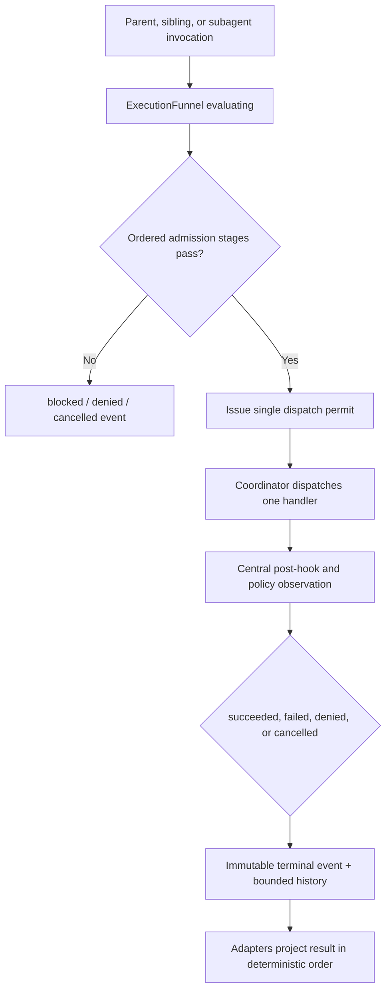

{/* [LAYER: INFRASTRUCTURE] */}

# Central execution funnel

All agent tool invocations enter one modern execution authority:
`src/core/task/tools/execution/ExecutionFunnel.ts`.

The funnel is intentionally a large, cohesive monolith. It keeps every decision that can authorize, block, deny, cancel, dispatch, or classify a tool invocation in one ordered audit surface. Tool handlers are operation adapters; `ToolExecutor`, sibling schedulers, and subagent runners are transport adapters. None of them may create a second execution decision.

This execution authority is separate from task completion. A successful tool event means one operation succeeded. Only `CompletionFunnel.ts` can decide that the whole task is complete.

## Canonical surfaces

| Concern | Canonical implementation |
| --- | --- |
| Admission, policy, permit, dispatch, reliability, terminal classification | `src/core/task/tools/execution/ExecutionFunnel.ts` |
| Serializable event contract | `src/shared/execution/executionFunnelEvent.ts` |
| Parent adapter and result projection | `src/core/task/ToolExecutor.ts` |
| Handler lookup and permit-protected dispatch | `src/core/task/tools/ToolExecutorCoordinator.ts` |
| Sibling invocation capture | `src/core/task/tools/siblings/ToolInvocationContext.ts` |
| Governed subagent integration | `src/core/task/tools/subagent/SubagentRunner.ts` |
| Task state projection | `src/core/task/TaskState.ts` |
| Task completion authority | `src/core/task/tools/completion/CompletionFunnel.ts` |

The former `ActionExecutor`, `executionAuthority`, and `ToolHookUtils` execution gates were removed. Their authoritative behavior now lives inside `ExecutionFunnel`; callers cannot fall back to those paths.

## Funnel contract

Every invocation moves through one ordered decision trace:

1. Publish `evaluating`.
2. Reject a replay of a terminal invocation ID.
3. Verify handler registration.
4. Normalize global parameters and reconcile browser lifecycle.
5. Enforce prior user rejection and the per-turn tool budget.
6. Enforce governed-lane tool authority.
7. Check task and invocation cancellation.
8. Inject target-layer evidence where applicable.
9. Enforce strict plan-mode restrictions.
10. Classify the operation and verify mutation fencing.
11. Check sibling/subagent resource collisions.
12. Enforce roadmap write preflight.
13. Run the applicable `UniversalGuard` pre-policy.
14. Run the centralized `PreToolUse` hook.
15. Recheck cancellation and issue one unforgeable in-process permit.
16. Publish `authorized`, then `executing`.
17. Dispatch exactly one registered handler under that permit.
18. Run task-scoped reliability, then centralized `PostToolUse` and post-policy observation.
19. Classify the result and publish exactly one terminal event.
20. Advance the workspace revision after a successful local mutation.

The coordinator fails closed if code attempts to call a handler without the active permit. This makes the funnel a real execution boundary rather than a convention.



## One event, no inferred status

`ExecutionFunnelEvent` is the sole serializable execution projection. It contains:

- schema version, task ID, invocation ID, and optional permit ID;
- tool name and parent/sibling/subagent lane;
- current phase and decision kind;
- stable reason code and human-readable reason;
- complete ordered stage trace with the decisive stage marked;
- terminal flag, timestamps, and workspace revision.

Terminal phases are `blocked`, `denied`, `cancelled`, `succeeded`, and `failed`. Consumers must select one whole event for one invocation. They must not infer success from handler prose, scan tool-result strings for lifecycle state, merge different events, or use presentation flags as another gate.

`TaskState.executionFunnelEventJson` stores the current projection. `executionFunnelHistory` retains a bounded terminal history for replay protection and audit. Sibling invocation contexts and subagent execution envelopes carry the same event type.

## Authority boundaries

### Parent execution

`ToolExecutor` creates the invocation input and delegates the complete decision to `ExecutionFunnel.execute()`. It may perform result presentation and advisory post-operation bookkeeping after the funnel returns. It does not run policy, hooks, mutation fencing, roadmap preflight, or dispatch independently.

### Sibling execution

The sibling scheduler decides dependency order and resource claims, not authorization. Each admitted sibling enters the same funnel with a stable invocation ID and an optional collision provider. Results may finish out of order, but the task projects them in model-emission order using the terminal funnel event.

### Subagent execution

The subagent runner supplies its governed lane mode and allowlist decision to the funnel. The funnel owns the lane denial, collision check, policy, hooks, dispatch, and terminal result. Published envelopes must contain a terminal `ExecutionFunnelEvent`, so parent merge logic does not reinterpret transcript text.

### Handlers

Handlers own operation-specific validation, consent prompts, and backend calls. When explicit consent is needed, the handler reports the decision through `executionFunnel.recordUserDecision()`. Automatic and inherited subagent approval are also recorded as funnel stages. Handlers do not mutate rejection state or publish authoritative execution status themselves.

## Risk-proportional paths inside one authority

Centralization does not mean serializing all safe work. The funnel classifies operations and applies data-driven fast paths while retaining one entry, trace, and terminal result.

| Operation class | Synchronous authority |
| --- | --- |
| Workspace query | Required parameters, `.dietcodeignore`, task/lane authority, cancellation; expensive structural guard and pre-hook may be skipped |
| Local mutation | Plan mode, durable fencing, collision claims, roadmap policy, guard, hook, approval, workspace revision |
| Shell/browser/network/MCP | Conservative side-effect classification, approval/permission behavior, hook and policy stages |
| Completion | Execution funnel authorizes the `attempt_completion` tool invocation; `CompletionFunnel` alone decides task completion |

Fast-path helpers such as I/O classification, lane parity, browser lifecycle, stability context, and ignore-policy refresh now live alongside the funnel. They are implementation details of one authority, not standalone gates.

## Reliability is subordinate to the permit

Retries, timeouts, concurrency, and circuit state are integrated into `ExecutionFunnel`. A reliability wrapper cannot dispatch a tool by itself: it runs inside the current permit context.

- Circuit keys are task and concurrency-group scoped.
- Retry is limited to recognized transient failures.
- Shell handlers set the funnel timeout to zero because `CommandExecutor` owns process timeout and cancellation; the funnel never starts a replacement process while an original shell remains alive.
- Every timer clears in `finally`.
- A missing or task-mismatched permit fails closed.

## Stream and turn control

After dispatch, task streaming asks `executionFunnel.getTurnControl()` for the one projection of rejection and non-parallel tool-budget exhaustion. The older booleans remain transient presentation compatibility fields, but no consumer interprets them independently. The terminal event is primary.

Execution success never sets task completion. Completion UI and resume behavior consume `CompletionFunnelEvent`, not `ExecutionFunnelEvent`.

## Adding or changing a tool

1. Register the handler in `ToolExecutorCoordinator`.
2. Add effect classification inside `ExecutionFunnel` when the tool is a new query or local mutation class.
3. Keep operation-specific input parsing and consent UI in the handler.
4. Do not call `handler.execute()`, `UniversalGuard`, lifecycle hooks, or mutation gates outside the funnel.
5. Route parent, sibling, and subagent use through `ExecutionFunnel.execute()`.
6. Assert the terminal event and decisive stage in tests; do not assert status by matching presentation text alone.

## Failure diagnosis

Start with `TaskState.executionFunnelEventJson` or the envelope event. The terminal event's `reasonCode`, `reason`, and `stages` identify the exact decisive gate.

| Reason code | Meaning |
| --- | --- |
| `unregistered_tool` | No coordinator handler exists |
| `duplicate_invocation` | A terminal invocation ID was replayed |
| `prior_user_rejection` | A previous tool in the turn was denied |
| `single_tool_budget_exhausted` | Another tool already ran in a non-parallel turn |
| `lane_tool_denied` | Governed lane allowlist rejected the tool |
| `plan_mode_restriction` | The tool or target layer is not writable in plan mode |
| `stale_fencing_token` | Durable mutation authority is no longer current |
| `lane_collision` | Resource claims conflict with another governed lane |
| `roadmap_write_denied` | Roadmap-native preflight failed |
| `policy_denied` | Pre-execution policy rejected the invocation |
| `hook_cancelled` | A lifecycle hook cancelled execution |
| `task_cancelled` | Task or invocation cancellation became active |
| `user_denied` | Explicit operation consent was denied |
| `preparation_failed` | The transport adapter could not build the canonical invocation configuration |
| `operation_failed` | Handler threw or returned an authoritative failure |
| `operation_succeeded` | Handler completed successfully |

## Validation

Run the focused authority and parity suites with `--no-config` so Mocha does not add the entire repository suite:

```sh
npx cross-env TS_NODE_PROJECT=./tsconfig.unit-test.json mocha --no-config \
  --require ts-node/register \
  --require tsconfig-paths/register \
  --require source-map-support/register \
  --require ./src/test/requires.cjs \
  src/core/task/tools/execution/__tests__/ExecutionFunnel.test.ts \
  src/test/tool-executor-hooks.test.ts \
  src/core/task/tools/siblings/__tests__/SiblingToolBatch.test.ts \
  src/core/task/tools/subagent/__tests__/SubagentRunner.test.ts \
  src/core/task/tools/subagent/__tests__/executionEnvelope.test.ts \
  --timeout 10000 --exit
```

Then run `npm run check-types`, `npm run lint`, `npm run test:unit`, and `npm run ci:build`.

## Invariants

- One funnel authorizes every parent, sibling, and subagent tool call.
- No handler dispatch occurs without a current permit.
- Every invocation has one immutable terminal event.
- Event status is never reconstructed from presentation text.
- A successful local mutation advances the workspace revision once.
- Query fast paths remain inside the funnel and still honor workspace security.
- Reliability cannot become a second execution authority.
- Tool success cannot become a second completion authority.
