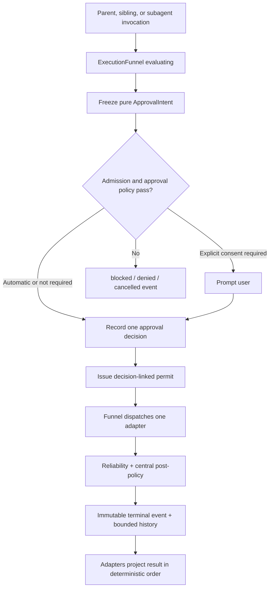

{/* [LAYER: INFRASTRUCTURE] */}

# Central execution funnel

All agent tool invocations enter one modern execution authority:
`src/core/task/tools/execution/ExecutionFunnel.ts`.

The funnel is intentionally a large, cohesive monolith. It keeps every decision that can authorize, block, deny, cancel, dispatch, or classify a tool invocation in one ordered audit surface. Tool handlers are operation adapters; `ToolExecutor`, sibling schedulers, and subagent runners are transport adapters. None of them may create a second execution decision.

This execution authority is separate from task lifecycle and completion. A successful tool event means one operation succeeded. `CompletionFunnel.ts` decides whether the task is durably complete; `TaskLifecycleFunnel.ts` alone commits the corresponding terminal lifecycle transition.

## Canonical surfaces

| Concern | Canonical implementation |
| --- | --- |
| Approval preparation, admission, decision, permit, dispatch, reliability, terminal classification | `src/core/task/tools/execution/ExecutionFunnel.ts` |
| Serializable event contract | `src/shared/execution/executionFunnelEvent.ts` |
| Parent adapter and result projection | `src/core/task/ToolExecutor.ts` |
| Handler registry only | `src/core/task/tools/ToolExecutorCoordinator.ts` |
| Sibling invocation capture | `src/core/task/tools/siblings/ToolInvocationContext.ts` |
| Governed subagent integration | `src/core/task/tools/subagent/SubagentRunner.ts` |
| Task state projection | `src/core/task/TaskState.ts` |
| Task completion authority | `src/core/task/tools/completion/CompletionFunnel.ts` |
| Task lifecycle eligibility and transition authority | `src/core/task/lifecycle/TaskLifecycleFunnel.ts` |

The former `ActionExecutor`, `executionAuthority`, `ToolHookUtils`, unconditional `autoApprove.ts`, executor/coordinator approval callbacks, handler-local approval paths, and compatibility decision helpers were removed. Their remaining contracts are either pure handler adapters or owned inside `ExecutionFunnel`; callers cannot fall back to those paths.

## Funnel contract

Every invocation moves through one ordered decision trace:

1. Register the invocation under its task generation and reject sequential or concurrent replay.
2. Prepare and normalize the operation.
3. Obtain and freeze the handler's synchronous, pure `ApprovalIntent`.
4. Query current-generation lifecycle eligibility, then evaluate mode, lane, fencing, intent-derived collision paths, roadmap, hooks, and execution policy.
5. Snapshot and evaluate approval settings, trusted-command policy, command safety tiers, and MCP per-tool policy.
6. Prompt only when the complete intent is not eligible for automatic admission.
7. Record exactly one immutable approval decision for the same task generation, invocation, and intent.
8. Issue one unforgeable invocation-scoped permit linked to that recorded decision.
9. Dispatch exactly one registered adapter through the funnel's permit-validating primitive.
10. Run task-scoped reliability without reacquiring or bypassing approval.
11. Enrich the result, run centralized post-hook/policy observation, classify the outcome, and advance the workspace revision after a successful mutation.
12. Publish one authoritative immutable terminal event with the complete ordered trace.

The funnel itself fails closed if code attempts to call an adapter without the active approval-linked permit. The registry cannot dispatch. This makes the funnel a real execution boundary rather than a convention.



## One event, no inferred status

`ExecutionFunnelEvent` is the sole serializable execution projection. It contains:

- schema version, task ID, task generation, invocation ID, and optional permit ID;
- frozen approval intent and normalized arguments;
- applicable settings/policy inputs, automatic-approval consideration, and prompt fact;
- exactly one immutable approval decision with actor/mechanism and intent identity;
- permit-to-decision identity link;
- tool name and parent/sibling/subagent lane;
- current phase and decision kind;
- stable reason code and human-readable reason;
- complete ordered stage trace with the decisive stage marked;
- terminal flag, timestamps, and workspace revision.

Terminal phases are `blocked`, `denied`, `cancelled`, `succeeded`, and `failed`. Consumers must select one whole event for one invocation. They must not infer success from handler prose, scan tool-result strings for lifecycle state, merge different events, or use presentation flags as another gate.

`TaskState.executionFunnelEventJson` stores the current projection. `executionFunnelHistory` retains a bounded terminal audit history, while the current-generation invocation ledger preserves replay rejection after history eviction. Sibling invocation contexts and subagent execution envelopes carry the same event type.

## Authority boundaries

### Parent execution

`ToolExecutor` creates the invocation input and delegates the complete decision to `ExecutionFunnel.execute()`. The funnel queries the task lifecycle eligibility contract before approval and again before permit-protected dispatch. It may submit an execution-derived lifecycle fact, but never writes task state or cancellation fields. `ToolExecutor` may perform result presentation and advisory post-operation bookkeeping after the funnel returns. It does not run policy, hooks, mutation fencing, roadmap preflight, or dispatch independently.

### Sibling execution

The sibling scheduler decides dependency order and resource claims, not authorization. Each admitted sibling enters the same funnel with a stable invocation ID and an optional collision provider. Results may finish out of order, but the task projects them in model-emission order using the terminal funnel event.

### Subagent execution

The subagent runner supplies its governed lane mode and allowlist decision to the funnel. The funnel owns the lane denial, collision check, policy, hooks, dispatch, and terminal result. Published envelopes must contain a terminal `ExecutionFunnelEvent`, so parent merge logic does not reinterpret transcript text.

### Handlers

Handlers own operation-specific input interpretation and backend calls. Every registered handler synchronously returns a configuration-free `ApprovalIntent` describing identity, normalized arguments, capability/risk, paths/scopes, side effects, human-readable consent text, and automatic-approval eligibility. Handlers never inspect approval settings, decide approval, prompt for operation consent, run approval hooks, record approval state, issue/reinterpret permits, or publish authoritative execution status.

`ask_followup_question` and completion feedback remain semantic user-input operations after their own invocation has been admitted; they are not operation-approval authorities.

## Risk-proportional paths inside one authority

Centralization does not mean serializing all safe work. The funnel classifies operations and applies data-driven fast paths while retaining one entry, trace, and terminal result.

| Operation class | Synchronous authority |
| --- | --- |
| Workspace query | Required parameters, `.dietcodeignore`, task/lane authority, cancellation; expensive structural guard and pre-hook may be skipped |
| Local mutation | Plan mode, durable fencing, collision claims, roadmap policy, guard, hook, approval, workspace revision |
| Shell/browser/network/MCP | Conservative side-effect classification, approval/permission behavior, hook and policy stages |
| Completion | Execution funnel authorizes the `attempt_completion` tool invocation; `CompletionFunnel` alone decides task completion |

Fast-path helpers such as I/O classification, lane parity, browser lifecycle, stability context, and ignore-policy refresh now live alongside the funnel. They are implementation details of one authority, not standalone gates.

## Reliability is subordinate to the permit

Retries, timeouts, concurrency, and circuit state are integrated into `ExecutionFunnel`. A reliability wrapper cannot dispatch a tool by itself: it runs inside the current permit context.

- Circuit keys are task and concurrency-group scoped.
- Retry is limited to recognized transient failures.
- Shell handlers set the funnel timeout to zero because `CommandExecutor` owns process timeout and cancellation; the funnel never starts a replacement process while an original shell remains alive.
- Every timer clears in `finally`.
- A missing or task-mismatched permit fails closed.

## Stream and turn control

After dispatch, task streaming asks `executionFunnel.getTurnControl()` for the one projection of rejection and non-parallel tool-budget exhaustion. The former `didRejectTool` and `didAlreadyUseTool` compatibility booleans were deleted; only the current-generation event is authoritative.

Execution success never sets task completion or task lifecycle terminality. Completion UI and resume behavior consume committed `TaskLifecycleEvent` state; `CompletionFunnelEvent` remains semantic completion evidence and `ExecutionFunnelEvent` remains operation evidence.

## Adding or changing a tool

1. Register the handler in `ToolExecutorCoordinator`.
2. Implement synchronous `getApprovalIntent(block)` using the pure intent builders; declare the complete possible side-effect envelope and exact commands up front.
3. Keep operation-specific input parsing and backend behavior in the handler, with no approval settings or consent UI.
4. Add centralized classification only when policy cannot be derived from the declared intent.
5. Do not call `handler.execute()`, `UniversalGuard`, lifecycle hooks, or mutation gates outside the funnel.
6. Route parent, sibling, and subagent use through `ExecutionFunnel.execute()`.
7. Assert the approval decision, causal permit link, terminal event, and decisive stage in tests; do not assert status by matching presentation text alone.
8. Run `npm run check:handler-imports` to enforce the handler boundary.

## Failure diagnosis

Start with `TaskState.executionFunnelEventJson` or the envelope event. The terminal event's `reasonCode`, `reason`, and `stages` identify the exact decisive gate.

| Reason code | Meaning |
| --- | --- |
| `unregistered_tool` | No coordinator handler exists |
| `duplicate_invocation` | A terminal invocation ID was replayed |
| `prior_user_rejection` | A previous tool in the turn was denied |
| `single_tool_budget_exhausted` | Another tool already ran in a non-parallel turn |
| `lane_tool_denied` | Governed lane allowlist rejected the tool |
| `plan_mode_restriction` | The tool or target layer is not writable in plan mode |
| `stale_fencing_token` | Durable mutation authority is no longer current |
| `lane_collision` | Resource claims conflict with another governed lane |
| `roadmap_write_denied` | Roadmap-native preflight failed |
| `policy_denied` | Pre-execution policy rejected the invocation |
| `hook_cancelled` | A lifecycle hook cancelled execution |
| `task_cancelled` | Task or invocation cancellation became active |
| `approval_preparation_failed` | Intent or approval settings preparation failed closed |
| `approval_denied` | Explicit operation consent was denied |
| `approval_cancelled` | Cancellation occurred before approval resolved |
| `approval_expired` | Explicit approval did not resolve before its deadline |
| `approval_failed` | Approval prompting failed |
| `preparation_failed` | The transport adapter could not build the canonical invocation configuration |
| `operation_failed` | Handler threw or returned an authoritative failure |
| `operation_succeeded` | Handler completed successfully |

## Validation

Run the focused authority and parity suites with `--no-config` so Mocha does not add the entire repository suite:

```sh
npx cross-env TS_NODE_PROJECT=./tsconfig.unit-test.json mocha --no-config \
  --require ts-node/register \
  --require tsconfig-paths/register \
  --require source-map-support/register \
  --require ./src/test/requires.cjs \
  src/core/task/tools/execution/__tests__/ExecutionFunnel.test.ts \
  src/test/tool-executor-hooks.test.ts \
  src/core/task/tools/siblings/__tests__/SiblingToolDependency.test.ts \
  src/core/task/tools/siblings/__tests__/SiblingToolScheduler.test.ts \
  src/core/task/tools/subagent/__tests__/SubagentRunner.test.ts \
  src/core/task/tools/subagent/__tests__/executionEnvelope.test.ts \
  --timeout 10000 --exit
```

Then run `npm run check-types`, `npm run lint`, `npm run check:handler-imports`, `npm run test:unit`, `npm run ci:build`, and `npm run vscode:prepublish`.

## Invariants

- One funnel authorizes every parent, sibling, and subagent tool call.
- No adapter dispatch occurs without a current permit linked to the one recorded approved decision for the same task generation, invocation, and intent.
- No permit exists before `approval.decision`.
- Every invocation has one immutable terminal event.
- Event status is never reconstructed from presentation text.
- A successful local mutation advances the workspace revision once.
- Query fast paths remain inside the funnel and still honor workspace security.
- Reliability cannot become a second execution authority.
- Tool success cannot become a second completion authority.
- Lifecycle cancellation and stale-generation fencing come from `TaskLifecycleFunnel`, never mutable task booleans.

Related: [Task lifecycle authority](task-lifecycle-authority.md).
