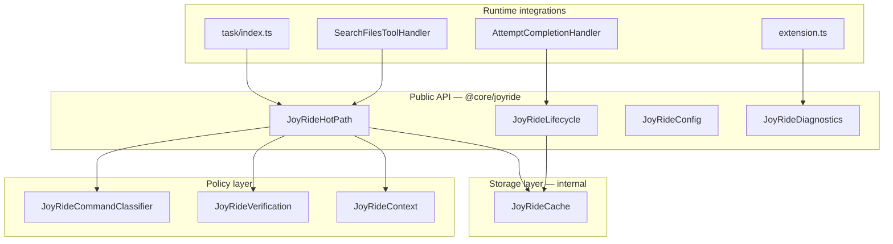

# JoyRide

[](#status)
[](#testing)
[](#public-api)

**Bounded typed execution cache for LUMI agent hot paths.**

JoyRide accelerates repeated safe work during active coding sessions — read-only commands, workspace search, and strictly proven verification — without storing secrets, without bypassing approval boundaries, and without pretending to be durable agent memory.

> **JoyRide is cache, not memory.** Locality and speed with explicit invalidation — not identity, narrative continuity, or long-term recall.

---

## Documentation

| Layer | Document | Audience |
|---|---|---|
| **Hub** | [docs/README.md](./docs/README.md) | Navigation and reading paths |
| **Brief** | [docs/BRIEF.md](./docs/BRIEF.md) | Executives, PM — one page |
| **Philosophy** | [docs/PHILOSOPHY.md](./docs/PHILOSOPHY.md) | Architects — design principles |
| **How caching works** | [docs/CACHING.md](./docs/CACHING.md) | Integrators — inputs → hash → hit/miss |
| **Whitepaper** | [docs/WHITEPAPER.md](./docs/WHITEPAPER.md) | Implementers — full specification |
| **API reference** | [docs/API.md](./docs/API.md) | Contributors — frozen surface |
| **Glossary** | [docs/GLOSSARY.md](./docs/GLOSSARY.md) | Everyone — canonical terms |
| **Troubleshooting** | [docs/TROUBLESHOOTING.md](./docs/TROUBLESHOOTING.md) | Operators — runbook |
| **Operator guide](../../docs/features/joyride.mdx) | LUMI users — config, disable |
| **Release notes** | [../../docs/features/joyride-release-notes.mdx](../../docs/features/joyride-release-notes.mdx) | Release managers |

### Reading paths

| You are… | Read in order |
|---|---|
| New to JoyRide | Brief → Caching model → README quick start |
| Adding a hot path | Caching model → API → Contributor checklist |
| Reviewing design | Philosophy → Whitepaper |
| Debugging reuse | Troubleshooting → Decision log |

---

## Status

| Attribute | Value |
|---|---|
| Maturity | GA — production runtime infrastructure |
| API | Modern-only; legacy boolean helpers **removed** |
| Export surface | Frozen — 69 symbols in `JOYRIDE_FROZEN_EXPORTS` |
| Tests | 179+ unit tests, CI via `npm run test:unit` |
| UI | None — observability via logs and snapshots |
| Durability | `memoryOnly` (session-scoped) |

---

## Architecture



**Import rule:** integrations touch `JoyRideCache` only through typed helpers — never direct `.get()` / `.set()`.

---

## How it works (30 seconds)

JoyRide uses **input-hash caching** (same discipline as Turbo/Nx task caches):

1. **Inputs** — command, cwd, workspace fingerprints, file hashes, search dimensions
2. **Hash** — SHA-256 over stable-serialized inputs → cache key
3. **Lookup** — compare stored validation fingerprint vs current proof
4. **Decision** — typed hit / miss / stale / rejected + `fallbackBehavior`
5. **Invalidate** — TTL, task flush, generation bump, fingerprint change

See [Caching model](./docs/CACHING.md) for full input tables and sequence diagrams.

---

## Core guarantees

| # | Guarantee | Enforcement |
|---|---|---|
| G1 | Fail-closed reuse | Allowlist classifier; verification proof gate |
| G2 | Typed decisions only | `JoyRideCacheDecision`; no boolean API |
| G3 | Bounded memory | 32 MiB default; pressure + emergency trim |
| G4 | Secret safety | Admission scan; no secret in diagnostics |
| G5 | Instant disable | `JOYRIDE_MODE=disabled` |
| G6 | Degraded fallback | Internal errors suspend reuse; agent continues |
| G7 | Auditability | Decision log (128), hit audit trail, snapshots |
| G8 | Contract stability | Drift tests on exports and import boundaries |

---

## Quick start

### Command hot path

```typescript
import {
  getJoyRideCache,
  createJoyRideTaskScope,
  isJoyRideHitDecision,
  lookupSafeCommandResult,
  registerTaskLifecycle,
  storeReusableCommandResult,
} from "@core/joyride"

const cache = getJoyRideCache()
const scope = createJoyRideTaskScope(taskId, cwd, terminalMode, generation)
registerTaskLifecycle(cache, taskId, scope.generation)

const decision = await lookupSafeCommandResult(cache, command, scope)
if (isJoyRideHitDecision(decision)) {
  return decision.value  // [userRejected, toolResponse]
}

const result = await execute(command)
await storeReusableCommandResult(cache, command, result, scope)
return result
```

### Search hot path

```typescript
const decision = await lookupSearchResult(cache, query, { cwd, includeGlobs }, scope)
if (isJoyRideHitDecision(decision)) {
  return decision.value  // results string
}
// execute search, then storeSearchResult(...)
```

### Rules (non-negotiable)

1. Import **only** from `@core/joyride`
2. Use `isJoyRideHitDecision(decision)` before skipping work
3. Follow `decision.fallbackBehavior` — do not invent policy
4. Never call `getJoyRideCache().get()`, `.set()`, or `.trySet()`

---

## Configuration

| Variable | Default | Effect |
|---|---|---|
| `JOYRIDE_MODE` | `enabled` | `disabled` · `diagnostics-only` · `enabled` |
| `JOYRIDE_COMMAND_REUSE` | on | `0`/`false` → never skip commands |
| `JOYRIDE_VERIFICATION_CACHE` | on | `0`/`false` → never reuse verification |
| `JOYRIDE_SEARCH_CACHE` | on | `0`/`false` → never reuse search |
| `JOYRIDE_SCRATCH_CACHE` | on | `0`/`false` → reject scratch retention |

```bash
# Kill switch
JOYRIDE_MODE=disabled code .

# Observe cache behavior without skipping work
JOYRIDE_MODE=diagnostics-only code .
```

---

## Cache kinds

| Kind | What | Skip policy |
|---|---|---|
| `hotExecution` | Command summaries | Allowlist safe-readonly only |
| `verification` | Test/lint output | Complete proof required |
| `workspaceIndex` | Search/grep results | Full key dimension match |
| `scratchArtifact` | Temp task artifacts | No skip — cleanup-owned |
| `taskLocal` | Task metadata | Flushed on task end |

Default budgets: 32 MiB total · 512 KiB max entry · 8 MiB per task · 4–12 MiB per kind.

---

## Typed decisions

```typescript
type JoyRideDecisionType =
  | "hit" | "miss" | "stale" | "rejected"
  | "disabled" | "diagnosticOnly" | "degraded"
```

Every decision includes: `canReuse`, `reasonCode`, `fallbackBehavior`, `auditEventId`.

Reason codes use stable prefixes: `hit.` · `miss.` · `stale.` · `reject.` · `degraded.` · `trim.` · `cleanup.` · `lifecycle.`

Full catalog: [Whitepaper Appendix A](./docs/WHITEPAPER.md#appendix-a-reason-code-catalog)

---

## Runtime integrations

| File | Role |
|---|---|
| `src/core/task/index.ts` | Command lookup/store; cancel flush; env-altering invalidation |
| `src/core/task/tools/handlers/SearchFilesToolHandler.ts` | Search lookup/store |
| `src/core/task/tools/handlers/AttemptCompletionHandler.ts` | Task completion flush |
| `src/extension.ts` | Deactivate diagnostics + shutdown |

---

## Diagnostics

```typescript
import {
  createJoyRideBugReportSnapshot,
  getJoyRideDecisionLog,
  getJoyRideCacheHitAuditTrail,
  summarizeJoyRideHealth,
  getJoyRideCache,
} from "@core/joyride"

summarizeJoyRideHealth(getJoyRideCache())
createJoyRideBugReportSnapshot(getJoyRideCache())
```

Runbook: [Troubleshooting](./docs/TROUBLESHOOTING.md)

---

## Testing

```bash
npm run test:unit -- --grep "JoyRide"
```

| Suite | Guards |
|---|---|
| `JoyRideContractDrift` | Export surface freeze |
| `JoyRideImportBoundary` | Integration import rules |
| `JoyRideRealSession` | Session dogfood scenarios |
| `JoyRideVerificationGa` | Verification proof strictness |
| `JoyRideBenchmark` | Performance regression gates |
| `JoyRideGaReadiness` | Doc + suite completeness |

Helpers: `__tests__/JoyRideTestHelpers.ts`

---

## Contributor checklist

- [ ] Import only from `@core/joyride`
- [ ] Typed lookup/store helpers only
- [ ] Handle `fallbackBehavior`
- [ ] Precise `JOYRIDE_REASON` codes
- [ ] Test enabled / disabled / diagnostics-only / degraded
- [ ] Test stale invalidation + unsafe refusal
- [ ] Add dogfood or contract test
- [ ] Update `JoyRideContract.ts` if public contract changes

Details: [Operator guide §Contributor checklist](../../docs/features/joyride.mdx#contributor-checklist)

---

## Comparison

| Approach | JoyRide | Naive cache | Agent memory |
|---|---|---|---|
| API | Typed decisions | boolean hit/miss | unstructured store |
| Command reuse | Allowlist | anything cached | anything "remembered" |
| Verification | Full proof | last output | last output |
| Bounds | 32 MiB + TTL | unbounded | unbounded |
| Disable | env var | code change | unclear |
| Observability | reason codes + audit | logs | opaque |
| Persistence | session | varies | cross-session |

---

## What JoyRide is not

- Agent memory, identity, or long-term recall
- UI, dashboard, or status surface
- Cross-session persistence for active reuse
- Substitute for tests when proof is incomplete
- Bypass for user approval boundaries

---

## Tagline

**Fast when safe. Silent when irrelevant. Explicit when questioned. Disabled when needed. Degraded when suspicious. Fail-closed always.**

---

## License

Part of LUMI (DietCode). See repository root `LICENSE`.
