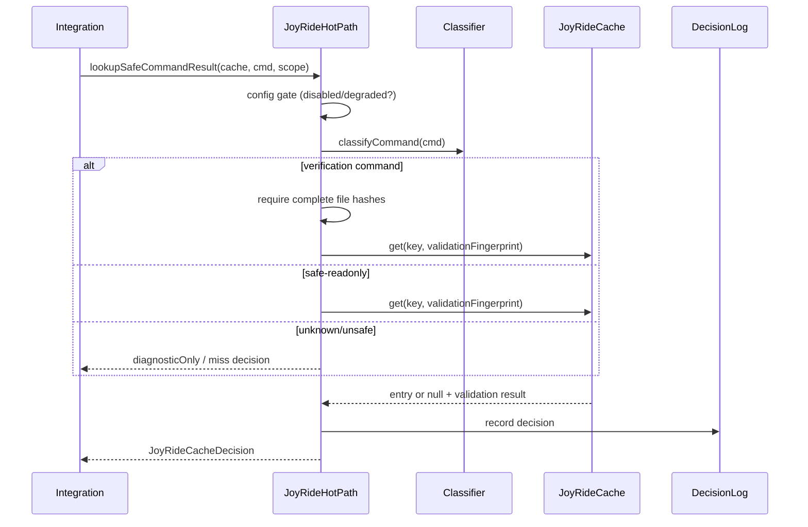
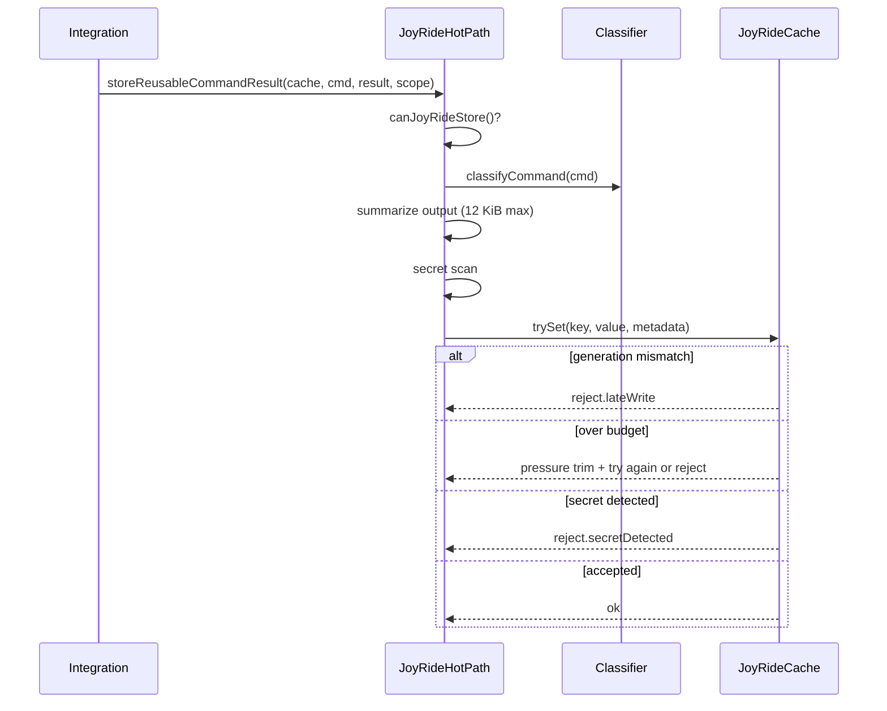

# How JoyRide Caching Works

**Input-based execution cache semantics for LUMI agent hot paths.**

This document mirrors the structure of [Turborepo caching](https://turbo.build/repo/docs/core-concepts/caching) and [Nx computation caching](https://nx.dev/concepts/how-caching-work): define **inputs**, compute a **hash**, compare on lookup, and **invalidate** when inputs change. JoyRide applies the same discipline to agent commands, search, and verification — not build tasks.

---

## Mental model

```
┌─────────────┐     hash(inputs)      ┌─────────────┐
│   Inputs    │ ────────────────────► │  Cache key  │
│ (command,   │                       │  + proof    │
│  cwd,       │                       └──────┬──────┘
│  fingerprints│                              │
│  file hashes)│         lookup              │
└─────────────┘ ◄────────────────────────────┘
                      │
          ┌───────────┼───────────┐
          ▼           ▼           ▼
        HIT         MISS        STALE
     (reuse)    (execute)   (rerun + diagnostic)
```

JoyRide never asks "did we run this before?" alone. It asks: **"do current inputs match the proof stored with this entry?"**

---

## What gets cached

| Operation | Cache kind | Stored value | Active skip allowed? |
|---|---|---|---|
| Safe-readonly command | `hotExecution` | Bounded output summary | Yes — allowlist only |
| Verification command | `verification` | Output summary + proof metadata | Yes — complete proof only |
| Workspace search/grep | `workspaceIndex` | Results string + count | Yes — full key match |
| Scratch artifact | `scratchArtifact` | Typed artifact + cleanup handler | No — retention only |
| Unknown command | `hotExecution` (diagnostic) | Output summary | **Never** |

---

## Inputs by cache kind

### Command (`hotExecution`)

| Input | Included in key? | Included in validation? |
|---|---|---|
| Normalized command string | ✓ | ✓ |
| `cwd` | ✓ | ✓ |
| `environmentFingerprint` | ✓ | ✓ |
| `dependencyFingerprint` | ✓ | ✓ |
| `gitHead` | ✓ | ✓ |
| `runtimeVersion` | ✓ | ✓ |
| Command classifier tier | gate (not key) | — |
| `approvalBoundaryId` | — | ✓ |
| `generation` (task) | — | ✓ |

**Classifier gate:** only `safe-readonly` tier may skip execution. Verification commands route to verification cache kind.

### Verification

| Input | Required for reuse? |
|---|---|
| `command` | ✓ |
| `cwd` | ✓ |
| `relevantFileHashes` (non-empty) | ✓ |
| `workspaceFingerprint` | ✓ |
| `approvalBoundaryId` | ✓ |
| `gitHead` | ✓ |
| `dependencyFingerprint` | ✓ |
| `lockfileFingerprint` | ✓ |
| `environmentFingerprint` | ✓ |
| `runtimeVersion` | ✓ |
| `toolVersion` (`lumi-verification-v1`) | ✓ |

Missing any dimension → `miss.verification.incompleteProof` or `miss.verification.missingFileHashes`.

### Search (`workspaceIndex`)

| Input | Key dimension |
|---|---|
| `query` | ✓ |
| `cwd` | ✓ |
| `includeGlobs` | ✓ |
| `excludeGlobs` | ✓ |
| `caseSensitive` | ✓ (default true) |
| `workspaceFingerprint` | ✓ |
| `changedFileGeneration` | ✓ |
| `searchImplementationVersion` | ✓ |

Change any dimension → miss with specific reason (`miss.search.queryChanged`, etc.).

### Scratch

| Input | Admission requirement |
|---|---|
| `ownerTaskId` | required |
| `artifactKind` | required |
| `contentHash` | computed |
| `generation` | required |
| `ttlMs` | required, > 0 |
| `estimatedBytes` | required, > 0 |
| `cleanupHandler` | required |

---

## Hashing

Keys are content-addressable:

```
joyride:{namespace}:{sha256(stableStringify({ namespace, parts }))}
```

`stableStringify()` sorts object keys and normalizes undefined — same inputs always produce the same hash (analogous to Turbo task hash inputs and Nx `inputs`/`namedInputs`).

Namespaces: `command-result`, `grep-result`, `verification`, `scratch-artifact`, `file-metadata`, `diff`.

---

## Lookup flow



### Decision outcomes

| Outcome | `canReuse` | Integration action |
|---|---|---|
| `hit` | `true` | Return `decision.value` |
| `miss` | `false` | Execute; optionally store |
| `stale` | `false` | Execute; stale entry kept for diagnostics |
| `diagnosticOnly` | `false` | Execute; never skip |
| `disabled` | `false` | Execute; do not store |
| `degraded` | `false` | Execute; do not trust cache |

---

## Store flow



---

## Invalidation triggers

Analogous to Nx "what invalidates the cache":

| Event | Affected entries | Mechanism |
|---|---|---|
| File edit (tracked generation) | Search | `changedFileGeneration` bump |
| Lockfile change | Verification | `stale.lockfileChanged` |
| Git commit/checkout | Command, verification | `stale.gitHeadChanged` |
| Task completion | Task-local, scratch | `flushTaskGeneration` |
| Task cancellation | All task entries | `bumpTaskGeneration` + flush |
| Env-altering command | Workspace-wide | `flushWorkspace` |
| TTL expiry | Any | `trim.ttl` |
| Memory pressure | LRU / emergency | `trim.pressure` / `trim.emergency` |
| Extension deactivate | All | `shutdownJoyRideCache` |

---

## What is never cached for reuse

| Content | Reason |
|---|---|
| Secret-bearing output | `reject.secretDetected` |
| Failed verification output | Stored `diagnosticOnly` only |
| Unknown commands (skip) | Classifier: never skip |
| Unsafe shell syntax | Classifier: never skip |
| Env-altering commands (skip) | Classifier: never skip |
| Entries after `JOYRIDE_MODE=disabled` | Config gate |
| Entries when degraded | No trusted hits |

---

## Comparison to build-tool caches

| Concept | Turbo / Nx | JoyRide |
|---|---|---|
| Unit of cache | Task | Command / search / verification |
| Hash inputs | `inputs`, env, deps | Fingerprints + command + proof |
| Remote tier | Optional | None (in-process only) |
| Hit means | Outputs identical | Outputs safe to reuse in session |
| Invalidation | Input change | Fingerprint / generation / TTL change |
| API | Framework hooks | Typed `JoyRideCacheDecision` |

JoyRide is **session-scoped execution cache**, not a distributed build cache. The input-hash discipline is the same; the trust model is stricter (fail-closed, allowlist commands).

---

## Further reading

- [API reference](./API.md) — lookup/store functions
- [Whitepaper §6–7](./WHITEPAPER.md) — key taxonomy and invalidation
- [Troubleshooting](./TROUBLESHOOTING.md) — when reuse looks wrong
