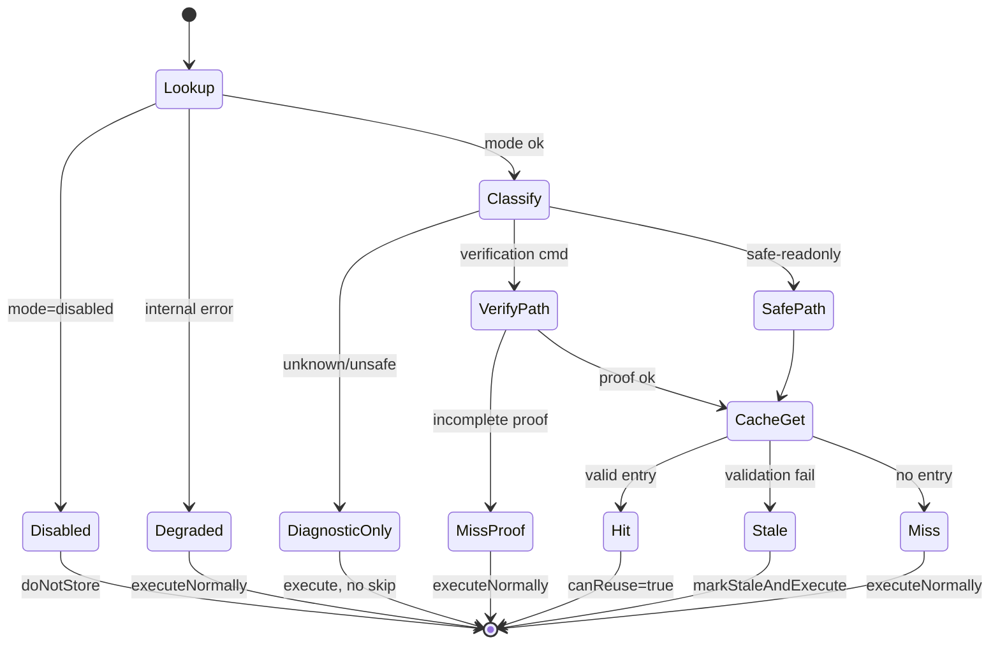

# JoyRide Technical Whitepaper

**Bounded typed execution cache for LUMI agent hot paths**

| Field | Value |
|---|---|
| Version | GA (modern-only API) |
| Implementation | `src/core/joyride/` |
| Public entrypoint | `@core/joyride` |
| Contract | `JoyRideContract.ts` |
| Test coverage | 179+ unit tests |

---

## Table of contents

1. [Abstract](#1-abstract)
2. [Problem statement](#2-problem-statement)
3. [System overview](#3-system-overview)
4. [Typed decision model](#4-typed-decision-model)
5. [Cache architecture](#5-cache-architecture)
6. [Cache key taxonomy](#6-cache-key-taxonomy)
7. [Invalidation model](#7-invalidation-model)
8. [Command classifier](#8-command-classifier)
9. [Verification proof model](#9-verification-proof-model)
10. [Search invalidation](#10-search-invalidation)
11. [Scratch artifact lifecycle](#11-scratch-artifact-lifecycle)
12. [Memory budget and eviction](#12-memory-budget-and-eviction)
13. [Security model](#13-security-model)
14. [Operational modes](#14-operational-modes)
15. [Observability](#15-observability)
16. [Public API contract](#16-public-api-contract)
17. [Integration boundaries](#17-integration-boundaries)
18. [Performance characteristics](#18-performance-characteristics)
19. [Failure modes](#19-failure-modes)
20. [Testing and contract enforcement](#20-testing-and-contract-enforcement)
21. [Non-goals and future work](#21-non-goals-and-future-work)
22. [References](#22-references)
23. [Appendix A — Reason code catalog](#appendix-a--reason-code-catalog)
24. [Appendix B — Safe-readonly allowlist](#appendix-b--safe-readonly-command-allowlist)
25. [Appendix C — Decision state machine](#appendix-c--decision-state-machine)
26. [Appendix D — Trust model comparison](#appendix-d--trust-model-comparison)
27. [Appendix E — Document revision history](#appendix-e--document-revision-history)

---

## 1. Abstract

JoyRide is LUMI's in-process execution cache for agent coding hot paths. It reduces latency in repeated command, search, and verification loops by reusing only validated, bounded, invalidation-aware cache entries.

Unlike general-purpose agent "memory" systems, JoyRide is explicitly **cache infrastructure**: session-scoped, TTL-bound, evictable, and fail-closed. Every lookup returns a typed `JoyRideCacheDecision` with stable reason codes and explicit fallback behavior. Integrations never receive ambiguous boolean results.

JoyRide is production-hardened with secret scanning, degraded-mode fallback, contract-tested export surfaces, and comprehensive real-session validation — without UI.

---

## 2. Problem statement

### 2.1 Agent loop friction

During active agent sessions, LUMI repeatedly executes:

```
inspect → modify → command → verify → search → inspect → ...
```

Each phase may re-run identical safe operations (`git status`, grep for a symbol, `npm test` after unrelated edits). Without caching, latency accumulates. With naive caching, correctness fails silently.

### 2.2 Failure modes of naive caching

| Failure | Consequence |
|---|---|
| Stale verification reuse | Agent believes tests pass when they would fail |
| Secret retention | Credentials in memory; leak via diagnostics |
| Unbounded growth | RAM pressure; editor slowdown |
| Unknown command reuse | Arbitrary shell execution skipped |
| Cross-task leakage | Task A output reused in Task B |
| Ambiguous hit/miss API | Call sites invent unsafe policy |

### 2.3 Design goal

Improve agent ergonomics (responsiveness, iteration speed) **without** increasing stale-state risk, hidden retention, or operational ambiguity.

---

## 3. System overview

### 3.1 Layered architecture

```
┌──────────────────────────────────────────────────────────────────┐
│ LUMI runtime integrations                                        │
│  task/index.ts · SearchFilesToolHandler · AttemptCompletionHandler│
│  extension.ts                                                    │
└────────────────────────────┬─────────────────────────────────────┘
                             │ @core/joyride (frozen exports)
┌────────────────────────────▼─────────────────────────────────────┐
│ JoyRideHotPath                                                     │
│  lookupSafeCommandResult · lookupSearchResult · lookupVerification │
│  storeReusableCommandResult · storeSearchResult · storeVerification│
│  storeScratchArtifactWithCleanup                                   │
└────────────┬───────────────────────────────┬─────────────────────┘
             │                               │
┌────────────▼────────────┐    ┌─────────────▼─────────────────────┐
│ JoyRideCommandClassifier │    │ JoyRideContext                     │
│ allowlist · unsafe detect│    │ workspace snapshot · task scope  │
└────────────┬────────────┘    └─────────────┬─────────────────────┘
             │                               │
┌────────────▼───────────────────────────────▼─────────────────────┐
│ JoyRideCache                                                       │
│ Map storage · validation · eviction · secret scan · cleanup        │
└────────────────────────────┬───────────────────────────────────────┘
                             │
┌────────────────────────────▼───────────────────────────────────────┐
│ Cross-cutting: JoyRideDecisions · JoyRideReasonCodes ·             │
│ JoyRideDecisionLog · JoyRideAudit · JoyRideDiagnostics ·           │
│ JoyRideConfig · JoyRideLifecycle                                   │
└────────────────────────────────────────────────────────────────────┘
```

### 3.2 Data flow: lookup

1. Integration calls `lookupSafeCommandResult(cache, command, scope, ...)`
2. Config gate: disabled → `disabled` decision; degraded → no trusted hits
3. Classifier: command tier determines reuse eligibility
4. Workspace snapshot built (fingerprints for cwd, git, lockfiles, deps, env)
5. Cache key materialized from stable JSON + SHA-256
6. `cache.get(key, validationFingerprint)` — validation compares stored vs current proof
7. Hit → `hitDecision` with value + audit; miss/stale → appropriate decision
8. Decision recorded in bounded decision log

### 3.3 Data flow: store

1. Integration calls `storeReusableCommandResult` after execution
2. Config gate: disabled → no-op
3. Classifier: `canStoreDiagnostic` check
4. Output summarized (bounded text, not raw multi-MB buffers)
5. Secret scan on admission
6. `cache.trySet(key, value, metadata)` — budget check, generation guard, late-write rejection
7. Pressure trim if over budget

---

## 4. Typed decision model

### 4.1 Decision types

| `type` | `canReuse` | Meaning |
|---|---|---|
| `hit` | `true` | Safe reuse; `value` present |
| `miss` | `false` | No reusable entry; execute normally |
| `stale` | `false` | Entry exists but invalid; rerun |
| `rejected` | `false` | Admission or policy refusal |
| `disabled` | `false` | JoyRide disabled |
| `diagnosticOnly` | `false` | Stored for stats; never skip |
| `degraded` | `false` | Internal failure; no trusted reuse |

### 4.2 Required fields

Every decision includes (enforced by `JoyRideDecisionInvariants.test.ts`):

```typescript
interface JoyRideDecisionContext {
  type: JoyRideDecisionType
  canReuse: boolean
  reasonCode: JoyRideReasonCode      // stable vocabulary
  reasonMessage: string              // human-readable
  fallbackBehavior: JoyRideFallbackBehavior
  diagnosticOnly: boolean
  degraded: boolean
  auditEventId: string
  // optional: keySummary, proofSummary, configExplanation, entryAgeMs, ...
}
```

### 4.3 Fallback behaviors

| Behavior | Caller action |
|---|---|
| `reuseCachedValue` | Return `decision.value` |
| `executeNormally` | Run work; no skip |
| `executeAndStoreDiagnosticOnly` | Run; store diagnostic if safe |
| `executeAndStoreReusableIfSafe` | Run; store if classifier allows |
| `rejectArtifact` | Do not admit artifact |
| `markStaleAndExecute` | Rerun; stale entry retained for diagnostics |
| `doNotStore` | JoyRide disabled |
| `disableActiveReuse` | Degraded — no skips |

### 4.4 Hit invariant

```typescript
function isJoyRideHitDecision(decision): decision is JoyRideHitDecision {
  return decision.type === "hit" && decision.canReuse
}
```

Integrations must use this guard — never check `canReuse` alone without `type === "hit"`.

---

## 5. Cache architecture

### 5.1 Cache kinds

| Kind | Purpose | Default TTL | Default budget |
|---|---|---|---|
| `hotExecution` | Safe-readonly command summaries | 5 min | 4 MiB |
| `taskLocal` | Task-scoped metadata | varies | 8 MiB |
| `workspaceIndex` | Search/grep results | 3 min | 12 MiB |
| `verification` | Proven test/lint output | 10 min | 8 MiB |
| `scratchArtifact` | Temporary task artifacts | spec-defined | 8 MiB |

### 5.2 Entry metadata

Each cache entry carries:

```typescript
interface JoyRideCacheEntry<T> {
  key: string
  value: T
  cacheKind: JoyRideCacheKind
  scope: JoyRideCacheScope
  ownerTaskId: string
  ttl: number
  estimatedBytes: number
  fingerprint: string
  workspaceFingerprint: string
  approvalBoundaryId: string
  generation: number
  safetyClassification: JoyRideSafetyClassification
  invalidationReason: JoyRideInvalidationReason[]
  cleanupHandler: JoyRideCleanupHandler
  // proof dimensions for validation
  relevantFileHashes?: Record<string, string>
  lockfileFingerprint?: string
  dependencyFingerprint?: string
  gitHead?: string
  environmentFingerprint?: string
  runtimeVersion?: string
  toolVersion?: string
}
```

### 5.3 Durability

Default: `memoryOnly`. JoyRide does not persist cache entries across VS Code sessions unless explicitly configured for diagnostic receipts (not used for active reuse).

### 5.4 Task generation guards

Each task registers a generation counter. Writes from obsolete generations are rejected (`reject.lateWrite`). Bumping generation on cancellation prevents stale async writes from polluting cache state.

---

## 6. Cache key taxonomy

Keys are content-addressable: `joyride:{namespace}:{sha256}`.

### 6.1 Key namespaces

| Namespace | Function | Input dimensions |
|---|---|---|
| `command-result` | `createCommandResultCacheKey` | command, cwd, env/deps/git/runtime fingerprints |
| `grep-result` | `createGrepResultCacheKey` | query, cwd, globs, workspace fingerprint, changed-file generation, case sensitivity, search impl version |
| `verification` | `createVerificationCacheKey` | command, cwd, file hashes, all workspace fingerprints, approval boundary, runtime/tool versions |
| `scratch-artifact` | `createScratchArtifactCacheKey` | taskId, artifact kind, content hash, generation, cleanup policy |
| `file-metadata` | `createFileMetadataCacheKey` | path, file hash, mtime generation, workspace fingerprint |
| `diff` | `createDiffCacheKey` | base/target hash, file path, taskId |

### 6.2 Stable serialization

`stableStringify()` sorts object keys, handles circular references, normalizes undefined → `"__undefined__"`. Fingerprints use SHA-256 over stable JSON — analogous to Turborepo/Nx task hash inputs.

### 6.3 Key immutability rule

Any change to key input dimensions produces a different key. Partial dimension overlap does not imply reuse eligibility — validation fingerprint must also match on `get()`.

---

## 7. Invalidation model

### 7.1 Invalidation reasons

```typescript
type JoyRideInvalidationReason =
  | "ttl_expired"
  | "task_completed" | "task_cancelled" | "task_boundary_changed"
  | "workspace_drift" | "workspace_generation_changed"
  | "file_hash_changed" | "git_head_changed"
  | "lockfile_fingerprint_changed" | "dependency_fingerprint_changed"
  | "approval_boundary_changed"
  | "runtime_version_changed" | "tool_version_changed"
  | "validation_failed" | "memory_pressure" | "emergency_pressure"
  | "manual_flush" | "entry_replaced"
  // ...
```

### 7.2 Validation on read

`cache.get(key, validationFingerprint)` compares stored entry proof against current validation:

| Dimension mismatch | Result |
|---|---|
| File hash changed | Stale — `stale.fileHashChanged` |
| Git HEAD changed | Stale — `stale.gitHeadChanged` |
| Lockfile changed | Stale — `stale.lockfileChanged` |
| Workspace generation changed | Stale — `stale.workspaceGenerationChanged` |
| Approval boundary changed | Stale — `stale.approvalBoundaryChanged` |
| Task generation changed | Stale — `stale.taskGenerationChanged` |

### 7.3 Lifecycle invalidation

| Event | Action |
|---|---|
| Task completion | `flushTaskGeneration(taskId)` |
| Task cancellation | `bumpTaskGeneration` + flush |
| Workspace drift | `flushWorkspace(fingerprint)` |
| Extension deactivate | `shutdownJoyRideCache()` |

### 7.4 Workspace snapshot composition

`buildJoyRideWorkspaceSnapshot(cwd, terminalMode, changedFileGeneration)`:

| Field | Source |
|---|---|
| `workspaceFingerprint` | hash(cwd + gitHead + changedFileGeneration) |
| `gitHead` | latest commit or `no-git` |
| `dependencyFingerprint` | stat hashes of package.json, pyproject.toml, Cargo.toml, go.mod, Gemfile, tsconfig.json |
| `lockfileFingerprint` | stat hashes of package-lock.json, pnpm-lock.yaml, yarn.lock, bun.lockb, Cargo.lock, go.sum, poetry.lock |
| `environmentFingerprint` | hash(cwd + terminalMode + runtime + platform + arch) |
| `changedFileGeneration` | monotonic counter from task layer |

---

## 8. Command classifier

### 8.1 Tiers

| Tier | Examples | Skip? | Store? |
|---|---|---|---|
| `safe-readonly` | `pwd`, `git status`, `git rev-parse HEAD` | Yes | Yes |
| `verification` | `npm test`, `eslint`, `tsc` | Only with proof | Yes (diagnostic default) |
| `diagnostic-store-only` | unknown commands, partial matches | Never | Sometimes |
| `no-store` | empty command | Never | Never |

### 8.2 Unsafe pattern detection

Before allowlist matching, commands are analyzed for:

- Shell chaining: `;`, `|`, `&&`, `||`
- Redirections: `<`, `>`, `>>`
- Subshells: `$()`, backticks
- Variable substitution: `$VAR`, `${VAR}`
- Env assignment: `export`, `KEY=value` prefix
- Relative/absolute binary paths: `./git`, `/usr/bin/...`
- Quoted operator bypass attempts
- Env-altering: `npm install`, `git commit`, `git config`
- Network/mutation: `curl`, `rm`, `sudo`

Analysis uses `stripQuotesForShellAnalysis()` to prevent quoted-operator bypass.

### 8.3 Allowlist philosophy

Active reuse requires **positive proof of safety** via explicit prefix/exact patterns — not absence of blocklist matches. New safe commands require deliberate allowlist addition + contract tests.

---

## 9. Verification proof model

### 9.1 Required proof fields

`validateVerificationProof()` requires all of:

| Field | Purpose |
|---|---|
| `relevantFileHashes` | Non-empty map of source file → hash |
| `workspaceFingerprint` | Current workspace identity |
| `approvalBoundaryId` | User approval scope |
| `gitHead` | VCS state |
| `dependencyFingerprint` | Manifest state |
| `lockfileFingerprint` | Lockfile state |
| `environmentFingerprint` | Runtime environment |
| `runtimeVersion` | Node/runtime version |
| `toolVersion` | Verification tool identity (`lumi-verification-v1`) |

Missing any field → `miss.verification.incompleteProof` or `miss.verification.missingFileHashes`.

### 9.2 Reuse conditions

A verification **hit** requires:

1. Complete proof at lookup time
2. Matching cache key (all dimensions)
3. Validation fingerprint match on `get()`
4. Entry not `diagnosticOnly` (failed tests stored diagnostic-only)
5. JoyRide not disabled/degraded
6. Verification cache not disabled via config

### 9.3 Failed verification

Commands with non-zero exit codes or failure markers in output are stored `diagnosticOnly: true`. They are never reused as proof of passing tests.

---

## 10. Search invalidation

### 10.1 Key dimensions

Search reuse requires identity across:

- `query` (exact)
- `cwd`
- `includeGlobs` / `excludeGlobs`
- `caseSensitive` (default: true)
- `workspaceFingerprint`
- `changedFileGeneration`
- `searchImplementationVersion` (currently versioned constant in hot path)

Any dimension change → miss with specific reason code (`miss.search.queryChanged`, `miss.search.includeGlobChanged`, etc.).

### 10.2 No fuzzy reuse

JoyRide does not implement "similar query" or semantic search caching. Keys are exact — analogous to grep cache keys in ripgrep-aware build tools.

---

## 11. Scratch artifact lifecycle

### 11.1 Admission requirements

| Requirement | Rejection code |
|---|---|
| Scratch cache enabled | `reject.scratchCacheDisabled` |
| `ownerTaskId` present | `reject.missingOwnerTask` |
| Positive `ttlMs` | `reject.missingTTL` |
| `cleanupHandler` defined | `reject.missingCleanupHandler` |
| Positive `estimatedBytes` | `reject.oversized` |

### 11.2 Cleanup triggers

- Task flush (`flushTaskGeneration`)
- Task cancellation (generation bump + flush)
- Shutdown (`shutdownJoyRide`)
- TTL expiry
- Pressure trim / emergency trim

Cleanup is idempotent — `cleanupInvokedKeys` prevents double invocation. Failures increment `cleanupFailureCount` without crashing runtime.

---

## 12. Memory budget and eviction

### 12.1 Default budgets

```typescript
const DEFAULT_BUDGET = {
  maxTotalBytes: 32 * MiB,
  maxEntryBytes: 512 * KiB,
  maxPerTaskBytes: 8 * MiB,
  maxArtifactCount: 128,
  maxArtifactBytes: 1024 * KiB,
  perKindBudgetBytes: {
    hotExecution: 4 * MiB,
    taskLocal: 8 * MiB,
    workspaceIndex: 12 * MiB,
    verification: 8 * MiB,
    scratchArtifact: 8 * MiB,
  },
  emergencyTargetRatio: 0.35,
}
```

### 12.2 Eviction order

1. TTL-expired entries
2. LRU within kind when per-kind budget exceeded
3. Pressure trim when total budget exceeded
4. Emergency trim to 35% of total budget under severe pressure

### 12.3 Size estimation

Conservative 1.25× overhead multiplier on all estimates. Oversized entries rejected at admission.

---

## 13. Security model

### 13.1 Secret detection patterns

Admission scans for:

- Anthropic/OpenAI/GitHub/Slack/AWS key formats
- Bearer tokens
- `api_key=`, `secret=`, `npm_token=` assignments
- PEM private keys
- `.env` value patterns

Key-name heuristic: `apiKey`, `secret`, `token`, `authorization`, `password`, `privateKey`, etc.

### 13.2 Rejection behavior

- Entry rejected: `reject.secretDetected`
- Stats: `rejectedUnsafeEntryCount++`
- Diagnostics: count only — **never raw secret content**
- Bug-report snapshot: rejection counts in summary

### 13.3 Safety classifications

`public` | `workspace` | `taskLocal` | `sensitive` | `unsafe` — assigned at admission; influences trim priority and diagnostic retention.

---

## 14. Operational modes

### 14.1 Config matrix

| Mode | `canJoyRideStore()` | `canJoyRideSkipWork()` | Use case |
|---|---|---|---|
| `enabled` | ✓ | ✓ (unless degraded) | Production default |
| `diagnostics-only` | ✓ | ✗ | Observe cache behavior without skipping |
| `disabled` | ✗ | ✗ | Instant kill switch |
| degraded (runtime) | best-effort | ✗ | Internal failure recovery |

### 14.2 Per-feature flags

Independent disable for command reuse, verification cache, search cache, scratch cache — all forced off when `mode=disabled`.

### 14.3 Environment variables

| Variable | Aliases |
|---|---|
| `JOYRIDE_MODE` | `on`/`enabled`, `diagnostics`/`diagnostics-only`/`observe`, `off`/`disabled` |
| `JOYRIDE_COMMAND_REUSE` | `JOYRIDE_COMMAND_REUSE_DISABLED` |
| `JOYRIDE_VERIFICATION_CACHE` | `JOYRIDE_VERIFICATION_CACHE_DISABLED` |
| `JOYRIDE_SEARCH_CACHE` | `JOYRIDE_SEARCH_CACHE_DISABLED` |
| `JOYRIDE_SCRATCH_CACHE` | `JOYRIDE_SCRATCH_CACHE_DISABLED` |

Config loads at module init; safe to reload via `loadJoyRideConfigFromEnv()`.

---

## 15. Observability

### 15.1 Decision log

- Ring buffer: 128 entries max
- Every lookup/store decision recorded
- Query: `getJoyRideDecisionLog(limit)`, `getLastJoyRideDecision()`
- Explain: `explainJoyRideDecision(decision)`

### 15.2 Hit audit trail

Active skips (actual reuse events) recorded separately:

```typescript
interface JoyRideCacheHitAudit {
  key: string
  cacheKind: JoyRideCacheKind
  hitSource: "command" | "verification" | "grep"
  ownerTaskId: string
  reuseReason: string
  entryAgeMs: number
  validationFingerprintSummary: string
}
```

### 15.3 Diagnostic report

`buildJoyRideDiagnosticReport(cache)` includes:

- Config + explanation
- Degraded state + reason
- Full stats (`JoyRideCacheStats`)
- Decision log size
- Recent audit trail (16 entries)
- Summary: hits, rejections, trim events, cleanup failures

### 15.4 Bug-report snapshot

`createJoyRideBugReportSnapshot(cache)` — JSON for issue attachments. Bounded, no secret content.

### 15.5 Health summary

`summarizeJoyRideHealth(cache)` — one-line operational status:

```
helping=true hits=12 entries=8 degraded=false decisions=16
```

---

## 16. Public API contract

### 16.1 Frozen exports

Exact export surface defined in `JOYRIDE_FROZEN_EXPORTS` (69 symbols). Contract drift test fails on any addition/removal without review.

### 16.2 Forbidden exports

Legacy APIs permanently removed:

- `lookupCommandResult`, `storeCommandResult`
- `lookupGrepResult`, `storeGrepResult`
- `JoyRideIntegration`
- Internal: `JoyRideCache` class, key builders, decision constructors, `resetJoyRideForTest`

### 16.3 Modern hot-path API

| Lookup | Store |
|---|---|
| `lookupSafeCommandResult` | `storeReusableCommandResult` |
| `lookupSearchResult` | `storeSearchResult` |
| `lookupVerificationProof` | `storeVerificationProof` |
| — | `storeScratchArtifactWithCleanup` |
| — | `storeCommandDiagnostic` |
| — | `storeFailedVerificationDiagnostic` |

---

## 17. Integration boundaries

### 17.1 Allowed imports (runtime)

Only `@core/joyride`. Forbidden direct imports:

- `/JoyRideCache`, `/JoyRideHotPath`, `/joyride/keys`
- `/JoyRideDecisionLog`, `/JoyRideDecisions`, `/JoyRideAudit`

### 17.2 Forbidden cache calls

Integrations must not call:

- `getJoyRideCache().get(`
- `getJoyRideCache().set(`
- `getJoyRideCache().trySet(`
- `getJoyRideCache().flushTask(`
- `getJoyRideCache().invalidate`

### 17.3 Approved integration files

```
src/core/task/index.ts
src/core/task/tools/handlers/SearchFilesToolHandler.ts
src/core/task/tools/handlers/AttemptCompletionHandler.ts
src/extension.ts
```

Enforced by `JoyRideImportBoundary.test.ts`.

---

## 18. Performance characteristics

### 18.1 Benchmark gates

`JoyRideBenchmark.test.ts` enforces generous CI thresholds:

| Operation | Threshold |
|---|---|
| 200 inserts | < 500 ms |
| 200 lookups | < 50 ms |
| Stats snapshot | < 20 ms |
| Bug-report snapshot | < 100 ms |
| Task flush | < 500 ms |
| Typed decision (command + search) | < 200 ms |

### 18.2 Hot-path design constraints

- Low allocation on lookup path
- Bounded decision log append (O(1))
- Flush chunked (64 entries per call) to avoid latency spikes
- No unbounded maps/arrays/logs
- Command output summarized (12 KiB default max in summaries)

JoyRide target: **invisible overhead** — cheap enough to leave enabled in production.

---

## 19. Failure modes

| Failure | Behavior |
|---|---|
| Internal lookup error | `degraded.internalFailure`; execute normally |
| Size estimator failure | Degraded mode; no trusted reuse |
| Diagnostic logging failure | Swallowed; agent continues |
| Cleanup handler throws | `cleanupFailureCount++`; no crash |
| Cache manager error | Degraded; bug snapshot includes state |
| Late write after cancel | `reject.lateWrite`; entry not stored |
| Secret detected | `reject.secretDetected`; not stored |

**Invariant:** JoyRide must never prevent agent execution.

---

## 20. Testing and contract enforcement

### 20.1 Test inventory (179+ tests)

| Category | Suites |
|---|---|
| Contract drift | `JoyRideContractDrift`, `JoyRideModernApi` |
| Import boundaries | `JoyRideImportBoundary` |
| Decision invariants | `JoyRideDecisionInvariants` |
| Config modes | `JoyRideConfigContract`, `JoyRideDegradedContract` |
| Reason codes | `JoyRideReasonCodes` |
| Real sessions | `JoyRideRealSession`, `JoyRideDogfood` |
| GA strictness | `JoyRideVerificationGa`, `JoyRideSearchGa`, `JoyRideScratchGa` |
| Failure modes | `JoyRideFailureModes` |
| Performance | `JoyRideBenchmark` |
| Core cache | `JoyRideCache`, `JoyRideHardening`, `JoyRideProduction` |

### 20.2 Run command

```bash
npm run test:unit -- --grep "JoyRide"
```

### 20.3 CI

Full unit suite runs in `.github/workflows/test.yml` — JoyRide tests included, not isolated.

---

## 21. Non-goals and future work

### 21.1 Explicit non-goals

- UI, dashboards, status bar controls
- Cross-session persistence for active reuse
- Agent memory / narrative continuity
- Semantic or fuzzy search caching
- Distributed / remote cache tier (local-only today)
- Compatibility wrappers for legacy APIs

### 21.2 Potential future directions (not committed)

- File metadata cache hot-path wiring
- Diff cache integration
- Spill-to-disk for diagnostic receipts (not active reuse)
- Additional allowlist entries with contract tests

Any future work must preserve: typed decisions, fail-closed behavior, import boundaries, and contract test coverage.

---

## 22. References

### 22.1 JoyRide documentation

| Document | Path |
|---|---|
| Documentation hub | `src/core/joyride/docs/README.md` |
| Package README | `src/core/joyride/README.md` |
| Brief | `src/core/joyride/docs/BRIEF.md` |
| Philosophy | `src/core/joyride/docs/PHILOSOPHY.md` |
| Caching model | `src/core/joyride/docs/CACHING.md` |
| API reference | `src/core/joyride/docs/API.md` |
| Glossary | `src/core/joyride/docs/GLOSSARY.md` |
| Troubleshooting | `src/core/joyride/docs/TROUBLESHOOTING.md` |
| Operator guide | `docs/features/joyride.mdx` |
| Release notes | `docs/features/joyride-release-notes.mdx` |

### 22.2 Analogous systems (design lineage)

| System | Relevant concept |
|---|---|
| [Bazel action cache](https://bazel.build/remote/caching) | Content-addressable keys; hermetic inputs |
| [Turborepo caching](https://turbo.build/repo/docs/core-concepts/caching) | Task hash inputs; cache hit/miss semantics |
| [Nx computation caching](https://nx.dev/concepts/how-caching-works) | Input-based invalidation |
| [HTTP caching (RFC 9111)](https://www.rfc-editor.org/rfc/rfc9111) | Validator-based freshness |
| [Redis eviction policies](https://redis.io/docs/reference/eviction/) | Bounded memory + eviction |
| [OpenTelemetry](https://opentelemetry.io/docs/specs/otel/) | Structured observability without UI |

JoyRide adapts these patterns for session-scoped agent execution — it is not a port of any single system.

---

## Appendix A — Reason code catalog

Complete stable vocabulary from `JoyRideReasonCodes.ts`. Vague standalone codes are forbidden by contract (`JOYRIDE_FORBIDDEN_VAGUE_REASONS`).

### Hits (`hit.`)

| Code | Meaning |
|---|---|
| `hit.command.safeAllowlisted` | Safe readonly command reused |
| `hit.search.workspaceFingerprintMatched` | Search key + validation matched |
| `hit.verification.completeProofMatched` | Verification proof complete |

### Misses — config (`miss.config.*`, `miss.cacheDegraded`)

| Code | Meaning |
|---|---|
| `miss.config.disabled` | JoyRide disabled |
| `miss.config.diagnosticsOnly` | Diagnostics-only — no skip |
| `miss.config.commandReuseDisabled` | Command reuse flag off |
| `miss.config.verificationCacheDisabled` | Verification cache off |
| `miss.config.searchCacheDisabled` | Search cache off |
| `miss.cacheDegraded` | Degraded — reuse suspended |

### Misses — command (`miss.command.*`, `miss.noEntry`, `miss.expired`)

| Code | Meaning |
|---|---|
| `miss.noEntry` | No cached entry |
| `miss.expired` | Entry TTL expired |
| `miss.command.unknown` | Unknown command — never skip |
| `miss.command.unsafeSyntax` | Unsafe shell syntax |
| `miss.command.notAllowlisted` | Not on safe-readonly allowlist |
| `miss.command.envAltering` | Env-altering command |
| `miss.command.diagnosticOnly` | Cached entry is diagnostic-only |

### Misses — verification (`miss.verification.*`)

| Code | Meaning |
|---|---|
| `miss.verification.missingFileHashes` | No file hash proof |
| `miss.verification.incompleteProof` | Proof fingerprint incomplete |

### Misses — search (`miss.search.*`)

| Code | Meaning |
|---|---|
| `miss.search.noEntry` | No search entry |
| `miss.search.cwdChanged` | cwd dimension changed |
| `miss.search.queryChanged` | query changed |
| `miss.search.includeGlobChanged` | include glob changed |

### Stale (`stale.`)

| Code | Meaning |
|---|---|
| `stale.fileHashChanged` | Source hash mismatch |
| `stale.gitHeadChanged` | Git HEAD changed |
| `stale.lockfileChanged` | Lockfile fingerprint changed |
| `stale.workspaceGenerationChanged` | Workspace generation changed |
| `stale.taskGenerationChanged` | Task generation changed |
| `stale.approvalBoundaryChanged` | Approval boundary changed |
| `stale.validationFailed` | Validation fingerprint failed |
| `stale.marked` | Manually marked stale |

### Rejections (`reject.`)

| Code | Meaning |
|---|---|
| `reject.secretDetected` | Secret pattern in value |
| `reject.oversized` | Entry exceeds size budget |
| `reject.scratchCacheDisabled` | Scratch cache off |
| `reject.missingCleanupHandler` | No cleanup handler |
| `reject.missingOwnerTask` | No owner task |
| `reject.missingTTL` | Invalid TTL |
| `reject.lateWrite` | Obsolete task generation |
| `reject.unscopedEntry` | Unscoped admission |
| `reject.cacheInternalError` | Internal admission error |

### Degraded, trim, cleanup, lifecycle

| Prefix | Examples |
|---|---|
| `degraded.` | `degraded.internalFailure` |
| `trim.` | `trim.ttl`, `trim.lru`, `trim.pressure`, `trim.emergency` |
| `cleanup.` | `cleanup.success`, `cleanup.failure` |
| `lifecycle.` | `lifecycle.taskFlush`, `lifecycle.workspaceFlush`, `lifecycle.shutdown` |
| `fallback.` | Internal markers — not decision types |

---

## Appendix B — Safe-readonly command allowlist

Explicit patterns from `JoyRideCommandClassifier.ts`. All require passing unsafe-syntax scan and not being env-altering.

### Exact match

`pwd`, `whoami`, `hostname`

### Prefix patterns

| Pattern | Examples |
|---|---|
| `git status` | `git status`, `git status -s` |
| `git branch` | `git branch`, `git branch -a` |
| `git rev-parse HEAD` | `git rev-parse HEAD` |
| `git rev-parse --is-inside-work-tree` | |
| `git rev-parse --show-toplevel` | |
| `git diff --stat` | |
| `git ls-files` | |
| `git log --oneline` | |
| `ls`, `ls -la` | |
| `which <bin>` | `which node` |
| `node --version`, `npm --version` | |
| `python --version`, `python3 --version` | |
| `go version`, `rustc --version` | |

**Not allowlisted:** any command with `;`, `|`, `&&`, redirects, subshells, `./binary`, mutation verbs, network tools, or verification commands (those use proof gate instead).

---

## Appendix C — Decision state machine



Only `Hit` with `isJoyRideHitDecision()` may skip work.

---

## Appendix D — Trust model comparison

| Dimension | Naive cache | JoyRide |
|---|---|---|
| Lookup return type | `boolean` / `T \| undefined` | `JoyRideCacheDecision` |
| Unknown command | may hit | never skip |
| Verification | last output | 10-dimension proof |
| Search | query only | 8+ key dimensions |
| Secrets | may store | reject at admission |
| Memory bound | none | 32 MiB + trim |
| Disable | code deploy | env var |
| Failure | may throw | degraded + continue |
| Audit | optional logs | decision log + hit audit |
| API stability | informal | frozen + drift tests |
| Scratch | hope GC | cleanup handler required |

---

## Appendix E — Document revision history

| Version | Date | Changes |
|---|---|---|
| 1.0 GA | 2026-06 | Modern-only API, frozen exports, 179+ contract tests |
| 1.1 docs | 2026-06 | CACHING, API, GLOSSARY, TROUBLESHOOTING, CONTRIBUTING, MIT license |

Documentation: `src/core/joyride/docs/` · Implementation: `src/core/joyride/*.ts` · Contract: `JoyRideContract.ts`

---

## License

JoyRide source and documentation in `src/core/joyride/` are [MIT licensed](../LICENSE) — Copyright (c) CardSorting.

---

*JoyRide: fast when safe. Silent when irrelevant. Explicit when questioned. Disabled when needed. Degraded when suspicious. Fail-closed always.*
